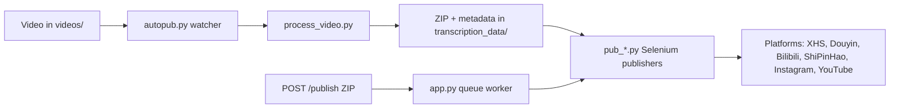

[English](../README.md) · [العربية](README.ar.md) · [Español](README.es.md) · [Français](README.fr.md) · [日本語](README.ja.md) · [한국어](README.ko.md) · [Tiếng Việt](README.vi.md) · [中文 (简体)](README.zh-Hans.md) · [中文（繁體）](README.zh-Hant.md) · [Deutsch](README.de.md) · [Русский](README.ru.md)


[](https://github.com/lachlanchen/lachlanchen/blob/main/figs/banner.png)

# AutoPublish

<p align="center">
  <strong>نشر فيديوهات قصيرة متعددة المنصات بطريقة script-first وبقيادة المتصفح.</strong><br/>
  <sub>دليل التشغيل المعتمد للإعداد، والتشغيل، ووضع الطابور، وتدفقات الأتمتة الخاصة بكل منصة.</sub>
</p>

[](#prerequisites)
[](#system-overview)
[](#running-the-tornado-service-apppy)
[](#platform-specific-notes)
[](#running-the-tornado-service-apppy)
[](#pwa-frontend-pwa)
[](https://github.com/sponsors/lachlanchen)
[](#table-of-contents)
[](#license)
[](#configuration)
[](#security--ops-checklist)
[](#raspberry-pi--linux-service-setup)

| انتقال سريع | الرابط |
| --- | --- |
| إعداد أول مرة | [Start Here](#start-here) |
| التشغيل بالمراقب المحلي | [Running the CLI pipeline (`autopub.py`)](#running-the-cli-pipeline-autopubpy) |
| التشغيل عبر طابور HTTP | [Running the Tornado service (`app.py`)](#running-the-tornado-service-apppy) |
| النشر كخدمة نظام | [Raspberry Pi / Linux Service Setup](#raspberry-pi--linux-service-setup) |
| دعم المشروع | [Support AutoPublish](#support-autopublish) |

مجموعة أدوات أتمتة لتوزيع محتوى الفيديو القصير على منصات صينية وعالمية متعددة. يجمع المشروع بين خدمة مبنية على Tornado، وروبوتات Selenium، وتدفق مراقبة ملفات محلي بحيث يؤدي وضع فيديو داخل مجلد إلى رفعه في النهاية إلى XiaoHongShu وDouyin وBilibili وWeChat Channels (ShiPinHao) وInstagram، ومع YouTube بشكل اختياري.

هذا المستودع منخفض المستوى عمدًا: معظم الإعدادات موجودة في ملفات Python وسكربتات shell. هذا المستند هو دليل تشغيلي يغطي الإعداد، والتشغيل، ونقاط التوسعة.

> ⚙️ **فلسفة التشغيل**: هذا المشروع يفضّل السكربتات الواضحة وأتمتة المتصفح المباشرة بدل طبقات التجريد المخفية.
> ✅ **السياسة المعتمدة لهذا README**: الحفاظ على التفاصيل التقنية أولًا ثم تحسين الوضوح وقابلية الاكتشاف.

### Quick Navigation

| أريد أن... | اذهب إلى |
| --- | --- |
| تشغيل أول عملية نشر | [Quick Start Checklist](#quick-start-checklist) |
| مقارنة أوضاع التشغيل | [Runtime Modes at a Glance](#runtime-modes-at-a-glance) |
| إعداد بيانات الاعتماد والمسارات | [Configuration](#configuration) |
| تشغيل وضع API وإضافة مهام للطابور | [Running the Tornado service (`app.py`)](#running-the-tornado-service-apppy) |
| التحقق بأوامر جاهزة للنسخ | [Examples](#examples) |
| الإعداد على Raspberry Pi/Linux | [Raspberry Pi / Linux Service Setup](#raspberry-pi--linux-service-setup) |

## Start Here

إذا كنت جديدًا في هذا المستودع، اتبع هذا التسلسل:

1. اقرأ [Prerequisites](#prerequisites) و[Installation](#installation).
2. اضبط الأسرار والمسارات المطلقة في [Configuration](#configuration).
3. جهّز جلسات تصحيح المتصفح في [Preparing Browser Sessions](#preparing-browser-sessions).
4. اختر وضع تشغيل واحدًا من [Usage](#usage): `autopub.py` (watcher) أو `app.py` (API queue).
5. تحقق باستخدام الأوامر في [Examples](#examples).

## Overview

يدعم AutoPublish حاليًا وضعين تشغيل للإنتاج:

1. **CLI watcher mode (`autopub.py`)** للاستيعاب والنشر المعتمدين على المجلد.
2. **API queue mode (`app.py`)** للنشر عبر ZIP باستخدام HTTP (`/publish`, `/publish/queue`).

تم تصميمه للمشغلين الذين يفضّلون سير عمل شفافًا قائمًا على السكربتات بدل منصات التنسيق المجردة.

### Runtime Modes at a Glance

| Mode | Entry point | Input | Best for | Output behavior |
| --- | --- | --- | --- | --- |
| CLI watcher | `autopub.py` | Files dropped into `videos/` | Local operator workflows and cron/service loops | يعالج الفيديوهات المكتشفة وينشر فورًا إلى المنصات المحددة |
| API queue service | `app.py` | ZIP upload to `POST /publish` | Integrations with upstream systems and remote triggering | يقبل المهام ويضعها في الطابور وينفذ النشر بترتيب العامل |

### Platform Coverage Snapshot

| Platform | Publisher module | Login helper | Control port | CLI mode | API mode |
| --- | --- | --- | --- | --- | --- |
| XiaoHongShu | `pub_xhs.py` | `login_xiaohongshu.py` | `5003` | ✅ | ✅ |
| Douyin | `pub_douyin.py` | `login_douyin.py` | `5004` | ✅ | ✅ |
| Bilibili | `pub_bilibili.py` | N/A | `5005` | ✅ | ✅ |
| ShiPinHao (WeChat Channels) | `pub_shipinhao.py` | `login_shipinhao.py` | `5006` | اختياري | ✅ |
| Instagram | `pub_instagram.py` | `login_instagram.py` | `5007` | اختياري | ✅ |
| YouTube | `pub_y2b.py` | N/A | `9222` | اختياري | ✅ |

## Quick Snapshot

| العنصر | القيمة |
| --- | --- |
| اللغة الأساسية | Python 3.10+ |
| بيئات التشغيل الرئيسية | CLI watcher (`autopub.py`) + خدمة Tornado queue (`app.py`) |
| محرك الأتمتة | Selenium + جلسات Chromium عبر remote-debug |
| صيغ الإدخال | فيديوهات خام (`videos/`) وحزم ZIP (`/publish`) |
| مسار مساحة العمل الحالية للمستودع | `/home/lachlan/ProjectsLFS/AutoPublish` |
| المستخدمون الأنسب | منشئو المحتوى/مهندسو العمليات الذين يديرون خطوط نشر فيديو قصير متعددة المنصات |

### Operational Safety Snapshot

| الموضوع | الحالة الحالية | الإجراء |
| --- | --- | --- |
| مسارات hard-coded | موجودة في عدة وحدات/سكربتات | حدّث ثوابت المسارات لكل جهاز قبل التشغيل الإنتاجي |
| حالة تسجيل دخول المتصفح | مطلوبة | احتفظ بملفات تعريف remote-debug دائمة لكل منصة |
| التعامل مع Captcha | تكاملات اختيارية متاحة | اضبط بيانات 2Captcha/Turing إذا لزم |
| إعلان الترخيص | لم يُكتشف ملف `LICENSE` في الجذر | أكّد شروط الاستخدام مع صاحب المشروع قبل إعادة التوزيع |

### Compatibility & Assumptions

| العنصر | الافتراض الحالي في هذا المستودع |
| --- | --- |
| Python | 3.10+ |
| بيئة التشغيل | Linux سطح مكتب/خادم مع واجهة GUI متاحة لـ Chromium |
| وضع التحكم بالمتصفح | جلسات Remote Debugging مع مجلدات profile دائمة |
| منفذ API الأساسي | `8081` (`app.py --port`) |
| backend المعالجة | يجب أن يكون `upload_url` و`process_url` قابلين للوصول ويُرجعان مخرجات ZIP صحيحة |
| مساحة العمل المستخدمة في هذا الإصدار | `/home/lachlan/ProjectsLFS/AutoPublish` |

---

## Table of Contents

- [Start Here](#start-here)
- [Overview](#overview)
- [Runtime Modes at a Glance](#runtime-modes-at-a-glance)
- [Platform Coverage Snapshot](#platform-coverage-snapshot)
- [Quick Snapshot](#quick-snapshot)
- [Operational Safety Snapshot](#operational-safety-snapshot)
- [Compatibility & Assumptions](#compatibility--assumptions)
- [System Overview](#system-overview)
- [Features](#features)
- [Project Structure](#project-structure)
- [Repository Layout](#repository-layout)
- [Prerequisites](#prerequisites)
- [Installation](#installation)
- [Configuration](#configuration)
- [Configuration Verification Checklist](#configuration-verification-checklist)
- [Preparing Browser Sessions](#preparing-browser-sessions)
- [Usage](#usage)
- [Examples](#examples)
- [Metadata & ZIP Format](#metadata--zip-format)
- [Data & Artifact Lifecycle](#data--artifact-lifecycle)
- [Platform-Specific Notes](#platform-specific-notes)
- [Raspberry Pi / Linux Service Setup](#raspberry-pi--linux-service-setup)
- [Legacy macOS Scripts](#legacy-macos-scripts)
- [Troubleshooting & Maintenance](#troubleshooting--maintenance)
- [FAQ](#faq)
- [Extending the System](#extending-the-system)
- [Quick Start Checklist](#quick-start-checklist)
- [Development Notes](#development-notes)
- [Roadmap](#roadmap)
- [Contributing](#contributing)
- [Security & Ops Checklist](#security--ops-checklist)
- [License](#license)
- [Acknowledgements](#acknowledgements)
- [Support AutoPublish](#support-autopublish)

---

## System Overview

🎯 **تدفق كامل من الوسائط الخام إلى المنشورات المنشورة**:



نظرة عامة على سير العمل:

1. **استقبال اللقطات الخام**: ضع فيديو داخل `videos/`. يكتشف المراقب (إما `autopub.py` أو مجدول/خدمة) الملفات الجديدة باستخدام `videos_db.csv` و`processed.csv`.
2. **توليد الأصول**: يقوم `process_video.VideoProcessor` برفع الملف إلى خادم معالجة المحتوى (`upload_url` و`process_url`) الذي يعيد حزمة ZIP تحتوي على:
   - الفيديو المعدّل/المشفّر (`<stem>.mp4`)،
   - صورة غلاف،
   - `{stem}_metadata.json` بعناوين وأوصاف ووسوم محلية، إلخ.
3. **النشر**: تقود البيانات الوصفية وحدات النشر Selenium في `pub_*.py`. يتصل كل ناشر بنسخة Chromium/Chrome قيد التشغيل مسبقًا عبر منافذ remote debugging ومجلدات user-data دائمة.
4. **لوحة تحكم ويب (اختياري)**: يوفّر `app.py` المسار `/publish`، ويقبل حزم ZIP الجاهزة، ويفكها، ويضيف مهام النشر إلى الطابور لنفس وحدات النشر. كما يمكنه تحديث جلسات المتصفح وتشغيل مساعدات تسجيل الدخول (`login_*.py`).
5. **وحدات الدعم**: يقوم `load_env.py` بتحميل الأسرار من `~/.bashrc`، ويوفّر `utils.py` أدوات مساعدة (تركيز النافذة، التعامل مع QR، أدوات البريد)، ويتكامل `solve_captcha_*.py` مع Turing/2Captcha عند ظهور captcha.

## Features

✨ **مصمّم لأتمتة عملية قائمة على السكربتات**:

- نشر متعدد المنصات: XiaoHongShu وDouyin وBilibili وShiPinHao (WeChat Channels) وInstagram وYouTube (اختياري).
- وضعا تشغيل: CLI watcher pipeline (`autopub.py`) وخدمة API queue (`app.py` + `/publish` + `/publish/queue`).
- مفاتيح تعطيل مؤقتة لكل منصة عبر ملفات `ignore_*`.
- إعادة استخدام جلسات المتصفح عبر remote-debug مع ملفات تعريف دائمة.
- أدوات اختيارية لأتمتة QR/captcha وإشعارات البريد الإلكتروني.
- لا حاجة لبناء frontend لاستخدام واجهة الرفع المضمنة PWA (`pwa/`).
- سكربتات أتمتة Linux/Raspberry Pi لإعداد الخدمات (`scripts/`).

### Feature Matrix

| Capability | CLI (`autopub.py`) | API (`app.py`) |
| --- | --- | --- |
| Input source | Local `videos/` watcher | Uploaded ZIP via `POST /publish` |
| Queueing | Internal file-based progression | Explicit in-memory job queue |
| Platform flags | CLI args (`--pub-*`) + `ignore_*` | Query args (`publish_*`) + `ignore_*` |
| Best fit | Single-host operator workflow | External systems and remote triggering |

---

## Project Structure

بنية عالية المستوى للمصدر ووقت التشغيل:

```text
AutoPublish/
├── README.md
├── app.py
├── autopub.py
├── process_video.py
├── load_env.py
├── utils.py
├── pub_*.py                  # platform publishers
├── login_*.py                # platform login/session helpers
├── solve_captcha_*.py
├── smtp.py
├── smtp_test_simple.py
├── send_email_qreader.py
├── requirements.txt
├── requirements.autopub.txt
├── .env.example
├── setup_raspberrypi.md
├── scripts/
├── pwa/
├── figs/
├── .github/FUNDING.yml
├── i18n/                     # multilingual READMEs
├── videos/                   # runtime input artifacts
├── logs/, logs-autopub/      # runtime logs
├── temp/, temp_screenshot/   # runtime temp artifacts
├── videos_db.csv
└── processed.csv
```

ملاحظة: يُستخدم `transcription_data/` أثناء وقت التشغيل بواسطة تدفق المعالجة/النشر، وقد يظهر بعد التنفيذ.

## Repository Layout

🗂️ **الوحدات الأساسية وما الذي تفعله**:

| Path | Purpose |
| --- | --- |
| `app.py` | خدمة Tornado تعرض `/publish` و`/publish/queue` مع طابور نشر داخلي وخيط عامل. |
| `autopub.py` | مراقب CLI: يفحص `videos/`، ويعالج الملفات الجديدة، ويستدعي وحدات النشر بالتوازي. |
| `process_video.py` | يرفع الفيديوهات إلى backend المعالجة ويخزّن حزم ZIP المسترجعة. |
| `pub_xhs.py`, `pub_douyin.py`, `pub_bilibili.py`, `pub_shipinhao.py`, `pub_instagram.py`, `pub_y2b.py` | وحدات أتمتة Selenium لكل منصة. |
| `login_xiaohongshu.py`, `login_douyin.py`, `login_shipinhao.py`, `login_instagram.py` | فحص الجلسات وتدفّقات تسجيل الدخول عبر QR. |
| `utils.py` | أدوات أتمتة مشتركة (تركيز النافذة، أدوات QR/mail، أدوات تشخيص). |
| `load_env.py` | يحمّل متغيرات البيئة من ملف shell (`~/.bashrc`) ويخفي السجلات الحساسة. |
| `smtp.py`, `smtp_test_simple.py`, `send_email_qreader.py` | مساعدات SMTP/SendGrid وسكربتات اختبار. |
| `solve_captcha_2captcha.py`, `solve_captcha_turing.py` | تكاملات حل captcha. |
| `scripts/` | سكربتات إعداد الخدمات والتشغيل (Raspberry Pi/Linux + أتمتة قديمة). |
| `pwa/` | PWA ثابتة لمعاينة ZIP وإرسال النشر. |
| `setup_raspberrypi.md` | دليل تجهيز Raspberry Pi خطوة بخطوة. |
| `.env.example` | قالب متغيرات البيئة (بيانات اعتماد، مسارات، مفاتيح captcha). |
| `.github/FUNDING.yml` | إعدادات الرعاية/التمويل. |
| `logs/`, `logs-autopub/`, `temp/`, `temp_screenshot/`, `videos/` | مخرجات وقت التشغيل والسجلات (الكثير منها ضمن gitignore). |

---

## Prerequisites

🧰 **ثبّت هذه المتطلبات قبل أول تشغيل**.

### Operating system and tools

- نظام Linux سطح مكتب/خادم مع جلسة X (`DISPLAY=:1` شائع في السكربتات المتوفرة).
- Chromium/Chrome مع ChromeDriver مطابق للإصدار.
- أدوات GUI/وسائط: `xdotool`, `ffmpeg`, `zip`, `unzip`.
- Python 3.10+ (venv أو Conda).

### Python dependencies

الحد الأدنى للتشغيل:

```bash
pip install selenium tornado requests requests-toolbelt sendgrid qreader opencv-python webdriver-manager
```

مطابقة بيئة المستودع:

```bash
python -m pip install -r requirements.txt
```

للتثبيت الخفيف للخدمات (تستخدمه سكربتات الإعداد افتراضيًا):

```bash
python -m pip install -r requirements.autopub.txt
```

يحتوي `requirements.autopub.txt` على:
- `selenium`, `webdriver-manager`, `tornado`, `requests`, `requests-toolbelt`, `sendgrid`, `qreader`, `opencv-python`, `numpy`, `pillow`, `twocaptcha`.

### Optional: create a sudo user

```bash
sudo useradd -m -s /bin/bash -G sudo <USERNAME> && echo "<USERNAME>:<PASSWORD>" | sudo chpasswd
```

---

## Installation

🚀 **إعداد من جهاز نظيف**:

1. انسخ المستودع:

```bash
git clone https://github.com/lachlanchen/AutoPublish.git
cd AutoPublish
```

2. أنشئ وفعّل بيئة (مثال باستخدام `venv`):

```bash
python3 -m venv .venv
source .venv/bin/activate
python -m pip install -U pip
python -m pip install -r requirements.txt
```

3. جهّز متغيرات البيئة:

```bash
cp .env.example .env
# fill values in .env (do not commit)
```

4. حمّل المتغيرات للسكربتات التي تقرأ قيم shell profile:

```bash
source ~/.bashrc
python load_env.py
```

ملاحظة: صُمم `load_env.py` حول `~/.bashrc`؛ إذا كانت بيئتك تعتمد ملف profile آخر، فعدّل ذلك وفقًا لبيئتك.

---

## Configuration

🔐 **اضبط بيانات الاعتماد أولًا، ثم تحقّق من المسارات الخاصة بالمضيف**.

### Environment variables

يتوقع المشروع بيانات اعتماد ومسارات متصفح/تشغيل اختيارية من متغيرات البيئة. ابدأ من `.env.example`:

| Variable | Description |
| --- | --- |
| `FROM_EMAIL`, `TO_EMAIL`, `APP_PASSWORD` | بيانات SMTP لإشعارات QR/تسجيل الدخول. |
| `SENDGRID_API_KEY` | مفتاح SendGrid لتدفقات البريد التي تستخدم SendGrid APIs. |
| `APIKEY_2CAPTCHA` | مفتاح API لخدمة 2Captcha. |
| `TULING_USERNAME`, `TULING_PASSWORD`, `TULING_ID` | بيانات اعتماد Turing captcha. |
| `DOUYIN_LOGIN_PASSWORD` | مساعد التحقق الثاني في Douyin. |
| `INSTAGRAM_*`, `CHROME_*`, `CHROMEDRIVER_PATH` | تجاوزات إعداد Instagram/برنامج تشغيل المتصفح. |
| `AUTOPUBLISH_BROWSER_BIN`, `AUTOPUBLISH_CHROMEDRIVER`, `AUTOPUBLISH_DISPLAY` | تجاوزات عالمية مفضلة للمتصفح/الدرايفر/العرض في `app.py`. |

### Path constants (important)

📌 **أكثر مشكلة بدء شيوعًا**: مسارات مطلقة hard-coded غير محلولة.

لا تزال عدة وحدات تحتوي على مسارات hard-coded. حدّثها لتناسب جهازك:

| File | Constant(s) | Meaning |
| --- | --- | --- |
| `app.py` | `logs_folder_root`, `autopublish_folder_root`, `videos_db_path`, `processed_path`, `transcription_root`, `upload_url`, `process_url`. | جذور خدمة API ونقاط نهاية backend. |
| `autopub.py` | `logs_folder_path`, `autopublish_folder_path`, `videos_db_path`, `processed_path`, `transcription_path`, `upload_url`, `process_url`, `chromedriver_path`. | جذور CLI watcher ونقاط نهاية backend. |
| `scripts/run_autopub.sh`, `scripts/setup_autopub.sh` | مسارات مطلقة إلى Python/Conda/repo/log. | مغلفات قديمة موجّهة أكثر لـ macOS. |
| `utils.py` | افتراضات مسار FFmpeg في مساعدات معالجة الغلاف. | توافق مسارات أدوات الوسائط. |

ملاحظة مهمة خاصة بالمستودع:
- مسار المستودع الحالي في مساحة العمل هذه هو `/home/lachlan/ProjectsLFS/AutoPublish`.
- بعض الكود والسكربتات ما تزال تشير إلى `/home/lachlan/Projects/auto-publish` أو `/Users/lachlan/...`.
- احتفظ بهذه المسارات وعدّلها محليًا قبل الاستخدام الإنتاجي.

### Platform toggles via `ignore_*`

🧩 **مفتاح أمان سريع**: إنشاء ملف `ignore_*` يعطّل الناشر المقابل دون تعديل الكود.

أعلام النشر مقيدة أيضًا بملفات ignore. أنشئ ملفًا فارغًا لتعطيل منصة:

```bash
touch ignore_xhs ignore_douyin ignore_bilibili ignore_shipinhao ignore_instagram ignore_y2b
```

احذف الملف الموافق لإعادة التفعيل.

### Configuration Verification Checklist

شغّل هذا التحقق السريع بعد ضبط `.env` وثوابت المسارات:

```bash
python -c "import os;print('AUTOPUBLISH_BROWSER_BIN=', os.getenv('AUTOPUBLISH_BROWSER_BIN'));print('AUTOPUBLISH_CHROMEDRIVER=', os.getenv('AUTOPUBLISH_CHROMEDRIVER'));print('DISPLAY=', os.getenv('DISPLAY') or os.getenv('AUTOPUBLISH_DISPLAY'))"
python -c "from load_env import load_env_from_bashrc; load_env_from_bashrc(); print('Environment load OK')"
python -c "import os; p=os.getenv('AUTOPUBLISH_CHROMEDRIVER') or os.getenv('CHROMEDRIVER_PATH') or '/usr/bin/chromedriver'; print(p, 'exists=', os.path.exists(p))"
```

إذا كانت أي قيمة مفقودة، حدّث `.env` أو `~/.bashrc` أو ثوابت السكربت قبل تشغيل وحدات النشر.

---

## Preparing Browser Sessions

🌐 **استمرارية الجلسة إلزامية** لرفع موثوق عبر Selenium.

1. أنشئ مجلدات ملفات تعريف مخصصة:

```bash
mkdir -p ~/chromium_dev_session_{5003,5004,5005,5006,5007,9222}
mkdir -p ~/chromium_dev_session_logs
```

2. شغّل جلسات المتصفح مع remote debugging (مثال لـ XiaoHongShu):

```bash
DISPLAY=:1 chromium-browser \
  --remote-debugging-port=5003 \
  --user-data-dir="$HOME/chromium_dev_session_5003" \
  https://creator.xiaohongshu.com/creator/post \
  > "$HOME/chromium_dev_session_logs/chromium_xhs.log" 2>&1 &
```

3. سجّل الدخول يدويًا مرة واحدة لكل منصة/ملف تعريف.

4. تحقّق أن Selenium يستطيع الاتصال:

```python
from selenium import webdriver
opts = webdriver.ChromeOptions()
opts.add_experimental_option("debuggerAddress", "127.0.0.1:5003")
driver = webdriver.Chrome(options=opts)
print(driver.title)
driver.quit()
```

ملاحظة أمنية:
- يحتوي `app.py` حاليًا على قيمة placeholder لكلمة مرور sudo (`password = "1"`) تُستخدم في منطق إعادة تشغيل المتصفح. استبدلها قبل أي نشر فعلي.

---

## Usage

▶️ **وضعا تشغيل متاحان**: CLI watcher وخدمة API queue.

### Running the CLI pipeline (`autopub.py`)

1. ضع فيديوهات المصدر في مجلد المراقبة (`videos/` أو `autopublish_folder_path` بعد ضبطه).
2. شغّل:

```bash
python autopub.py --use-cache --pub-xhs --pub-douyin --pub-bilibili
```

Flags:

| Flag | Meaning |
| --- | --- |
| `--pub-xhs`, `--pub-douyin`, `--pub-bilibili` | يقيّد النشر للمنصات المحددة. إذا لم تمرر أيًا منها، تُفعّل المنصات الثلاث افتراضيًا. |
| `--test` | وضع اختبار يُمرّر إلى وحدات النشر (السلوك يختلف حسب وحدة المنصة). |
| `--use-cache` | يعيد استخدام `transcription_data/<video>/<video>.zip` الموجود إن توفر. |

تدفق CLI لكل فيديو:
- رفع/معالجة عبر `process_video.py`.
- استخراج ZIP إلى `transcription_data/<video>/`.
- تشغيل الناشرين المحددين عبر `ThreadPoolExecutor`.
- إلحاق حالة التتبع في `videos_db.csv` و`processed.csv`.

### Running the Tornado service (`app.py`)

🛰️ **وضع API** مناسب للأنظمة الخارجية التي تنتج حزم ZIP.

تشغيل الخادم:

```bash
python app.py --refresh-time 1800 --port 8081
```

ملخص نقاط النهاية:

| Endpoint | Method | Purpose |
| --- | --- | --- |
| `/publish` | `POST` | رفع bytes لملف ZIP وإضافة مهمة نشر للطابور |
| `/publish/queue` | `GET` | فحص الطابور، وسجل المهام، وحالة النشر |

### `POST /publish`

📤 **أضف مهمة نشر للطابور** عبر رفع bytes لملف ZIP مباشرة.

- Header: `Content-Type: application/octet-stream`
- وسيط query/form مطلوب: `filename` (اسم ملف ZIP)
- وسائط منطقية اختيارية: `publish_xhs`, `publish_douyin`, `publish_bilibili`, `publish_shipinhao`, `publish_instagram`, `publish_y2b`, `test`
- Body: raw ZIP bytes

مثال:

```bash
curl -X POST "http://localhost:8081/publish?filename=demo.zip&publish_xhs=true&publish_instagram=true&publish_y2b=true" \
  --data-binary @demo.zip \
  -H "Content-Type: application/octet-stream"
```

السلوك الحالي في الكود:
- يتم قبول الطلب وإضافته للطابور.
- يعيد الرد الفوري JSON يتضمن `status: queued` و`job_id` و`queue_size`.
- يعالج worker thread المهام في الطابور بشكل تسلسلي.

### `GET /publish/queue`

📊 **راقب صحة الطابور والمهام الجارية**.

يعيد JSON لحالة الطابور/السجل:

```bash
curl "http://localhost:8081/publish/queue"
```

يتضمن الرد حقولًا مثل:
- `status`, `jobs`, `queue_size`, `is_publishing`.

### Browser refresh thread

♻️ تحديث المتصفح دوريًا يقلّل فشل الجلسات القديمة أثناء التشغيل الطويل.

يشغّل `app.py` خيط تحديث في الخلفية باستخدام فترة `--refresh-time` ويربطه بفحوصات تسجيل الدخول. يتضمن زمن النوم للتحديث سلوك تأخير عشوائي.

### PWA frontend (`pwa/`)

🖥️ واجهة ثابتة وخفيفة لرفع ZIP يدويًا وفحص الطابور.

شغّل الواجهة محليًا:

```bash
cd pwa
python -m http.server 5173
```

افتح `http://localhost:5173` واضبط عنوان backend الأساسي (مثال `http://lazyingart:8081`).

قدرات PWA:
- معاينة ZIP بالسحب والإفلات.
- تبديل أهداف النشر + وضع الاختبار.
- الإرسال إلى `/publish` مع polling لـ `/publish/queue`.

### Command Palette

🧷 **الأوامر الأكثر استخدامًا في مكان واحد**.

| Task | Command |
| --- | --- |
| تثبيت كل الاعتماديات | `python -m pip install -r requirements.txt` |
| تثبيت اعتماديات تشغيل خفيفة | `python -m pip install -r requirements.autopub.txt` |
| تحميل متغيرات البيئة من shell | `source ~/.bashrc && python load_env.py` |
| تشغيل خادم API queue | `python app.py --refresh-time 1800 --port 8081` |
| تشغيل خط CLI watcher | `python autopub.py --use-cache --pub-xhs --pub-douyin --pub-bilibili` |
| إرسال ZIP إلى الطابور | `curl -X POST "http://localhost:8081/publish?filename=demo.zip" --data-binary @demo.zip -H "Content-Type: application/octet-stream"` |
| فحص حالة الطابور | `curl -s "http://localhost:8081/publish/queue"` |
| تشغيل PWA محليًا | `cd pwa && python -m http.server 5173` |

---

## Examples

🧪 **أوامر smoke-test جاهزة للنسخ/اللصق**:

### Example 0: Load environment and start API server

```bash
source ~/.bashrc
python load_env.py
python app.py --refresh-time 1800 --port 8081
```

### Example A: CLI publish run

```bash
python autopub.py --pub-xhs --pub-douyin --use-cache
```

### Example B: API publish run (single ZIP)

```bash
curl -X POST "http://localhost:8081/publish?filename=my_bundle.zip&publish_bilibili=true&test=true" \
  --data-binary @my_bundle.zip \
  -H "Content-Type: application/octet-stream"
```

### Example C: Check queue status

```bash
curl -s "http://localhost:8081/publish/queue"
```

### Example D: SMTP helper smoke test

```bash
python smtp.py
python smtp_test_simple.py
```

---

## Metadata & ZIP Format

📦 **عقد ZIP مهم**: حافظ على اتساق أسماء الملفات ومفاتيح البيانات الوصفية مع توقعات وحدات النشر.

الحد الأدنى المتوقع داخل ZIP:

```text
<stem>_metadata.json
<video_filename>.mp4
<cover_filename>.jpg
```

تقود `metadata` الناشرين الصينيين؛ و`metadata["english_version"]` اختياري ويُستخدم لوحدة نشر YouTube.

الحقول المستخدمة غالبًا في الوحدات:
- `title`, `brief_description`, `middle_description`, `long_description`
- `tags` (قائمة hashtags)
- `video_filename`, `cover_filename`
- حقول خاصة بكل منصة كما هو مطبق في ملفات `pub_*.py`

إذا كنت تولّد ملفات ZIP خارجيًا، فاحرص على تطابق المفاتيح وأسماء الملفات مع ما تتوقعه الوحدات.

## Data & Artifact Lifecycle

ينتج هذا المسار مخرجات محلية يجب الاحتفاظ بها أو تدويرها أو تنظيفها بوعي:

| Artifact | Location | Produced by | Why it matters |
| --- | --- | --- | --- |
| فيديوهات الإدخال | `videos/` | إسقاط يدوي أو مزامنة upstream | مصدر الوسائط لوضع CLI watcher |
| مخرجات ZIP للمعالجة | `transcription_data/<stem>/<stem>.zip` | `process_video.py` | حمولة قابلة لإعادة الاستخدام مع `--use-cache` |
| أصول النشر بعد الفك | `transcription_data/<stem>/...` | فك ZIP في `autopub.py` / `app.py` | ملفات وmetadata جاهزة للنشر |
| سجلات النشر | `logs/`, `logs-autopub/` | تشغيل CLI/API | تشخيص الأعطال ومسار تدقيق |
| سجلات المتصفح | `~/chromium_dev_session_logs/*.log` (أو بادئة chrome) | سكربتات تشغيل المتصفح | تشخيص مشاكل الجلسة/المنفذ/الإقلاع |
| ملفات CSV للتتبع | `videos_db.csv`, `processed.csv` | CLI watcher | منع المعالجة المكررة |

توصية صيانة:
- أضف مهمة تنظيف/أرشفة دورية لـ `transcription_data/` و`temp/` والسجلات القديمة لتجنب امتلاء القرص.

---

## Platform-Specific Notes

🧭 **خريطة المنافذ + ملكية الوحدات** لكل ناشر.

| Platform | Port | Module(s) | Notes |
| --- | --- | --- | --- |
| XiaoHongShu | 5003 | `pub_xhs.py`, `login_xiaohongshu.py` | تدفّق إعادة تسجيل الدخول عبر QR؛ وتنقية العنوان واستخدام الهاشتاغات من metadata. |
| Douyin | 5004 | `pub_douyin.py`, `login_douyin.py` | فحوصات اكتمال الرفع ومسارات إعادة المحاولة حساسة لتغيرات المنصة؛ راقب السجلات بدقة. |
| Bilibili | 5005 | `pub_bilibili.py` | توجد نقاط تكامل captcha عبر `solve_captcha_2captcha.py` و`solve_captcha_turing.py`. |
| ShiPinHao (WeChat Channels) | 5006 | `pub_shipinhao.py`, `login_shipinhao.py` | الموافقة السريعة عبر QR مهمة لموثوقية تحديث الجلسات. |
| Instagram | 5007 | `pub_instagram.py`, `login_instagram.py` | التحكم في وضع API عبر `publish_instagram=true`؛ ومتغيرات البيئة متاحة في `.env.example`. |
| YouTube | 9222 | `pub_y2b.py` | يستخدم كتلة metadata المسماة `english_version`؛ عطّله عبر `ignore_y2b`. |

---

## Raspberry Pi / Linux Service Setup

🐧 **موصى به للأجهزة العاملة باستمرار**.

لإعداد الجهاز كاملًا اتبع [`setup_raspberrypi.md`](setup_raspberrypi.md).

إعداد سريع لخط التشغيل:

```bash
export AUTOPUB_USER=<USERNAME>
export AUTOPUB_REPO=/home/<USERNAME>/Projects/autopub
sudo -E ./scripts/setup_autopub_pipeline.sh
```

يقوم ذلك بتنسيق:
- `scripts/setup_envs.sh`
- `scripts/setup_virtual_desktop_service.sh`
- `scripts/download_and_setup_driver.sh`
- `scripts/setup_autopub_service.sh`

شغّل الخدمة يدويًا في tmux:

```bash
./scripts/start_autopub_tmux.sh
```

تحقق من الخدمات/المنافذ:

```bash
systemctl status autopub.service autopub-vnc.service
sudo ss -ltnp | grep 590
```

ملاحظة توافق:
- بعض الوثائق/السكربتات الأقدم ما تزال تشير إلى `virtual-desktop.service`؛ سكربتات الإعداد الحالية في هذا المستودع تثبّت `autopub-vnc.service`.

---

## Legacy macOS Scripts

🍎 لا تزال المغلفات القديمة موجودة للتوافق مع إعدادات محلية أقدم.

لا يزال المستودع يتضمن سكربتات موروثة موجهة لـ macOS:
- `scripts/run_autopub.sh`
- `scripts/setup_autopub.sh`

تحتوي هذه الملفات على مسارات مطلقة من نوع `/Users/lachlan/...` وافتراضات Conda. احتفظ بها إذا كنت تعتمد هذا المسار، لكن حدّث المسارات/venv/الأدوات بما يناسب جهازك.

---

## Troubleshooting & Maintenance

🛠️ **إذا حدث فشل، ابدأ من هنا**.

- **اختلاف المسارات بين الأجهزة**: إذا ظهرت أخطاء تشير إلى ملفات مفقودة تحت `/Users/lachlan/...` أو `/home/lachlan/Projects/auto-publish`، فوحّد الثوابت مع مسار جهازك (`/home/lachlan/ProjectsLFS/AutoPublish` في مساحة العمل هذه).
- **نظافة الأسرار**: شغّل `~/.local/bin/detect-secrets scan` قبل أي push. وبدّل أي بيانات اعتماد تم كشفها.
- **أخطاء backend المعالجة**: إذا طبع `process_video.py` الرسالة “Failed to get the uploaded file path,” فتحقق أن JSON استجابة الرفع يتضمن `file_path` وأن نقطة نهاية المعالجة تعيد bytes ZIP.
- **عدم تطابق ChromeDriver**: إذا ظهرت أخطاء اتصال DevTools، فوحّد إصدار Chrome/Chromium مع الدرايفر (أو استخدم `webdriver-manager`).
- **مشكلات تركيز المتصفح**: يعتمد `bring_to_front` على مطابقة عنوان النافذة (اختلافات تسمية Chromium/Chrome قد تكسر هذا).
- **انقطاعات captcha**: اضبط بيانات 2Captcha/Turing وادمج مخرجات الحل في المواضع المطلوبة.
- **ملفات lock القديمة**: إذا لم تبدأ التشغيلات المجدولة أبدًا، فتحقق من حالة العمليات واحذف `autopub.lock` القديم (تدفق سكربت قديم).
- **سجلات يجب فحصها**: `logs/`, `logs-autopub/`, `~/chromium_dev_session_logs/*.log` إضافة إلى سجلات service journal.

## FAQ

**Q: هل يمكن تشغيل وضع API ووضع CLI watcher في نفس الوقت؟**  
A: ممكن تقنيًا، لكنه غير مُستحسن إلا إذا عزلت مصادر الإدخال وجلسات المتصفح بعناية. كلا الوضعين قد يتنافسان على نفس وحدات النشر والملفات والمنافذ.

**Q: لماذا يعيد `/publish` حالة queued لكن لا يظهر نشر فعلي فورًا؟**  
A: يقوم `app.py` أولًا بوضع المهام في الطابور، ثم يعالجها عامل خلفي بشكل تسلسلي. افحص `/publish/queue` و`is_publishing` وسجلات الخدمة.

**Q: هل أحتاج `load_env.py` إذا كنت أستخدم `.env` بالفعل؟**  
A: سكربت `start_autopub_tmux.sh` يقوم بقراءة `.env` إن وُجد، بينما بعض التشغيلات المباشرة تعتمد على متغيرات shell. توحيد القيم بين `.env` وبيئة shell يمنع المفاجآت.

**Q: ما الحد الأدنى لعقد ZIP في رفع API؟**  
A: ملف ZIP صالح يحتوي `{stem}_metadata.json`، بالإضافة إلى ملف الفيديو وملف الغلاف بأسماء تطابق مفاتيح metadata (`video_filename`, `cover_filename`).

**Q: هل الوضع headless مدعوم؟**  
A: بعض الوحدات تعرض متغيرات مرتبطة بـ headless، لكن وضع التشغيل الأساسي والموثق في هذا المستودع هو جلسات متصفح مع GUI وملفات تعريف دائمة.

---

## Extending the System

🧱 **نقاط التوسعة** لإضافة منصات جديدة وتشغيل أكثر أمانًا.

- **إضافة منصة جديدة**: انسخ وحدة `pub_*.py`، ثم حدّث selectors/flows، وأضف `login_*.py` إذا كان إعادة التوثيق عبر QR مطلوبة، ثم اربط الأعلام ومعالجة الطابور في `app.py` وربط CLI في `autopub.py`.
- **تجريد الإعدادات**: انقل الثوابت المبعثرة إلى إعداد مركزي منظم (`config.yaml`/`.env` + نموذج typed) لتشغيل متعدد المضيفات.
- **تقوية تخزين بيانات الاعتماد**: استبدل التدفقات الحساسة hard-coded أو المعروضة عبر shell بآليات أكثر أمانًا (`sudo -A`, keychain, vault/secret manager).
- **الحاويات (Containerization)**: اجمع Chromium/ChromeDriver + بيئة Python + شاشة افتراضية في وحدة نشر واحدة قابلة للنقل للخوادم/السحابة.

---

## Quick Start Checklist

✅ **أقصر مسار لأول نشر ناجح**.

1. انسخ هذا المستودع وثبّت الاعتماديات (`pip install -r requirements.txt` أو النسخة الخفيفة `requirements.autopub.txt`).
2. حدّث ثوابت المسارات hard-coded في `app.py` و`autopub.py` وأي سكربت ستشغّله.
3. صدّر بيانات الاعتماد المطلوبة في shell profile أو `.env`؛ ثم شغّل `python load_env.py` للتحقق من التحميل.
4. أنشئ مجلدات ملفات تعريف المتصفح عبر remote-debug وشغّل كل جلسة منصة مطلوبة مرة واحدة.
5. سجّل الدخول يدويًا في كل منصة مستهدفة داخل ملف التعريف الموافق.
6. ابدأ إما وضع API (`python app.py --port 8081`) أو وضع CLI (`python autopub.py --use-cache ...`).
7. أرسل ZIP تجريبيًا واحدًا (وضع API) أو ملف فيديو تجريبيًا واحدًا (وضع CLI)، وافحص `logs/`.
8. شغّل فحص الأسرار قبل كل push.

---

## Development Notes

🧬 **خط الأساس الحالي للتطوير** (تنسيق يدوي + اختبارات smoke).

- أسلوب Python يتبع تنسيق 4 مسافات الموجود حاليًا والتنسيق اليدوي.
- لا توجد حاليًا مجموعة اختبارات آلية رسمية؛ اعتمد على اختبارات smoke:
  - معالجة فيديو تجريبي واحد عبر `autopub.py`؛
  - إرسال ZIP واحد إلى `/publish` ومراقبة `/publish/queue`؛
  - التحقق يدويًا من كل منصة مستهدفة.
- أضف نقطة دخول صغيرة `if __name__ == "__main__":` عند إنشاء سكربتات جديدة لتسهيل dry-runs السريعة.
- أبقِ تغييرات المنصات معزولة قدر الإمكان (`pub_*`, `login_*`, `ignore_*` toggles).
- نواتج التشغيل (`videos/*`, `logs*/*`, `transcription_data/*`, `ignore_*`) يُتوقع أن تكون محلية ومعظمها متجاهل في git.

---

## Roadmap

🗺️ **تحسينات ذات أولوية مستندة إلى قيود الكود الحالية**.

التحسينات المخطط لها/المرغوبة (استنادًا إلى بنية الكود الحالية والملاحظات الموجودة):

1. استبدال المسارات hard-coded المتفرقة بإعداد مركزي (`.env`/YAML + نماذج typed).
2. إزالة أنماط كلمة مرور sudo hard-coded ونقل التحكم بالعمليات إلى آليات أكثر أمانًا.
3. تحسين موثوقية النشر عبر إعادة محاولات أقوى وكشف أفضل لحالة واجهة المستخدم لكل منصة.
4. توسيع دعم المنصات (مثل Kuaishou أو منصات مبدعين أخرى).
5. حزم وقت التشغيل في وحدات نشر قابلة لإعادة الإنتاج (container + virtual display profile).
6. إضافة فحوصات تكامل آلية لعقد ZIP وتنفيذ الطابور.

---

## Contributing

🤝 اجعل طلبات PR مركزة وقابلة لإعادة الإنتاج وواضحة بخصوص افتراضات وقت التشغيل.

المساهمات مرحّب بها.

1. Fork ثم أنشئ فرعًا مركّزًا.
2. اجعل الـ commits صغيرة وبصيغة أمر (نمط السجل مثال: “Wait for YouTube checks before publishing”).
3. أضف ملاحظات تحقق يدوي في PR:
   - افتراضات البيئة،
   - إعادة تشغيل المتصفح/الجلسات،
   - السجلات/اللقطات ذات الصلة عند تغييرات تدفقات UI.
4. لا تلتزم أبدًا بأسرار حقيقية (`.env` متجاهل؛ استخدم `.env.example` للشكل فقط).

إذا أضفت وحدات ناشر جديدة، اربط كل ما يلي:
- `pub_<platform>.py`
- `login_<platform>.py` اختياري
- أعلام API ومعالجة الطابور في `app.py`
- ربط CLI في `autopub.py` (عند الحاجة)
- معالجة مفاتيح `ignore_<platform>`
- تحديثات README

## Security & Ops Checklist

قبل أي تشغيل يشبه بيئة الإنتاج:

1. تأكد أن `.env` موجود محليًا وغير متتبع في git.
2. بدّل/أزل أي بيانات اعتماد قد تكون سُربت تاريخيًا في commits.
3. استبدل القيم الحساسة placeholder في مسارات الكود (مثل placeholder كلمة مرور sudo في `app.py`).
4. تحقق من أن مفاتيح `ignore_*` مضبوطة كما تريد قبل التشغيل الدفعي.
5. تأكد من عزل ملفات تعريف المتصفح لكل منصة واستخدام حسابات أقل صلاحية ممكنة.
6. تأكد أن السجلات لا تحتوي أسرارًا قبل مشاركتها في تقارير الأعطال.
7. شغّل `detect-secrets` (أو بديل مكافئ) قبل push.

---

<a id="support-autopublish"></a>
## ❤️ Support

| Donate | PayPal | Stripe |
|---|---|---|
| [](https://chat.lazying.art/donate) | [](https://paypal.me/RongzhouChen) | [](https://buy.stripe.com/aFadR8gIaflgfQV6T4fw400) |

💖 دعم المجتمع يمول البنية التحتية، وأعمال الاعتمادية، وتكاملات المنصات الجديدة.

AutoPublish جزء من جهد أوسع لإبقاء أدوات المبدعين متعددة المنصات مفتوحة وقابلة للتعديل. التبرعات تساعد على:

- إبقاء مزرعة Selenium وواجهة API للمعالجة ووحدات GPU السحابية قيد التشغيل.
- إطلاق ناشرين جدد (Kuaishou وInstagram Reels وغيرهما) مع إصلاحات اعتمادية للروبوتات الحالية.
- مشاركة المزيد من التوثيق ومجموعات البيانات الأولية والدروس التعليمية للمبدعين المستقلين.

### خيارات إضافية للتبرع

<div align="center">
<table style="margin:0 auto; text-align:center; border-collapse:collapse;">
  <tr>
    <td style="text-align:center; vertical-align:middle; padding:6px 12px;">
      <a href="https://chat.lazying.art/donate">https://chat.lazying.art/donate</a>
    </td>
    <td style="text-align:center; vertical-align:middle; padding:6px 12px;">
      <a href="https://chat.lazying.art/donate"></a>
    </td>
  </tr>
  <tr>
    <td style="text-align:center; vertical-align:middle; padding:6px 12px;">
      <a href="https://paypal.me/RongzhouChen">
        
      </a>
    </td>
    <td style="text-align:center; vertical-align:middle; padding:6px 12px;">
      <a href="https://buy.stripe.com/aFadR8gIaflgfQV6T4fw400">
        
      </a>
    </td>
  </tr>
  <tr>
    <td style="text-align:center; vertical-align:middle; padding:6px 12px;"><strong>WeChat</strong></td>
    <td style="text-align:center; vertical-align:middle; padding:6px 12px;"><strong>Alipay</strong></td>
  </tr>
  <tr>
    <td style="text-align:center; vertical-align:middle; padding:6px 12px;"></td>
    <td style="text-align:center; vertical-align:middle; padding:6px 12px;"></td>
  </tr>
</table>
</div>

**支援 / Donate**

- ご支援はクリエイター自動化の研究・開発・運用コストをまかなう大きな力になります。
- 你的支持将用于服务器与研发，帮助作者持续开放改进跨平台发布工具链。
- Your support keeps the pipelines alive so more independent studios can publish everywhere with less busywork.

Also available via:
- GitHub Sponsors: <https://github.com/sponsors/lachlanchen>
- Project links: <https://lazying.art>, <https://chat.lazying.art>, <https://onlyideas.art>

---

## License

لا يوجد حاليًا ملف `LICENSE` في لقطة هذا المستودع.

افتراض هذه المسودة:
- اعتبر الاستخدام وإعادة التوزيع غير محددين حتى يضيف صاحب المشروع ملف ترخيص صريح.

الإجراء التالي المقترح:
- أضف ملف `LICENSE` في الجذر (مثل MIT/Apache-2.0/GPL-3.0) وحدّث هذا القسم وفقًا لذلك.

> 📝 إلى أن تتم إضافة ملف ترخيص، اعتبر افتراضات إعادة التوزيع التجاري/الداخلي غير محسومة وأكّدها مباشرة مع صاحب المشروع.

---

## Acknowledgements

- ملف صاحب المشروع والرعاية: [@lachlanchen](https://github.com/lachlanchen)
- مصدر إعداد التمويل: [`.github/FUNDING.yml`](.github/FUNDING.yml)
- خدمات المنظومة المشار إليها في هذا المستودع: Selenium، Tornado، SendGrid، وواجهات 2Captcha وTuring captcha.
