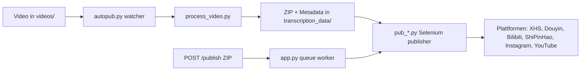

[English](../README.md) · [العربية](README.ar.md) · [Español](README.es.md) · [Français](README.fr.md) · [日本語](README.ja.md) · [한국어](README.ko.md) · [Tiếng Việt](README.vi.md) · [中文 (简体)](README.zh-Hans.md) · [中文（繁體）](README.zh-Hant.md) · [Deutsch](README.de.md) · [Русский](README.ru.md)


[](https://github.com/lachlanchen/lachlanchen/blob/main/figs/banner.png)

# AutoPublish

<p align="center">
  <strong>Skript-first, browsergesteuertes Publishing von Kurzvideos auf mehreren Plattformen.</strong><br/>
  <sub>Canonsical operations manual for setup, runtime, queue mode, and platform automation workflows.</sub>
</p>

[](#voraussetzungen)
[](#system-ueberblick)
[](#betrieb-des-tornado-services-apppy)
[](#plattform-spezifische-hinweise)
[](#betrieb-des-tornado-services-apppy)
[](#pwa-frontend-pwa)
[](https://github.com/sponsors/lachlanchen)
[](#inhaltsverzeichnis)
[](#lizenz)
[](#konfiguration)
[](#sicherheits--betriebscheckliste)
[](#raspberry-pi--linux-service-setup)

| Springe zu | Link |
| --- | --- |
| Erstes Setup | [Hier starten](#erste-schritte) |
| Im lokalen Watcher starten | [CLI-Pipeline ausfuehren (`autopub.py`)](#autopub-pipeline-verwenden) |
| Via HTTP-Queue starten | [Tornado-Service betreiben (`app.py`)](#tornado-service-nutzen) |
| Als Dienst deployen | [Raspberry Pi / Linux Service Setup](#raspberry-pi--linux-service-setup) |
| Das Projekt unterstuetzen | [Support](#support) |

Automation Toolkit zur Verteilung von Kurzvideo-Content auf mehrere chinesische und internationale Plattformen. Das Projekt kombiniert einen Tornado-basierten Service, Selenium-Automatisierungs-Bots und einen lokalen File-Watcher-Workflow, sodass das Ablegen eines Videos in einem Ordner letztlich zu Uploads auf XiaoHongShu, Douyin, Bilibili, WeChat Channels (ShiPinHao), Instagram und optional YouTube fuehrt.

Das Repository ist bewusst low-level gehalten: Die meiste Konfiguration liegt in Python-Dateien und Shell-Skripten. Diese Dokumentation ist ein operatives Handbuch fuer Setup, Laufzeit und Erweiterungspunkte.

> ⚙️ **Betriebsphilosophie**: Dieses Projekt bevorzugt explizite Skripte und direkte Browser-Automatisierung statt versteckter Abstraktionsschichten.
> ✅ **Kanonische Policy fuer dieses README**: Erst technische Details erhalten, dann Lesbarkeit und Auffindbarkeit verbessern.
> 🌍 **Lokalisierungsstatus (ueberprueft am 2026-02-28)**: `i18n/` enthaelt jetzt Arabisch, Deutsch, Spanisch, Franzoesisch, Japanisch, Koreanisch, Vietnamesisch, Vereinfachtes Chinesisch und Traditionelles Chinesisch.

### Schnellnavigation

| Ich moechte ... | Gehe hier hin |
| --- | --- |
| Meine erste Publikation starten | [Quick Start Checkliste](#schnellstart-checkliste) |
| Betriebsmodi vergleichen | [Laufzeitmodi auf einen Blick](#laufzeitmodi-im-ueberblick) |
| Credentials und Pfade setzen | [Konfiguration](#konfiguration) |
| API-Modus starten und Jobs senden | [Tornado-Service betreiben (`app.py`)](#tornado-service-nutzen) |
| Mit Copy/Paste-Befehlen testen | [Beispiele](#beispiele) |
| Auf Raspberry Pi/Linux deployen | [Raspberry Pi / Linux Service Setup](#raspberry-pi--linux-service-setup) |

<a id="start-here"></a>
## Erste Schritte

Wenn du neu in diesem Repository bist, nutze diese Reihenfolge:

1. Lies [Voraussetzungen](#voraussetzungen) und [Installation](#installation).
2. Konfiguriere Secrets und absolute Pfade in [Konfiguration](#konfiguration).
3. Bereite Browser-Debug-Sessions in [Browser-Sessions vorbereiten](#browser-sessions-vorbereiten).
4. Waehle einen Laufzeitmodus in [Nutzung](#nutzung): `autopub.py` (Watcher) oder `app.py` (API-Queue).
5. Validere mit den Befehlen aus [Beispiele](#beispiele).

<a id="overview"></a>
## Ueberblick

AutoPublish unterstuetzt aktuell zwei produktive Laufzeitmodi:

1. **CLI Watcher Modus (`autopub.py`)** fuer Ordner-basierte Ingestion und Publishing.
2. **API Queue Modus (`app.py`)** fuer ZIP-basiertes Publishing ueber HTTP (`/publish`, `/publish/queue`).

Es ist fuer Betreiber gedacht, die transparente, skriptorientierte Workflows ueber abstrakte Orchestrierungsplattformen bevorzugen.

### Laufzeitmodi im Ueberblick

| Modus | Einstiegspunkt | Eingabe | Best fuer | Ausgabeverhalten |
| --- | --- | --- | --- | --- |
| CLI watcher | `autopub.py` | Dateien, die in `videos/` landen | Lokale Operator-Workflows und Cron-/Service-Loops | Verarbeitet erkannte Videos und publiziert direkt zu den ausgewaehlten Plattformen |
| API Queue Service | `app.py` | ZIP-Upload zu `POST /publish` | Integrationen mit Upstream-Systemen und Remote-Triggern | Nimmt Jobs an, setzt sie in Queue und laeuft in Worker-Reihenfolge ab |

<a id="platform-coverage-snapshot"></a>
### Plattformabdeckung im Snapshot

| Plattform | Publisher Modul | Login Helper | Control Port | CLI Modus | API Modus |
| --- | --- | --- | --- | --- | --- |
| XiaoHongShu | `pub_xhs.py` | `login_xiaohongshu.py` | `5003` | ✅ | ✅ |
| Douyin | `pub_douyin.py` | `login_douyin.py` | `5004` | ✅ | ✅ |
| Bilibili | `pub_bilibili.py` | N/A | `5005` | ✅ | ✅ |
| ShiPinHao (WeChat Channels) | `pub_shipinhao.py` | `login_shipinhao.py` | `5006` | Optional | ✅ |
| Instagram | `pub_instagram.py` | `login_instagram.py` | `5007` | Optional | ✅ |
| YouTube | `pub_y2b.py` | N/A | `9222` | Optional | ✅ |

<a id="quick-snapshot"></a>
## Kurzer Snapshot

| Kriterium | Wert |
| --- | --- |
| Primare Sprache | Python 3.10+ |
| Haupt-Laufzeiten | CLI Watcher (`autopub.py`) + Tornado Queue Service (`app.py`) |
| Automations-Engine | Selenium + persistente Remote-Debug-Chromium-Sessions |
| Eingabeformate | Rohvideos (`videos/`) und ZIP-Bundles (`/publish`) |
| Aktueller Repo-Pfad | `/home/lachlan/ProjectsLFS/AutoPublish` |
| Zielnutzer | Creator-/Ops-Ingenieure, die Multi-Plattform-Pipelines betreiben |

### Sicherheitsschnappschuss im Betrieb

| Thema | Aktueller Stand | Aktion |
| --- | --- | --- |
| Hard-coded Pfade | In mehreren Modulen/Skripten vorhanden | Path-Konstanten pro Host vor Produktivbetrieb aktualisieren |
| Browser Login Status | Erforderlich | Fuer jede Plattform persistent ein eigenes Remote-Debug-Profil halten |
| Captcha-Handling | Optionale Integrationen vorhanden | Bei Bedarf 2Captcha-/Turing-Credentials setzen |
| Lizenzangabe | Keine `LICENSE` im Root erkannt | Nutzungsbedingungen beim Maintainer vor Weitergabe abklären |

### Kompatibilitaet & Annahmen

| Item | Annahme in diesem Repo |
| --- | --- |
| Python | 3.10+ |
| Laufzeitumgebung | Linux Desktop/Server mit verfuegbaren GUI-Display fuer Chromium |
| Browsersteuerung | Remote-Debugging Sessions mit persistierten Profilverzeichnissen |
| Primärer API Port | `8081` (`app.py --port`) |
| Processing Backend | `upload_url` + `process_url` muessen erreichbar sein und gueltiges ZIP liefern |
| Workspace fuer diesen Entwurf | `/home/lachlan/ProjectsLFS/AutoPublish` |

---

<a id="table-of-contents"></a>
## Inhaltsverzeichnis

- [Erste Schritte](#start-here)
- [Ueberblick](#overview)
- [Laufzeitmodi im Ueberblick](#runtime-modes-at-a-glance)
- [Plattformabdeckung im Snapshot](#platform-coverage-snapshot)
- [Kurzer Snapshot](#quick-snapshot)
- [Sicherheitsschnappschuss im Betrieb](#operational-safety-snapshot)
- [Kompatibilitaet & Annahmen](#compatibility--assumptions)
- [Systemueberblick](#system-overview)
- [Funktionen](#features)
- [Projektstruktur](#project-structure)
- [Repository Layout](#repository-layout)
- [Voraussetzungen](#prerequisites)
- [Installation](#installation)
- [Konfiguration](#configuration)
- [Konfigurations-Checklist](#configuration-verification-checklist)
- [Browser Sessions vorbereiten](#preparing-browser-sessions)
- [Nutzung](#usage)
- [Beispiele](#examples)
- [Metadaten & ZIP-Format](#metadata--zip-format)
- [Daten- und Artefaktlifecycle](#data--artifact-lifecycle)
- [Plattform spezifische Hinweise](#platform-specific-notes)
- [Raspberry Pi / Linux Service Setup](#raspberry-pi--linux-service-setup)
- [Legacy macOS Skripte](#legacy-macos-scripts)
- [Troubleshooting & Wartung](#troubleshooting--maintenance)
- [FAQ](#faq)
- [Erweiterung des Systems](#extending-the-system)
- [Schnellstart-Checkliste](#quick-start-checklist)
- [Entwicklungsnotizen](#development-notes)
- [Roadmap](#roadmap)
- [Mitwirken](#contributing)
- [Sicherheits- & Ops-Checklist](#security--ops-checklist)
- [Lizenz](#license)
- [Danksagungen](#acknowledgements)
- [Support](#support-autopublish)

---

<a id="system-overview"></a>
## Systemueberblick

🎯 **End-to-End Ablauf** von Rohdaten bis zum publizierten Beitrag:



Ablauf im Ueberblick:

1. **Rohmaterial-Eingang**: Lege ein Video in `videos/`. Der Watcher (entweder `autopub.py` oder Scheduler/Service) erkennt neue Dateien ueber `videos_db.csv` und `processed.csv`.
2. **Asset-Generierung**: `process_video.VideoProcessor` sendet die Datei an einen Content-Processing-Server (`upload_url` und `process_url`) und bekommt ein ZIP-Paket mit:
   - dem bearbeiteten/encodierten Video (`<stem>.mp4`),
   - einem Cover-Bild,
   - `{stem}_metadata.json` mit lokalisierten Titel-, Beschreibungs- und Tag-Daten.
3. **Publishing**: Metadaten steuern die Selenium-Publisher in `pub_*.py`. Jeder Publisher verbindet sich zu einer bereits laufenden Chromium-/Chrome-Instanz über Remote-Debugging-Ports und persistente User-Data-Verzeichnisse.
4. **Web-Steuerungsebene (optional)**: `app.py` stellt `/publish` bereit, nimmt vorgefertigte ZIP-Bundles entgegen, entpackt sie und fuegt Publish-Jobs in dieselben Publisher ein. Es kann auch Browser-Sessions aktualisieren und Login-Helper (`login_*.py`) ausloesen.
5. **Support-Module**: `load_env.py` liest Secrets aus `~/.bashrc` ein, `utils.py` stellt Hilfsfunktionen bereit (Fensterfokus, QR-Handhabung, Mail Hilfsfunktionen), und `solve_captcha_*.py` integriert Turing/2Captcha bei Captcha-Herausforderungen.

<a id="features"></a>
## Funktionen

✨ **Für pragmatische, skriptzentrische Automatisierung ausgelegt**:

- Multi-Plattform-Publishing: XiaoHongShu, Douyin, Bilibili, ShiPinHao (WeChat Channels), Instagram, YouTube (optional).
- Zwei Betriebsmodi: CLI Watcher Pipeline (`autopub.py`) und API Queue Service (`app.py` + `/publish` + `/publish/queue`).
- Plattformweise Deaktivierung ueber `ignore_*` Dateien.
- Wiederverwendung von Remote-Debugging-Browser-Sessions mit persistenten Profilen.
- Optionale QR-/Captcha-Automatisierung und Mail-Benachrichtigungs-Helfer.
- Kein Frontend-Build fuer die enthaltene PWA Upload-Oberflaeche (`pwa/`) erforderlich.
- Linux/Raspberry Pi Automatisierungsskripte fuer Service-Setup (`scripts/`).

### Funktionsmatrix

| Funktion | CLI (`autopub.py`) | API (`app.py`) |
| --- | --- | --- |
| Eingabequelle | Lokaler `videos/` Watcher | Hochgeladenes ZIP ueber `POST /publish` |
| Queueing | Interner Dateibasierter Verlauf | Explizite in-memory Job Queue |
| Plattform-Flags | CLI-Args (`--pub-*`) + `ignore_*` | Query-Args (`publish_*`) + `ignore_*` |
| Beste Wahl | Single-Host Operator Workflow | Externe Systeme und Remote Trigger |

---

<a id="project-structure"></a>
## Projektstruktur

High-level Source-/Runtime-Layout:

```text
AutoPublish/
├── README.md
├── app.py
├── autopub.py
├── process_video.py
├── load_env.py
├── utils.py
├── pub_*.py                  # Plattform-Publisher
├── login_*.py                # Plattform Login/Session Helper
├── solve_captcha_*.py
├── smtp.py
├── smtp_test_simple.py
├── send_email_qreader.py
├── requirements.txt
├── requirements.autopub.txt
├── .env.example
├── setup_raspberrypi.md
├── scripts/
├── pwa/
├── figs/
├── .github/FUNDING.yml
├── i18n/                     # mehrsprachige READMEs
├── videos/                   # Runtime-Eingabe-Artefakte
├── logs/, logs-autopub/      # Runtime-Logs
├── temp/, temp_screenshot/   # Runtime-Temp-Artefakte
├── videos_db.csv
└── processed.csv
```

Hinweis: `transcription_data/` wird zur Laufzeit im Processing/Publishing-Flow verwendet und kann nach der Ausfuehrung entstehen.

<a id="repository-layout"></a>
## Repository Layout

🗂️ **Schluesselfunktionen und deren Aufgabe**:

| Pfad | Zweck |
| --- | --- |
| `app.py` | Tornado-Service mit `/publish` und `/publish/queue`, inkl. interner Publish-Queue und Worker-Thread. |
| `autopub.py` | CLI Watcher: scannt `videos/`, verarbeitet neue Dateien und ruft Publisher parallel auf. |
| `process_video.py` | Laedt Videos zum Processing-Backend hoch und speichert zurueckgelieferte ZIP-Bundles. |
| `pub_xhs.py`, `pub_douyin.py`, `pub_bilibili.py`, `pub_shipinhao.py`, `pub_instagram.py`, `pub_y2b.py` | Selenium Automationsmodule pro Plattform. |
| `login_xiaohongshu.py`, `login_douyin.py`, `login_shipinhao.py`, `login_instagram.py` | Session Checks und QR Login Flows. |
| `utils.py` | Gemeinsame Automations-Helfer (Fensterfokus, QR/Mail Hilfsfunktionen, Diagnose). |
| `load_env.py` | Laedt Env-Variablen aus dem Shell-Profil (`~/.bashrc`) und maskiert sensible Log-Ausgaben. |
| `smtp.py`, `smtp_test_simple.py`, `send_email_qreader.py` | SMTP/SendGrid Helper und Testskripte. |
| `solve_captcha_2captcha.py`, `solve_captcha_turing.py` | Integrationen fuer Captcha Loeser. |
| `scripts/` | Service Setup- und Betriebs-Skripte (Raspberry Pi/Linux + Legacy Automatisierung). |
| `pwa/` | Statische PWA fuer ZIP-Vorschau und Publish-Eingabe. |
| `setup_raspberrypi.md` | Schritt fuer Schritt Anleitung fuer Raspberry-Pi Provisioning. |
| `.env.example` | Umgebungsvariablen Template (Credentials, Pfade, Captcha Schluessel). |
| `.github/FUNDING.yml` | Sponsor/Funding Konfiguration. |
| `logs/`, `logs-autopub/`, `temp/`, `temp_screenshot/`, `videos/` | Laufzeit-Artefakte und Logs (vieles ist gitignored). |

---

<a id="prerequisites"></a>
## Voraussetzungen

🧰 **Diese Abhaengigkeiten vor dem ersten Lauf installieren**.

### Betriebssystem und Werkzeuge

- Linux Desktop/Server mit X Session (`DISPLAY=:1` ist in bereitgestellten Skripten üblich).
- Chromium/Chrome und passender ChromeDriver.
- GUI/Media Hilfsprogramme: `xdotool`, `ffmpeg`, `zip`, `unzip`.
- Python 3.10+ (venv oder Conda).

### Python-Abhaengigkeiten

Minimales Runtime-Set:

```bash
pip install selenium tornado requests requests-toolbelt sendgrid qreader opencv-python webdriver-manager
```

Repo-Abhaengigkeiten:

```bash
python -m pip install -r requirements.txt
```

Fuer leichte Service-Installationen (standardmaessig von Setup-Skripten genutzt):

```bash
python -m pip install -r requirements.autopub.txt
```

`requirements.autopub.txt` enthaelt:
- `selenium`, `webdriver-manager`, `tornado`, `requests`, `requests-toolbelt`, `sendgrid`, `qreader`, `opencv-python`, `numpy`, `pillow`, `twocaptcha`.

### Optional: sudo Benutzer anlegen

```bash
sudo useradd -m -s /bin/bash -G sudo <USERNAME> && echo "<USERNAME>:<PASSWORD>" | sudo chpasswd
```

---

<a id="installation"></a>
## Installation

🚀 **Einrichten auf einem sauberen System**:

1. Repository klonen:

```bash
git clone https://github.com/lachlanchen/AutoPublish.git
cd AutoPublish
```

2. Umgebung erstellen und aktivieren (Beispiel mit `venv`):

```bash
python3 -m venv .venv
source .venv/bin/activate
python -m pip install -U pip
python -m pip install -r requirements.txt
```

3. Umgebungsvariablen vorbereiten:

```bash
cp .env.example .env
# fill values in .env (do not commit)
```

4. Variablen fuer Skripte laden, die Shell-Profilwerte lesen:

```bash
source ~/.bashrc
python load_env.py
```

Hinweis: `load_env.py` ist auf `~/.bashrc` ausgelegt; wenn deine Umgebung ein anderes Shell-Profil nutzt, passe das entsprechend an.

---

<a id="configuration"></a>
## Konfiguration

🔐 **Credentials setzen und Host-spezifische Pfade pruefen**.

### Umgebungsvariablen

Das Projekt erwartet Credentials und optionale Browser-/Runtime-Pfade aus Umgebungsvariablen. Starte mit `.env.example`:

| Variable | Beschreibung |
| --- | --- |
| `FROM_EMAIL`, `TO_EMAIL`, `APP_PASSWORD` | SMTP Credentials fuer QR/Login Benachrichtigungen. |
| `SENDGRID_API_KEY` | SendGrid Key fuer Email-Flows, die SendGrid APIs verwenden. |
| `APIKEY_2CAPTCHA` | 2Captcha API Key. |
| `TULING_USERNAME`, `TULING_PASSWORD`, `TULING_ID` | Turing Captcha Credentials. |
| `DOUYIN_LOGIN_PASSWORD` | Zweitfaktor-Helfer fuer Douyin. |
| `INSTAGRAM_*`, `CHROME_*`, `CHROMEDRIVER_PATH` | Overrides fuer Instagram/Browser Driver. |
| `AUTOPUBLISH_BROWSER_BIN`, `AUTOPUBLISH_CHROMEDRIVER`, `AUTOPUBLISH_DISPLAY` | Globale Browser/Driver/Display Overrides in `app.py`. |

### Pfad-Konstanten (wichtig)

📌 **Haufigster Startfehler**: nicht aufgeloeste hard-coded absolute Pfade.

Mehrere Module enthalten weiterhin hard-coded Pfade. Aktualisiere sie fuer deinen Host:

| Datei | Konstante(n) | Bedeutung |
| --- | --- | --- |
| `app.py` | `logs_folder_root`, `autopublish_folder_root`, `videos_db_path`, `processed_path`, `transcription_root`, `upload_url`, `process_url`. | API Service Roots und Backend Endpunkte. |
| `autopub.py` | `logs_folder_path`, `autopublish_folder_path`, `videos_db_path`, `processed_path`, `transcription_path`, `upload_url`, `process_url`, `chromedriver_path`. | CLI-Watcher Roots und Backend Endpunkte. |
| `scripts/run_autopub.sh`, `scripts/setup_autopub.sh` | Absolute Pfade fuer Python/Conda/Repo/Logs. | Legacy/macOS-orientierte Wrapper. |
| `utils.py` | FFmpeg Pfadannahmen in Cover-Processing Helpers. | Medienwerkzeug-Pfad Kompatibilitaet. |

Wichtiger Repository Hinweis:
- Der aktuelle Repository Pfad in diesem Workspace ist `/home/lachlan/ProjectsLFS/AutoPublish`.
- Einige Dateien enthalten noch Referenzen auf `/home/lachlan/Projects/auto-publish` oder `/Users/lachlan/...`.
- Behalt oder passe diese Pfade lokal vor Produktionsnutzung an.

### Plattform-Toggles ueber `ignore_*`

🧩 **Schneller Sicherheits-Schalter**: Eine leere `ignore_*` Datei deaktiviert diese Plattform ohne Code-Änderung.

Publishing Flags werden ebenfalls ueber Ignore-Dateien gesteuert. Lege eine leere Datei an, um eine Plattform zu deaktivieren:

```bash
touch ignore_xhs ignore_douyin ignore_bilibili ignore_shipinhao ignore_instagram ignore_y2b
```

Die entsprechende Datei wieder entfernen, um den Dienst wieder zu aktivieren.

<a id="configuration-verification-checklist"></a>
### Konfigurations-Validierungs-Checkliste

Fuehre nach Setzen von `.env` und Pfad-Konstanten diese Schnellvalidierung aus:

```bash
python -c "import os;print('AUTOPUBLISH_BROWSER_BIN=', os.getenv('AUTOPUBLISH_BROWSER_BIN'));print('AUTOPUBLISH_CHROMEDRIVER=', os.getenv('AUTOPUBLISH_CHROMEDRIVER'));print('DISPLAY=', os.getenv('DISPLAY') or os.getenv('AUTOPUBLISH_DISPLAY'))"
python -c "from load_env import load_env_from_bashrc; load_env_from_bashrc(); print('Environment load OK')"
python -c "import os; p=os.getenv('AUTOPUBLISH_CHROMEDRIVER') or os.getenv('CHROMEDRIVER_PATH') or '/usr/bin/chromedriver'; print(p, 'exists=', os.path.exists(p))"
```

Fehlen Werte, aktualisiere `.env`, `~/.bashrc` oder Script-Konstanten vor dem Start der Publisher.

---

<a id="preparing-browser-sessions"></a>
## Browser-Sessions vorbereiten

🌐 **Persistente Sessions sind Pflicht** fuer stabiles Selenium-Publishing.

1. Plattform-spezifische Profile anlegen:

```bash
mkdir -p ~/chromium_dev_session_{5003,5004,5005,5006,5007,9222}
mkdir -p ~/chromium_dev_session_logs
```

2. Browser Sessions mit Remote Debugging starten (Beispiel fuer XiaoHongShu):

```bash
DISPLAY=:1 chromium-browser \
  --remote-debugging-port=5003 \
  --user-data-dir="$HOME/chromium_dev_session_5003" \
  https://creator.xiaohongshu.com/creator/post \
  > "$HOME/chromium_dev_session_logs/chromium_xhs.log" 2>&1 &
```

3. Manual Login fuer jede Plattform/Jetzt einmal durchfuehren.
4. Verifizieren, dass Selenium verbinden kann:

```python
from selenium import webdriver
opts = webdriver.ChromeOptions()
opts.add_experimental_option("debuggerAddress", "127.0.0.1:5003")
driver = webdriver.Chrome(options=opts)
print(driver.title)
driver.quit()
```

Hinweis zur Sicherheit:
- `app.py` enthaelt aktuell noch ein hart kodiertes sudo Passwort (`password = "1"`) in der Browser-Neustartlogik. Vor Produktion ersetzen.

---

<a id="usage"></a>
## Nutzung

▶️ **Zwei Betriebsmodi sind verfuegbar**: CLI Watcher und API Queue Service.

<a id="autopub-pipeline-verwenden"></a>
### CLI Pipeline ausfuehren (`autopub.py`)

1. Lege Quelldateien in das Watch-Verzeichnis (`videos/` oder dein konfiguriertes `autopublish_folder_path`) ab.
2. Starte:

```bash
python autopub.py --use-cache --pub-xhs --pub-douyin --pub-bilibili
```

Flags:

| Flag | Bedeutung |
| --- | --- |
| `--pub-xhs`, `--pub-douyin`, `--pub-bilibili` | Beschraenkt das Publizieren auf bestimmte Plattformen. Ohne Flags sind diese drei standardmaessig aktiv. |
| `--test` | Testmodus, der an Publisher weitergereicht wird (Verhalten ist plattformabh. variabel). |
| `--use-cache` | Vorhandene `transcription_data/<video>/<video>.zip` erneut nutzen, falls vorhanden. |

CLI Ablauf pro Video:
- Upload/Verarbeitung durch `process_video.py`.
- ZIP wird nach `transcription_data/<video>/` entpackt.
- Ausgewaehlte Publisher via `ThreadPoolExecutor` starten.
- Tracking-Status in `videos_db.csv` und `processed.csv` schreiben.

<a id="tornado-service-nutzen"></a>
### Tornado Service betreiben (`app.py`)

🛰️ **API-Modus** ist praktisch fuer externe Systeme, die ZIP-Bundles erzeugen.

Start:

```bash
python app.py --refresh-time 1800 --port 8081
```

API Endpoint Uebersicht:

| Endpoint | Methode | Zweck |
| --- | --- | --- |
| `/publish` | `POST` | ZIP Bytes hochladen und einen Publish Job in die Queue stellen |
| `/publish/queue` | `GET` | Queue, Job-Verlauf und Publish Status einsehen |

<a id="publish-post"></a>
### `POST /publish`

📤 **Einen Publish-Job in die Queue geben** durch direktes Hochladen eines ZIPs.

- Header: `Content-Type: application/octet-stream`
- Erforderlich: Query/Form Arg `filename` (ZIP Dateiname)
- Optional booleans: `publish_xhs`, `publish_douyin`, `publish_bilibili`, `publish_shipinhao`, `publish_instagram`, `publish_y2b`, `test`
- Body: rohe ZIP bytes

Beispiel:

```bash
curl -X POST "http://localhost:8081/publish?filename=demo.zip&publish_xhs=true&publish_instagram=true&publish_y2b=true" \
  --data-binary @demo.zip \
  -H "Content-Type: application/octet-stream"
```

Aktuelles Verhalten laut Code:
- Die Anfrage wird angenommen und in die Queue gestellt.
- Als direkte Antwort wird JSON mit `status: queued`, `job_id` und `queue_size` geliefert.
- Der Worker Thread verarbeitet Queue-Jobs seriell.

<a id="publish-queue-get"></a>
### `GET /publish/queue`

📊 **Queue Gesundheit und laufende Jobs beobachten**.

Response:

```bash
curl "http://localhost:8081/publish/queue"
```

Beachte JSON Felder: `status`, `jobs`, `queue_size`, `is_publishing`.

### Browser Refresh Thread

♻️ Periodischer Session-Refresh reduziert alte Session Fehler ueber lange Laufzeiten.

`app.py` startet ein Hintergrund-Refresh mit Intervall `--refresh-time` und greift auf Login-Checks zurueck. Das Refresh-Intervall beinhaltet eine zufaellige Delay-Komponente.

### PWA Frontend (`pwa/`)

🖥️ Leichte statische UI fuer manuelle ZIP Uploads und Queue-Ansicht.

Lokale Ausfuehrung:

```bash
cd pwa
python -m http.server 5173
```

Oeffne `http://localhost:5173` und setze die Backend Basis-URL (z. B. `http://lazyingart:8081`).

PWA Funktionen:
- Drag/drop ZIP Vorschau.
- Zielplattformen + Testmodus Umschalter.
- Senden an `/publish` und Polling von `/publish/queue`.

### Command Palette

🧷 **Meistgenutzte Kommandos gesammelt**.

| Aufgabe | Befehl |
| --- | --- |
| Vollstaendige Abhaengigkeiten installieren | `python -m pip install -r requirements.txt` |
| Lightweight Runtime Abhaengigkeiten installieren | `python -m pip install -r requirements.autopub.txt` |
| Shell-basierte Env Variablen laden | `source ~/.bashrc && python load_env.py` |
| API Queue Server starten | `python app.py --refresh-time 1800 --port 8081` |
| CLI Watcher Pipeline starten | `python autopub.py --use-cache --pub-xhs --pub-douyin --pub-bilibili` |
| ZIP an Queue senden | `curl -X POST "http://localhost:8081/publish?filename=demo.zip" --data-binary @demo.zip -H "Content-Type: application/octet-stream"` |
| Queue Status anschauen | `curl -s "http://localhost:8081/publish/queue"` |
| Lokale PWA starten | `cd pwa && python -m http.server 5173` |

---

<a id="examples"></a>
## Beispiele

🧪 **Copy/Paste Smoke-Test Kommandos**:

### Beispiel 0: Umgebung laden und API Server starten

```bash
source ~/.bashrc
python load_env.py
python app.py --refresh-time 1800 --port 8081
```

### Beispiel A: CLI Publish Lauf

```bash
python autopub.py --pub-xhs --pub-douyin --use-cache
```

### Beispiel B: API Publish Lauf (einzelnes ZIP)

```bash
curl -X POST "http://localhost:8081/publish?filename=my_bundle.zip&publish_bilibili=true&test=true" \
  --data-binary @my_bundle.zip \
  -H "Content-Type: application/octet-stream"
```

### Beispiel C: Queue Status prüfen

```bash
curl -s "http://localhost:8081/publish/queue"
```

### Beispiel D: SMTP Helper Smoke Test

```bash
python smtp.py
python smtp_test_simple.py
```

---

<a id="metadata--zip-format"></a>
## Metadaten & ZIP-Format

📦 **ZIP Vertrag ist wichtig**: Dateinamen und Metadaten-Schluessel muessen zu Publisher Erwartungen passen.

Erwartete ZIP Inhalte (Minimum):

```text
<stem>_metadata.json
<video_filename>.mp4
<cover_filename>.jpg
```

`metadata` steuert CN Publisher; optional `metadata["english_version"]` wird vom YouTube Publisher verwendet.

Von Modulen genutzte Felder:
- `title`, `brief_description`, `middle_description`, `long_description`
- `tags` (Liste von Hashtags)
- `video_filename`, `cover_filename`
- Plattform-spezifische Felder wie in einzelnen `pub_*.py` Modulen implementiert

Wenn du ZIPs extern erzeugst, halte Schluessel und Dateinamen mit den Erwartungen der Module konsistent.

<a id="data--artifact-lifecycle"></a>
## Daten- und Artefakt-Lebenszyklus

Die Pipeline erzeugt lokale Artefakte, die Operatoren bewusst verwalten, rotieren oder aufraeumen sollten:

| Artefakt | Ort | Erzeugt von | Warum relevant |
| --- | --- | --- | --- |
| Eingabe-Videos | `videos/` | Manuelles Ablage oder upstream sync | Quelle fuer CLI Watcher |
| Processing ZIP output | `transcription_data/<stem>/<stem>.zip` | `process_video.py` | Wiederverwendbares Payload fuer `--use-cache` |
| Entpackte Publish Assets | `transcription_data/<stem>/...` | ZIP-Extraktion in `autopub.py` / `app.py` | Publisher-bereite Dateien und Metadaten |
| Publish Logs | `logs/`, `logs-autopub/` | CLI/API Runtime | Fehlersuche und Audit-Trail |
| Browser Logs | `~/chromium_dev_session_logs/*.log` (oder Chrome-Praefix) | Browser Startskripte | Diagnose fuer Session/Port/Startup Probleme |
| Tracking CSVs | `videos_db.csv`, `processed.csv` | CLI Watcher | Verhindert Doppelverarbeitung |

Empfehlung fuer Pflege:
- Plane periodische Cleanup-/Archivierungsjobs fuer alte `transcription_data/`, `temp/` und alte Logs ein, um Datenmangel durch volllaufende Platte zu vermeiden.

---

<a id="platform-specific-notes"></a>
## Plattform spezifische Hinweise

🧭 **Port Mapping + Modul-Zuordnung** pro Publisher.

| Plattform | Port | Modul(e) | Hinweise |
| --- | --- | --- | --- |
| XiaoHongShu | 5003 | `pub_xhs.py`, `login_xiaohongshu.py` | QR Re-Login Flow; Titel-Bereinigung und Hashtag Nutzung ueber Metadaten. |
| Douyin | 5004 | `pub_douyin.py`, `login_douyin.py` | Upload Abschluss Checks und Retry-Pfade sind plattform-sensitiv; Logs engmaschig beobachten. |
| Bilibili | 5005 | `pub_bilibili.py` | Captcha Hooks ueber `solve_captcha_2captcha.py` und `solve_captcha_turing.py` verfuegbar. |
| ShiPinHao (WeChat Channels) | 5006 | `pub_shipinhao.py`, `login_shipinhao.py` | Schnelle QR Freigabe fuer stabiles Session Refresh wichtig. |
| Instagram | 5007 | `pub_instagram.py`, `login_instagram.py` | Steuerung im API Modus mit `publish_instagram=true`; Env Vars in `.env.example`. |
| YouTube | 9222 | `pub_y2b.py` | Verwendet `english_version` Metadata Block; mit `ignore_y2b` deaktivieren. |

<a id="raspberry-pi--linux-service-setup"></a>
## Raspberry Pi / Linux Service Setup

🐧 **Empfohlen fuer Always-on Hosts**.

Fuer vollstaendige Host Einrichtung siehe [`setup_raspberrypi.md`](setup_raspberrypi.md).

Kurzes Setup:

```bash
export AUTOPUB_USER=<USERNAME>
export AUTOPUB_REPO=/home/<USERNAME>/Projects/autopub
sudo -E ./scripts/setup_autopub_pipeline.sh
```

Das orchestriert:
- `scripts/setup_envs.sh`
- `scripts/setup_virtual_desktop_service.sh`
- `scripts/download_and_setup_driver.sh`
- `scripts/setup_autopub_service.sh`

Service manuell in tmux starten:

```bash
./scripts/start_autopub_tmux.sh
```

Services/Ports pruefen:

```bash
systemctl status autopub.service autopub-vnc.service
sudo ss -ltnp | grep 590
```

Kompatibilitaets Hinweis:
- Einige Aeltere Dokumente/Skripte verweisen noch auf `virtual-desktop.service`; aktuelle Setup Skripte im Repo installieren `autopub-vnc.service`.

<a id="legacy-macos-scripts"></a>
## Legacy macOS Skripte

🍎 Legacy Wrapper bleiben zur Kompatibilitaet mit alten lokalen Setups erhalten.

Im Repository sind noch folgende macOS-orientierte Wrapper enthalten:
- `scripts/run_autopub.sh`
- `scripts/setup_autopub.sh`

Sie enthalten absolute `/Users/lachlan/...` Pfade und Conda Annahmen. Behalte sie, wenn du diesen Workflow nutzt, passe aber Pfade/venv/Tools fuer deinen Host an.

---

<a id="troubleshooting--maintenance"></a>
## Troubleshooting & Wartung

🛠️ **Wenn etwas schief laeuft, dort anfangen**.

- **Pfaddrift zwischen Maschinen**: Wenn Fehler Dateien unter `/Users/lachlan/...` oder `/home/lachlan/Projects/auto-publish` nicht finden, gleiche Konstanten auf deinen Host-Pfad an (`/home/lachlan/ProjectsLFS/AutoPublish` in diesem Workspace).
- **Secrets Hygiene**: Führe `~/.local/bin/detect-secrets scan` vor jedem Push aus. Leaks rotieren.
- **Fehler im Processing Backend**: Wenn `process_video.py` "Failed to get the uploaded file path" ausgibt, prüfe, ob die Upload Response JSON `file_path` enthaelt und der Verarbeitungspunkt ZIP bytes laesst.
- **ChromeDriver Mismatch**: Bei DevTools Verbindungsfehlern bitte Chrome/Chromium und Driver Versionen angleichen (oder auf `webdriver-manager` wechseln).
- **Browser Fokus Probleme**: `bring_to_front` basiert auf Fenstertitel; Namensunterschiede von Chromium/Chrome koennen diesen Ansatz brechen.
- **Captcha Unterbrechungen**: Konfiguriere 2Captcha/Turing Credentials und integriere Solver-Ausgaben wo notwendig.
- **Stale Lock Dateien**: Wenn zeitgesteuerte Runs nicht starten, Prozessstatus pruefen und alte `autopub.lock` Datei entfernen (Legacy Ablauf).
- **Logs zur Pruefung**: `logs/`, `logs-autopub/`, `~/chromium_dev_session_logs/*.log`, plus Service Journal Logs.

<a id="faq"></a>
## FAQ

**F: Kann ich API Modus und CLI Watcher gleichzeitig betreiben?**  
A: Möglich, aber nicht empfohlen, es sei denn, Eingabequellen und Browser-Sessions sind strikt getrennt. Beide Modi knnen auf dieselben Publisher, Dateien und Ports zugreifen.

**F: Warum liefert `/publish` `queued`, aber es wird noch nichts publiziert?**  
A: `app.py` stellt Jobs zuerst in die Queue, danach verarbeitet der Hintergrund-Worker sie seriell. Ueberpruefe `/publish/queue`, `is_publishing` und die Service-Logs.

**F: Brauche ich `load_env.py`, wenn ich bereits `.env` nutze?**  
A: `start_autopub_tmux.sh` liest `.env` falls vorhanden, jedoch verlassen einige direkte Ausfuehrungen das Shell-environment. Halte `.env` und Shell Exports konsistent.

**F: Was ist der minimale ZIP Vertrag fuer API Uploads?**  
A: Ein gueltiges ZIP mit `{stem}_metadata.json` plus Video- und Cover-Datei, deren Namen in den Metadata Feldern (`video_filename`, `cover_filename`) referenziert sind.

**F: Wird Headless Mode unterstuetzt?**  
A: Einige Module expose headless-bezogene Variablen, aber dokumentierter Primärbetrieb ist GUI-basierter Browserbetrieb mit persistierten Profilen.

<a id="extending-the-system"></a>
## Erweiterung des Systems

🧱 **Erweiterungsmöglichkeiten** fuer neue Plattformen und sichereren Betrieb.

- **Neue Plattform hinzufuegen**: Kopiere ein `pub_*.py` Modul, aktualisiere Selektoren/Flows, fuege falls benoetigt ein `login_*.py` hinzu und binde Flags sowie Queue-Handling in `app.py` und CLI-Verkabelung in `autopub.py` ein.
- **Konfigurations-Abstraktion**: Migration verstreuter Konstanten auf strukturiertes Config Modell (`config.yaml`/`.env` + typisierte Konfiguration) fuer multi-host Betrieb.
- **Credential-Härtung**: Ersatz von hard-coded oder shell-angezeigten Geheimwaegen durch sichere Secret-Manager Lsg. (`sudo -A`, Keychain, Vault/Secret Manager).
- **Containerisierung**: Chromium/ChromeDriver + Python Runtime + virtuellen Display in einem deploybaren Bundle fuer Cloud/Server.

<a id="quick-start-checklist"></a>
## Schnellstart-Checkliste

✅ **Minimaler Pfad zur ersten erfolgreichen Veroeffentlichung**.

1. Repository klonen und Abhaengigkeiten installieren (`pip install -r requirements.txt` oder lightweight `requirements.autopub.txt`).
2. Hard-coded Pfad Konstante in `app.py`, `autopub.py` und allen auszufuehrenden Skripten anpassen.
3. Erforderliche Credentials in Shell Profil oder `.env` exportieren; `python load_env.py` fuer Ladevorgang testen.
4. Remote Debug Browser Profilverzeichnisse anlegen und jede benoetigte Plattform-Session einmal starten.
5. Jede Zielplattform im Browser manuell anmelden.
6. Entweder API Modus starten (`python app.py --port 8081`) oder CLI Modus (`python autopub.py --use-cache ...`).
7. Eine Beispiel-ZIP (API Modus) oder eine Beispieldatei (CLI Modus) einreichen und `logs/` pruefen.
8. Vor jedem Push Secrets Scans ausfuehren.

<a id="development-notes"></a>
## Entwicklungshinweise

🧬 **Aktuelle Entwicklungsgrundlage** (manuelles Formatting + Smoke Tests).

- Python-Style folgt bestehender 4-Space Einrueckung und manuellen Formaten.
- Kein formelles automatisiertes Testsystem; stattdessen Smoke Tests:
  - Prozessiere ein Sample Video durch `autopub.py`;
  - sende ein ZIP an `/publish` und beobachte `/publish/queue`;
  - valide jedes Zielplatform manuell.
- Bei neuen Skripten einen kleinen `if __name__ == "__main__":` Einstiegspunkt einbauen, um schnelle Trockenausfuehrungen zu ermoeglichen.
- Plattformaenderungen moeglichst isoliert halten (`pub_*`, `login_*`, `ignore_*` Schalter).
- Laufzeit-Artefakte (`videos/*`, `logs*/*`, `transcription_data/*`, `ignore_*`) werden lokal erwartet und sind zumeist ignored.

---

<a id="roadmap"></a>
## Roadmap

🗺️ **Prioritaetserhoehte Verbesserungen laut aktueller Code-Constraints**.

Geplante und gewuenschte Verbesserungen:

1. Verstreute hart kodierte Pfade durch zentrale Konfiguration ersetzen (`.env`/YAML + typisierte Modelle).
2. Hart kodierte Sudo Passwortmuster entfernen und Prozesssteuerung auf sichere Mechanismen umstellen.
3. Verlaesslichkeit beim Publizieren verbessern durch stabilere Wiederholungen und bessere UI-Zustandserkennung je Plattform.
4. Plattformunterstuetzung erweitern (z. B. Kuaishou oder andere Creator Plattformen).
5. Laufzeit als reproduzierbares Deployment Paket (Container + virtuelles Display Profil).
6. Automatisierte Integrationspruefungen fuer ZIP Vertrag und Queue Ausfuehrung ergänzen.

<a id="contributing"></a>
## Mitwirken

🤝 PRs willkommen: fokussiert, reproduzierbar und eindeutig bzgl. Laufzeit-Annahmen.

1. Forken und fokussierten Branch anlegen.
2. Kleine, imperative Commits halten (z. B. "Wait for YouTube checks before publishing").
3. Verifizierungsnotizen in PRs aufnehmen:
   - Umgebungsannahmen,
   - Browser/Session Restarts,
   - Relevante Logs/Screenshots bei UI Flow Aenderungen.
4. Niemals echte Secrets committen (`.env` ist ignored; nutze `.env.example` fuer Schema nur).

Wenn neue Publisher Module eingefuehrt werden, alle folgenden Punkte anbinden:
- `pub_<platform>.py`
- optional `login_<platform>.py`
- API Flags und Queue Handling in `app.py`
- CLI Wiring in `autopub.py` (wenn relevant)
- `ignore_<platform>` Toggle Handling
- README Aktualisierung

<a id="security--ops-checklist"></a>
## Sicherheits- & Ops-Checkliste

Vor produktionsnahen Runs:

1. Sicherstellen, dass `.env` lokal existiert und nicht im Git liegt.
2. Credentials, die historisch geleakt wurden, rotieren/entfernen.
3. Platzhalter-Sensitivwerte im Code ersetzen (beispielsweise Passwort Platzhalter in `app.py`).
4. Verifizieren, dass `ignore_*` Schalter fuer den geplanten Batch bewusst gesetzt sind.
5. Sicherstellen, dass Browser-Profile pro Plattform isoliert sind und nur minimal privilegierte Accounts verwendet werden.
6. Pruefen, dass Logs keine Secrets enthalten, bevor Tickets/Issues geteilt werden.
7. Vor Push `detect-secrets` (oder Aequivalentes) ausfuehren.

<a id="support-autopublish"></a>
## ❤️ Support

| Donate | PayPal | Stripe |
|---|---|---|
| [](https://chat.lazying.art/donate) | [](https://paypal.me/RongzhouChen) | [](https://buy.stripe.com/aFadR8gIaflgfQV6T4fw400) |

💖 Community Unterstuetzung finanziert Infrastruktur, Zuverlaessigkeit und neue Plattform-Integrationen.

AutoPublish ist Teil einer groesseren Initiative, um Multi-Plattform-Creator-Werkzeuge offen und gut anpassbar zu halten. Spenden helfen dabei:

- Selenium-Umgebung, Processing API und Cloud GPUs am Leben zu erhalten.
- Neue Publisher wie Kuaishou oder Instagram Reels sowie Stabilitaetsfixes fuer bestehende Bots zu entwickeln.
- Mehr Dokumentation, Starter-Daten und Tutorials fuer selbststaendige Creator anzubieten.

### Zusätzliche Spendenoptionen

<div align="center">
<table style="margin:0 auto; text-align:center; border-collapse:collapse;">
  <tr>
    <td style="text-align:center; vertical-align:middle; padding:6px 12px;">
      <a href="https://chat.lazying.art/donate">https://chat.lazying.art/donate</a>
    </td>
    <td style="text-align:center; vertical-align:middle; padding:6px 12px;">
      <a href="https://chat.lazying.art/donate"></a>
    </td>
  </tr>
  <tr>
    <td style="text-align:center; vertical-align:middle; padding:6px 12px;">
      <a href="https://paypal.me/RongzhouChen">
        
      </a>
    </td>
    <td style="text-align:center; vertical-align:middle; padding:6px 12px;">
      <a href="https://buy.stripe.com/aFadR8gIaflgfQV6T4fw400">
        
      </a>
    </td>
  </tr>
  <tr>
    <td style="text-align:center; vertical-align:middle; padding:6px 12px;"><strong>WeChat</strong></td>
    <td style="text-align:center; vertical-align:middle; padding:6px 12px;"><strong>Alipay</strong></td>
  </tr>
  <tr>
    <td style="text-align:center; vertical-align:middle; padding:6px 12px;"></td>
    <td style="text-align:center; vertical-align:middle; padding:6px 12px;"></td>
  </tr>
</table>
</div>

**Spenden / Donate**

- Financial Unterstuetzung erlaubt es, die Entwicklungs- und Betriebskosten des Creator Automation Projekts zu decken.
- Dein Beitrag hilft, den Serverbetrieb und die Entwicklung zu staerken, damit der Open-Workflow fuer Cross-Platform Publishing weiter ausgebaut bleibt.
- Your support keeps the pipelines alive so more independent studios can publish everywhere with less busywork.

Auch verfuegbar via:
- GitHub Sponsors: <https://github.com/sponsors/lachlanchen>
- Projektlinks: <https://lazying.art>, <https://chat.lazying.art>, <https://onlyideas.art>

---

<a id="license"></a>
## Lizenz

In diesem Repository Snapshot ist keine `LICENSE` Datei vorhanden.

Annahme fuer diesen Entwurf:
- Nutzung und Weitergabe gelten als nicht definiert, bis der Maintainer eine explizite Lizenzdatei bereitstellt.

Empfohlene naechste Aktion:
- Füge eine Top-level `LICENSE` hinzu (z. B. MIT/Apache-2.0/GPL-3.0) und aktualisiere diesen Abschnitt entsprechend.

> 📝 Solange keine Lizenzdatei existiert, bleiben kommerzielle/interne Weiterverwendungsannahmen offen; ruecksprich direkt mit dem Maintainer.

<a id="acknowledgements"></a>
## Danksagung

- Maintainer und Sponsor Profil: [@lachlanchen](https://github.com/lachlanchen)
- Funding Konfiguration Quelle: [`.github/FUNDING.yml`](.github/FUNDING.yml)
- Im Repo genannte Ecosystem Services: Selenium, Tornado, SendGrid, 2Captcha, Turing captcha APIs.
