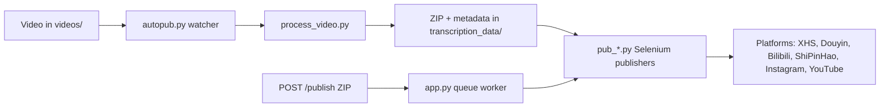

[English](../README.md) · [العربية](README.ar.md) · [Español](README.es.md) · [Français](README.fr.md) · [日本語](README.ja.md) · [한국어](README.ko.md) · [Tiếng Việt](README.vi.md) · [中文 (简体)](README.zh-Hans.md) · [中文（繁體）](README.zh-Hant.md) · [Deutsch](README.de.md) · [Русский](README.ru.md)


[](https://github.com/lachlanchen/lachlanchen/blob/main/figs/banner.png)

# AutoPublish

<p align="center">
  <strong>Publicación multiplataforma de videos cortos, guiada por navegador y orientada a scripts.</strong><br/>
  <sub>Manual operativo canónico para configuración, ejecución, modo cola y flujos de automatización por plataforma.</sub>
</p>

[](#prerrequisitos)
[](#resumen-del-sistema)
[](#ejecucion-del-servicio-tornado-apppy)
[](#notas-especificas-por-plataforma)
[](#ejecucion-del-servicio-tornado-apppy)
[](#frontend-pwa-pwa)
[](https://github.com/sponsors/lachlanchen)
[](#tabla-de-contenidos)
[](#licencia)
[](#configuracion)
[](#checklist-de-seguridad--operaciones)
[](#configuracion-de-servicio-raspberry-pi--linux)

| Ir a | Enlace |
| --- | --- |
| Primera configuración | [Empieza Aquí](#empieza-aqui) |
| Ejecutar con watcher local | [Ejecución del pipeline CLI (`autopub.py`)](#ejecucion-del-pipeline-cli-autopubpy) |
| Ejecutar vía cola HTTP | [Ejecución del servicio Tornado (`app.py`)](#ejecucion-del-servicio-tornado-apppy) |
| Desplegar como servicio | [Configuración de Servicio Raspberry Pi / Linux](#configuracion-de-servicio-raspberry-pi--linux) |
| Apoyar el proyecto | [Support](#support-autopublish) |

Toolkit de automatización para distribuir contenido de video corto en múltiples plataformas chinas e internacionales para creadores. El proyecto combina un servicio basado en Tornado, bots de Selenium y un flujo local de vigilancia de archivos para que, al dejar un video en una carpeta, termine publicándose en XiaoHongShu, Douyin, Bilibili, WeChat Channels (ShiPinHao), Instagram y, opcionalmente, YouTube.

El repositorio es intencionalmente de bajo nivel: gran parte de la configuración vive en archivos Python y scripts de shell. Este documento es un manual operativo que cubre configuración, ejecución y puntos de extensión.

> ⚙️ **Filosofía operativa**: este proyecto prioriza scripts explícitos y automatización directa del navegador sobre capas de abstracción ocultas.
> ✅ **Política canónica de este README**: preservar el detalle técnico y luego mejorar legibilidad y descubribilidad.
> 🌍 **Estado de localización (verificado en este workspace el 28 de febrero de 2026)**: `i18n/` incluye variantes en árabe, alemán, español, francés, japonés, coreano, ruso, vietnamita, chino simplificado y chino tradicional.

### Navegación Rápida

| Quiero... | Ir aquí |
| --- | --- |
| Ejecutar mi primera publicación | [Checklist de Inicio Rápido](#checklist-de-inicio-rapido) |
| Comparar modos de ejecución | [Modos de Ejecución de un Vistazo](#modos-de-ejecucion-de-un-vistazo) |
| Configurar credenciales y rutas | [Configuración](#configuracion) |
| Iniciar modo API y encolar trabajos | [Ejecución del servicio Tornado (`app.py`)](#ejecucion-del-servicio-tornado-apppy) |
| Validar con comandos de copiar/pegar | [Ejemplos](#ejemplos) |
| Configurar en Raspberry Pi/Linux | [Configuración de Servicio Raspberry Pi / Linux](#configuracion-de-servicio-raspberry-pi--linux) |

## Empieza Aquí

Si eres nuevo en este repositorio, usa esta secuencia:

1. Lee [Prerrequisitos](#prerrequisitos) e [Instalación](#instalacion).
2. Configura secretos y rutas absolutas en [Configuración](#configuracion).
3. Prepara sesiones del navegador en [Preparación de Sesiones del Navegador](#preparacion-de-sesiones-del-navegador).
4. Elige un modo de ejecución en [Uso](#uso): `autopub.py` (watcher) o `app.py` (cola API).
5. Valida con los comandos de [Ejemplos](#ejemplos).

## Resumen

AutoPublish actualmente soporta dos modos de ejecución de producción:

1. **Modo watcher CLI (`autopub.py`)** para ingestión y publicación basadas en carpetas.
2. **Modo cola API (`app.py`)** para publicación basada en ZIP vía HTTP (`/publish`, `/publish/queue`).

Está diseñado para operadores que prefieren flujos transparentes, centrados en scripts, frente a plataformas de orquestación abstractas.

### Modos de Ejecución de un Vistazo

| Modo | Punto de entrada | Entrada | Ideal para | Comportamiento de salida |
| --- | --- | --- | --- | --- |
| Watcher CLI | `autopub.py` | Archivos colocados en `videos/` | Flujos locales de operador y bucles cron/servicio | Procesa videos detectados y publica de inmediato en las plataformas seleccionadas |
| Servicio de cola API | `app.py` | Carga ZIP a `POST /publish` | Integraciones con sistemas upstream y activación remota | Acepta trabajos, los encola y ejecuta publicación en orden de worker |

### Cobertura de Plataformas

| Plataforma | Módulo publicador | Helper de login | Puerto de control | Modo CLI | Modo API |
| --- | --- | --- | --- | --- | --- |
| XiaoHongShu | `pub_xhs.py` | `login_xiaohongshu.py` | `5003` | ✅ | ✅ |
| Douyin | `pub_douyin.py` | `login_douyin.py` | `5004` | ✅ | ✅ |
| Bilibili | `pub_bilibili.py` | N/A | `5005` | ✅ | ✅ |
| ShiPinHao (WeChat Channels) | `pub_shipinhao.py` | `login_shipinhao.py` | `5006` | Opcional | ✅ |
| Instagram | `pub_instagram.py` | `login_instagram.py` | `5007` | Opcional | ✅ |
| YouTube | `pub_y2b.py` | N/A | `9222` | Opcional | ✅ |

## Vista Rápida

| Qué | Valor |
| --- | --- |
| Lenguaje principal | Python 3.10+ |
| Runtimes principales | Watcher CLI (`autopub.py`) + servicio de cola Tornado (`app.py`) |
| Motor de automatización | Selenium + sesiones Chromium con depuración remota |
| Formatos de entrada | Videos en crudo (`videos/`) y bundles ZIP (`/publish`) |
| Ruta del workspace del repositorio | `/home/lachlan/ProjectsLFS/AutoPublish` |
| Usuarios ideales | Creadores/ingenieros de operaciones que gestionan pipelines de video corto multiplataforma |

### Vista de Seguridad Operativa

| Tema | Estado actual | Acción |
| --- | --- | --- |
| Rutas hard-codeadas | Presentes en múltiples módulos/scripts | Actualizar constantes de ruta por host antes de producción |
| Estado de login del navegador | Requerido | Mantener perfiles persistentes de depuración remota por plataforma |
| Gestión de captcha | Integraciones opcionales disponibles | Configurar credenciales de 2Captcha/Turing cuando aplique |
| Declaración de licencia | No se detecta archivo `LICENSE` en la raíz | Confirmar términos de uso con el mantenedor antes de redistribuir |

### Compatibilidad y Supuestos

| Elemento | Supuesto actual en este repositorio |
| --- | --- |
| Python | 3.10+ |
| Entorno de ejecución | Linux desktop/server con GUI disponible para Chromium |
| Modo de control del navegador | Sesiones de depuración remota con directorios de perfil persistentes |
| Puerto API principal | `8081` (`app.py --port`) |
| Backend de procesamiento | `upload_url` + `process_url` deben ser accesibles y devolver ZIP válido |
| Workspace usado para este borrador | `/home/lachlan/ProjectsLFS/AutoPublish` |

---

## Tabla de Contenidos

- [Empieza Aquí](#empieza-aqui)
- [Resumen](#resumen)
- [Modos de Ejecución de un Vistazo](#modos-de-ejecucion-de-un-vistazo)
- [Cobertura de Plataformas](#cobertura-de-plataformas)
- [Vista Rápida](#vista-rapida)
- [Vista de Seguridad Operativa](#vista-de-seguridad-operativa)
- [Compatibilidad y Supuestos](#compatibilidad-y-supuestos)
- [Resumen del Sistema](#resumen-del-sistema)
- [Características](#caracteristicas)
- [Estructura del Proyecto](#estructura-del-proyecto)
- [Distribución del Repositorio](#distribucion-del-repositorio)
- [Prerrequisitos](#prerrequisitos)
- [Instalación](#instalacion)
- [Configuración](#configuracion)
- [Checklist de Verificación de Configuración](#checklist-de-verificacion-de-configuracion)
- [Preparación de Sesiones del Navegador](#preparacion-de-sesiones-del-navegador)
- [Uso](#uso)
- [Ejemplos](#ejemplos)
- [Metadata y Formato ZIP](#metadata-y-formato-zip)
- [Ciclo de Vida de Datos y Artefactos](#ciclo-de-vida-de-datos-y-artefactos)
- [Notas Específicas por Plataforma](#notas-especificas-por-plataforma)
- [Configuración de Servicio Raspberry Pi / Linux](#configuracion-de-servicio-raspberry-pi--linux)
- [Scripts Legacy para macOS](#scripts-legacy-para-macos)
- [Solución de Problemas y Mantenimiento](#solucion-de-problemas-y-mantenimiento)
- [FAQ](#faq)
- [Extender el Sistema](#extender-el-sistema)
- [Checklist de Inicio Rápido](#checklist-de-inicio-rapido)
- [Notas de Desarrollo](#notas-de-desarrollo)
- [Hoja de Ruta](#hoja-de-ruta)
- [Contribuir](#contribuir)
- [Checklist de Seguridad & Operaciones](#checklist-de-seguridad--operaciones)
- [Support](#support-autopublish)
- [Licencia](#licencia)
- [Agradecimientos](#agradecimientos)

---

## Resumen del Sistema

🎯 **Flujo de extremo a extremo** desde media cruda hasta posts publicados:



Flujo de trabajo de un vistazo:

1. **Ingreso de material bruto**: coloca un video dentro de `videos/`. El watcher (`autopub.py` o un scheduler/servicio) detecta archivos nuevos usando `videos_db.csv` y `processed.csv`.
2. **Generación de recursos**: `process_video.VideoProcessor` sube el archivo al servidor de procesamiento de contenido (`upload_url` y `process_url`) y recibe un ZIP que contiene:
   - video editado/codificado (`<stem>.mp4`),
   - imagen de portada,
   - `{stem}_metadata.json` con títulos localizados, descripciones, tags, etc.
3. **Publicación**: la metadata alimenta los publicadores Selenium de `pub_*.py`. Cada publicador se conecta a una instancia Chromium/Chrome ya activa mediante puertos de depuración remota y perfiles persistentes.
4. **Plano de control web (opcional)**: `app.py` expone `/publish`, acepta bundles ZIP preconstruidos, los descomprime y encola trabajos para los mismos publicadores. También puede refrescar sesiones de navegador y activar helpers de login (`login_*.py`).
5. **Módulos de soporte**: `load_env.py` hidrata secretos desde `~/.bashrc`; `utils.py` ofrece utilidades (focus de ventana, manejo QR, helpers de correo); `solve_captcha_*.py` integra Turing/2Captcha cuando aparecen captchas.

## Características

✨ **Diseñado para automatización pragmática, orientada a scripts**:

- Publicación multi-plataforma: XiaoHongShu, Douyin, Bilibili, ShiPinHao (WeChat Channels), Instagram, YouTube (opcional).
- Dos modos de operación: watcher CLI (`autopub.py`) y servicio de cola API (`app.py` + `/publish` + `/publish/queue`).
- Interruptores temporales por plataforma mediante archivos `ignore_*`.
- Reutilización de sesiones de navegador con depuración remota y perfiles persistentes.
- Automatización opcional de QR/captcha y helpers de notificación por correo.
- Sin requisito de build frontend para la UI PWA incluida (`pwa/`).
- Scripts Linux/Raspberry Pi para configuración como servicio (`scripts/`).

### Matriz de Características

| Capacidad | CLI (`autopub.py`) | API (`app.py`) |
| --- | --- | --- |
| Fuente de entrada | Watcher local en `videos/` | ZIP subido vía `POST /publish` |
| Encolado | Progresión interna basada en archivos | Cola explícita en memoria |
| Flags de plataforma | Args CLI (`--pub-*`) + `ignore_*` | Query args (`publish_*`) + `ignore_*` |
| Mejor encaje | Flujo de operador en un solo host | Sistemas externos y activación remota |

---

## Estructura del Proyecto

Distribución de código/runtime a alto nivel:

```text
AutoPublish/
├── README.md
├── app.py
├── autopub.py
├── process_video.py
├── load_env.py
├── utils.py
├── pub_*.py                  # publicadores por plataforma
├── login_*.py                # helpers de login/sesión por plataforma
├── solve_captcha_*.py
├── smtp.py
├── smtp_test_simple.py
├── send_email_qreader.py
├── requirements.txt
├── requirements.autopub.txt
├── .env.example
├── setup_raspberrypi.md
├── scripts/
├── pwa/
├── figs/
├── .github/FUNDING.yml
├── i18n/                     # READMEs multilingües
├── videos/                   # artefactos de entrada de runtime
├── logs/, logs-autopub/      # logs de runtime
├── temp/, temp_screenshot/   # artefactos temporales de runtime
├── videos_db.csv
└── processed.csv
```

Nota: `transcription_data/` se usa en runtime por el flujo de procesamiento/publicación y puede aparecer tras la ejecución.

## Distribución del Repositorio

🗂️ **Módulos clave y su función**:

| Ruta | Propósito |
| --- | --- |
| `app.py` | Servicio Tornado que expone `/publish` y `/publish/queue`, con cola interna y worker thread. |
| `autopub.py` | Watcher CLI: escanea `videos/`, procesa archivos nuevos e invoca publicadores en paralelo. |
| `process_video.py` | Sube videos al backend de procesamiento y guarda los ZIP devueltos. |
| `pub_xhs.py`, `pub_douyin.py`, `pub_bilibili.py`, `pub_shipinhao.py`, `pub_instagram.py`, `pub_y2b.py` | Módulos de automatización Selenium por plataforma. |
| `login_xiaohongshu.py`, `login_douyin.py`, `login_shipinhao.py`, `login_instagram.py` | Verificación de sesiones y flujos de login QR. |
| `utils.py` | Helpers compartidos (focus de ventana, QR/mail, diagnóstico). |
| `load_env.py` | Carga variables desde `~/.bashrc` y enmascara logs sensibles. |
| `smtp.py`, `smtp_test_simple.py`, `send_email_qreader.py` | Helpers SMTP/SendGrid y scripts de prueba. |
| `solve_captcha_2captcha.py`, `solve_captcha_turing.py` | Integraciones de resolución de captcha. |
| `scripts/` | Scripts de setup/operación (Raspberry Pi/Linux + automatización legacy). |
| `pwa/` | PWA estática para vista previa de ZIP y envío de publicación. |
| `setup_raspberrypi.md` | Guía paso a paso para aprovisionamiento Raspberry Pi. |
| `.env.example` | Plantilla de variables de entorno (credenciales, rutas, claves captcha). |
| `.github/FUNDING.yml` | Configuración de patrocinio/financiación. |
| `logs/`, `logs-autopub/`, `temp/`, `temp_screenshot/`, `videos/` | Artefactos y logs de runtime (muchos están en gitignore). |

---

## Prerrequisitos

🧰 **Instala esto antes de la primera ejecución**.

### Sistema operativo y herramientas

- Linux desktop/server con sesión X (`DISPLAY=:1` es común en los scripts incluidos).
- Chromium/Chrome y ChromeDriver compatible.
- Helpers GUI/media: `xdotool`, `ffmpeg`, `zip`, `unzip`.
- Python 3.10+ (venv o Conda).

### Dependencias de Python

Conjunto mínimo de runtime:

```bash
pip install selenium tornado requests requests-toolbelt sendgrid qreader opencv-python webdriver-manager
```

Paridad con el repositorio:

```bash
python -m pip install -r requirements.txt
```

Para instalaciones ligeras del servicio (usadas por los scripts de setup por defecto):

```bash
python -m pip install -r requirements.autopub.txt
```

`requirements.autopub.txt` contiene:
- `selenium`, `webdriver-manager`, `tornado`, `requests`, `requests-toolbelt`, `sendgrid`, `qreader`, `opencv-python`, `numpy`, `pillow`, `twocaptcha`.

### Opcional: crear un usuario sudo

```bash
sudo useradd -m -s /bin/bash -G sudo <USERNAME> && echo "<USERNAME>:<PASSWORD>" | sudo chpasswd
```

---

## Instalación

🚀 **Configuración desde una máquina limpia**:

1. Clona el repositorio:

```bash
git clone https://github.com/lachlanchen/AutoPublish.git
cd AutoPublish
```

2. Crea y activa un entorno (ejemplo con `venv`):

```bash
python3 -m venv .venv
source .venv/bin/activate
python -m pip install -U pip
python -m pip install -r requirements.txt
```

3. Prepara variables de entorno:

```bash
cp .env.example .env
# fill values in .env (do not commit)
```

4. Carga variables para scripts que leen valores del perfil de shell:

```bash
source ~/.bashrc
python load_env.py
```

Nota: `load_env.py` está diseñado alrededor de `~/.bashrc`; si tu entorno usa otro perfil de shell, ajústalo.

---

## Configuración

🔐 **Configura credenciales y luego verifica rutas específicas del host**.

### Variables de entorno

El proyecto espera credenciales y rutas opcionales de navegador/runtime desde variables de entorno. Empieza desde `.env.example`:

| Variable | Descripción |
| --- | --- |
| `FROM_EMAIL`, `TO_EMAIL`, `APP_PASSWORD` | Credenciales SMTP para notificaciones de QR/login. |
| `SENDGRID_API_KEY` | Clave SendGrid para flujos de correo que usan APIs de SendGrid. |
| `APIKEY_2CAPTCHA` | Clave API de 2Captcha. |
| `TULING_USERNAME`, `TULING_PASSWORD`, `TULING_ID` | Credenciales captcha de Turing. |
| `DOUYIN_LOGIN_PASSWORD` | Helper de segunda verificación de Douyin. |
| `INSTAGRAM_*`, `CHROME_*`, `CHROMEDRIVER_PATH` | Overrides de navegador/driver para Instagram. |
| `AUTOPUBLISH_BROWSER_BIN`, `AUTOPUBLISH_CHROMEDRIVER`, `AUTOPUBLISH_DISPLAY` | Overrides globales preferidos de navegador/driver/display en `app.py`. |

### Constantes de ruta (importante)

📌 **Problema de arranque más común**: rutas absolutas hard-codeadas sin resolver.

Varios módulos todavía contienen rutas hard-codeadas. Actualízalas para tu host:

| Archivo | Constante(s) | Significado |
| --- | --- | --- |
| `app.py` | `logs_folder_root`, `autopublish_folder_root`, `videos_db_path`, `processed_path`, `transcription_root`, `upload_url`, `process_url`. | Raíces del servicio API y endpoints backend. |
| `autopub.py` | `logs_folder_path`, `autopublish_folder_path`, `videos_db_path`, `processed_path`, `transcription_path`, `upload_url`, `process_url`, `chromedriver_path`. | Raíces del watcher CLI y endpoints backend. |
| `scripts/run_autopub.sh`, `scripts/setup_autopub.sh` | Rutas absolutas a Python/Conda/repo/logs. | Wrappers legacy orientados a macOS. |
| `utils.py` | Suposiciones de ruta FFmpeg en helpers de portada. | Compatibilidad de rutas de herramientas multimedia. |

Nota importante del repositorio:
- La ruta actual del repo en este workspace es `/home/lachlan/ProjectsLFS/AutoPublish`.
- Parte del código y scripts aún referencia `/home/lachlan/Projects/auto-publish` o `/Users/lachlan/...`.
- Conserva y ajusta estas rutas localmente antes del uso en producción.

### Toggles de plataforma vía `ignore_*`

🧩 **Interruptor de seguridad rápido**: crear un archivo `ignore_*` desactiva ese publicador sin editar código.

Los flags de publicación también están condicionados por archivos `ignore`. Crea un archivo vacío para desactivar una plataforma:

```bash
touch ignore_xhs ignore_douyin ignore_bilibili ignore_shipinhao ignore_instagram ignore_y2b
```

Elimina el archivo correspondiente para volver a habilitarla.

### Checklist de Verificación de Configuración

Ejecuta esta validación rápida después de configurar `.env` y constantes de ruta:

```bash
python -c "import os;print('AUTOPUBLISH_BROWSER_BIN=', os.getenv('AUTOPUBLISH_BROWSER_BIN'));print('AUTOPUBLISH_CHROMEDRIVER=', os.getenv('AUTOPUBLISH_CHROMEDRIVER'));print('DISPLAY=', os.getenv('DISPLAY') or os.getenv('AUTOPUBLISH_DISPLAY'))"
python -c "from load_env import load_env_from_bashrc; load_env_from_bashrc(); print('Environment load OK')"
python -c "import os; p=os.getenv('AUTOPUBLISH_CHROMEDRIVER') or os.getenv('CHROMEDRIVER_PATH') or '/usr/bin/chromedriver'; print(p, 'exists=', os.path.exists(p))"
```

Si falta algún valor, actualiza `.env`, `~/.bashrc` o las constantes de scripts antes de ejecutar los publicadores.

---

## Preparación de Sesiones del Navegador

🌐 **La persistencia de sesión es obligatoria** para publicación Selenium fiable.

1. Crea carpetas de perfil dedicadas:

```bash
mkdir -p ~/chromium_dev_session_{5003,5004,5005,5006,5007,9222}
mkdir -p ~/chromium_dev_session_logs
```

2. Lanza sesiones de navegador con depuración remota (ejemplo para XiaoHongShu):

```bash
DISPLAY=:1 chromium-browser \
  --remote-debugging-port=5003 \
  --user-data-dir="$HOME/chromium_dev_session_5003" \
  https://creator.xiaohongshu.com/creator/post \
  > "$HOME/chromium_dev_session_logs/chromium_xhs.log" 2>&1 &
```

3. Inicia sesión manualmente una vez por cada plataforma/perfil.

4. Verifica que Selenium puede conectarse:

```python
from selenium import webdriver
opts = webdriver.ChromeOptions()
opts.add_experimental_option("debuggerAddress", "127.0.0.1:5003")
driver = webdriver.Chrome(options=opts)
print(driver.title)
driver.quit()
```

Nota de seguridad:
- `app.py` actualmente contiene un placeholder de contraseña sudo hard-codeada (`password = "1"`) usada por la lógica de reinicio del navegador. Reemplázalo antes de un despliegue real.

---

## Uso

▶️ **Hay dos modos de ejecución** disponibles: watcher CLI y servicio de cola API.

### Ejecución del pipeline CLI (`autopub.py`)

1. Coloca videos fuente en el directorio observado (`videos/` o tu `autopublish_folder_path` configurado).
2. Ejecuta:

```bash
python autopub.py --use-cache --pub-xhs --pub-douyin --pub-bilibili
```

Flags:

| Flag | Significado |
| --- | --- |
| `--pub-xhs`, `--pub-douyin`, `--pub-bilibili` | Restringe la publicación a plataformas seleccionadas. Si no pasas ninguno, las tres quedan habilitadas por defecto. |
| `--test` | Modo prueba que se pasa a los publicadores (el comportamiento varía por módulo de plataforma). |
| `--use-cache` | Reutiliza `transcription_data/<video>/<video>.zip` si existe. |

Flujo CLI por video:
- Subir/procesar mediante `process_video.py`.
- Extraer ZIP en `transcription_data/<video>/`.
- Lanzar publicadores seleccionados vía `ThreadPoolExecutor`.
- Registrar estado en `videos_db.csv` y `processed.csv`.

### Ejecución del servicio Tornado (`app.py`)

🛰️ **El modo API** es útil para sistemas externos que generan bundles ZIP.

Iniciar servidor:

```bash
python app.py --refresh-time 1800 --port 8081
```

Resumen de endpoints API:

| Endpoint | Método | Propósito |
| --- | --- | --- |
| `/publish` | `POST` | Subir bytes ZIP y encolar un trabajo de publicación |
| `/publish/queue` | `GET` | Inspeccionar cola, historial de trabajos y estado de publicación |

### `POST /publish`

📤 **Encola un trabajo de publicación** subiendo bytes ZIP directamente.

- Header: `Content-Type: application/octet-stream`
- Arg query/form requerido: `filename` (nombre del ZIP)
- Booleanos opcionales: `publish_xhs`, `publish_douyin`, `publish_bilibili`, `publish_shipinhao`, `publish_instagram`, `publish_y2b`, `test`
- Body: bytes ZIP en crudo

Ejemplo:

```bash
curl -X POST "http://localhost:8081/publish?filename=demo.zip&publish_xhs=true&publish_instagram=true&publish_y2b=true" \
  --data-binary @demo.zip \
  -H "Content-Type: application/octet-stream"
```

Comportamiento actual en código:
- La solicitud se acepta y encola.
- La respuesta inmediata devuelve JSON con `status: queued`, `job_id` y `queue_size`.
- Un worker thread procesa serialmente los trabajos en cola.

### `GET /publish/queue`

📊 **Observa la salud de la cola y los trabajos en curso**.

Devuelve JSON de estado/historial:

```bash
curl "http://localhost:8081/publish/queue"
```

Campos de respuesta incluyen:
- `status`, `jobs`, `queue_size`, `is_publishing`.

### Thread de refresco del navegador

♻️ El refresco periódico del navegador reduce fallos por sesiones obsoletas en ventanas largas de uptime.

`app.py` ejecuta un thread de refresco en segundo plano con intervalo `--refresh-time` y hooks de verificación de login. El sleep de refresco incluye retrasos aleatorios.

### Frontend PWA (`pwa/`)

🖥️ UI estática ligera para subidas manuales de ZIP e inspección de cola.

Ejecutar UI estática local:

```bash
cd pwa
python -m http.server 5173
```

Abre `http://localhost:5173` y define la URL base del backend (por ejemplo `http://lazyingart:8081`).

Capacidades de la PWA:
- Vista previa ZIP por arrastrar/soltar.
- Toggles de objetivos de publicación + modo prueba.
- Envío a `/publish` y sondeo de `/publish/queue`.

### Paleta de Comandos

🧷 **Comandos más usados en un solo lugar**.

| Tarea | Comando |
| --- | --- |
| Instalar dependencias completas | `python -m pip install -r requirements.txt` |
| Instalar dependencias ligeras de runtime | `python -m pip install -r requirements.autopub.txt` |
| Cargar variables de entorno desde shell | `source ~/.bashrc && python load_env.py` |
| Iniciar servidor API de cola | `python app.py --refresh-time 1800 --port 8081` |
| Iniciar pipeline watcher CLI | `python autopub.py --use-cache --pub-xhs --pub-douyin --pub-bilibili` |
| Enviar ZIP a la cola | `curl -X POST "http://localhost:8081/publish?filename=demo.zip" --data-binary @demo.zip -H "Content-Type: application/octet-stream"` |
| Inspeccionar estado de cola | `curl -s "http://localhost:8081/publish/queue"` |
| Servir PWA local | `cd pwa && python -m http.server 5173` |

---

## Ejemplos

🧪 **Comandos de smoke-test para copiar y pegar**:

### Ejemplo 0: cargar entorno e iniciar servidor API

```bash
source ~/.bashrc
python load_env.py
python app.py --refresh-time 1800 --port 8081
```

### Ejemplo A: ejecución de publicación CLI

```bash
python autopub.py --pub-xhs --pub-douyin --use-cache
```

### Ejemplo B: ejecución de publicación API (ZIP único)

```bash
curl -X POST "http://localhost:8081/publish?filename=my_bundle.zip&publish_bilibili=true&test=true" \
  --data-binary @my_bundle.zip \
  -H "Content-Type: application/octet-stream"
```

### Ejemplo C: consultar estado de la cola

```bash
curl -s "http://localhost:8081/publish/queue"
```

### Ejemplo D: smoke test del helper SMTP

```bash
python smtp.py
python smtp_test_simple.py
```

---

## Metadata y Formato ZIP

📦 **El contrato ZIP importa**: mantén nombres de archivo y claves de metadata alineados con lo que esperan los publicadores.

Contenido esperado del ZIP (mínimo):

```text
<stem>_metadata.json
<video_filename>.mp4
<cover_filename>.jpg
```

`metadata` impulsa publicadores CN; `metadata["english_version"]` opcional alimenta el publicador de YouTube.

Campos usados comúnmente por los módulos:
- `title`, `brief_description`, `middle_description`, `long_description`
- `tags` (lista de hashtags)
- `video_filename`, `cover_filename`
- campos específicos por plataforma según implementación en `pub_*.py`

Si generas ZIPs externamente, mantén claves y nombres de archivo alineados con las expectativas de los módulos.

## Ciclo de Vida de Datos y Artefactos

El pipeline crea artefactos locales que conviene conservar, rotar o limpiar de forma deliberada:

| Artefacto | Ubicación | Producido por | Por qué importa |
| --- | --- | --- | --- |
| Videos de entrada | `videos/` | Carga manual o sync upstream | Media fuente para modo watcher CLI |
| Salida ZIP de procesamiento | `transcription_data/<stem>/<stem>.zip` | `process_video.py` | Payload reutilizable con `--use-cache` |
| Assets extraídos para publicar | `transcription_data/<stem>/...` | Extracción ZIP en `autopub.py` / `app.py` | Archivos y metadata listos para publicadores |
| Logs de publicación | `logs/`, `logs-autopub/` | Runtime CLI/API | Diagnóstico de fallos y trazabilidad |
| Logs del navegador | `~/chromium_dev_session_logs/*.log` (o prefijo chrome) | Scripts de arranque del navegador | Diagnóstico de sesión/puerto/arranque |
| CSV de seguimiento | `videos_db.csv`, `processed.csv` | Watcher CLI | Evitar procesamiento duplicado |

Recomendación de mantenimiento:
- Agrega un job periódico de limpieza/archivo para `transcription_data/`, `temp/` y logs antiguos para evitar problemas por presión de disco.

---

## Notas Específicas por Plataforma

🧭 **Mapa de puertos + ownership de módulos** para cada publicador.

| Plataforma | Puerto | Módulo(s) | Notas |
| --- | --- | --- | --- |
| XiaoHongShu | 5003 | `pub_xhs.py`, `login_xiaohongshu.py` | Flujo de re-login por QR; sanitización de título y hashtags desde metadata. |
| Douyin | 5004 | `pub_douyin.py`, `login_douyin.py` | Los checks de subida y reintentos son frágiles; vigila logs de cerca. |
| Bilibili | 5005 | `pub_bilibili.py` | Hooks de captcha vía `solve_captcha_2captcha.py` y `solve_captcha_turing.py`. |
| ShiPinHao (WeChat Channels) | 5006 | `pub_shipinhao.py`, `login_shipinhao.py` | Aprobar QR rápido mejora la fiabilidad del refresco de sesión. |
| Instagram | 5007 | `pub_instagram.py`, `login_instagram.py` | En modo API se controla con `publish_instagram=true`; hay env vars en `.env.example`. |
| YouTube | 9222 | `pub_y2b.py` | Usa bloque de metadata `english_version`; desactiva con `ignore_y2b`. |

---

## Configuración de Servicio Raspberry Pi / Linux

🐧 **Recomendado para hosts always-on**.

Para bootstrap completo del host, sigue [`setup_raspberrypi.md`](setup_raspberrypi.md).

Configuración rápida del pipeline:

```bash
export AUTOPUB_USER=<USERNAME>
export AUTOPUB_REPO=/home/<USERNAME>/Projects/autopub
sudo -E ./scripts/setup_autopub_pipeline.sh
```

Esto orquesta:
- `scripts/setup_envs.sh`
- `scripts/setup_virtual_desktop_service.sh`
- `scripts/download_and_setup_driver.sh`
- `scripts/setup_autopub_service.sh`

Ejecutar servicio manualmente en tmux:

```bash
./scripts/start_autopub_tmux.sh
```

Validar servicios/puertos:

```bash
systemctl status autopub.service autopub-vnc.service
sudo ss -ltnp | grep 590
```

Nota de compatibilidad:
- Algunos documentos/scripts antiguos aún referencian `virtual-desktop.service`; los scripts actuales de este repositorio instalan `autopub-vnc.service`.

---

## Scripts Legacy para macOS

🍎 Los wrappers legacy se mantienen por compatibilidad con setups locales antiguos.

El repositorio aún incluye wrappers orientados a macOS:
- `scripts/run_autopub.sh`
- `scripts/setup_autopub.sh`

Contienen rutas absolutas `/Users/lachlan/...` y supuestos de Conda. Conserva este flujo si lo necesitas, pero actualiza rutas/venv/tooling para tu host.

---

## Solución de Problemas y Mantenimiento

🛠️ **Si algo falla, empieza aquí**.

- **Deriva de rutas entre máquinas**: si aparecen errores de archivos faltantes bajo `/Users/lachlan/...` o `/home/lachlan/Projects/auto-publish`, alinea constantes con la ruta de tu host (`/home/lachlan/ProjectsLFS/AutoPublish` en este workspace).
- **Higiene de secretos**: ejecuta `~/.local/bin/detect-secrets scan` antes de push. Rota credenciales expuestas.
- **Errores del backend de procesamiento**: si `process_video.py` imprime “Failed to get the uploaded file path,” valida que la respuesta JSON de subida incluya `file_path` y que el endpoint de procesamiento devuelva bytes ZIP.
- **Desajuste de ChromeDriver**: si hay errores de conexión DevTools, alinea versiones de Chrome/Chromium y driver (o usa `webdriver-manager`).
- **Problemas de focus del navegador**: `bring_to_front` depende de coincidencia del título de ventana (las diferencias Chromium/Chrome pueden romperlo).
- **Interrupciones por captcha**: configura credenciales de 2Captcha/Turing e integra salidas del solver donde aplique.
- **Locks obsoletos**: si ejecuciones programadas no arrancan, verifica estado de procesos y elimina `autopub.lock` obsoleto (flujo legacy).
- **Logs a inspeccionar**: `logs/`, `logs-autopub/`, `~/chromium_dev_session_logs/*.log`, y logs del journal de servicios.

## FAQ

**P: ¿Puedo ejecutar el modo API y el watcher CLI al mismo tiempo?**  
R: Es posible, pero no se recomienda salvo que aísles cuidadosamente entradas y sesiones de navegador. Ambos modos pueden competir por publicadores, archivos y puertos.

**P: ¿Por qué `/publish` devuelve `queued` pero aún no aparece publicado?**  
R: `app.py` primero encola trabajos y luego un worker en segundo plano los procesa en serie. Revisa `/publish/queue`, `is_publishing` y logs del servicio.

**P: ¿Necesito `load_env.py` si ya uso `.env`?**  
R: `start_autopub_tmux.sh` hace `source` de `.env` si existe, mientras algunas ejecuciones directas dependen del entorno del shell. Mantener `.env` y exportaciones del shell consistentes evita sorpresas.

**P: ¿Cuál es el contrato ZIP mínimo para cargas API?**  
R: Un ZIP válido con `{stem}_metadata.json`, más los archivos de video y portada cuyos nombres coincidan con las claves de metadata (`video_filename`, `cover_filename`).

**P: ¿Está soportado el modo headless?**  
R: Algunos módulos exponen variables relacionadas con headless, pero el modo principal y documentado de este repositorio es con sesiones de navegador GUI y perfiles persistentes.

---

## Extender el Sistema

🧱 **Puntos de extensión** para nuevas plataformas y operaciones más seguras.

- **Agregar una nueva plataforma**: copia un módulo `pub_*.py`, actualiza selectores/flujos, añade `login_*.py` si necesitas reautenticación QR, y conecta flags/manejo de cola en `app.py` y wiring CLI en `autopub.py`.
- **Abstracción de configuración**: migra constantes dispersas a configuración estructurada (`config.yaml`/`.env` + modelo tipado) para operación multi-host.
- **Endurecimiento de credenciales**: reemplaza flujos sensibles hard-codeados o expuestos por shell con gestión de secretos más segura (`sudo -A`, keychain, vault/secret manager).
- **Contenerización**: empaqueta Chromium/ChromeDriver + runtime Python + display virtual en una unidad desplegable para uso cloud/server.

---

## Checklist de Inicio Rápido

✅ **Ruta mínima hacia la primera publicación exitosa**.

1. Clona este repositorio e instala dependencias (`pip install -r requirements.txt` o la variante ligera `requirements.autopub.txt`).
2. Actualiza constantes de ruta hard-codeadas en `app.py`, `autopub.py` y scripts que vayas a ejecutar.
3. Exporta credenciales requeridas en tu perfil de shell o `.env`; ejecuta `python load_env.py` para validar carga.
4. Crea carpetas de perfil de navegador con depuración remota y lanza cada sesión de plataforma requerida una vez.
5. Inicia sesión manualmente en cada plataforma objetivo dentro de su perfil.
6. Inicia modo API (`python app.py --port 8081`) o modo CLI (`python autopub.py --use-cache ...`).
7. Envía un ZIP de muestra (modo API) o un video de muestra (modo CLI) y revisa `logs/`.
8. Ejecuta escaneo de secretos antes de cada push.

---

## Notas de Desarrollo

🧬 **Línea base de desarrollo actual** (formato manual + smoke tests).

- El estilo Python sigue la indentación existente de 4 espacios y formato manual.
- No hay suite formal de pruebas automatizadas; usa smoke tests:
  - procesa un video de muestra con `autopub.py`;
  - envía un ZIP a `/publish` y monitorea `/publish/queue`;
  - valida manualmente cada plataforma objetivo.
- Incluye un entrypoint pequeño `if __name__ == "__main__":` al añadir scripts nuevos para dry-runs rápidos.
- Mantén cambios de plataforma aislados cuando sea posible (`pub_*`, `login_*`, toggles `ignore_*`).
- Los artefactos de runtime (`videos/*`, `logs*/*`, `transcription_data/*`, `ignore_*`) se espera que sean locales y, en su mayoría, están ignorados por git.

---

## Hoja de Ruta

🗺️ **Mejoras prioritarias reflejadas por las restricciones actuales del código**.

Mejoras planificadas/deseadas (según estructura actual y notas existentes):

1. Reemplazar rutas hard-codeadas por configuración central (`.env`/YAML + modelos tipados).
2. Eliminar patrones de contraseña sudo hard-codeada y mover control de procesos a mecanismos más seguros.
3. Mejorar fiabilidad de publicación con reintentos robustos y mejor detección de estado UI por plataforma.
4. Expandir soporte de plataformas (por ejemplo Kuaishou u otras plataformas de creadores).
5. Empaquetar runtime en unidades de despliegue reproducibles (contenedor + perfil de display virtual).
6. Añadir checks de integración automatizados para contrato ZIP y ejecución de cola.

---

## Contribuir

🤝 Mantén los PRs enfocados, reproducibles y explícitos sobre supuestos de runtime.

Las contribuciones son bienvenidas.

1. Haz fork y crea una rama enfocada.
2. Mantén commits pequeños e imperativos (estilo del historial: “Wait for YouTube checks before publishing”).
3. Incluye notas de verificación manual en PRs:
   - supuestos de entorno,
   - reinicios de navegador/sesión,
   - logs/capturas relevantes para cambios de flujo UI.
4. Nunca hagas commit de secretos reales (`.env` está ignorado; usa `.env.example` solo como plantilla).

Si introduces nuevos módulos de publicación, conecta todo lo siguiente:
- `pub_<platform>.py`
- `login_<platform>.py` opcional
- flags API y manejo de cola en `app.py`
- wiring CLI en `autopub.py` (si aplica)
- manejo de toggles `ignore_<platform>`
- actualizaciones de README

## Checklist de Seguridad & Operaciones

Antes de cualquier ejecución tipo producción:

1. Confirma que `.env` existe localmente y no está versionado.
2. Rota/elimina cualquier credencial que pudo haberse comprometido históricamente.
3. Sustituye valores sensibles placeholder en rutas de código (por ejemplo el placeholder sudo en `app.py`).
4. Verifica que los switches `ignore_*` sean intencionales antes de ejecuciones por lote.
5. Asegura perfiles de navegador aislados por plataforma y cuentas de mínimo privilegio.
6. Confirma que los logs no exponen secretos antes de compartir reportes.
7. Ejecuta `detect-secrets` (o equivalente) antes de push.

---

<a id="support-autopublish"></a>
## ❤️ Support

| Donate | PayPal | Stripe |
|---|---|---|
| [](https://chat.lazying.art/donate) | [](https://paypal.me/RongzhouChen) | [](https://buy.stripe.com/aFadR8gIaflgfQV6T4fw400) |

💖 El apoyo de la comunidad financia infraestructura, mejoras de fiabilidad e integraciones con nuevas plataformas.

AutoPublish forma parte de un esfuerzo más amplio para mantener abiertas y hackeables las herramientas para creadores multiplataforma. Las donaciones ayudan a:

- Mantener en línea la granja Selenium, la API de procesamiento y las GPU cloud.
- Lanzar nuevos publicadores (Kuaishou, Instagram Reels, etc.) junto con mejoras de fiabilidad para los bots existentes.
- Compartir más documentación, datasets iniciales y tutoriales para creadores independientes.

### Opciones adicionales de donación

<div align="center">
<table style="margin:0 auto; text-align:center; border-collapse:collapse;">
  <tr>
    <td style="text-align:center; vertical-align:middle; padding:6px 12px;">
      <a href="https://chat.lazying.art/donate">https://chat.lazying.art/donate</a>
    </td>
    <td style="text-align:center; vertical-align:middle; padding:6px 12px;">
      <a href="https://chat.lazying.art/donate"></a>
    </td>
  </tr>
  <tr>
    <td style="text-align:center; vertical-align:middle; padding:6px 12px;">
      <a href="https://paypal.me/RongzhouChen">
        
      </a>
    </td>
    <td style="text-align:center; vertical-align:middle; padding:6px 12px;">
      <a href="https://buy.stripe.com/aFadR8gIaflgfQV6T4fw400">
        
      </a>
    </td>
  </tr>
  <tr>
    <td style="text-align:center; vertical-align:middle; padding:6px 12px;"><strong>WeChat</strong></td>
    <td style="text-align:center; vertical-align:middle; padding:6px 12px;"><strong>Alipay</strong></td>
  </tr>
  <tr>
    <td style="text-align:center; vertical-align:middle; padding:6px 12px;"></td>
    <td style="text-align:center; vertical-align:middle; padding:6px 12px;"></td>
  </tr>
</table>
</div>

**支援 / Donate**

- ご支援はクリエイター自動化の研究・開発・運用コストをまかなう大きな力になります。
- 你的支持将用于服务器与研发，帮助作者持续开放改进跨平台发布工具链。
- Your support keeps the pipelines alive so more independent studios can publish everywhere with less busywork.

También disponible vía:
- GitHub Sponsors: <https://github.com/sponsors/lachlanchen>
- Enlaces del proyecto: <https://lazying.art>, <https://chat.lazying.art>, <https://onlyideas.art>

---

## Licencia

Actualmente no hay un archivo `LICENSE` en este snapshot del repositorio.

Supuesto para este borrador:
- Considera uso y redistribución como indefinidos hasta que el mantenedor añada una licencia explícita.

Siguiente acción recomendada:
- Añadir un `LICENSE` en la raíz (por ejemplo MIT/Apache-2.0/GPL-3.0) y actualizar esta sección en consecuencia.

> 📝 Hasta que exista un archivo de licencia, trata como no resueltos los supuestos de redistribución comercial/interna y confirma directamente con el mantenedor.

---

## Agradecimientos

- Perfil del mantenedor y sponsor: [@lachlanchen](https://github.com/lachlanchen)
- Fuente de configuración de financiación: [`.github/FUNDING.yml`](.github/FUNDING.yml)
- Servicios del ecosistema referenciados en este repositorio: Selenium, Tornado, SendGrid, APIs de captcha 2Captcha y Turing.
