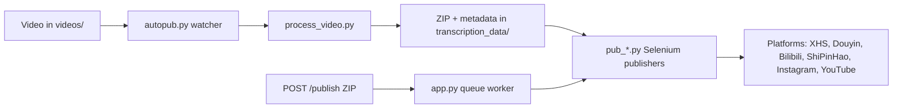

[English](../README.md) · [العربية](README.ar.md) · [Español](README.es.md) · [Français](README.fr.md) · [日本語](README.ja.md) · [한국어](README.ko.md) · [Tiếng Việt](README.vi.md) · [中文 (简体)](README.zh-Hans.md) · [中文（繁體）](README.zh-Hant.md) · [Deutsch](README.de.md) · [Русский](README.ru.md)


[](https://github.com/lachlanchen/lachlanchen/blob/main/figs/banner.png)

<div align="center">

# AutoPublish

<p align="center">
  <strong>Automatización de publicación de vídeos cortos, impulsada por scripts, con navegador.
  </strong><br/>
  <sub>Manual operativo de referencia para configuración, ejecución, modo cola y flujos de automatización por plataforma.</sub>
</p>

</div>

[](#prerrequisitos)
[](#resumen-del-sistema)
[](#ejecucion-del-servicio-tornado-apppy)
[](#notas-especificas-por-plataforma)
[](#ejecucion-del-servicio-tornado-apppy)
[](#frontend-pwa-pwa)
[](https://github.com/sponsors/lachlanchen)
[](#tabla-de-contenidos)
[](#licencia)
[](#configuracion)
[](#checklist-de-seguridad--operaciones)
[](#configuracion-de-servicio-raspberry-pi--linux)

[](#uso)
[](#preparacion-de-sesiones-del-navegador)
[](#metadata-y-formato-zip)

| Ir a | Enlace |
| --- | --- |
| Configuración inicial | [Empieza aquí](#empieza-aqui) |
| Ejecutar con watcher local | [Ejecutar el pipeline CLI (`autopub.py`)](#ejecucion-del-pipeline-cli-autopubpy) |
| Ejecutar mediante cola HTTP | [Ejecutar el servicio Tornado (`app.py`)](#ejecucion-del-servicio-tornado-apppy) |
| Desplegar como servicio | [Configuración de Raspberry Pi / servicio Linux](#configuracion-de-servicio-raspberry-pi--linux) |
| Apoyar el proyecto | [Support](#support-autopublish) |

Conjunto de herramientas para automatizar la distribución de contenido en vídeo corto a varias plataformas de creadores (chinas e internacionales). El repositorio combina un servicio basado en Tornado, bots de Selenium y un flujo local de vigilancia de carpetas, de modo que al depositar un vídeo en una carpeta se pueda publicar en XiaoHongShu, Douyin, Bilibili, WeChat Channels (ShiPinHao), Instagram y, opcionalmente, YouTube.

El repositorio está intencionalmente de bajo nivel: la mayor parte de la configuración reside en archivos Python y scripts. Este documento es un manual operativo que cubre configuración, ejecución y puntos de extensión.

> ⚙️ **Filosofía operativa**: este proyecto prioriza scripts explícitos y automatización directa por navegador frente a capas de abstracción ocultas.
> ✅ **Política canónica para este README**: conservar el detalle técnico y luego mejorar legibilidad y encontrabilidad.
> 🌍 **Estado de localización (verificado en este workspace el 28 de febrero de 2026)**: `i18n/` incluye variantes en árabe, alemán, español, francés, japonés, coreano, vietnamita, chino simplificado y chino tradicional.

### Navegación rápida

| Quiero... | Ir aquí |
| --- | --- |
| Ejecutar mi primera publicación | [Checklist de inicio rápido](#checklist-de-inicio-rapido) |
| Comparar modos de ejecución | [Modos de ejecución de un vistazo](#modos-de-ejecucion-de-un-vistazo) |
| Configurar credenciales y rutas | [Configuración](#configuracion) |
| Iniciar modo API y encolar trabajos | [Ejecutar el servicio Tornado (`app.py`)](#ejecucion-del-servicio-tornado-apppy) |
| Validar con comandos listos para copiar | [Ejemplos](#ejemplos) |
| Configurar en Raspberry Pi / Linux | [Configuración de servicio Raspberry Pi / Linux](#configuracion-de-servicio-raspberry-pi--linux) |

## Empieza Aquí

Si te incorporas por primera vez, sigue esta secuencia:

1. Lee [Prerrequisitos](#prerrequisitos) y [Instalación](#instalacion).
2. Configura secretos y rutas absolutas en [Configuración](#configuracion).
3. Prepara sesiones de navegador en [Preparación de sesiones del navegador](#preparacion-de-sesiones-del-navegador).
4. Elige un modo de ejecución en [Uso](#uso): `autopub.py` (watcher) o `app.py` (cola API).
5. Valida con los comandos de [Ejemplos](#ejemplos).

## Resumen

AutoPublish actualmente soporta dos modos de ejecución en producción:

1. **Modo watcher CLI (`autopub.py`)** para ingesta y publicación basadas en carpeta.
2. **Modo cola API (`app.py`)** para publicar desde ZIP mediante HTTP (`/publish`, `/publish/queue`).

Está pensado para operadores que prefieren flujos transparentes y guiados por scripts frente a plataformas de orquestación abstracta.

### Modos de ejecución de un vistazo

| Modo | Punto de entrada | Entrada | Ideal para | Comportamiento de salida |
| --- | --- | --- | --- | --- |
| watcher CLI | `autopub.py` | Archivos colocados en `videos/` | Flujos de operador local y bucles cron/servicio | Procesa vídeos detectados y publica inmediatamente en las plataformas seleccionadas |
| Servicio de cola API | `app.py` | Carga ZIP a `POST /publish` | Integraciones con sistemas externos y activación remota | Acepta trabajos, los encola y ejecuta la publicación en orden de worker |

### Cobertura de plataformas

| Plataforma | Módulo publicador | Helper de login | Puerto de control | Modo CLI | Modo API |
| --- | --- | --- | --- | --- | --- |
| XiaoHongShu | `pub_xhs.py` | `login_xiaohongshu.py` | `5003` | ✅ | ✅ |
| Douyin | `pub_douyin.py` | `login_douyin.py` | `5004` | ✅ | ✅ |
| Bilibili | `pub_bilibili.py` | N/A | `5005` | ✅ | ✅ |
| ShiPinHao (WeChat Channels) | `pub_shipinhao.py` | `login_shipinhao.py` | `5006` | Opcional | ✅ |
| Instagram | `pub_instagram.py` | `login_instagram.py` | `5007` | Opcional | ✅ |
| YouTube | `pub_y2b.py` | N/A | `9222` | Opcional | ✅ |

## Vista Rápida

| Qué | Valor | Indicador visual |
| --- | --- | --- |
| Lenguaje principal | Python 3.10+ |  |
| Runtimes principales | Pipeline CLI (`autopub.py`) + servicio API de Tornado (`app.py`) |  |
| Motor de automatización | Selenium + sesiones Chromium con remote debug |  |
| Formatos de entrada | Vídeos sin procesar (`videos/`) y paquetes ZIP (`/publish`) |  |
| Ruta del workspace actual | `/home/lachlan/ProjectsLFS/AutoPublish` |  |
| Usuarios objetivo | Creadores/operadores que gestionan pipelines multiplaforma de vídeo corto |  |

### Instantánea de seguridad operativa

| Tema | Estado actual | Acción |
| --- | --- | --- |
| Rutas codificadas | Presentes en varios módulos/scripts | Actualiza las constantes de ruta por host antes de ejecución en producción |
| Estado de sesión del navegador | Requerido | Mantén perfiles remotos persistentes por plataforma |
| Gestión de captcha | Integraciones opcionales disponibles | Configura credenciales de 2Captcha/Turing cuando sea necesario |
| Declaración de licencia | No se detecta `LICENSE` en la raíz | Confirma términos con el mantenedor antes de redistribuir |

### Compatibilidad y supuestos

| Elemento | Supuesto actual en este repositorio |
| --- | --- |
| Python | 3.10+ |
| Entorno de ejecución | Linux desktop/servidor con GUI disponible para Chromium |
| Modo de control del navegador | Sesiones de depuración remota con directorios de perfil persistentes |
| Puerto API principal | `8081` (`app.py --port`) |
| Backend de procesamiento | `upload_url` + `process_url` deben ser accesibles y devolver un ZIP válido |
| Espacio de trabajo usado para este borrador | `/home/lachlan/ProjectsLFS/AutoPublish` |

---

## Tabla de Contenidos

- [Empieza Aquí](#empieza-aqui)
- [Resumen](#resumen)
- [Modos de ejecución de un vistazo](#modos-de-ejecucion-de-un-vistazo)
- [Cobertura de plataformas](#cobertura-de-plataformas)
- [Vista rápida](#vista-rápida)
- [Instantánea de seguridad operativa](#instantánea-de-seguridad-operativa)
- [Compatibilidad y supuestos](#compatibilidad-y-supuestos)
- [Resumen del sistema](#resumen-del-sistema)
- [Características](#características)
- [Estructura del proyecto](#estructura-del-proyecto)
- [Distribución del repositorio](#distribución-del-repositorio)
- [Prerrequisitos](#prerrequisitos)
- [Instalación](#instalacion)
- [Configuración](#configuracion)
- [Checklist de verificación de configuración](#checklist-de-verificacion-de-configuracion)
- [Preparación de sesiones del navegador](#preparacion-de-sesiones-del-navegador)
- [Uso](#uso)
- [Ejemplos](#ejemplos)
- [Metadata y formato ZIP](#metadata-y-formato-zip)
- [Ciclo de vida de datos y artefactos](#ciclo-de-vida-de-datos-y-artefactos)
- [Notas específicas por plataforma](#notas-especificas-por-plataforma)
- [Configuración de servicio Raspberry Pi / Linux](#configuracion-de-servicio-raspberry-pi--linux)
- [Scripts legacy para macOS](#scripts-legacy-para-macos)
- [Solución de problemas y mantenimiento](#solucion-de-problemas-y-mantenimiento)
- [FAQ](#faq)
- [Extender el sistema](#extender-el-sistema)
- [Checklist de inicio rápido](#checklist-de-inicio-rapido)
- [Notas de desarrollo](#notas-de-desarrollo)
- [Hoja de ruta](#hoja-de-ruta)
- [Contribuir](#contribuir)
- [Checklist de seguridad & operaciones](#checklist-de-seguridad--operaciones)
- [Support](#support-autopublish)
- [Licencia](#licencia)
- [Agradecimientos](#agradecimientos)

---

## Resumen del sistema

🎯 **Flujo de extremo a extremo** desde medios brutos hasta publicaciones públicas:



Flujo de trabajo de una vista:

1. **Entrada de material bruto**: coloca un vídeo en `videos/`. El watcher (`autopub.py` o un scheduler/servicio) detecta nuevos archivos usando `videos_db.csv` y `processed.csv`.
2. **Generación de activos**: `process_video.VideoProcessor` sube el archivo a un servidor de procesamiento (`upload_url` y `process_url`) que devuelve un paquete ZIP con:
   - el vídeo editado/encodificado (`<stem>.mp4`),
   - una imagen de portada,
   - `{stem}_metadata.json` con títulos, descripciones y etiquetas localizadas.
3. **Publicación**: `metadata` alimenta los publicadores Selenium en `pub_*.py`. Cada publicador se acopla a una instancia Chromium/Chrome ya en ejecución mediante puertos de depuración remota y directorios de perfil persistentes.
4. **Plano de control web (opcional)**: `app.py` expone `/publish`, acepta paquetes ZIP preconstruidos, los descomprime y encola trabajos para los mismos publicadores. También puede refrescar sesiones del navegador y lanzar helpers de login (`login_*.py`).
5. **Módulos de soporte**: `load_env.py` carga secretos desde `~/.bashrc`, `utils.py` aporta helpers (foco de ventana, manejo de QR, utilidades de correo) y `solve_captcha_*.py` integra Turing/2Captcha cuando aparecen captchas.

## Características

✨ **Diseñado para una automatización práctica y guiada por scripts**:

- Publicación multiplataforma: XiaoHongShu, Douyin, Bilibili, ShiPinHao (WeChat Channels), Instagram, YouTube (opcional).
- Dos modos de operación: pipeline watcher CLI (`autopub.py`) y servicio de cola API (`app.py` + `/publish` + `/publish/queue`).
- Desactivación temporal por plataforma mediante archivos `ignore_*`.
- Reutilización de sesiones de navegador con depuración remota y perfiles persistentes.
- Automatización opcional de QR/captcha y helpers de notificación por correo.
- La UI PWA (`pwa/`) incluida no requiere compilación.
- Scripts de automatización para Linux/Raspberry Pi en `scripts/`.

### Matriz de características

| Capacidad | CLI (`autopub.py`) | API (`app.py`) |
| --- | --- | --- |
| Fuente de entrada | Carpeta local `videos/` | ZIP subido vía `POST /publish` |
| Encolado | Progreso interno basado en archivos | Cola explícita en memoria |
| Flags de plataforma | args CLI (`--pub-*`) + `ignore_*` | query args (`publish_*`) + `ignore_*` |
| Ajuste ideal | Flujo de operador en un solo host | Integraciones externas y activación remota |

---

## Estructura del proyecto

Distribución de alto nivel del código y runtime:

```text
AutoPublish/
├── README.md
├── app.py
├── autopub.py
├── process_video.py
├── load_env.py
├── utils.py
├── pub_*.py                  # módulos publicadores por plataforma
├── login_*.py                # helpers de login/sesión
├── solve_captcha_*.py
├── smtp.py
├── smtp_test_simple.py
├── send_email_qreader.py
├── requirements.txt
├── requirements.autopub.txt
├── .env.example
├── setup_raspberrypi.md
├── scripts/
├── pwa/
├── figs/
├── .github/FUNDING.yml
├── i18n/                     # READMEs multilingües
├── videos/                   # artefactos de entrada en runtime
├── logs/, logs-autopub/      # logs de runtime
├── temp/, temp_screenshot/   # artefactos temporales
├── videos_db.csv
└── processed.csv
```

Nota: `transcription_data/` se usa en runtime en el flujo de procesamiento/publicación y puede aparecer tras la ejecución.

## Distribución del repositorio

🗂️ **Módulos clave y su función**:

| Ruta | Propósito |
| --- | --- |
| `app.py` | Servicio Tornado que expone `/publish` y `/publish/queue`, con cola interna y thread worker. |
| `autopub.py` | Watcher CLI: escanea `videos/`, procesa archivos nuevos y lanza publicadores en paralelo. |
| `process_video.py` | Sube vídeos al backend de procesamiento y guarda los ZIP devueltos. |
| `pub_xhs.py`, `pub_douyin.py`, `pub_bilibili.py`, `pub_shipinhao.py`, `pub_instagram.py`, `pub_y2b.py` | Módulos de automatización Selenium por plataforma. |
| `login_xiaohongshu.py`, `login_douyin.py`, `login_shipinhao.py`, `login_instagram.py` | Comprobaciones de sesión y flujo de login por QR. |
| `utils.py` | Helpers compartidos (focus de ventana, QR, utilidades de correo, diagnóstico). |
| `load_env.py` | Carga variables desde `~/.bashrc` y enmascara logs sensibles. |
| `smtp.py`, `smtp_test_simple.py`, `send_email_qreader.py` | Helpers y scripts de prueba SMTP/SendGrid. |
| `solve_captcha_2captcha.py`, `solve_captcha_turing.py` | Integraciones de resolución de captcha. |
| `scripts/` | Scripts de setup y operación (Raspberry Pi/Linux + automatización heredada). |
| `pwa/` | PWA estática para vista previa de ZIP y envío de publicación. |
| `setup_raspberrypi.md` | Guía paso a paso para aprovisionamiento de Raspberry Pi. |
| `.env.example` | Plantilla de variables de entorno (credenciales, rutas, claves captcha). |
| `.github/FUNDING.yml` | Configuración de patrocinio/financiación. |
| `logs/`, `logs-autopub/`, `temp/`, `temp_screenshot/`, `videos/` | Artefactos y logs de runtime (la mayoría están en gitignore). |

---

## Prerrequisitos

🧰 **Instala esto antes de ejecutar por primera vez**.

### Sistema operativo y herramientas

- Linux desktop/servidor con sesión X (`DISPLAY=:1` es común en los scripts incluidos).
- Chromium/Chrome y ChromeDriver compatible.
- Utilidades GUI/media: `xdotool`, `ffmpeg`, `zip`, `unzip`.
- Python 3.10+ (venv o Conda).

### Dependencias de Python

Conjunto mínimo de runtime:

```bash
pip install selenium tornado requests requests-toolbelt sendgrid qreader opencv-python webdriver-manager
```

Paridad con el repositorio:

```bash
python -m pip install -r requirements.txt
```

Para instalaciones ligeras del servicio (usadas por los scripts de setup por defecto):

```bash
python -m pip install -r requirements.autopub.txt
```

`requirements.autopub.txt` contiene:
- `selenium`, `webdriver-manager`, `tornado`, `requests`, `requests-toolbelt`, `sendgrid`, `qreader`, `opencv-python`, `numpy`, `pillow`, `twocaptcha`.

### Opcional: crear usuario sudo

```bash
sudo useradd -m -s /bin/bash -G sudo <USERNAME> && echo "<USERNAME>:<PASSWORD>" | sudo chpasswd
```

---

## Instalación

🚀 **Setup desde una máquina limpia**:

1. Clona el repositorio:

```bash
git clone https://github.com/lachlanchen/AutoPublish.git
cd AutoPublish
```

2. Crea y activa un entorno (ejemplo con `venv`):

```bash
python3 -m venv .venv
source .venv/bin/activate
python -m pip install -U pip
python -m pip install -r requirements.txt
```

3. Prepara las variables de entorno:

```bash
cp .env.example .env
# fill values in .env (do not commit)
```

4. Carga variables para scripts que leen valores del perfil del shell:

```bash
source ~/.bashrc
python load_env.py
```

Nota: `load_env.py` está diseñado alrededor de `~/.bashrc`; si tu entorno usa otro perfil de shell, adáptalo.

---

## Configuración

🔐 **Configura credenciales y verifica rutas específicas del host**.

### Variables de entorno

El proyecto espera credenciales y rutas opcionales de navegador/runtime desde variables de entorno. Comienza desde `.env.example`:

| Variable | Descripción |
| --- | --- |
| `FROM_EMAIL`, `TO_EMAIL`, `APP_PASSWORD` | Credenciales SMTP para notificaciones de QR/login. |
| `SENDGRID_API_KEY` | Clave SendGrid para flujos de correo que usan las APIs de SendGrid. |
| `APIKEY_2CAPTCHA` | Clave API de 2Captcha. |
| `TULING_USERNAME`, `TULING_PASSWORD`, `TULING_ID` | Credenciales captcha de Turing. |
| `DOUYIN_LOGIN_PASSWORD` | Ayuda de segunda verificación de Douyin. |
| `INSTAGRAM_*`, `CHROME_*`, `CHROMEDRIVER_PATH` | Overrides de navegador/driver para Instagram. |
| `AUTOPUBLISH_BROWSER_BIN`, `AUTOPUBLISH_CHROMEDRIVER`, `AUTOPUBLISH_DISPLAY` | Overrides globales de navegador/driver/display preferidos en `app.py`. |

### Constantes de ruta (importante)

📌 **Problema más habitual al arrancar**: rutas absolutas hardcodeadas sin resolver.

Varios módulos aún contienen rutas fijas. Actualízalas para tu host:

| Archivo | Constant(es) | Significado |
| --- | --- | --- |
| `app.py` | `logs_folder_root`, `autopublish_folder_root`, `videos_db_path`, `processed_path`, `transcription_root`, `upload_url`, `process_url`. | Raíces del servicio API y endpoints del backend. |
| `autopub.py` | `logs_folder_path`, `autopublish_folder_path`, `videos_db_path`, `processed_path`, `transcription_path`, `upload_url`, `process_url`, `chromedriver_path`. | Raíces del watcher CLI y endpoints del backend. |
| `scripts/run_autopub.sh`, `scripts/setup_autopub.sh` | Rutas absolutas a Python/Conda/repo/logs. | Wrappers heredados orientados a macOS. |
| `utils.py` | Suposiciones de ruta de FFmpeg en helpers de portada. | Compatibilidad de herramientas multimedia. |

Nota importante del repositorio:
- La ruta actual del repositorio en este workspace es `/home/lachlan/ProjectsLFS/AutoPublish`.
- Parte del código y scripts aún referencia `/home/lachlan/Projects/auto-publish` o `/Users/lachlan/...`.
- Conserva y ajusta esas rutas en tu host antes de usarlo en producción.

### Toggles por plataforma vía `ignore_*`

🧩 **Interruptor rápido de seguridad**: crear un archivo `ignore_*` desactiva ese publicador sin editar código.

Las flags de publicación también se gobiernan por estos archivos. Crea un archivo vacío para desactivar una plataforma:

```bash
touch ignore_xhs ignore_douyin ignore_bilibili ignore_shipinhao ignore_instagram ignore_y2b
```

Elimina el archivo correspondiente para reactivarla.

### Checklist de verificación de configuración

Ejecuta esta validación rápida tras definir `.env` y las constantes de ruta:

```bash
python -c "import os;print('AUTOPUBLISH_BROWSER_BIN=', os.getenv('AUTOPUBLISH_BROWSER_BIN'));print('AUTOPUBLISH_CHROMEDRIVER=', os.getenv('AUTOPUBLISH_CHROMEDRIVER'));print('DISPLAY=', os.getenv('DISPLAY') or os.getenv('AUTOPUBLISH_DISPLAY'))"
python -c "from load_env import load_env_from_bashrc; load_env_from_bashrc(); print('Environment load OK')"
python -c "import os; p=os.getenv('AUTOPUBLISH_CHROMEDRIVER') or os.getenv('CHROMEDRIVER_PATH') or '/usr/bin/chromedriver'; print(p, 'exists=', os.path.exists(p))"
```

Si falta algún valor, actualiza `.env`, `~/.bashrc` o las constantes de scripts antes de ejecutar publicadores.

---

## Preparación de sesiones del navegador

🌐 **La persistencia de sesión es obligatoria** para publicar con Selenium de forma fiable.

1. Crea carpetas de perfil dedicadas:

```bash
mkdir -p ~/chromium_dev_session_{5003,5004,5005,5006,5007,9222}
mkdir -p ~/chromium_dev_session_logs
```

2. Lanza sesiones con depuración remota (ejemplo para XiaoHongShu):

```bash
DISPLAY=:1 chromium-browser \
  --remote-debugging-port=5003 \
  --user-data-dir="$HOME/chromium_dev_session_5003" \
  https://creator.xiaohongshu.com/creator/post \
  > "$HOME/chromium_dev_session_logs/chromium_xhs.log" 2>&1 &
```

3. Inicia sesión manualmente una vez por cada plataforma/perfil.

4. Verifica que Selenium puede conectarse:

```python
from selenium import webdriver
opts = webdriver.ChromeOptions()
opts.add_experimental_option("debuggerAddress", "127.0.0.1:5003")
driver = webdriver.Chrome(options=opts)
print(driver.title)
driver.quit()
```

Nota de seguridad:
- `app.py` actualmente contiene un placeholder hardcodeado de contraseña sudo (`password = "1"`) usado por la lógica de reinicio del navegador. Cámbialo antes de despliegue real.

---

## Uso

▶️ **Hay dos modos de ejecución** disponibles: watcher CLI y servicio de cola API.

### Ejecución del pipeline CLI (`autopub.py`)

1. Coloca vídeos fuente en el directorio observado (`videos/` o tu `autopublish_folder_path` configurado).
2. Ejecuta:

```bash
python autopub.py --use-cache --pub-xhs --pub-douyin --pub-bilibili
```

Flags:

| Flag | Significado |
| --- | --- |
| `--pub-xhs`, `--pub-douyin`, `--pub-bilibili` | Restringe la publicación a plataformas seleccionadas. Si no pasas ninguna, las tres se dejan activadas por defecto. |
| `--test` | Modo de prueba que se pasa a los publicadores (el comportamiento varía por módulo). |
| `--use-cache` | Reutiliza `transcription_data/<video>/<video>.zip` si está disponible. |

Flujo CLI por vídeo:
- Sube/procesa vía `process_video.py`.
- Extrae el ZIP en `transcription_data/<video>/`.
- Lanza publicadores seleccionados con `ThreadPoolExecutor`.
- Registra estado en `videos_db.csv` y `processed.csv`.

### Ejecución del servicio Tornado (`app.py`)

🛰️ **El modo API** es útil para sistemas externos que generan paquetes ZIP.

Arranca el servidor:

```bash
python app.py --refresh-time 1800 --port 8081
```

Resumen de endpoints:

| Endpoint | Método | Propósito |
| --- | --- | --- |
| `/publish` | `POST` | Sube bytes de ZIP y encola un trabajo de publicación |
| `/publish/queue` | `GET` | Inspecciona cola, historial de trabajos y estado de publicación |

### `POST /publish`

📤 **Encola un trabajo de publicación** subiendo bytes de ZIP directamente.

- Header: `Content-Type: application/octet-stream`
- Argumento query/form obligatorio: `filename` (nombre del ZIP)
- Booleanos opcionales: `publish_xhs`, `publish_douyin`, `publish_bilibili`, `publish_shipinhao`, `publish_instagram`, `publish_y2b`, `test`
- Body: bytes ZIP en bruto

Ejemplo:

```bash
curl -X POST "http://localhost:8081/publish?filename=demo.zip&publish_xhs=true&publish_instagram=true&publish_y2b=true" \
  --data-binary @demo.zip \
  -H "Content-Type: application/octet-stream"
```

Comportamiento actual en código:
- La solicitud se acepta y se encola.
- La respuesta inmediata devuelve JSON incluyendo `status: queued`, `job_id` y `queue_size`.
- Un worker thread procesa los trabajos en serie.

### `GET /publish/queue`

📊 **Observa salud de la cola y trabajos en curso**.

Devuelve JSON de estado/historial:

```bash
curl "http://localhost:8081/publish/queue"
```

Campos de respuesta incluyen:
- `status`, `jobs`, `queue_size`, `is_publishing`.

### Hilo de refresco del navegador

♻️ El refresco periódico del navegador reduce fallos por sesiones obsoletas en ventanas de uptime largas.

`app.py` ejecuta un hilo de refresco en segundo plano usando `--refresh-time` y hooks de comprobación de login. El tiempo de espera incluye retardo aleatorio.

### Frontend PWA (`pwa/`)

🖥️ UI estática ligera para subidas manuales de ZIP e inspección de cola.

Levantar UI local:

```bash
cd pwa
python -m http.server 5173
```

Abre `http://localhost:5173` y configura la base URL del backend (por ejemplo `http://lazyingart:8081`).

Capacidades de la PWA:
- Previsualización de ZIP con arrastrar y soltar.
- Toggles de objetivo de publicación + modo prueba.
- Envía a `/publish` y consulta `/publish/queue`.

### Paleta de comandos

🧷 **Comandos más usados en un bloque**.

| Tarea | Comando |
| --- | --- |
| Instalar dependencias completas | `python -m pip install -r requirements.txt` |
| Instalar dependencias ligeras de runtime | `python -m pip install -r requirements.autopub.txt` |
| Cargar variables del entorno del shell | `source ~/.bashrc && python load_env.py` |
| Iniciar servidor API de cola | `python app.py --refresh-time 1800 --port 8081` |
| Iniciar pipeline watcher CLI | `python autopub.py --use-cache --pub-xhs --pub-douyin --pub-bilibili` |
| Enviar ZIP a la cola | `curl -X POST "http://localhost:8081/publish?filename=demo.zip" --data-binary @demo.zip -H "Content-Type: application/octet-stream"` |
| Inspeccionar estado de cola | `curl -s "http://localhost:8081/publish/queue"` |
| Servir PWA local | `cd pwa && python -m http.server 5173` |

---

## Ejemplos

🧪 **Comandos smoke-test para copiar y pegar**:

### Ejemplo 0: Cargar entorno e iniciar servidor API

```bash
source ~/.bashrc
python load_env.py
python app.py --refresh-time 1800 --port 8081
```

### Ejemplo A: Ejecución de publicación CLI

```bash
python autopub.py --pub-xhs --pub-douyin --use-cache
```

### Ejemplo B: Ejecución API (un único ZIP)

```bash
curl -X POST "http://localhost:8081/publish?filename=my_bundle.zip&publish_bilibili=true&test=true" \
  --data-binary @my_bundle.zip \
  -H "Content-Type: application/octet-stream"
```

### Ejemplo C: Consultar estado de cola

```bash
curl -s "http://localhost:8081/publish/queue"
```

### Ejemplo D: Smoke test del helper SMTP

```bash
python smtp.py
python smtp_test_simple.py
```

---

## Metadata y formato ZIP

📦 **El contrato ZIP importa**: mantén nombres de archivo y claves de metadata alineados con lo que esperan los publicadores.

Contenido mínimo esperado de ZIP:

```text
<stem>_metadata.json
<video_filename>.mp4
<cover_filename>.jpg
```

`metadata` impulsa publicadores CN; `metadata["english_version"]` alimenta opcionalmente el publicador de YouTube.

Campos usados comúnmente por los módulos:
- `title`, `brief_description`, `middle_description`, `long_description`
- `tags` (lista de hashtags)
- `video_filename`, `cover_filename`
- campos específicos por plataforma según implementación en `pub_*.py`

Si generas ZIPs externamente, conserva claves y nombres alineados con lo que esperan los módulos.

## Ciclo de vida de datos y artefactos

El pipeline crea artefactos locales que conviene conservar, rotar o limpiar deliberadamente:

| Artefacto | Ubicación | Producido por | Por qué importa |
| --- | --- | --- | --- |
| Vídeos de entrada | `videos/` | Carga manual o sync upstream | Fuente de media para watcher CLI |
| ZIP de procesamiento | `transcription_data/<stem>/<stem>.zip` | `process_video.py` | Payload reutilizable con `--use-cache` |
| Activos extraídos | `transcription_data/<stem>/...` | Extracción ZIP en `autopub.py` / `app.py` | Archivos y metadata listos para publicadores |
| Logs de publicación | `logs/`, `logs-autopub/` | Runtime CLI/API | Triaging de fallos y trazabilidad |
| Logs del navegador | `~/chromium_dev_session_logs/*.log` (o prefijo chrome) | Scripts de arranque de navegador | Diagnóstico de sesión/puerto/startup |
| CSV de seguimiento | `videos_db.csv`, `processed.csv` | Watcher CLI | Evita procesamiento duplicado |

Recomendación de mantenimiento:
- Añade limpieza/archivado periódico de `transcription_data/`, `temp/` y logs antiguos para evitar presión de disco.

---

## Notas específicas por plataforma

🧭 **Mapa de puertos y ownership de módulos** para cada publicador.

| Plataforma | Puerto | Módulo(s) | Notas |
| --- | --- | --- | --- |
| XiaoHongShu | 5003 | `pub_xhs.py`, `login_xiaohongshu.py` | Flujo de re-login por QR; sanitización de título y hashtags desde metadata. |
| Douyin | 5004 | `pub_douyin.py`, `login_douyin.py` | Las comprobaciones de carga y rutas de reintento son frágiles; vigila logs de cerca. |
| Bilibili | 5005 | `pub_bilibili.py` | Hooks de captcha disponibles vía `solve_captcha_2captcha.py` y `solve_captcha_turing.py`. |
| ShiPinHao (WeChat Channels) | 5006 | `pub_shipinhao.py`, `login_shipinhao.py` | Aprobar rápido el QR mejora la confiabilidad del refresco de sesión. |
| Instagram | 5007 | `pub_instagram.py`, `login_instagram.py` | En modo API se controla con `publish_instagram=true`; hay env vars en `.env.example`. |
| YouTube | 9222 | `pub_y2b.py` | Usa `metadata["english_version"]`; desactiva con `ignore_y2b`. |

## Configuración de servicio Raspberry Pi / Linux

🐧 **Recomendado para hosts always-on**.

Para bootstrap completo del host, sigue [`setup_raspberrypi.md`](setup_raspberrypi.md).

Configuración rápida del pipeline:

```bash
export AUTOPUB_USER=<USERNAME>
export AUTOPUB_REPO=/home/<USERNAME>/Projects/autopub
sudo -E ./scripts/setup_autopub_pipeline.sh
```

Esto orquesta:
- `scripts/setup_envs.sh`
- `scripts/setup_virtual_desktop_service.sh`
- `scripts/download_and_setup_driver.sh`
- `scripts/setup_autopub_service.sh`

Ejecutar servicio manualmente en tmux:

```bash
./scripts/start_autopub_tmux.sh
```

Validar servicios y puertos:

```bash
systemctl status autopub.service autopub-vnc.service
sudo ss -ltnp | grep 590
```

Nota de compatibilidad:
- Algunos documentos/scripts antiguos aún referencian `virtual-desktop.service`; los scripts actuales del repositorio instalan `autopub-vnc.service`.

---

## Scripts legacy para macOS

🍎 Se conservan wrappers legacy para compatibilidad con setups locales antiguos.

El repositorio aún incluye wrappers orientados a macOS:
- `scripts/run_autopub.sh`
- `scripts/setup_autopub.sh`

Contienen rutas absolutas `/Users/lachlan/...` y supuestos de Conda. Conserva estos flujos si los usas, pero actualiza rutas/venv/herramientas para tu host.

---

## Solución de problemas y mantenimiento

🛠️ **Si algo falla, empieza aquí**.

- **Deriva de rutas entre máquinas**: si aparecen errores sobre rutas faltantes en `/Users/lachlan/...` o `/home/lachlan/Projects/auto-publish`, alinea constantes con la ruta de tu host (`/home/lachlan/ProjectsLFS/AutoPublish` en este workspace).
- **Higiene de secretos**: ejecuta `~/.local/bin/detect-secrets scan` antes de `push`. Rota credenciales filtradas.
- **Errores del backend de procesamiento**: si `process_video.py` muestra `Failed to get the uploaded file path`, valida que la respuesta JSON del upload incluya `file_path` y que el endpoint de procesamiento devuelva bytes ZIP.
- **Desajuste de ChromeDriver**: si hay errores de conexión a DevTools, alinea versiones de Chrome/Chromium y driver (o usa `webdriver-manager`).
- **Problemas de foco del navegador**: `bring_to_front` depende de coincidencia exacta del título de ventana (las diferencias entre Chromium/Chrome pueden romper esto).
- **Interrupciones por captcha**: configura credenciales de 2Captcha/Turing e integra los resultados del solver cuando haga falta.
- **Bloqueos obsoletos**: si ejecuciones programadas no inician, revisa el estado de procesos y elimina `autopub.lock` obsoleto (flujo heredado).
- **Logs a inspeccionar**: `logs/`, `logs-autopub/`, `~/chromium_dev_session_logs/*.log`, además de los journales de servicio.

## FAQ

**P: ¿Puedo ejecutar modo API y watcher CLI al mismo tiempo?**  
R: Es posible, pero no recomendado salvo que aísles cuidadosamente entradas y sesiones del navegador. Ambos modos pueden competir por publicadores, archivos y puertos.

**P: ¿Por qué `/publish` devuelve `queued` pero todavía no aparece publicado?**  
R: `app.py` primero encola trabajos y luego un worker en segundo plano los procesa en serie. Revisa `/publish/queue`, `is_publishing` y los logs del servicio.

**P: ¿Necesito `load_env.py` si ya uso `.env`?**  
R: `start_autopub_tmux.sh` hace `source` de `.env` si existe, mientras que algunas ejecuciones directas dependen de variables del shell. Mantener consistencia entre `.env` y exports del shell evita sorpresas.

**P: ¿Cuál es el contrato ZIP mínimo para cargas API?**  
R: Un ZIP válido con `{stem}_metadata.json`, además de vídeo y portada con nombres que coincidan con las claves de metadata (`video_filename`, `cover_filename`).

**P: ¿Se soporta modo headless?**  
R: Algunos módulos exponen variables relacionadas con headless, pero el modo principal documentado en este repositorio es con sesiones GUI y perfiles persistentes.

## Extender el sistema

🧱 **Puntos de extensión** para nuevas plataformas y operaciones más seguras.

- **Agregar una nueva plataforma**: copia un módulo `pub_*.py`, actualiza selectores/flujo, añade `login_*.py` si necesitas reautenticación por QR y conecta flags/cola en `app.py` y wiring CLI en `autopub.py`.
- **Abstracción de configuración**: migra constantes dispersas a una configuración estructurada (`config.yaml`/`.env` + modelo tipado) para operación multi-host.
- **Endurecimiento de credenciales**: sustituye flujos sensibles hardcodeados o expuestos por una gestión de secretos segura (`sudo -A`, keychain, vault/secret manager).
- **Contenerización**: empaqueta Chromium/ChromeDriver + runtime Python + display virtual en una unidad desplegable para uso cloud/servidor.

## Checklist de inicio rápido

✅ **Ruta mínima hacia la primera publicación exitosa**.

1. Clona este repositorio e instala dependencias (`pip install -r requirements.txt` o `requirements.autopub.txt` ligero).
2. Actualiza constantes de ruta hardcodeadas en `app.py`, `autopub.py` y scripts que ejecutes.
3. Exporta credenciales requeridas en tu perfil de shell o `.env`; ejecuta `python load_env.py` para validar carga.
4. Crea carpetas de perfil de navegador con depuración remota y lanza cada sesión de plataforma al menos una vez.
5. Inicia sesión manualmente en cada plataforma objetivo dentro de su perfil.
6. Inicia modo API (`python app.py --port 8081`) o CLI (`python autopub.py --use-cache ...`).
7. Envía un ZIP de muestra (modo API) o un vídeo de muestra (modo CLI) y revisa `logs/`.
8. Ejecuta detección de secretos antes de cada push.

## Notas de desarrollo

🧬 **Línea base de desarrollo actual** (formato manual + smoke tests).

- El estilo Python sigue la indentación existente de 4 espacios y formato manual.
- No hay suite formal de pruebas; usa smoke tests:
  - procesa un vídeo de muestra con `autopub.py`;
  - envía un ZIP a `/publish` y monitoriza `/publish/queue`;
  - valida manualmente cada plataforma objetivo.
- Incluye un entrypoint `if __name__ == "__main__":` al añadir scripts nuevos para dry-runs rápidos.
- Mantén cambios de plataforma aislados donde sea posible (`pub_*`, `login_*`, toggles `ignore_*`).
- Los artefactos de runtime (`videos/*`, `logs*/*`, `transcription_data/*`, `ignore_*`) se esperan locales y en su mayoría están gitignored.

## Hoja de ruta

🗺️ **Mejoras prioritarias reflejadas por las restricciones actuales del código**.

Mejoras planificadas/deseadas (según estructura actual y notas existentes):

1. Reemplazar rutas hardcodeadas por configuración central (`.env`/YAML + modelos tipados).
2. Eliminar patrones de contraseña sudo hardcodeada y pasar el control de procesos a mecanismos más seguros.
3. Mejorar fiabilidad de publicación con reintentos robustos y mejor detección de estado de UI por plataforma.
4. Ampliar soporte de plataformas (por ejemplo Kuaishou u otras plataformas de creadores).
5. Empaquetar el runtime en unidades de despliegue reproducibles (contenedor + perfil de display virtual).
6. Añadir checks de integración automatizados para contrato ZIP y ejecución de cola.

## Contribuir

🤝 Mantén los PRs enfocados, reproducibles y explícitos sobre supuestos de runtime.

Las contribuciones son bienvenidas.

1. Haz fork y crea una rama enfocada.
2. Mantén commits pequeños e imperativos (estilo del historial: “Wait for YouTube checks before publishing”).
3. Incluye notas de verificación manual en PRs:
   - supuestos de entorno,
   - reinicios de navegador/sesión,
   - logs o capturas relevantes para cambios de flujo UI.
4. Nunca comitees secretos reales (`.env` está ignorado; usa `.env.example` solo como plantilla).

Si introduces nuevos módulos publicadores, conecta lo siguiente:
- `pub_<platform>.py`
- `login_<platform>.py` opcional
- flags API y cola en `app.py`
- wiring CLI en `autopub.py` (si aplica)
- manejo de toggles `ignore_<platform>`
- actualiza el README

## Checklist de seguridad & operaciones

Antes de cualquier ejecución tipo producción:

1. Confirma que `.env` existe localmente y no esté versionado.
2. Rota o elimina credenciales que hayan podido comprometerse históricamente.
3. Sustituye valores sensibles placeholder en rutas de código (por ejemplo el placeholder sudo en `app.py`).
4. Verifica que los switches `ignore_*` sean intencionales antes de corridas por lotes.
5. Asegura perfiles de navegador aislados por plataforma y cuentas con mínimo privilegio.
6. Confirma que los logs no expongan secretos antes de compartir reportes.
7. Ejecuta `detect-secrets` (o equivalente) antes de `push`.

<a id="support-autopublish"></a>
## Licencia

Actualmente no hay archivo `LICENSE` en este snapshot del repositorio.

Supuesto para este borrador:
- Considera el uso y la redistribución como no definidos hasta que el mantenedor agregue una licencia explícita.

Siguiente acción recomendada:
- Añadir un archivo `LICENSE` en la raíz (por ejemplo MIT/Apache-2.0/GPL-3.0) y actualizar esta sección en consecuencia.

> 📝 Mientras no haya un archivo de licencia, trata asunciones comerciales/internas de redistribución como pendientes y confírmalo directamente con el mantenedor.

---

## Agradecimientos

- Perfil del mantenedor y sponsor: [@lachlanchen](https://github.com/lachlanchen)
- Fuente de configuración de financiación: [`.github/FUNDING.yml`](.github/FUNDING.yml)
- Servicios del ecosistema referenciados en este repositorio: Selenium, Tornado, SendGrid, 2Captcha, APIs de captcha de Turing.


## ❤️ Support

| Donate | PayPal | Stripe |
| --- | --- | --- |
| [](https://chat.lazying.art/donate) | [](https://paypal.me/RongzhouChen) | [](https://buy.stripe.com/aFadR8gIaflgfQV6T4fw400) |
