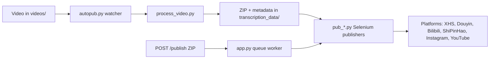

[English](../README.md) · [العربية](README.ar.md) · [Español](README.es.md) · [Français](README.fr.md) · [日本語](README.ja.md) · [한국어](README.ko.md) · [Tiếng Việt](README.vi.md) · [中文 (简体)](README.zh-Hans.md) · [中文（繁體）](README.zh-Hant.md) · [Deutsch](README.de.md) · [Русский](README.ru.md)


[](https://github.com/lachlanchen/lachlanchen/blob/main/figs/banner.png)

<div align="center">

# AutoPublish

<p align="center">
  <strong>Automatisation multi-plateforme de publication de courtes vidéos pilotée par scripts navigateur.</strong><br/>
  <sub>Manuel de fonctionnement de référence pour la configuration, l’exécution, le mode file d’attente et les flux d’automatisation multi-plateforme.</sub>
</p>

</div>

[](#prerequisites)
[](#system-overview)
[](#running-the-tornado-service-apppy)
[](#platform-specific-notes)
[](#running-the-tornado-service-apppy)
[](#pwa-frontend-pwa)
[](https://github.com/sponsors/lachlanchen)
[](#table-of-contents)
[](#license)
[](#configuration)
[](#security--ops-checklist)
[](#raspberry-pi--linux-service-setup)

[](#usage)
[](#preparing-browser-sessions)
[](#metadata--zip-format)

| Aller à | Lien |
| --- | --- |
| Mise en route | [Commencer ici](#start-here) |
| Exécuter avec le watcher local | [Lancer le pipeline CLI (`autopub.py`)](#running-the-cli-pipeline-autopubpy) |
| Exécuter via file d’attente HTTP | [Lancer le service Tornado (`app.py`)](#running-the-tornado-service-apppy) |
| Déployer en service | [Mise en place Raspberry Pi / service Linux](#raspberry-pi--linux-service-setup) |
| Soutenir le projet | [Support](#support-autopublish) |

Toolkit d’automatisation pour diffuser du contenu vidéo court sur plusieurs plateformes de créateurs chinoises et internationales. Le projet combine un service basé sur Tornado, des bots Selenium et un flux local par surveillance de dossier, de sorte qu’ajouter une vidéo dans un dossier déclenche ensuite la publication sur XiaoHongShu, Douyin, Bilibili, WeChat Channels (ShiPinHao), Instagram, et éventuellement YouTube.

Le dépôt est volontairement de bas niveau : la plupart de la configuration vit dans les fichiers Python et les scripts shell. Ce document sert de manuel opérationnel couvrant la configuration, l’exécution et les points d’extension.

> ⚙️ **Philosophie opérationnelle** : ce projet privilégie les scripts explicites et l’automatisation navigateur directe plutôt que des couches d’abstraction opaques.
> ✅ **Politique canonique de ce README** : préserver les détails techniques, puis améliorer la lisibilité et l’explorabilité.
> 🌍 **État de la localisation (vérifié dans cet espace le 28 février 2026)** : `i18n/` contient actuellement des variantes arabe, allemand, espagnol, français, japonais, coréen, russe, vietnamien, chinois simplifié et chinois traditionnel.

### Navigation rapide

| Je veux... | Aller ici |
| --- | --- |
| Lancer ma première publication | [Checklist de démarrage rapide](#quick-start-checklist) |
| Comparer les modes d’exécution | [Modes d’exécution en un coup d’œil](#runtime-modes-at-a-glance) |
| Configurer identifiants et chemins | [Configuration](#configuration) |
| Lancer le mode API et les tâches de file | [Lancer le service Tornado (`app.py`)](#running-the-tornado-service-apppy) |
| Valider avec des commandes directes | [Exemples](#examples) |
| Configurer Raspberry Pi/Linux | [Mise en place Raspberry Pi / service Linux](#raspberry-pi--linux-service-setup) |

<a id="start-here"></a>
## Démarrage

Si vous découvrez ce dépôt, suivez cette séquence :

1. Consultez [Prérequis](#prerequisites) et [Installation](#installation).
2. Configurez les secrets et chemins absolus dans [Configuration](#configuration).
3. Préparez les sessions de navigateur dans [Préparer les sessions navigateur](#preparing-browser-sessions).
4. Choisissez un mode d’exécution dans [Utilisation](#usage) : `autopub.py` (watcher) ou `app.py` (file d’attente API).
5. Validez avec les commandes de [Exemples](#examples).

<a id="overview"></a>
## Vue d’ensemble

AutoPublish prend actuellement en charge deux modes d’exécution production :

<div align="center">


</div>

1. **Mode watcher CLI (`autopub.py`)** pour ingestion basée dossier et publication.
2. **Mode file d’attente API (`app.py`)** pour la publication basée ZIP via HTTP (`/publish`, `/publish/queue`).

Le projet est conçu pour des opérateurs qui privilégient des flux transparents, script-first, plutôt que des plateformes d’orchestration abstraites.

### Modes d’exécution en un coup d’œil

| Mode | Point d’entrée | Entrée | Idéal pour | Comportement de sortie |
| --- | --- | --- | --- | --- |
| Watcher CLI | `autopub.py` | Fichiers déposés dans `videos/` | Flux locaux d’opérateurs et boucles cron/service | Traite les vidéos détectées et les publie immédiatement sur les plateformes choisies |
| Service file d’attente API | `app.py` | ZIP chargé sur `POST /publish` | Intégrations avec systèmes amont et déclenchement distant | Accepte les jobs, les met en file, puis les exécute via les publishers selon l’ordre de queue |

<a id="platform-coverage-snapshot"></a>
### Vue d’ensemble de la couverture plateformes

| Plateforme | Module publisher | Assistant login | Port de contrôle | Mode CLI | Mode API |
| --- | --- | --- | --- | --- | --- |
| XiaoHongShu | `pub_xhs.py` | `login_xiaohongshu.py` | `5003` | ✅ | ✅ |
| Douyin | `pub_douyin.py` | `login_douyin.py` | `5004` | ✅ | ✅ |
| Bilibili | `pub_bilibili.py` | N/A | `5005` | ✅ | ✅ |
| ShiPinHao (WeChat Channels) | `pub_shipinhao.py` | `login_shipinhao.py` | `5006` | Optionnel | ✅ |
| Instagram | `pub_instagram.py` | `login_instagram.py` | `5007` | Optionnel | ✅ |
| YouTube | `pub_y2b.py` | N/A | `9222` | Optionnel | ✅ |

<a id="quick-snapshot"></a>
## Vue rapide

| Élément | Valeur | Indicateur visuel |
| --- | --- | --- |
| Langage principal | Python 3.10+ |  |
| Exécutions principales | Watcher CLI (`autopub.py`) + service queue Tornado (`app.py`) |  |
| Moteur d’automatisation | Selenium + sessions Chromium en debug distant |  |
| Formats d’entrée | Vidéos brutes (`videos/`) et bundles ZIP (`/publish`) |  |
| Chemin de dépôt actuel | `/home/lachlan/ProjectsLFS/AutoPublish` |  |
| Utilisateurs cibles | Créateurs / opérateurs gérant des pipelines multi-plateformes |  |

### Instantané de sécurité opérationnelle

| Sujet | État actuel | Action |
| --- | --- | --- |
| Chemins en dur | Présents dans plusieurs modules/scripts | Ajustez les constantes de chemin par hôte avant les exécutions en production |
| État de connexion navigateur | Requis | Conservez des profils de debug distant persistants par plateforme |
| Gestion des captchas | Intégrations optionnelles disponibles | Configurez les identifiants 2Captcha/Turing si nécessaire |
| Déclaration de licence | Aucun fichier `LICENSE` au niveau racine détecté | Confirmez les conditions d’usage avec le mainteneur avant redistribution |

<a id="compatibility--assumptions"></a>
### Compatibilité et hypothèses

| Élément | Hypothèse actuelle du dépôt |
| --- | --- |
| Python | 3.10+ |
| Environnement d’exécution | Serveur/PC Linux avec affichage GUI disponible pour Chromium |
| Mode de contrôle navigateur | Sessions de débogage à distance avec dossiers de profils persistants |
| Port API principal | `8081` (`app.py --port`) |
| Backend de traitement | `upload_url` + `process_url` doivent être joignables et retourner un ZIP valide |
| Espace de travail de ce draft | `/home/lachlan/ProjectsLFS/AutoPublish` |

---

<a id="table-of-contents"></a>
## Table des matières

- [Démarrage](#start-here)
- [Vue d’ensemble](#overview)
- [Modes d’exécution en un coup d’œil](#runtime-modes-at-a-glance)
- [Aperçu de la couverture des plateformes](#platform-coverage-snapshot)
- [Vue rapide](#quick-snapshot)
- [Instantané de sécurité opérationnelle](#operational-safety-snapshot)
- [Compatibilité et hypothèses](#compatibility--assumptions)
- [Vue d’ensemble du système](#system-overview)
- [Fonctionnalités](#features)
- [Structure du projet](#project-structure)
- [Organisation du dépôt](#repository-layout)
- [Prérequis](#prerequisites)
- [Installation](#installation)
- [Configuration](#configuration)
- [Checklist de vérification de la configuration](#configuration-verification-checklist)
- [Préparer les sessions navigateur](#preparing-browser-sessions)
- [Utilisation](#usage)
- [Exemples](#examples)
- [Format Metadata & ZIP](#metadata--zip-format)
- [Cycle de vie des données et artefacts](#data--artifact-lifecycle)
- [Notes spécifiques par plateforme](#platform-specific-notes)
- [Raspberry Pi / mise en place service Linux](#raspberry-pi--linux-service-setup)
- [Scripts macOS hérités](#legacy-macos-scripts)
- [Dépannage et maintenance](#troubleshooting--maintenance)
- [FAQ](#faq)
- [Étendre le système](#extending-the-system)
- [Checklist de démarrage rapide](#quick-start-checklist)
- [Notes de développement](#development-notes)
- [Feuille de route](#roadmap)
- [Contribuer](#contributing)
- [Checklist sécurité & ops](#security--ops-checklist)
- [Licence](#license)
- [Remerciements](#acknowledgements)
- [Support](#support-autopublish)

---

<a id="system-overview"></a>
## Vue d’ensemble du système

🎯 **Flux de bout en bout** depuis la source média jusqu’aux publications :



Flux en bref :

1. **Ingestion des rushes** : déposez une vidéo dans `videos/`. Le watcher (`autopub.py` ou un planificateur/service) détecte les nouveaux fichiers via `videos_db.csv` et `processed.csv`.
2. **Génération d’actifs** : `process_video.VideoProcessor` envoie le fichier à un serveur de traitement (`upload_url` et `process_url`) qui renvoie un ZIP contenant :
   - la vidéo encodée/retouchée (`<stem>.mp4`),
   - une miniature,
   - `{stem}_metadata.json` avec titres, descriptions, tags localisés, etc.
3. **Publication** : les metadata pilotent les publishers Selenium dans `pub_*.py`. Chaque publisher se connecte à une instance Chromium/Chrome déjà lancée via les ports de debug distant et des répertoires utilisateur persistants.
4. **Plan de contrôle web (optionnel)** : `app.py` expose `/publish`, accepte des archives ZIP préconstruites, les décompresse, puis met les jobs en file pour les mêmes publishers. Il peut aussi rafraîchir les sessions navigateur et déclencher les assistants de connexion (`login_*.py`).
5. **Modules de support** : `load_env.py` charge les secrets depuis `~/.bashrc`, `utils.py` fournit des helpers (mise au premier plan de fenêtre, gestion QR, helpers mail) et `solve_captcha_*.py` s’intègre à Turing/2Captcha lorsque des captchas apparaissent.

<a id="features"></a>
## Fonctionnalités

✨ **Conçu pour une automatisation pratique, orientée scripts** :

- Publication multi-plateforme : XiaoHongShu, Douyin, Bilibili, ShiPinHao (WeChat Channels), Instagram, YouTube (optionnel).
- Deux modes d’exécution : pipeline watcher CLI (`autopub.py`) et service file d’attente API (`app.py` + `/publish` + `/publish/queue`).
- Interrupteurs de désactivation par plateforme via fichiers `ignore_*`.
- Réutilisation de sessions navigateur en debug distant avec profils persistants.
- Automatisation QR/captcha optionnelle et helpers de notification email.
- Aucune dépendance de build frontend pour l’UI PWA d’upload (`pwa/`).
- Scripts d’automatisation Linux/Raspberry Pi pour la mise en service (`scripts/`).

### Matrice de fonctionnalités

| Capacités | CLI (`autopub.py`) | API (`app.py`) |
| --- | --- | --- |
| Source d’entrée | Watcher local `videos/` | ZIP chargé via `POST /publish` |
| File d’attente | Progression basée sur fichiers internes | File d’attente mémoire explicite |
| Drapeaux plateforme | Arguments CLI (`--pub-*`) + `ignore_*` | Paramètres query (`publish_*`) + `ignore_*` |
| Meilleur usage | Workflow opérateur sur hôte unique | Systèmes externes et déclenchement distant |

---

<a id="project-structure"></a>
## Structure du projet

Organisation source/runtime de haut niveau :

```text
AutoPublish/
├── README.md
├── app.py
├── autopub.py
├── process_video.py
├── load_env.py
├── utils.py
├── pub_*.py                  # publishers par plateforme
├── login_*.py                # helpers de connexion/session
├── solve_captcha_*.py
├── smtp.py
├── smtp_test_simple.py
├── send_email_qreader.py
├── requirements.txt
├── requirements.autopub.txt
├── .env.example
├── setup_raspberrypi.md
├── scripts/
├── pwa/
├── figs/
├── .github/FUNDING.yml
├── i18n/                     # README multilingues
├── videos/                   # artefacts d’entrée runtime
├── logs/, logs-autopub/      # logs runtime
├── temp/, temp_screenshot/   # artefacts temporaires runtime
├── videos_db.csv
└── processed.csv
```

Note : `transcription_data/` est utilisé durant l’exécution par le flux de traitement/publication et peut apparaître après exécution.

<a id="repository-layout"></a>
## Organisation du dépôt

🗂️ **Modules clés et leurs rôles** :

| Chemin | Rôle |
| --- | --- |
| `app.py` | Service Tornado exposant `/publish` et `/publish/queue`, avec queue interne et thread worker. |
| `autopub.py` | Watcher CLI : scanne `videos/`, traite les nouveaux fichiers et déclenche les publishers en parallèle. |
| `process_video.py` | Charge des vidéos vers le backend de traitement et stocke les ZIP retournés. |
| `pub_xhs.py`, `pub_douyin.py`, `pub_bilibili.py`, `pub_shipinhao.py`, `pub_instagram.py`, `pub_y2b.py` | Modules d’automatisation Selenium par plateforme. |
| `login_xiaohongshu.py`, `login_douyin.py`, `login_shipinhao.py`, `login_instagram.py` | Vérifications de session et flux de connexion QR. |
| `utils.py` | Helpers partagés d’automatisation (focus fenêtre, utilitaires QR/email, diagnostics). |
| `load_env.py` | Charge les variables d’environnement depuis le profil shell (`~/.bashrc`) et masque les logs sensibles. |
| `smtp.py`, `smtp_test_simple.py`, `send_email_qreader.py` | Outils d’aide SMTP/SendGrid et scripts de test. |
| `solve_captcha_2captcha.py`, `solve_captcha_turing.py` | Intégrations solveur de captcha. |
| `scripts/` | Scripts de mise en service et opérations (Raspberry Pi/Linux + automatisation historique). |
| `pwa/` | PWA statique pour aperçu ZIP et soumission de publication. |
| `setup_raspberrypi.md` | Guide pas-à-pas de provisioning Raspberry Pi. |
| `.env.example` | Modèle de variables d’environnement (identifiants, chemins, clés captcha). |
| `.github/FUNDING.yml` | Configuration de sponsoring/fonds. |
| `logs/`, `logs-autopub/`, `temp/`, `temp_screenshot/`, `videos/` | Artefacts et logs d’exécution (la plupart ignorés par Git). |

---

<a id="prerequisites"></a>
## Prérequis

🧰 **À installer avant le premier lancement**.

### Système d’exploitation et outils

- Desktop/serveur Linux avec une session X (`DISPLAY=:1` est courant dans les scripts fournis).
- Chromium/Chrome et ChromeDriver correspondant.
- Outils GUI/media : `xdotool`, `ffmpeg`, `zip`, `unzip`.
- Python 3.10+ (venv ou Conda).

### Dépendances Python

Jeu minimal d’exécution :

```bash
pip install selenium tornado requests requests-toolbelt sendgrid qreader opencv-python webdriver-manager
```

Parité du dépôt :

```bash
python -m pip install -r requirements.txt
```

Pour une installation de service légère (utilisée par défaut par les scripts de setup) :

```bash
python -m pip install -r requirements.autopub.txt
```

`requirements.autopub.txt` contient :
- `selenium`, `webdriver-manager`, `tornado`, `requests`, `requests-toolbelt`, `sendgrid`, `qreader`, `opencv-python`, `numpy`, `pillow`, `twocaptcha`.

### Optionnel : créer un utilisateur sudo

```bash
sudo useradd -m -s /bin/bash -G sudo <USERNAME> && echo "<USERNAME>:<PASSWORD>" | sudo chpasswd
```

---

<a id="installation"></a>
## Installation

🚀 **Mise en place depuis une machine propre** :

1. Cloner le dépôt :

```bash
git clone https://github.com/lachlanchen/AutoPublish.git
cd AutoPublish
```

2. Créer et activer un environnement (exemple avec `venv`) :

```bash
python3 -m venv .venv
source .venv/bin/activate
python -m pip install -U pip
python -m pip install -r requirements.txt
```

3. Préparer les variables d’environnement :

```bash
cp .env.example .env
# fill values in .env (do not commit)
```

4. Charger les variables pour les scripts lisant les valeurs du profil shell :

```bash
source ~/.bashrc
python load_env.py
```

Note : `load_env.py` est conçu autour de `~/.bashrc` ; adaptez si votre environnement utilise un autre profil shell.

---

<a id="configuration"></a>
## Configuration

🔐 **Définissez d’abord les identifiants, puis vérifiez les chemins propres à l’hôte**.

### Variables d’environnement

Le projet attend des identifiants et chemins navigateur/runtime via des variables d’environnement. Commencez par `.env.example` :

| Variable | Description |
| --- | --- |
| `FROM_EMAIL`, `TO_EMAIL`, `APP_PASSWORD` | Identifiants SMTP pour les notifications QR/connexion. |
| `SENDGRID_API_KEY` | Clé SendGrid pour les flux email utilisant les API SendGrid. |
| `APIKEY_2CAPTCHA` | Clé API 2Captcha. |
| `TULING_USERNAME`, `TULING_PASSWORD`, `TULING_ID` | Identifiants captcha Turing. |
| `DOUYIN_LOGIN_PASSWORD` | Aide à la seconde vérification Douyin. |
| `INSTAGRAM_*`, `CHROME_*`, `CHROMEDRIVER_PATH` | Remplacements facultatifs de navigateur/driver Instagram. |
| `AUTOPUBLISH_BROWSER_BIN`, `AUTOPUBLISH_CHROMEDRIVER`, `AUTOPUBLISH_DISPLAY` | Remplacements globaux navigateur/driver/affichage préférés dans `app.py`. |

### Constantes de chemins (important)

📌 **Problème de démarrage le plus fréquent** : chemins absolus codés en dur non résolus.

Plusieurs modules contiennent encore des chemins codés en dur. Mettez-les à jour pour votre hôte :

| Fichier | Constante(s) | Signification |
| --- | --- | --- |
| `app.py` | `logs_folder_root`, `autopublish_folder_root`, `videos_db_path`, `processed_path`, `transcription_root`, `upload_url`, `process_url`. | Racines de service API et points de terminaison backend. |
| `autopub.py` | `logs_folder_path`, `autopublish_folder_path`, `videos_db_path`, `processed_path`, `transcription_path`, `upload_url`, `process_url`, `chromedriver_path`. | Racines watcher CLI et points de terminaison backend. |
| `scripts/run_autopub.sh`, `scripts/setup_autopub.sh` | Chemins absolus Python/Conda/depôt/logs. | Wrappers hérités/orientés macOS. |
| `utils.py` | Hypothèses de chemins FFmpeg dans les helpers de couverture. | Compatibilité des outils média. |

Note importante sur le dépôt :
- Le chemin actuel du dépôt dans cet environnement est `/home/lachlan/ProjectsLFS/AutoPublish`.
- Une partie du code et des scripts référence encore `/home/lachlan/Projects/auto-publish` ou `/Users/lachlan/...`.
- Conservez et ajustez ces chemins localement avant usage en production.

### Interrupteurs plateforme via `ignore_*`

🧩 **Commutateur de sécurité rapide** : créer un fichier `ignore_*` désactive ce publisher sans modification de code.

Les drapeaux de publication sont également filtrés par les fichiers `ignore_*`. Créez un fichier vide pour désactiver une plateforme :

```bash
touch ignore_xhs ignore_douyin ignore_bilibili ignore_shipinhao ignore_instagram ignore_y2b
```

Supprimez le fichier correspondant pour la réactiver.

<a id="configuration-verification-checklist"></a>
### Checklist de vérification de la configuration

Exécutez cette validation rapide après avoir réglé `.env` et les constantes de chemin :

```bash
python -c "import os;print('AUTOPUBLISH_BROWSER_BIN=', os.getenv('AUTOPUBLISH_BROWSER_BIN'));print('AUTOPUBLISH_CHROMEDRIVER=', os.getenv('AUTOPUBLISH_CHROMEDRIVER'));print('DISPLAY=', os.getenv('DISPLAY') or os.getenv('AUTOPUBLISH_DISPLAY'))"
python -c "from load_env import load_env_from_bashrc; load_env_from_bashrc(); print('Environment load OK')"
python -c "import os; p=os.getenv('AUTOPUBLISH_CHROMEDRIVER') or os.getenv('CHROMEDRIVER_PATH') or '/usr/bin/chromedriver'; print(p, 'exists=', os.path.exists(p))"
```

Si une valeur manque, mettez à jour `.env`, `~/.bashrc` ou les constantes du script avant de lancer les publishers.

---

<a id="preparing-browser-sessions"></a>
## Préparer les sessions navigateur

🌐 **La persistance des sessions est obligatoire** pour une publication Selenium fiable.

1. Créez des dossiers de profil dédiés :

```bash
mkdir -p ~/chromium_dev_session_{5003,5004,5005,5006,5007,9222}
mkdir -p ~/chromium_dev_session_logs
```

2. Lancez des sessions navigateur en debug distant (exemple pour XiaoHongShu) :

```bash
DISPLAY=:1 chromium-browser \
  --remote-debugging-port=5003 \
  --user-data-dir="$HOME/chromium_dev_session_5003" \
  https://creator.xiaohongshu.com/creator/post \
  > "$HOME/chromium_dev_session_logs/chromium_xhs.log" 2>&1 &
```

3. Connectez-vous manuellement une première fois pour chaque plateforme/profil.

4. Vérifiez que Selenium peut s’attacher :

```python
from selenium import webdriver
opts = webdriver.ChromeOptions()
opts.add_experimental_option("debuggerAddress", "127.0.0.1:5003")
driver = webdriver.Chrome(options=opts)
print(driver.title)
driver.quit()
```

Note de sécurité :
- `app.py` contient actuellement un mot de passe `sudo` codé en dur (`password = "1"`) utilisé par la logique de redémarrage navigateur. Remplacez-le avant tout déploiement réel.

<a id="usage"></a>
## Utilisation

▶️ **Deux modes d’exécution** sont disponibles : watcher CLI et service file d’attente API.

<a id="running-the-cli-pipeline-autopubpy"></a>
### Exécuter le pipeline CLI (`autopub.py`)

1. Déposez les vidéos sources dans le répertoire surveillé (`videos/` ou votre `autopublish_folder_path` configuré).
2. Exécutez :

```bash
python autopub.py --use-cache --pub-xhs --pub-douyin --pub-bilibili
```

Flags :

| Drapeau | Signification |
| --- | --- |
| `--pub-xhs`, `--pub-douyin`, `--pub-bilibili` | Limite la publication aux plateformes sélectionnées. Si aucun n’est passé, les trois sont activés par défaut. |
| `--test` | Mode test transmis aux publishers (le comportement varie selon la plateforme). |
| `--use-cache` | Réutilise un `transcription_data/<video>/<video>.zip` existant si disponible. |

Flux CLI par vidéo :
- Upload/process via `process_video.py`.
- Extraction du ZIP vers `transcription_data/<video>/`.
- Lancement des publishers sélectionnés via `ThreadPoolExecutor`.
- Ajout d’état de suivi dans `videos_db.csv` et `processed.csv`.

<a id="running-the-tornado-service-apppy"></a>
### Exécuter le service Tornado (`app.py`)

🛰️ **Le mode API** est utile pour les systèmes externes produisant des bundles ZIP.

Démarrer le serveur :

```bash
python app.py --refresh-time 1800 --port 8081
```

Résumé des endpoints API :

| Endpoint | Méthode | Objectif |
| --- | --- | --- |
| `/publish` | `POST` | Charge des octets ZIP et met un job de publication en file |
| `/publish/queue` | `GET` | Consulte la file, l’historique des jobs et l’état de publication |

<a id="post-publish"></a>
### `POST /publish`

📤 **Enfile une tâche de publication** en important directement les octets ZIP.

- Header : `Content-Type: application/octet-stream`
- Paramètre obligatoire : `filename` (nom du ZIP)
- Booléens optionnels : `publish_xhs`, `publish_douyin`, `publish_bilibili`, `publish_shipinhao`, `publish_instagram`, `publish_y2b`, `test`
- Corps : octets ZIP bruts

Exemple :

```bash
curl -X POST "http://localhost:8081/publish?filename=demo.zip&publish_xhs=true&publish_instagram=true&publish_y2b=true" \
  --data-binary @demo.zip \
  -H "Content-Type: application/octet-stream"
```

Comportement courant dans le code :
- La requête est acceptée et mise en file.
- La réponse immédiate retourne un JSON incluant `status: queued`, `job_id`, et `queue_size`.
- Le thread worker traite les jobs de manière séquentielle.

<a id="get-publish-queue"></a>
### `GET /publish/queue`

📊 **Surveille la santé de la file et les jobs en cours**.

Retourne le statut/historique de la queue en JSON :

```bash
curl "http://localhost:8081/publish/queue"
```

Les champs de réponse incluent :
- `status`, `jobs`, `queue_size`, `is_publishing`.

<a id="browser-refresh-thread"></a>
### Thread de rafraîchissement navigateur

♻️ Un rafraîchissement périodique réduit les échecs de session vieillissante sur les longues durées.

`app.py` lance un thread de rafraîchissement en arrière-plan utilisant l’intervalle `--refresh-time` et s’appuie sur des checks de connexion. Le temps d’attente du refresh inclut une randomisation.

<a id="pwa-frontend-pwa"></a>
### Frontend PWA (`pwa/`)

🖥️ UI statique légère pour uploads ZIP manuels et inspection de la queue.

Exécuter l’UI localement :

```bash
cd pwa
python -m http.server 5173
```

Ouvrez `http://localhost:5173` et configurez l’URL backend (par exemple `http://lazyingart:8081`).

Capacités PWA :
- Prévisualisation ZIP en glisser-déposer.
- Cibles de publication + mode test.
- Envoi vers `/publish` et interrogation de `/publish/queue`.

<a id="command-palette"></a>
### Palette de commandes

🧷 **Commandes les plus utilisées en un seul endroit**.

| Tâche | Commande |
| --- | --- |
| Installer toutes les dépendances | `python -m pip install -r requirements.txt` |
| Installer les dépendances runtime légères | `python -m pip install -r requirements.autopub.txt` |
| Charger env basé sur shell | `source ~/.bashrc && python load_env.py` |
| Démarrer le serveur file d’attente API | `python app.py --refresh-time 1800 --port 8081` |
| Démarrer le pipeline watcher CLI | `python autopub.py --use-cache --pub-xhs --pub-douyin --pub-bilibili` |
| Soumettre un ZIP en file | `curl -X POST "http://localhost:8081/publish?filename=demo.zip" --data-binary @demo.zip -H "Content-Type: application/octet-stream"` |
| Vérifier l’état de la file | `curl -s "http://localhost:8081/publish/queue"` |
| Servir la PWA locale | `cd pwa && python -m http.server 5173` |

---

<a id="examples"></a>
## Exemples

🧪 **Commandes de smoke test à copier/coller** :

### Exemple 0 : Charger l’environnement et démarrer le serveur API

```bash
source ~/.bashrc
python load_env.py
python app.py --refresh-time 1800 --port 8081
```

### Exemple A : Exécution publish CLI

```bash
python autopub.py --pub-xhs --pub-douyin --use-cache
```

### Exemple B : Exécution publish API (ZIP unique)

```bash
curl -X POST "http://localhost:8081/publish?filename=my_bundle.zip&publish_bilibili=true&test=true" \
  --data-binary @my_bundle.zip \
  -H "Content-Type: application/octet-stream"
```

### Exemple C : Vérifier la queue

```bash
curl -s "http://localhost:8081/publish/queue"
```

### Exemple D : Test helper SMTP

```bash
python smtp.py
python smtp_test_simple.py
```

---

<a id="metadata--zip-format"></a>
## Format Metadata & ZIP

📦 **Le contrat ZIP est important** : les noms de fichiers et les clés metadata doivent rester alignés avec les attentes des publishers.

Contenu ZIP attendu (minimum) :

```text
<stem>_metadata.json
<video_filename>.mp4
<cover_filename>.jpg
```

`metadata` alimente les publishers CN ; `metadata["english_version"]` alimente optionnellement le publisher YouTube.

Champs utilisés couramment par les modules :
- `title`, `brief_description`, `middle_description`, `long_description`
- `tags` (liste de hashtags)
- `video_filename`, `cover_filename`
- Champs spécifiques plateforme implémentés dans chaque fichier `pub_*.py`

Si vous générez des ZIP en externe, conservez les clés et noms de fichiers alignés sur les attentes des modules.

<a id="data--artifact-lifecycle"></a>
## Cycle de vie des données et des artefacts

Le pipeline crée des artefacts locaux que les opérateurs doivent conserver, faire tourner ou nettoyer volontairement :

| Artefact | Emplacement | Produit par | Pourquoi c’est important |
| --- | --- | --- | --- |
| Vidéos d’entrée | `videos/` | Dépôt manuel ou synchronisation amont | Source média pour le mode watcher CLI |
| Sortie ZIP de traitement | `transcription_data/<stem>/<stem>.zip` | `process_video.py` | Charge utile réutilisable pour `--use-cache` |
| Assets publiables extraits | `transcription_data/<stem>/...` | Extraction ZIP dans `autopub.py` / `app.py` | Fichiers prêts à publier et metadata |
| Logs de publication | `logs/`, `logs-autopub/` | Runtime CLI/API | Diagnostic des erreurs et traçabilité |
| Logs navigateur | `~/chromium_dev_session_logs/*.log` (ou préfixe chrome) | Scripts de démarrage navigateur | Dépannage session/port/startup |
| CSV de suivi | `videos_db.csv`, `processed.csv` | Watcher CLI | Évite le traitement en double |

Recommandation d’entretien :
- Ajoutez une tâche régulière de nettoyage/archivage de `transcription_data/`, `temp/`, et des anciens logs pour éviter des saturations disque.

<a id="platform-specific-notes"></a>
## Notes spécifiques par plateforme

🧭 **Carte des ports + propriétaire de module** pour chaque publisher.

| Plateforme | Port | Module(s) | Remarques |
| --- | --- | --- | --- |
| XiaoHongShu | 5003 | `pub_xhs.py`, `login_xiaohongshu.py` | Flux de reconnexion QR ; nettoyage de titre et gestion hashtags depuis metadata. |
| Douyin | 5004 | `pub_douyin.py`, `login_douyin.py` | Contrôles de fin d’upload et chemins de retry fragiles par plateforme ; surveillez les logs. |
| Bilibili | 5005 | `pub_bilibili.py` | Hooks captcha disponibles via `solve_captcha_2captcha.py` et `solve_captcha_turing.py`. |
| ShiPinHao (WeChat Channels) | 5006 | `pub_shipinhao.py`, `login_shipinhao.py` | Une approbation QR rapide améliore la fiabilité du rafraîchissement de session. |
| Instagram | 5007 | `pub_instagram.py`, `login_instagram.py` | Contrôlé en mode API avec `publish_instagram=true` ; variables disponibles dans `.env.example`. |
| YouTube | 9222 | `pub_y2b.py` | Utilise le bloc metadata `english_version` ; désactivez via `ignore_y2b`. |

<a id="raspberry-pi--linux-service-setup"></a>
## Raspberry Pi / mise en place service Linux

🐧 **Recommandé pour les hôtes toujours actifs**.

Pour un démarrage complet d’hôte, suivez [`setup_raspberrypi.md`](setup_raspberrypi.md).

Mise en place rapide du pipeline :

```bash
export AUTOPUB_USER=<USERNAME>
export AUTOPUB_REPO=/home/<USERNAME>/Projects/autopub
sudo -E ./scripts/setup_autopub_pipeline.sh
```

Cela orchestre :
- `scripts/setup_envs.sh`
- `scripts/setup_virtual_desktop_service.sh`
- `scripts/download_and_setup_driver.sh`
- `scripts/setup_autopub_service.sh`

Exécuter le service manuellement en tmux :

```bash
./scripts/start_autopub_tmux.sh
```

Valider les services/ports :

```bash
systemctl status autopub.service autopub-vnc.service
sudo ss -ltnp | grep 590
```

Note de compatibilité :
- Certains documents/scripts plus anciens mentionnent encore `virtual-desktop.service` ; les scripts actuels installent `autopub-vnc.service`.

<a id="legacy-macos-scripts"></a>
## Scripts macOS hérités

🍎 Des wrappers historiques restent disponibles pour compatibilité avec d’anciens setups locaux.

Le dépôt inclut encore des wrappers orientés macOS :
- `scripts/run_autopub.sh`
- `scripts/setup_autopub.sh`

Ils contiennent des chemins absolus `/Users/lachlan/...` et des hypothèses Conda. Conservez-les si ce workflow est nécessaire, mais mettez à jour chemins/env/venv selon votre hôte.

<a id="troubleshooting--maintenance"></a>
## Dépannage et maintenance

🛠️ **Si quelque chose échoue, commencez ici**.

- **Dérive de chemins entre hôtes** : si des erreurs signalent des fichiers manquants sous `/Users/lachlan/...` ou `/home/lachlan/Projects/auto-publish`, alignez les constantes avec votre chemin hôte (`/home/lachlan/ProjectsLFS/AutoPublish` dans cet environnement).
- **Hygiène des secrets** : lancez `~/.local/bin/detect-secrets scan` avant push. Faites tourner les identifiants si nécessaire.
- **Erreurs backend de traitement** : si `process_video.py` affiche “Failed to get the uploaded file path”, vérifiez que la réponse upload contient `file_path` et que l’endpoint processing retourne des octets ZIP.
- **Incohérence ChromeDriver** : si des erreurs de connexion DevTools apparaissent, alignez versions Chrome/Chromium et driver (ou passez à `webdriver-manager`).
- **Problèmes de focus navigateur** : `bring_to_front` s’appuie sur le titre de fenêtre (les variantes de nom Chrome/Chromium peuvent casser cela).
- **Interruptions captcha** : configurez identifiants 2Captcha/Turing et intégrez les retours solveur si nécessaire.
- **Fichiers lock stale** : si les tâches planifiées ne démarrent jamais, vérifiez l’état processus et supprimez `autopub.lock` stale (flux des scripts hérités).
- **Logs à inspecter** : `logs/`, `logs-autopub/`, `~/chromium_dev_session_logs/*.log`, et journal du service.

<a id="faq"></a>
## FAQ

**Q : Puis-je exécuter le mode API et le watcher CLI en même temps ?**  
R : C’est possible mais pas recommandé sauf si vous isolez soigneusement les entrées et les sessions navigateur. Les deux modes peuvent se concurrencer sur les mêmes publishers, fichiers et ports.

**Q : Pourquoi `/publish` retourne queued alors qu’aucune publication n’apparaît encore ?**  
R : `app.py` met d’abord les jobs en file, puis un worker en arrière-plan les traite séquentiellement. Vérifiez `/publish/queue`, `is_publishing` et les logs service.

**Q : Ai-je besoin de `load_env.py` si j’utilise déjà `.env` ?**  
R : `start_autopub_tmux.sh` charge `.env` si présent, tandis que certaines exécutions directes s’appuient sur l’environnement shell. Garder `.env` et exports shell cohérents évite les surprises.

**Q : Quel est le contrat ZIP minimum pour les uploads API ?**  
R : Un ZIP valide avec `{stem}_metadata.json`, plus les noms de vidéo et de cover correspondant aux clés metadata (`video_filename`, `cover_filename`).

**Q : Le mode headless est-il supporté ?**  
R : Certains modules exposent des variables liées au headless, mais le mode d’exploitation principal documenté de ce dépôt reste des sessions navigateur GUI avec profils persistants.

<a id="extending-the-system"></a>
## Étendre le système

🧱 **Points d’extension** pour nouvelles plateformes et opérations plus sûres.

- **Ajouter une nouvelle plateforme** : copiez un module `pub_*.py`, mettez à jour sélecteurs/flux, ajoutez `login_*.py` si une ré-authentification QR est nécessaire, puis branchez les flags et la gestion de file dans `app.py` et le wiring CLI dans `autopub.py`.
- **Abstraction de config** : migrez les constantes dispersées vers une configuration structurée (`config.yaml`/`.env` + modèle typé) pour un usage multi-hôtes.
- **Durcissement du stockage d’identifiants** : remplacez les flux sensibles hard-codés ou exposés au shell par une gestion sécurisée (`sudo -A`, trousseau, vault/secret manager).
- **Conteneurisation** : empaquetez Chromium/ChromeDriver + runtime Python + affichage virtuel dans une unité déployable unique pour serveurs/cloud.

<a id="quick-start-checklist"></a>
## Checklist de démarrage rapide

✅ **Parcours minimal vers une première publication réussie**.

1. Clonez ce dépôt et installez les dépendances (`pip install -r requirements.txt` ou `requirements.autopub.txt` léger).
2. Mettez à jour les constantes de chemin codées en dur dans `app.py`, `autopub.py` et tous les scripts que vous allez exécuter.
3. Exportez les identifiants requis dans votre profil shell ou `.env` ; exécutez `python load_env.py` pour vérifier la charge.
4. Créez des dossiers de profils navigateur remote-debug et lancez chaque session plateforme requise au moins une fois.
5. Connectez-vous manuellement sur chaque plateforme cible dans son profil.
6. Démarrez soit le mode API (`python app.py --port 8081`) soit le mode CLI (`python autopub.py --use-cache ...`).
7. Soumettez un ZIP d’exemple (mode API) ou une vidéo d’exemple (mode CLI) et inspectez `logs/`.
8. Lancez une analyse de secrets avant chaque push.

<a id="development-notes"></a>
## Notes de développement

🧬 **Base de développement actuelle** (formatage manuel + smoke testing).

- La syntaxe Python suit les 4 espaces et un formatage manuel existant.
- Aucun test automatisé formel actuellement ; tests de fumée recommandés :
  - traiter une vidéo d’exemple via `autopub.py`;
  - poster un ZIP vers `/publish` et surveiller `/publish/queue`;
  - valider chaque plateforme cible manuellement.
- Incluez un petit point d’entrée `if __name__ == "__main__":` quand vous ajoutez de nouveaux scripts pour des exécutions rapides.
- Gardez les changements plateforme isolés autant que possible (`pub_*`, `login_*`, bascules `ignore_*`).
- Les artefacts runtime (`videos/*`, `logs*/*`, `transcription_data/*`, `ignore_*`) sont attendus en local et majoritairement ignorés par git.

<a id="roadmap"></a>
## Feuille de route

🗺️ **Améliorations prioritaires reflétées par les contraintes du code actuel**.

Améliorations prévues/voulues (selon la structure actuelle) :

1. Remplacer les chemins dispersés en dur par une config centralisée (`.env`/YAML + modèles typés).
2. Supprimer les patterns de mot de passe sudo codés en dur et migrer le contrôle de processus vers des mécanismes plus sûrs.
3. Améliorer la fiabilité de publication avec plus de retries et une meilleure détection d’état UI par plateforme.
4. Étendre la couverture plateformes (ex. Kuaishou ou autres plateformes créateurs).
5. Mettre le runtime dans des unités de déploiement reproductibles (container + profil d’affichage virtuel).
6. Ajouter des vérifications automatisées d’intégration pour le contrat ZIP et l’exécution de la queue.

<a id="contributing"></a>
## Contribuer

🤝 Gardez les PR ciblées, reproductibles et explicites sur les hypothèses d’exécution.

Les contributions sont les bienvenues.

1. Forker et créer une branche focalisée.
2. Gardez les commits petits et impératifs (exemple d’historique : “Wait for YouTube checks before publishing”).
3. Incluez des notes de validation manuelle dans les PR :
   - hypothèses d’environnement,
   - redémarrage navigateur/session,
   - logs/screenshots pertinents pour les changements de flux UI.
4. Ne commettez jamais de secrets réels (`.env` est ignoré ; utilisez `.env.example` pour la forme uniquement).

Si vous introduisez de nouveaux modules publisher, branchez au minimum :
- `pub_<platform>.py`
- `login_<platform>.py` optionnel
- flags API et gestion queue dans `app.py`
- wiring CLI dans `autopub.py` (si besoin)
- gestion bascule `ignore_<platform>`
- mise à jour README

<a id="security--ops-checklist"></a>
## Checklist sécurité & ops

Avant toute exécution proche de la production :

1. Confirmez que `.env` existe localement et n’est pas tracké par git.
2. Faites tourner/retirez toute crédential historiquement committé.
3. Remplacez les valeurs sensibles placeholders dans le code (par exemple le placeholder de mot de passe sudo dans `app.py`).
4. Vérifiez que les switches `ignore_*` des plateformes sont intentionnels avant les runs batch.
5. Assurez-vous que les profils navigateur sont isolés par plateforme et que les comptes utilisés suivent le principe du moindre privilège.
6. Vérifiez que les logs ne révèlent pas de secrets avant tout partage de rapports d’issues.
7. Lancez `detect-secrets` (ou équivalent) avant chaque push.

<a id="support-autopublish"></a>
## ❤️ Support

| Donate | PayPal | Stripe |
| --- | --- | --- |
| [](https://chat.lazying.art/donate) | [](https://paypal.me/RongzhouChen) | [](https://buy.stripe.com/aFadR8gIaflgfQV6T4fw400) |

## License

Aucun fichier `LICENSE` n’est présent actuellement dans cet état du dépôt.

Hypothèse pour cette version :
- Traitez l’usage et la redistribution comme non définis tant que le mainteneur n’a pas ajouté une licence explicite.

Recommandation d’action :
- Ajoutez un `LICENSE` au niveau racine (par exemple MIT/Apache-2.0/GPL-3.0) et mettez à jour cette section en conséquence.

> 📝 Tant qu’un fichier de licence n’est pas ajouté, considérez que les hypothèses de redistribution commerciale/interne restent non résolues et confirmez directement avec le mainteneur.

---

<a id="acknowledgements"></a>
## Remerciements

- Maintainer et profil sponsor : [@lachlanchen](https://github.com/lachlanchen)
- Source de configuration de financement : [`.github/FUNDING.yml`](.github/FUNDING.yml)
- Services écosystème référencés dans ce dépôt : Selenium, Tornado, SendGrid, 2Captcha, APIs captcha Turing.
