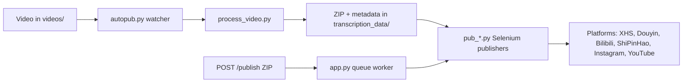

[English](../README.md) · [العربية](README.ar.md) · [Español](README.es.md) · [Français](README.fr.md) · [日本語](README.ja.md) · [한국어](README.ko.md) · [Tiếng Việt](README.vi.md) · [中文 (简体)](README.zh-Hans.md) · [中文（繁體）](README.zh-Hant.md) · [Deutsch](README.de.md) · [Русский](README.ru.md)


<div align="center">

[](https://github.com/lachlanchen/lachlanchen/blob/main/figs/banner.png)

# AutoPublish

<p align="center">
  <strong>スクリプト最優先、ブラウザ駆動のマルチプラットフォーム向けショート動画公開自動化。</strong><br/>
  <sub>セットアップ、ランタイム、キューモード、プラットフォーム自動化ワークフローの運用マニュアル。</sub>
</p>

</div>

[](#prerequisites)
[](#system-overview)
[](#running-the-tornado-service-apppy)
[](#platform-specific-notes)
[](#running-the-tornado-service-apppy)
[](#pwa-frontend-pwa)
[](https://github.com/sponsors/lachlanchen)
[](#table-of-contents)
[](#license)
[](#configuration)
[](#security--ops-checklist)
[](#raspberry-pi--linux-service-setup)

[](#usage)
[](#preparing-browser-sessions)
[](#metadata--zip-format)

| 移動先 | リンク |
| --- | --- |
| 初回セットアップ | [ここから始める](#start-here) |
| ローカル watcher で実行 | [CLI パイプライン実行 (`autopub.py`)](#running-the-cli-pipeline-autopubpy) |
| HTTP キューで実行 | [Tornado サービス実行 (`app.py`)](#running-the-tornado-service-apppy) |
| サービスとして配備 | [Raspberry Pi / Linux サービスセットアップ](#raspberry-pi--linux-service-setup) |
| プロジェクトを支援 | [Support](#support-autopublish) |

多言語クリエイター向けショート動画配信を、Tornado ベースのサービス、Selenium 自動化ボット、ローカルファイル監視ワークフローで運用するツールキットです。`videos/` に動画を置くことで、最終的に XiaoHongShu、Douyin、Bilibili、WeChat Channels（ShiPinHao）、Instagram、必要に応じて YouTube へ配信されます。

このリポジトリは意図的に低レベルです。設定は Python ファイルとシェルスクリプト側に直接記述されます。本ドキュメントはセットアップ、ランタイム、拡張ポイントを網羅する運用マニュアルです。

> ⚙️ **運用思想**: 本プロジェクトは、抽象化層を隠す設計ではなく、明示的なスクリプトと直接的なブラウザ自動化を優先します。
> ✅ **この README の運用方針**: まず技術仕様を厳密に保持し、読みやすさと見つけやすさを高めます。

### クイックナビ

| やりたいこと | 移動先 |
| --- | --- |
| 最初の投稿を実行する | [クイックスタートチェックリスト](#quick-start-checklist) |
| 実行モードを比較する | [実行モード比較（俯瞰）](#runtime-modes-at-a-glance) |
| 認証情報とパスを設定する | [設定](#configuration) |
| API モードでキューを起動する | [Tornado サービス実行 (`app.py`)](#running-the-tornado-service-apppy) |
| コピペで検証する | [例](#examples) |
| Raspberry Pi / Linux で設定する | [Raspberry Pi / Linux サービスセットアップ](#raspberry-pi--linux-service-setup) |

<a id="start-here"></a>
## Start Here

このリポジトリを初めて使う場合は、次の順で進めてください。

1. [Prerequisites](#prerequisites) と [Installation](#installation) を読む。
2. [Configuration](#configuration) でシークレットと絶対パスを設定する。
3. [Preparing Browser Sessions](#preparing-browser-sessions) でブラウザデバッグセッションを準備する。
4. [Usage](#usage) から実行モードを選択する: `autopub.py`（watcher）または `app.py`（API queue）。
5. [Examples](#examples) のコマンドで検証する。

<a id="overview"></a>
## Overview

AutoPublish は現在、以下の 2 つの本番向け実行モードをサポートします。

1. **CLI watcher モード (`autopub.py`)**: フォルダ投入型の取り込み/公開。
2. **API queue モード (`app.py`)**: HTTP（`/publish`, `/publish/queue`）で ZIP を受けて公開。

抽象化オーケストレーションより、透明性の高いスクリプト起点ワークフローを重視する運用者向けです。

<a id="runtime-modes-at-a-glance"></a>
### Runtime Modes at a Glance

| Mode | Entry point | Input | Best for | Output behavior |
| --- | --- | --- | --- | --- |
| CLI watcher | `autopub.py` | `videos/` に投入されたファイル | ローカル運用のワークフロー、cron/service ループ | 検知した動画を処理し、選択したプラットフォームに即時投稿 |
| API queue サービス | `app.py` | `POST /publish` へアップロードされた ZIP | 上流システム連携やリモート起動 | ジョブを受け付け、キュー登録して worker 順で実行 |

<a id="platform-coverage-snapshot"></a>
### Platform Coverage Snapshot

| Platform | Publisher module | Login helper | Control port | CLI mode | API mode |
| --- | --- | --- | --- | --- | --- |
| XiaoHongShu | `pub_xhs.py` | `login_xiaohongshu.py` | `5003` | ✅ | ✅ |
| Douyin | `pub_douyin.py` | `login_douyin.py` | `5004` | ✅ | ✅ |
| Bilibili | `pub_bilibili.py` | N/A | `5005` | ✅ | ✅ |
| ShiPinHao (WeChat Channels) | `pub_shipinhao.py` | `login_shipinhao.py` | `5006` | Optional | ✅ |
| Instagram | `pub_instagram.py` | `login_instagram.py` | `5007` | Optional | ✅ |
| YouTube | `pub_y2b.py` | N/A | `9222` | Optional | ✅ |

<a id="quick-snapshot"></a>
## Quick Snapshot

| What | Value | Color cue |
| --- | --- | --- |
| メイン言語 | Python 3.10+ |  |
| 主な実行形態 | CLI watcher (`autopub.py`) + Tornado キューサービス (`app.py`) |  |
| 自動化エンジン | Selenium + remote-debug Chromium sessions |  |
| 入力形式 | 生動画（`videos/`）と ZIP バンドル（`/publish`） |  |
| リポジトリの作業パス | `/home/lachlan/ProjectsLFS/AutoPublish` |  |
| 想定ユーザー | マルチプラットフォーム短尺動画パイプラインを運用するクリエイター/オペレーション担当 |  |

<a id="operational-safety-snapshot"></a>
### Operational Safety Snapshot

| Topic | Current state | Action |
| --- | --- | --- |
| ハードコードされたパス | 複数モジュール/スクリプトで確認 | 本番前にホストごとの定数を更新 |
| ブラウザログイン状態 | 必須 | プラットフォーム別に永続 remote-debug プロファイルを維持 |
| キャプチャ（captcha）対処 | 任意の連携あり | 必要に応じて 2Captcha / Turing 認証情報を設定 |
| ライセンス宣言 | ルート `LICENSE` が未検出 | 再配布前にメンテナーへ利用条件を確認 |

<a id="compatibility--assumptions"></a>
### Compatibility & Assumptions

| Item | Current assumption in this repo |
| --- | --- |
| Python | 3.10+ |
| Runtime environment | GUI 表示が利用可能な Linux デスクトップ/サーバ |
| Browser control mode | 永続プロファイルディレクトリを使う remote debugging sessions |
| Primary API port | `8081`（`app.py --port`） |
| Processing backend | `upload_url` と `process_url` に到達でき、ZIP を返却する |
| Workspace used for this draft | `/home/lachlan/ProjectsLFS/AutoPublish` |

---

<a id="table-of-contents"></a>
## Table of Contents

- [Start Here](#start-here)
- [Overview](#overview)
- [Runtime Modes at a Glance](#runtime-modes-at-a-glance)
- [Platform Coverage Snapshot](#platform-coverage-snapshot)
- [Quick Snapshot](#quick-snapshot)
- [Operational Safety Snapshot](#operational-safety-snapshot)
- [Compatibility & Assumptions](#compatibility--assumptions)
- [System Overview](#system-overview)
- [Features](#features)
- [Project Structure](#project-structure)
- [Repository Layout](#repository-layout)
- [Prerequisites](#prerequisites)
- [Installation](#installation)
- [Configuration](#configuration)
- [Configuration Verification Checklist](#configuration-verification-checklist)
- [Preparing Browser Sessions](#preparing-browser-sessions)
- [Usage](#usage)
- [Examples](#examples)
- [Metadata & ZIP Format](#metadata--zip-format)
- [Data & Artifact Lifecycle](#data--artifact-lifecycle)
- [Platform-Specific Notes](#platform-specific-notes)
- [Raspberry Pi / Linux Service Setup](#raspberry-pi--linux-service-setup)
- [Legacy macOS Scripts](#legacy-macos-scripts)
- [Troubleshooting & Maintenance](#troubleshooting--maintenance)
- [FAQ](#faq)
- [Extending the System](#extending-the-system)
- [Quick Start Checklist](#quick-start-checklist)
- [Development Notes](#development-notes)
- [Roadmap](#roadmap)
- [Contributing](#contributing)
- [Security & Ops Checklist](#security--ops-checklist)
- [Support](#support-autopublish)
- [License](#license)
- [Acknowledgements](#acknowledgements)

---

<a id="system-overview"></a>
## System Overview

🎯 生メディアから公開記事までのエンドツーエンドフロー:



ワークフローの概要:

1. **素材取り込み**: `videos/` に動画を配置します。watcher（`autopub.py` またはスケジューラ/service）が `videos_db.csv` と `processed.csv` を使って新規ファイルを検出します。
2. **アセット生成**: `process_video.VideoProcessor` がファイルを処理サーバー（`upload_url` と `process_url`）へ送信し、以下を含む ZIP パッケージを受け取ります。
   - 編集/エンコード済み動画（`<stem>.mp4`）
   - カバー画像
   - `{stem}_metadata.json`（ローカライズ済みタイトル、説明、タグなど）
3. **公開実行**: メタデータを元に `pub_*.py` の Selenium publisher が動作します。各 publisher は remote debugging ポートと永続 user-data ディレクトリを使って、起動済みの Chromium/Chrome セッションへ接続します。
4. **Web 制御面（任意）**: `app.py` が `/publish` を提供し、予め作成された ZIP を受け取り展開、同じ publisher へジョブをキュー投入して実行します。ブラウザ再起動とログイン補助（`login_*.py`）の呼び出しも可能です。
5. **補助モジュール**: `load_env.py` は `~/.bashrc` から環境変数を読込、`utils.py` はウィンドウフォーカス、QR 処理、メールヘルパーなどの共通関数を提供、`solve_captcha_*.py` は Turing/2Captcha 連携で captcha に対応します。

<a id="features"></a>
## Features

✨ 実運用志向で、スクリプト起点の自動化を想定:

- マルチプラットフォーム公開: XiaoHongShu、Douyin、Bilibili、ShiPinHao（WeChat Channels）、Instagram、YouTube（任意）
- 2 つの稼働モード: CLI watcher パイプライン (`autopub.py`) と API queue サービス (`app.py` + `/publish` + `/publish/queue`)
- `ignore_*` ファイルによるプラットフォーム別有効/無効の切替
- remote-debugging セッション再利用と永続プロフィール
- 任意で QR / captcha 自動処理とメール通知ヘルパー
- 同梱 PWA（`pwa/`）アップローダ UI はフロントエンドビルド不要
- Linux / Raspberry Pi 用のサービスセットアップ用スクリプト (`scripts/`)

### Feature Matrix

| Capability | CLI (`autopub.py`) | API (`app.py`) |
| --- | --- | --- |
| Input source | ローカル `videos/` watcher | `POST /publish` での ZIP 送信 |
| Queueing | ファイルベースの内部進行 | 明示的なインメモリジョブキュー |
| Platform flags | CLI 引数（`--pub-*`）＋ `ignore_*` | クエリ引数（`publish_*`）＋ `ignore_*` |
| Best fit | 単一ホストの運用ワークフロー | 外部システム連携、リモート起動 |

---

<a id="project-structure"></a>
## Project Structure

高位のソース/ランタイムレイアウト:

```text
AutoPublish/
├── README.md
├── app.py
├── autopub.py
├── process_video.py
├── load_env.py
├── utils.py
├── pub_*.py                  # platform publishers
├── login_*.py                # platform login/session helpers
├── solve_captcha_*.py
├── smtp.py
├── smtp_test_simple.py
├── send_email_qreader.py
├── requirements.txt
├── requirements.autopub.txt
├── .env.example
├── setup_raspberrypi.md
├── scripts/
├── pwa/
├── figs/
├── .github/FUNDING.yml
├── i18n/                     # multilingual READMEs
├── videos/                   # runtime input artifacts
├── logs/, logs-autopub/      # runtime logs
├── temp/, temp_screenshot/   # runtime temp artifacts
├── videos_db.csv
└── processed.csv
```

補足: `transcription_data/` は実行時の処理・公開フローで使用され、実行後に作成される場合があります。

<a id="repository-layout"></a>
## Repository Layout

🗂️ 主要モジュールと役割:

| Path | Purpose |
| --- | --- |
| `app.py` | `/publish` と `/publish/queue` を提供する Tornado サービス。内部キューと worker thread を持ちます。 |
| `autopub.py` | CLI watcher。`videos/` を監視し、新規ファイルを処理し、publisher を並列起動します。 |
| `process_video.py` | 動画を処理バックエンドに送信し、返却された ZIP を保存します。 |
| `pub_xhs.py`, `pub_douyin.py`, `pub_bilibili.py`, `pub_shipinhao.py`, `pub_instagram.py`, `pub_y2b.py` | プラットフォーム別 Selenium 自動化モジュール。 |
| `login_xiaohongshu.py`, `login_douyin.py`, `login_shipinhao.py`, `login_instagram.py` | セッションチェックと QR ログインフロー。 |
| `utils.py` | 共通自動化ヘルパー（ウィンドウフォーカス、QR/メール補助、診断ヘルパー）。 |
| `load_env.py` | シェルプロファイル（`~/.bashrc`）から環境変数を読み込み、機密ログをマスクします。 |
| `smtp.py`, `smtp_test_simple.py`, `send_email_qreader.py` | SMTP/SendGrid 補助とテストスクリプト。 |
| `solve_captcha_2captcha.py`, `solve_captcha_turing.py` | captcha solver 連携。 |
| `scripts/` | サービスセットアップと運用スクリプト（Raspberry Pi/Linux + legacy 自動化）。 |
| `pwa/` | ZIP プレビューと投稿送信用の静的 PWA。 |
| `setup_raspberrypi.md` | Raspberry Pi の初期設定手順。 |
| `.env.example` | 環境変数テンプレート（認証情報、パス、captcha キー）。 |
| `.github/FUNDING.yml` | スポンサー/資金周り設定。 |
| `logs/`, `logs-autopub/`, `temp/`, `temp_screenshot/`, `videos/` | 実行成果物とログ（多くは gitignore）。 |

---

<a id="prerequisites"></a>
## Prerequisites

🧰 初回実行前に以下をインストールしてください。

### Operating system and tools

- GUI 表示付きの Linux デスクトップ/サーバ（`DISPLAY=:1` がスクリプト既定）
- Chromium/Chrome と対応 ChromeDriver
- GUI/メディア補助ツール: `xdotool`, `ffmpeg`, `zip`, `unzip`
- Python 3.10+（venv または Conda）

### Python dependencies

最小ランタイム要件:

```bash
pip install selenium tornado requests requests-toolbelt sendgrid qreader opencv-python webdriver-manager
```

リポジトリ準拠:

```bash
python -m pip install -r requirements.txt
```

軽量サービスインストール（セットアップスクリプト既定）:

```bash
python -m pip install -r requirements.autopub.txt
```

`requirements.autopub.txt` には以下が含まれます。
- `selenium`, `webdriver-manager`, `tornado`, `requests`, `requests-toolbelt`, `sendgrid`, `qreader`, `opencv-python`, `numpy`, `pillow`, `twocaptcha`.

### Optional: create a sudo user

```bash
sudo useradd -m -s /bin/bash -G sudo <USERNAME> && echo "<USERNAME>:<PASSWORD>" | sudo chpasswd
```

---

<a id="installation"></a>
## Installation

🚀 クリーン環境からのセットアップ:

1. リポジトリをクローン:

```bash
git clone https://github.com/lachlanchen/AutoPublish.git
cd AutoPublish
```

2. 仮想環境作成と有効化（`venv` 例）:

```bash
python3 -m venv .venv
source .venv/bin/activate
python -m pip install -U pip
python -m pip install -r requirements.txt
```

3. 環境変数の準備:

```bash
cp .env.example .env
# fill values in .env (do not commit)
```

4. シェルプロフィール依存値を読み込む:

```bash
source ~/.bashrc
python load_env.py
```

注: `load_env.py` は `~/.bashrc` を前提にしています。別シェルを使う場合は適宜調整してください。

---

<a id="configuration"></a>
## Configuration

🔐 認証情報を設定し、ホスト固有のパスを確認します。

### Environment variables

環境変数から認証情報と任意のブラウザ/ランタイムパスを受け取ります。まず `.env.example` を元にします。

| Variable | Description |
| --- | --- |
| `FROM_EMAIL`, `TO_EMAIL`, `APP_PASSWORD` | QR/ログイン通知向け SMTP 認証情報 |
| `SENDGRID_API_KEY` | SendGrid API を使うメールフロー用キー |
| `APIKEY_2CAPTCHA` | 2Captcha API キー |
| `TULING_USERNAME`, `TULING_PASSWORD`, `TULING_ID` | Turing captcha 認証情報 |
| `DOUYIN_LOGIN_PASSWORD` | Douyin の二段階認証補助 |
| `INSTAGRAM_*`, `CHROME_*`, `CHROMEDRIVER_PATH` | Instagram/ブラウザドライバ上書き |
| `AUTOPUBLISH_BROWSER_BIN`, `AUTOPUBLISH_CHROMEDRIVER`, `AUTOPUBLISH_DISPLAY` | `app.py` 向け全体デフォルト設定 |

### Path constants (important)

📌 最も多い起動時の原因はハードコード絶対パスです。

複数モジュールにまだハードコードパスが残っています。ホスト向けに更新してください。

| File | Constant(s) | Meaning |
| --- | --- | --- |
| `app.py` | `logs_folder_root`, `autopublish_folder_root`, `videos_db_path`, `processed_path`, `transcription_root`, `upload_url`, `process_url` | API サービスのルートとバックエンド endpoint |
| `autopub.py` | `logs_folder_path`, `autopublish_folder_path`, `videos_db_path`, `processed_path`, `transcription_path`, `upload_url`, `process_url`, `chromedriver_path` | CLI watcher のルートとバックエンド endpoint |
| `scripts/run_autopub.sh`, `scripts/setup_autopub.sh` | Python/Conda/リポジトリ/ログの絶対パス | legacy/macOS 向けラッパー |
| `utils.py` | カバー処理ヘルパー内の FFmpeg 前提パス | メディアツールのパス互換性 |

重要なリポジトリメモ:
- このワークスペースの現在パスは `/home/lachlan/ProjectsLFS/AutoPublish`。
- 一部コードやスクリプトにはまだ `/home/lachlan/Projects/auto-publish`、`/Users/lachlan/...` が残る場合があります。
- 本番導入前に、ローカル環境向けに更新してください。

### Platform toggles via `ignore_*`

🧩 **即席の安全スイッチ**: `ignore_*` を touch すると、その publisher がコード変更なしで無効化できます。

公開フラグは ignore ファイルでも制御されます。無効化したい場合は空ファイルを作成:

```bash
touch ignore_xhs ignore_douyin ignore_bilibili ignore_shipinhao ignore_instagram ignore_y2b
```

再有効化は対応ファイルを削除します。

### Configuration Verification Checklist

`.env` とパス定数を設定した後、以下を確認してください。

```bash
python -c "import os;print('AUTOPUBLISH_BROWSER_BIN=', os.getenv('AUTOPUBLISH_BROWSER_BIN'));print('AUTOPUBLISH_CHROMEDRIVER=', os.getenv('AUTOPUBLISH_CHROMEDRIVER'));print('DISPLAY=', os.getenv('DISPLAY') or os.getenv('AUTOPUBLISH_DISPLAY'))"
python -c "from load_env import load_env_from_bashrc; load_env_from_bashrc(); print('Environment load OK')"
python -c "import os; p=os.getenv('AUTOPUBLISH_CHROMEDRIVER') or os.getenv('CHROMEDRIVER_PATH') or '/usr/bin/chromedriver'; print(p, 'exists=', os.path.exists(p))"
```

いずれか不足している場合は、`.env`、`~/.bashrc`、またはスクリプト定数を実行前に修正してください。

---

<a id="preparing-browser-sessions"></a>
## Preparing Browser Sessions

🌐 Selenium 公開の成功率を上げるためセッションの永続化が必須です。

1. 専用プロフィールフォルダを作成:

```bash
mkdir -p ~/chromium_dev_session_{5003,5004,5005,5006,5007,9222}
mkdir -p ~/chromium_dev_session_logs
```

2. remote-debug を使ってブラウザを起動（XiaoHongShu 例）:

```bash
DISPLAY=:1 chromium-browser \
  --remote-debugging-port=5003 \
  --user-data-dir="$HOME/chromium_dev_session_5003" \
  https://creator.xiaohongshu.com/creator/post \
  > "$HOME/chromium_dev_session_logs/chromium_xhs.log" 2>&1 &
```

3. 各プラットフォーム／プロフィールで手動ログインを1回実施。

4. Selenium 接続を確認:

```python
from selenium import webdriver
opts = webdriver.ChromeOptions()
opts.add_experimental_option("debuggerAddress", "127.0.0.1:5003")
driver = webdriver.Chrome(options=opts)
print(driver.title)
driver.quit()
```

Security note:
- `app.py` にはブラウザ再起動ロジックで使われるプレースホルダのハードコード sudo パスワード（`password = "1"`）が存在します。実運用前に置換してください。

---

<a id="usage"></a>
## Usage

▶️ 実行モードは 2 つあります: CLI watcher と API queue サービス。

### Running the CLI pipeline (`autopub.py`)

1. 監視対象ディレクトリ（`videos/` または設定済み `autopublish_folder_path`）に元動画を置きます。
2. 起動:

```bash
python autopub.py --use-cache --pub-xhs --pub-douyin --pub-bilibili
```

Flags:

| Flag | Meaning |
| --- | --- |
| `--pub-xhs`, `--pub-douyin`, `--pub-bilibili` | 選択したプラットフォームのみ公開。未指定なら 3 つすべて既定で有効 |
| `--test` | publisher へ test mode を渡す（挙動はプラットフォーム実装ごと） |
| `--use-cache` | `transcription_data/<video>/<video>.zip` があれば再利用 |

CLI フロー（動画1本あたり）:
- `process_video.py` で upload / process
- ZIP を `transcription_data/<video>/` に展開
- 選択 publisher を `ThreadPoolExecutor` で起動
- `videos_db.csv` と `processed.csv` に進行状態を追加

### Running the Tornado service (`app.py`)

🛰️ API モードは外部システムが ZIP を作る運用に有効です。

サーバー起動:

```bash
python app.py --refresh-time 1800 --port 8081
```

API エンドポイント要約:

| Endpoint | Method | Purpose |
| --- | --- | --- |
| `/publish` | `POST` | ZIP をアップロードして公開ジョブをキュー投入 |
| `/publish/queue` | `GET` | キュー、履歴、公開状態を確認 |

### `POST /publish`

📤 ZIP をそのままアップロードしてジョブをキューに入れます。

- Header: `Content-Type: application/octet-stream`
- 必須 query/form 引数: `filename`（ZIP ファイル名）
- 任意ブール値: `publish_xhs`, `publish_douyin`, `publish_bilibili`, `publish_shipinhao`, `publish_instagram`, `publish_y2b`, `test`
- Body: 生の ZIP bytes

例:

```bash
curl -X POST "http://localhost:8081/publish?filename=demo.zip&publish_xhs=true&publish_instagram=true&publish_y2b=true" \
  --data-binary @demo.zip \
  -H "Content-Type: application/octet-stream"
```

Current behavior in code:
- リクエストは受け付けてキューに入り、即時レスポンスとして `status: queued`、`job_id`、`queue_size` を返します。
- ワーカースレッドは登録順に順次処理します。

### `GET /publish/queue`

📊 キュー健全性と実行中ジョブの観測:

キュー状態/履歴 JSON を返します。

```bash
curl "http://localhost:8081/publish/queue"
```

レスポンス要素: `status`, `jobs`, `queue_size`, `is_publishing`。

### Browser refresh thread

♻️ 長時間稼働時の stale session を減らすため、定期的なブラウザ再起動を実行します。

`app.py` は `--refresh-time` 間隔でバックグラウンド更新スレッドを動かし、login チェックと連携します。sleep にはランダム遅延があります。

### PWA frontend (`pwa/`)

🖥️ ZIP 手動アップロードとキュー監視のための軽量静的 UI。

ローカル実行:

```bash
cd pwa
python -m http.server 5173
```

`http://localhost:5173` を開き、backend base URL（例: `http://lazyingart:8081`）を設定します。

PWA の機能:
- ZIP のドラッグ&ドロップでのプレビュー
- 投稿先トグルと test mode
- `/publish` 送信と `/publish/queue` ポーリング

### Command Palette

🧷 よく使うコマンドを1か所に集約:

| Task | Command |
| --- | --- |
| 全依存関係のインストール | `python -m pip install -r requirements.txt` |
| 軽量ランタイム依存のインストール | `python -m pip install -r requirements.autopub.txt` |
| シェル由来 env 読み込み | `source ~/.bashrc && python load_env.py` |
| API queue サーバー起動 | `python app.py --refresh-time 1800 --port 8081` |
| CLI watcher パイプライン起動 | `python autopub.py --use-cache --pub-xhs --pub-douyin --pub-bilibili` |
| ZIP をキュー投入 | `curl -X POST "http://localhost:8081/publish?filename=demo.zip" --data-binary @demo.zip -H "Content-Type: application/octet-stream"` |
| キュー状態確認 | `curl -s "http://localhost:8081/publish/queue"` |
| ローカル PWA 起動 | `cd pwa && python -m http.server 5173` |

---

<a id="examples"></a>
## Examples

🧪 コピー&ペーストで使えるスモークテスト:

### Example 0: 環境を読んで API サーバー起動

```bash
source ~/.bashrc
python load_env.py
python app.py --refresh-time 1800 --port 8081
```

### Example A: CLI publish run

```bash
python autopub.py --pub-xhs --pub-douyin --use-cache
```

### Example B: API publish run (single ZIP)

```bash
curl -X POST "http://localhost:8081/publish?filename=my_bundle.zip&publish_bilibili=true&test=true" \
  --data-binary @my_bundle.zip \
  -H "Content-Type: application/octet-stream"
```

### Example C: キュー状態確認

```bash
curl -s "http://localhost:8081/publish/queue"
```

### Example D: SMTP ヘルパーのスモークテスト

```bash
python smtp.py
python smtp_test_simple.py
```

---

<a id="metadata--zip-format"></a>
## Metadata & ZIP Format

📦 ZIP 契約は重要です。ファイル名とメタデータキーを publisher の期待値に合わせます。

想定される ZIP 内容（最小）:

```text
<stem>_metadata.json
<video_filename>.mp4
<cover_filename>.jpg
```

`metadata` は CN 向け publisher で使用されます。`metadata["english_version"]` は YouTube publisher で使用される場合があります。

publish で頻繁に使うキー:
- `title`, `brief_description`, `middle_description`, `long_description`
- `tags`（ハッシュタグ一覧）
- `video_filename`, `cover_filename`
- 各 `pub_*.py` ごとのプラットフォーム固有フィールド

ZIP を外部生成する場合も、キーとファイル名をモジュール仕様に合わせてください。

<a id="data--artifact-lifecycle"></a>
## Data & Artifact Lifecycle

パイプラインは運用者が保持・ローテーション・クリーンアップを明示的に行う必要があるローカル成果物を作成します。

| Artifact | Location | Produced by | Why it matters |
| --- | --- | --- | --- |
| 入力動画 | `videos/` | 手動投入または upstream 同期 | CLI watcher モードの入力データ |
| 処理済み ZIP 出力 | `transcription_data/<stem>/<stem>.zip` | `process_video.py` | `--use-cache` で再利用可能 |
| 展開済み公開資産 | `transcription_data/<stem>/...` | `autopub.py` / `app.py` の ZIP 展開 | 投稿用ファイルとメタデータ |
| 公開ログ | `logs/`, `logs-autopub/` | CLI/API 実行時 | 障害解析と監査の履歴 |
| ブラウザログ | `~/chromium_dev_session_logs/*.log`（または chrome prefix） | ブラウザ起動スクリプト | セッション/ポート/起動問題の診断 |
| トラッキング CSV | `videos_db.csv`, `processed.csv` | CLI watcher | 重複処理防止 |

運用上の推奨:
- `transcription_data/`, `temp/`, `logs*` の古いファイルは定期的にアーカイブや削除を検討し、ディスク枯渇を防ぐ。

---

<a id="platform-specific-notes"></a>
## Platform-Specific Notes

🧭 各 publisher のポートとモジュール所有:

| Platform | Port | Module(s) | Notes |
| --- | --- | --- | --- |
| XiaoHongShu | 5003 | `pub_xhs.py`, `login_xiaohongshu.py` | QR 再ログインフローあり。タイトルの整形と hashtag 利用を metadata で指定 |
| Douyin | 5004 | `pub_douyin.py`, `login_douyin.py` | アップロード完了チェックと再試行フローは壊れやすいためログ監視が重要 |
| Bilibili | 5005 | `pub_bilibili.py` | captcha hook は `solve_captcha_2captcha.py`, `solve_captcha_turing.py` から利用可能 |
| ShiPinHao (WeChat Channels) | 5006 | `pub_shipinhao.py`, `login_shipinhao.py` | セッション更新の信頼性のため、QR 承認の高速化が重要 |
| Instagram | 5007 | `pub_instagram.py`, `login_instagram.py` | API モードは `publish_instagram=true` で制御。`.env.example` に変数あり |
| YouTube | 9222 | `pub_y2b.py` | `english_version` メタデータを使用。`ignore_y2b` で無効化 |

<a id="raspberry-pi--linux-service-setup"></a>
## Raspberry Pi / Linux Service Setup

🐧 常時起動ホスト向けに推奨。

完全なセットアップ手順は [`setup_raspberrypi.md`](../setup_raspberrypi.md) を参照。

クイックスタート:

```bash
export AUTOPUB_USER=<USERNAME>
export AUTOPUB_REPO=/home/<USERNAME>/Projects/autopub
sudo -E ./scripts/setup_autopub_pipeline.sh
```

実行内容:
- `scripts/setup_envs.sh`
- `scripts/setup_virtual_desktop_service.sh`
- `scripts/download_and_setup_driver.sh`
- `scripts/setup_autopub_service.sh`

tmux で手動起動:

```bash
./scripts/start_autopub_tmux.sh
```

サービス/ポート確認:

```bash
systemctl status autopub.service autopub-vnc.service
sudo ss -ltnp | grep 590
```

互換性ノート:
- 古い資料やスクリプトは `virtual-desktop.service` を参照する場合がありますが、現行セットアップでは `autopub-vnc.service` を使用します。

<a id="legacy-macos-scripts"></a>
## Legacy macOS Scripts

🍎 旧ローカル環境互換のため macOS 向け wrapper を維持しています。

リポジトリには次が含まれます:
- `scripts/run_autopub.sh`
- `scripts/setup_autopub.sh`

これらは `Conda` 仮定と `'/Users/lachlan/...'` の絶対パスを含みます。必要なら利用しますが、ホスト向けにパスや venv を更新してください。

---

<a id="troubleshooting--maintenance"></a>
## Troubleshooting & Maintenance

🛠️ 障害時はまずここを確認。

- **パスのズレ（機種別）**: `/Users/lachlan/...` や `/home/lachlan/Projects/auto-publish` の参照エラーが出る場合、定数を現在のホストパス（このワークスペースでは `/home/lachlan/ProjectsLFS/AutoPublish`）に合わせます。
- **シークレット管理**: push 前に `~/.local/bin/detect-secrets scan` を実行し、露出した資格情報はローテーションします。
- **処理バックエンドのエラー**: `process_video.py` が "Failed to get the uploaded file path" を出力する場合は、upload 応答 JSON に `file_path` があるか、処理エンドポイントが ZIP bytes を返しているかを確認。
- **ChromeDriver 不一致**: DevTools 接続エラー時は Chrome/Chromium と driver のバージョンを揃える（または `webdriver-manager` へ切替）。
- **ブラウザフォーカス不具合**: `bring_to_front` はウィンドウタイトル一致に依存します。ブラウザ名の差異で失敗しやすいです。
- **Captcha の途中停止**: 2Captcha/Turing 資格情報を設定し、必要に応じて solver 結果を統合。
- **古いロックファイル**: ジョブが始まらない場合、`autopub.lock`（legacy フロー）を確認・削除。
- **確認対象ログ**: `logs/`, `logs-autopub/`, `~/chromium_dev_session_logs/*.log`, `journalctl` の service ログ。

<a id="faq"></a>
## FAQ

**Q: API モードと CLI watcher を同時に実行できますか？**  
A: 可能ですが、入力とブラウザセッションを厳密に分離しない場合は推奨されません。両モードが同じ publisher、ファイル、ポートを競合させる可能性があります。

**Q: `/publish` が queued を返すのに、まだ投稿が始まりません。**  
A: `app.py` はまずジョブをキューへ入れ、次に background worker が順次処理します。`/publish/queue`、`is_publishing`、サービスログを確認してください。

**Q: `.env` を使っている場合でも `load_env.py` は必要ですか？**  
A: `start_autopub_tmux.sh` は `.env` を読み込む一方で、直接実行はシェル環境依存となることがあります。`.env` とシェル export を一致させてください。

**Q: API アップロードで必要な最小 ZIP 仕様は？**  
A: `{stem}_metadata.json` と、`video_filename`、`cover_filename` に対応する動画・カバーを含む有効な ZIP です。

**Q: headless mode はサポートされていますか？**  
A: 一部モジュールに headless 関連オプションはありますが、本リポジトリの主運用モードは永続プロフィール付きの GUI ブラウザです。

<a id="extending-the-system"></a>
## Extending the System

🧱 新規 platform 拡張と運用改善の拡張ポイント:

- **新規 platform 追加**: `pub_*.py` をコピーして selector/flow を更新し、必要なら `login_*.py` を追加。次に `app.py` の queue/flags と `autopub.py` の CLI 配線を追加。
- **設定の抽象化**: 分散した定数を `config.yaml`/`.env` + 型定義モデルのような構成管理へ統合し、マルチホスト運用を容易にする。
- **資格情報保護の強化**: ハードコードやシェル露出の機密処理を、Vault など安全なシークレット管理へ移行。
- **コンテナ化**: Chromium/ChromeDriver、Python runtime、仮想ディスプレイを1つの再現可能ユニットへまとめる。

<a id="quick-start-checklist"></a>
## Quick Start Checklist

✅ 1本目の投稿までの最短手順:

1. リポジトリをクローンし、依存関係をインストール（`pip install -r requirements.txt` または `requirements.autopub.txt`）。
2. `app.py`、`autopub.py`、実行するスクリプトのハードコードパス定数を更新。
3. shell profile または `.env` に必須認証情報を設定し、`python load_env.py` で読み込み確認。
4. remote-debug 用のブラウザプロファイルフォルダを作成し、対象 platform のセッションを起動。
5. 各ターゲットプラットフォームで1回手動ログイン。
6. `python app.py --port 8081`（API）または `python autopub.py --use-cache ...`（CLI）を起動。
7. API はサンプル ZIP、CLI はサンプル動画を1件投入して `logs/` を確認。
8. push 前にシークレットスキャンを実施。

<a id="development-notes"></a>
## Development Notes

🧬 現在の開発ベースライン（手動整形 + スモークテスト）:

- Python は既存ルール（4スペースインデント、手動整形）を遵守。
- 公式な自動テストはありません。手動スモークテスト推奨:
  - `autopub.py` でサンプル動画を1本処理
  - `/publish` に ZIP を1件送り `/publish/queue` を監視
  - 各 target platform を手動で検証
- 新規スクリプト追加時は簡易実行のため `if __name__ == "__main__":` エントリポイントを追加。
- プラットフォーム変更は可能な限り `pub_*`, `login_*`, `ignore_*` 単位で分離。
- `videos/*`, `logs*/*`, `transcription_data/*`, `ignore_*` はローカル前提で、ほぼ gitignore。

<a id="roadmap"></a>
## Roadmap

🗺️ 現行コード制約を踏まえた優先改善:

1. 分散したハードコードパスを一元化し、`.env`/YAML + typed model 的な設定に移行。
2. ハードコード sudo パスワードを除去し、安全なプロセス制御へ移行。
3. 各 platform の再試行と UI 状態検知を強化し、公開の信頼性向上。
4. 対応 platform 拡張（例: Kuaishou など）を追加。
5. 再現性のあるデプロイ単位（container + virtual display profile）にまとめる。
6. ZIP 契約と queue 実行の自動統合チェックを追加。

<a id="contributing"></a>
## Contributing

🤝 PR は小さく再現可能で、実行前提を明記してください。

コントリビューション歓迎です。

1. Fork してフォーカスしたブランチを作成。
2. コミットは小さく命令形を推奨（履歴例: “Wait for YouTube checks before publishing”）。
3. PR には手動検証メモを含める。
   - 環境前提
   - ブラウザ/セッション再起動の有無
   - UI フロー変更のログやスクリーンショット
4. 実際のシークレットはコミットしない（`.env` は gitignore、形は `.env.example` のみ）。

新規 publisher module を追加する場合は以下を必須で接続:
- `pub_<platform>.py`
- 任意 `login_<platform>.py`
- `app.py` の API flags と queue handling
- `autopub.py` の CLI wiring（必要なら）
- `ignore_<platform>` トグル対応
- README 更新

<a id="security--ops-checklist"></a>
## Security & Ops Checklist

本番相当実行前に:

1. `.env` がローカルに存在し、git で追跡されていないことを確認。
2. 過去にコミットされた可能性がある資格情報を削除／ローテーション。
3. コード内のプレースホルダ機密値（例: `app.py` の sudo パスワードの仮値）を置換。
4. `ignore_*` スイッチの有効化・無効化が意図通りか確認。
5. ブラウザプロフィールを platform ごとに分離し、最小権限アカウントを使用。
6. 共有ログに機密情報が含まれないことを確認。
7. push 前に `detect-secrets`（または同等）を実行。

<a id="support-autopublish"></a>
## ❤️ Support

| Donate | PayPal | Stripe |
| --- | --- | --- |
| [](https://chat.lazying.art/donate) | [](https://paypal.me/RongzhouChen) | [](https://buy.stripe.com/aFadR8gIaflgfQV6T4fw400) |

## License

このリポジトリのスナップショットには現在 `LICENSE` がありません。

この草稿の扱い:
- メンテナーが明示的なライセンスファイルを追加するまで、利用・再配布条件は未定義として扱ってください。

推奨アクション:
- トップレベルに `LICENSE`（例: MIT/Apache-2.0/GPL-3.0）を追加し、このセクションを更新してください。

> 📝 ライセンスファイルが追加されるまでは、商用／社内再配布条件は未確定であるため、必ずメンテナーへ直接確認してください。

---

<a id="acknowledgements"></a>
## Acknowledgements

- メンテナーおよび sponsor プロファイル: [@lachlanchen](https://github.com/lachlanchen)
- 資金設定の参照先: [`../.github/FUNDING.yml`](../.github/FUNDING.yml)
- 本リポジトリで参照されるエコシステム: Selenium, Tornado, SendGrid, 2Captcha, Turing captcha APIs。
