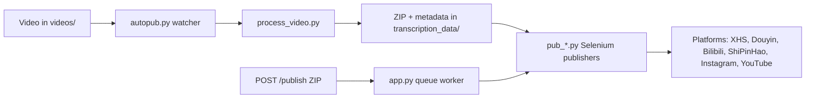

[English](../README.md) · [العربية](README.ar.md) · [Español](README.es.md) · [Français](README.fr.md) · [日本語](README.ja.md) · [한국어](README.ko.md) · [Tiếng Việt](README.vi.md) · [中文 (简体)](README.zh-Hans.md) · [中文（繁體）](README.zh-Hant.md) · [Deutsch](README.de.md) · [Русский](README.ru.md)


<div align="center">

[](https://github.com/lachlanchen/lachlanchen/blob/main/figs/banner.png)

# AutoPublish

<p align="center">
  <strong>스크립트 우선, 브라우저 기반 멀티 플랫폼 쇼츠 게시 자동화.</strong><br/>
  <sub>설치, 런타임, 큐 모드, 플랫폼 자동화 워크플로를 위한 운영 매뉴얼입니다.</sub>
</p>

</div>

[](#prerequisites)
[](#system-overview)
[](#running-the-tornado-service-apppy)
[](#platform-specific-notes)
[](#running-the-tornado-service-apppy)
[](#pwa-frontend-pwa)
[](https://github.com/sponsors/lachlanchen)
[](#table-of-contents)
[](#license)
[](#configuration)
[](#security--ops-checklist)
[](#raspberry-pi--linux-service-setup)

[](#usage)
[](#preparing-browser-sessions)
[](#metadata--zip-format)

| 이동 | 링크 |
| --- | --- |
| 첫 설정 | [시작하기](#start-here) |
| 로컬 watcher 실행 | [CLI 파이프라인 실행 (`autopub.py`)](#running-the-cli-pipeline-autopubpy) |
| HTTP 큐로 실행 | [Tornado 서비스 실행 (`app.py`)](#running-the-tornado-service-apppy) |
| 서비스로 배포 | [Raspberry Pi / Linux 서비스 설정](#raspberry-pi--linux-service-setup) |
| 프로젝트 지원 | [Support](#support-autopublish) |

이 저장소는 단기형 비디오 콘텐츠를 여러 중국 및 국제 크리에이터 플랫폼에 배포하기 위한 자동화 도구 모음입니다. Tornado 기반 서비스, Selenium 자동화 봇, 로컬 파일 감시 워크플로우를 결합해 `videos/` 폴더에 영상을 넣으면 최종적으로 XiaoHongShu, Douyin, Bilibili, WeChat Channels(ShiPinHao), Instagram, 그리고 선택적으로 YouTube에 업로드됩니다.

리포지토리는 의도적으로 저수준으로 구성되어 있습니다. 주요 설정은 Python 파일과 셸 스크립트에 직접 존재합니다. 이 문서는 설정, 런타임, 확장 지점을 다루는 운영 매뉴얼입니다.

> ⚙️ **운영 철학**: 이 프로젝트는 숨겨진 추상화 계층보다 명시적 스크립트와 직접 브라우저 자동화를 선호합니다.
> ✅ **이 README의 공식 원칙**: 기술 세부사항을 유지한 뒤 가독성과 탐색성을 개선합니다.
> 🌍 **현지화 상태 (작업 공간에서 2026년 2월 28일 기준 검증됨)**: `i18n/`에는 아랍어, 독일어, 스페인어, 프랑스어, 일본어, 한국어, 러시아어, 베트남어, 중국어 간체, 중국어 번체 버전이 포함됩니다.

### 빠른 탐색

| 원하는 작업 | 이동 |
| --- | --- |
| 첫 게시 실행 | [빠른 시작 체크리스트](#quick-start-checklist) |
| 런타임 모드 비교 | [런타임 모드 한눈에 보기](#runtime-modes-at-a-glance) |
| 인증 정보 및 경로 설정 | [설정](#configuration) |
| API 모드/큐 작업 시작 | [Tornado 서비스 실행 (`app.py`)](#running-the-tornado-service-apppy) |
| 복붙으로 검증 | [예시](#examples) |
| Raspberry Pi/Linux에 설정 | [Raspberry Pi / Linux 서비스 설정](#raspberry-pi--linux-service-setup) |

<a id="start-here"></a>
## 시작하기

이 저장소를 처음 사용하는 경우 아래 순서로 진행하세요.

1. [Prerequisites](#prerequisites) 및 [Installation](#installation)을 확인합니다.
2. [설정](#configuration)에서 시크릿 값과 절대 경로를 구성합니다.
3. [브라우저 세션 준비](#preparing-browser-sessions)로 브라우저 디버그 세션을 준비합니다.
4. [사용법](#usage)에서 실행 모드를 하나 선택합니다: `autopub.py`(watcher) 또는 `app.py`(API queue).
5. [예시](#examples)의 명령으로 동작을 확인합니다.

<a id="overview"></a>
## 개요

AutoPublish는 현재 두 가지 실제 운영 모드를 지원합니다.

1. **CLI watcher 모드 (`autopub.py`)**: 폴더 기반 수집/게시 파이프라인.
2. **API queue 모드 (`app.py`)**: HTTP (`/publish`, `/publish/queue`)로 ZIP 업로드 기반 게시.

이 프로젝트는 추상 오케스트레이션 플랫폼보다 투명한 스크립트 우선 워크플로우를 선호하는 운영자를 대상으로 설계되었습니다.

<a id="runtime-modes-at-a-glance"></a>
### 런타임 모드 한눈에 보기

| 모드 | 진입점 | 입력 | 적합한 대상 | 출력 동작 |
| --- | --- | --- | --- | --- |
| CLI watcher | `autopub.py` | `videos/`에 투입된 파일 | 로컬 운영자 워크플로 및 cron/service 루프 | 감지한 영상을 처리하고 즉시 선택된 플랫폼에 게시 |
| API queue 서비스 | `app.py` | `POST /publish`로 업로드한 ZIP | 상위 시스템 연동 및 원격 트리거 | 작업을 수락해 큐에 넣고 worker 순서대로 실행 |

<a id="platform-coverage-snapshot"></a>
### 플랫폼 커버리지 스냅샷

| 플랫폼 | 게시 모듈 | 로그인 헬퍼 | 제어 포트 | CLI 모드 | API 모드 |
| --- | --- | --- | --- | --- | --- |
| XiaoHongShu | `pub_xhs.py` | `login_xiaohongshu.py` | `5003` | ✅ | ✅ |
| Douyin | `pub_douyin.py` | `login_douyin.py` | `5004` | ✅ | ✅ |
| Bilibili | `pub_bilibili.py` | N/A | `5005` | ✅ | ✅ |
| ShiPinHao (WeChat Channels) | `pub_shipinhao.py` | `login_shipinhao.py` | `5006` | Optional | ✅ |
| Instagram | `pub_instagram.py` | `login_instagram.py` | `5007` | Optional | ✅ |
| YouTube | `pub_y2b.py` | N/A | `9222` | Optional | ✅ |

<a id="quick-snapshot"></a>
## 빠른 요약

| 항목 | 값 | 색상 표시 |
| --- | --- | --- |
| 기본 언어 | Python 3.10+ |  |
| 핵심 런타임 | CLI watcher (`autopub.py`) + Tornado queue 서비스 (`app.py`) |  |
| 자동화 엔진 | Selenium + remote-debug Chromium 세션 |  |
| 입력 형식 | Raw 영상 (`videos/`) 및 ZIP 번들 (`/publish`) |  |
| 현재 리포지토리 작업 경로 | `/home/lachlan/ProjectsLFS/AutoPublish` |  |
| 권장 사용자 | 다중 플랫폼 쇼츠 파이프라인을 운영하는 크리에이터/운영 엔지니어 |  |

<a id="operational-safety-snapshot"></a>
### 운영 안전성 요약

| 항목 | 현재 상태 | 조치 |
| --- | --- | --- |
| 하드코딩 경로 | 여러 모듈/스크립트에 존재 | 운영 전 호스트별 경로 상수 업데이트 |
| 브라우저 로그인 상태 | 필수 | 플랫폼별 영구 remote-debug 프로필 유지 |
| 캡차 처리 | 필요 시 통합 사용 가능 | 필요한 경우 2Captcha/Turing 자격 증명 설정 |
| 라이선스 선언 | 최상위 `LICENSE` 파일 미탐지 | 재배포 전 유지보수자에게 사용 조건 확인 |

<a id="compatibility--assumptions"></a>
### 호환성 및 가정

| 항목 | 현재 가정 |
| --- | --- |
| Python | 3.10+ |
| 런타임 환경 | Linux 데스크톱/서버 및 Chromium 표시 가능한 GUI |
| 브라우저 제어 방식 | 영구 프로필 디렉터리를 사용하는 remote debugging 세션 |
| 기본 API 포트 | `8081` (`app.py --port`) |
| 처리 백엔드 | `upload_url` + `process_url` 접근 가능 및 유효한 ZIP 응답 반환 |
| 이 초안의 작업 경로 | `/home/lachlan/ProjectsLFS/AutoPublish` |

---

<a id="table-of-contents"></a>
## 목차

- [시작하기](#start-here)
- [개요](#overview)
- [런타임 모드 한눈에 보기](#runtime-modes-at-a-glance)
- [플랫폼 커버리지 스냅샷](#platform-coverage-snapshot)
- [빠른 요약](#quick-snapshot)
- [운영 안전성 요약](#operational-safety-snapshot)
- [호환성 및 가정](#compatibility--assumptions)
- [시스템 개요](#system-overview)
- [기능](#features)
- [프로젝트 구조](#project-structure)
- [저장소 레이아웃](#repository-layout)
- [사전 요구사항](#prerequisites)
- [설치](#installation)
- [설정](#configuration)
- [설정 검증 체크리스트](#configuration-verification-checklist)
- [브라우저 세션 준비](#preparing-browser-sessions)
- [사용법](#usage)
- [예시](#examples)
- [메타데이터 및 ZIP 형식](#metadata--zip-format)
- [데이터 및 산출물 라이프사이클](#data--artifact-lifecycle)
- [플랫폼별 참고사항](#platform-specific-notes)
- [Raspberry Pi / Linux 서비스 설정](#raspberry-pi--linux-service-setup)
- [레거시 macOS 스크립트](#legacy-macos-scripts)
- [문제 해결 및 유지관리](#troubleshooting--maintenance)
- [FAQ](#faq)
- [시스템 확장](#extending-the-system)
- [빠른 시작 체크리스트](#quick-start-checklist)
- [개발 노트](#development-notes)
- [로드맵](#roadmap)
- [기여](#contributing)
- [보안 및 운영 체크리스트](#security--ops-checklist)
- [라이선스](#license)
- [감사의 말](#acknowledgements)
- [Support](#support-autopublish)

---

<a id="system-overview"></a>
## 시스템 개요

🎯 **원본 미디어에서 게시물까지의 엔드 투 엔드 흐름**:



작동 흐름:

1. **원본 자산 수집**: `videos/` 안에 영상을 넣습니다. watcher(예: `autopub.py` 또는 스케줄러/서비스)는 `videos_db.csv`와 `processed.csv`로 새 파일을 감지합니다.
2. **자산 생성**: `process_video.VideoProcessor`가 파일을 처리 서버(`upload_url`, `process_url`)로 업로드하고 ZIP 패키지를 받습니다. 패키지에는 다음이 포함됩니다:
   - 편집/인코딩된 비디오 (`<stem>.mp4`)
   - 썸네일 이미지
   - 현지화된 제목, 설명, 태그 등이 담긴 `{stem}_metadata.json`
3. **게시**: 메타데이터를 바탕으로 `pub_*.py`의 Selenium 게시 모듈이 동작합니다. 각 모듈은 remote-debug 포트와 영구 user-data 디렉터리를 사용해 이미 실행 중인 Chromium/Chrome 인스턴스에 연결합니다.
4. **웹 제어 평면(선택)**: `app.py`가 `/publish`를 노출해 사전 생성된 ZIP 번들을 받아 압축 해제하고 동일한 게시 모듈 큐로 작업을 전달합니다. 브라우저 세션 새로 고침 및 로그인 헬퍼(`login_*.py`) 호출도 가능합니다.
5. **지원 모듈**: `load_env.py`는 `~/.bashrc`에서 시크릿을 로드하고, `utils.py`는 창 포커스·QR 처리·메일 유틸리티 헬퍼를 제공하며, `solve_captcha_*.py`는 Turing/2Captcha와 연동해 캡차 대응을 담당합니다.

<a id="features"></a>
## 기능

✨ **실전형 스크립트 우선 자동화**를 위해 설계했습니다:

- 멀티 플랫폼 게시: XiaoHongShu, Douyin, Bilibili, ShiPinHao(WeChat Channels), Instagram, YouTube(선택)
- 두 가지 운영 모드: CLI watcher 파이프라인 (`autopub.py`) 및 API queue 서비스 (`app.py` + `/publish` + `/publish/queue`)
- `ignore_*` 파일을 통한 플랫폼별 임시 비활성화 스위치
- remote-debug 브라우저 세션 재사용과 영구 프로필
- 선택적 QR/캡차 자동화 및 메일 알림 헬퍼
- 포함된 PWA(`pwa/`) 업로더 UI는 별도 프론트엔드 빌드가 필요하지 않음
- Linux/Raspberry Pi 자동화용 스크립트 제공 (`scripts/`)

### 기능 매트릭스

| 기능 | CLI (`autopub.py`) | API (`app.py`) |
| --- | --- | --- |
| 입력 소스 | 로컬 `videos/` watcher | `POST /publish`로 업로드한 ZIP |
| 큐잉 | 내부 파일 기반 진행 | 명시적 인메모리 작업 큐 |
| 플랫폼 플래그 | CLI 인수 (`--pub-*`) + `ignore_*` | 쿼리 인수 (`publish_*`) + `ignore_*` |
| 적합 대상 | 단일 호스트 운영자 워크플로 | 외부 시스템 연동 및 원격 트리거 |

---

<a id="project-structure"></a>
## 프로젝트 구조

상위 소스/런타임 구조:

```text
AutoPublish/
├── README.md
├── app.py
├── autopub.py
├── process_video.py
├── load_env.py
├── utils.py
├── pub_*.py                  # 플랫폼 게시 모듈
├── login_*.py                # 플랫폼 로그인/세션 헬퍼
├── solve_captcha_*.py
├── smtp.py
├── smtp_test_simple.py
├── send_email_qreader.py
├── requirements.txt
├── requirements.autopub.txt
├── .env.example
├── setup_raspberrypi.md
├── scripts/
├── pwa/
├── figs/
├── .github/FUNDING.yml
├── i18n/                     # 다국어 README
├── videos/                   # 런타임 입력 산출물
├── logs/, logs-autopub/      # 런타임 로그
├── temp/, temp_screenshot/   # 런타임 임시 산출물
├── videos_db.csv
└── processed.csv
```

참고: `transcription_data/`는 처리 및 게시 흐름에서 런타임 중 사용되며 실행 후 생성될 수 있습니다.

<a id="repository-layout"></a>
## 저장소 레이아웃

🗂️ **주요 모듈 및 역할**:

| 경로 | 용도 |
| --- | --- |
| `README.md` | 프로젝트 개요 및 운영 매뉴얼 |
| `app.py` | `/publish` 및 `/publish/queue`를 노출하는 Tornado 서비스, 내부 publish 큐/워커 스레드 포함 |
| `autopub.py` | CLI watcher: `videos/` 감시, 신규 파일 처리 후 병렬 게시자 호출 |
| `process_video.py` | 처리 백엔드로 영상 업로드 후 반환된 ZIP 저장 |
| `pub_xhs.py`, `pub_douyin.py`, `pub_bilibili.py`, `pub_shipinhao.py`, `pub_instagram.py`, `pub_y2b.py` | 플랫폼별 Selenium 자동화 모듈 |
| `login_xiaohongshu.py`, `login_douyin.py`, `login_shipinhao.py`, `login_instagram.py` | 세션 체크 및 QR 로그인 흐름 |
| `utils.py` | 공통 자동화 유틸(창 포커스, QR/메일 헬퍼, 진단) |
| `load_env.py` | 쉘 프로파일(`~/.bashrc`)에서 env 로드, 민감 로그 마스킹 |
| `smtp.py`, `smtp_test_simple.py`, `send_email_qreader.py` | SMTP/SendGrid 헬퍼 및 테스트 스크립트 |
| `solve_captcha_2captcha.py`, `solve_captcha_turing.py` | 캡차 솔버 통합 |
| `scripts/` | 서비스 설정/운영 스크립트 (Raspberry Pi/Linux + legacy) |
| `pwa/` | ZIP 미리보기/게시 제출용 정적 PWA |
| `setup_raspberrypi.md` | Raspberry Pi 프로비저닝 단계 문서 |
| `.env.example` | 환경변수 템플릿(자격 증명, 경로, 캡차 키) |
| `.github/FUNDING.yml` | 스폰서/후원 설정 |
| `logs/`, `logs-autopub/`, `temp/`, `temp_screenshot/`, `videos/` | 런타임 산출물 및 로그(대부분 gitignore) |

---

<a id="prerequisites"></a>
## 사전 요구사항

🧰 **초기 실행 전에 설치해야 할 항목**입니다.

### 운영체제 및 도구

- Linux 데스크톱/서버(스크립트 예시는 `DISPLAY=:1` 사용)
- Chromium/Chrome 및 호환되는 ChromeDriver
- GUI/미디어 도구: `xdotool`, `ffmpeg`, `zip`, `unzip`
- Python 3.10+ (venv 또는 Conda)

### Python 의존성

최소 실행 세트:

```bash
pip install selenium tornado requests requests-toolbelt sendgrid qreader opencv-python webdriver-manager
```

리포지토리 의존성:

```bash
python -m pip install -r requirements.txt
```

가벼운 서비스 설치(`setup` 스크립트 기본값):

```bash
python -m pip install -r requirements.autopub.txt
```

`requirements.autopub.txt`에는 다음이 포함됩니다:
- `selenium`, `webdriver-manager`, `tornado`, `requests`, `requests-toolbelt`, `sendgrid`, `qreader`, `opencv-python`, `numpy`, `pillow`, `twocaptcha`

### 선택: sudo 사용자 생성

```bash
sudo useradd -m -s /bin/bash -G sudo <USERNAME> && echo "<USERNAME>:<PASSWORD>" | sudo chpasswd
```

---

<a id="installation"></a>
## 설치

🚀 **깨끗한 환경에서 시작하기**:

1. 저장소 클론:

```bash
git clone https://github.com/lachlanchen/AutoPublish.git
cd AutoPublish
```

2. 가상 환경 생성 및 활성화(예시, `venv`):

```bash
python3 -m venv .venv
source .venv/bin/activate
python -m pip install -U pip
python -m pip install -r requirements.txt
```

3. 환경 변수 준비:

```bash
cp .env.example .env
# .env 값 채우기 (커밋하지 마세요)
```

4. 쉘 프로파일 기반 값을 읽는 스크립트를 실행:

```bash
source ~/.bashrc
python load_env.py
```

참고: `load_env.py`는 `~/.bashrc`를 기준으로 작성되었습니다. 다른 쉘 프로파일을 사용하면 해당 방식에 맞게 조정하세요.

---

<a id="configuration"></a>
## 설정

🔐 **자격 증명 설정 후, 호스트별 경로를 확인하세요**.

### 환경 변수

이 프로젝트는 환경 변수에서 자격 증명과 브라우저/런타임 경로를 읽습니다. `.env.example`에서 시작하세요.

| 변수 | 설명 |
| --- | --- |
| `FROM_EMAIL`, `TO_EMAIL`, `APP_PASSWORD` | QR/login 알림용 SMTP 자격 증명 |
| `SENDGRID_API_KEY` | SendGrid API 기반 이메일 플로우용 키 |
| `APIKEY_2CAPTCHA` | 2Captcha API 키 |
| `TULING_USERNAME`, `TULING_PASSWORD`, `TULING_ID` | Turing 캡차 자격 증명 |
| `DOUYIN_LOGIN_PASSWORD` | Douyin 2차 인증 보조용 |
| `INSTAGRAM_*`, `CHROME_*`, `CHROMEDRIVER_PATH` | Instagram/브라우저 드라이버 오버라이드 |
| `AUTOPUBLISH_BROWSER_BIN`, `AUTOPUBLISH_CHROMEDRIVER`, `AUTOPUBLISH_DISPLAY` | `app.py`의 전역 브라우저/드라이버/표시 환경 오버라이드 |

### 경로 상수(중요)

📌 **가장 흔한 시작 오류**: 하드코딩 절대 경로 미해결.

몇몇 모듈에는 하드코딩 경로가 남아 있습니다. 호스트에 맞게 갱신하세요.

| 파일 | 상수 | 의미 |
| --- | --- | --- |
| `app.py` | `logs_folder_root`, `autopublish_folder_root`, `videos_db_path`, `processed_path`, `transcription_root`, `upload_url`, `process_url` | API 서비스 루트와 백엔드 엔드포인트 |
| `autopub.py` | `logs_folder_path`, `autopublish_folder_path`, `videos_db_path`, `processed_path`, `transcription_path`, `upload_url`, `process_url`, `chromedriver_path` | CLI watcher 루트 및 백엔드 엔드포인트 |
| `scripts/run_autopub.sh`, `scripts/setup_autopub.sh` | Python/Conda/저장소/로그의 절대 경로 | legacy/macOS 지향 래퍼 |
| `utils.py` | 커버 처리 헬퍼의 FFmpeg 경로 가정 | 미디어 도구 경로 호환성 |

운영 노트:
- 이 작업공간의 현재 경로는 `/home/lachlan/ProjectsLFS/AutoPublish`입니다.
- 일부 코드와 스크립트는 여전히 `/home/lachlan/Projects/auto-publish` 또는 `/Users/lachlan/...`를 참조할 수 있습니다.
- 코드 실행 전에 이러한 경로를 로컬 환경에 맞게 유지/조정하세요.

### `ignore_*`로 플랫폼 토글

🧩 **빠른 안전 전환**: `ignore_*` 파일을 만들면 해당 게시자를 코드 수정 없이 비활성화할 수 있습니다.

게시 플래그도 ignore 파일로 제어합니다. 비우기 파일을 생성해 비활성화:

```bash
touch ignore_xhs ignore_douyin ignore_bilibili ignore_shipinhao ignore_instagram ignore_y2b
```

해당 파일을 삭제하면 다시 활성화됩니다.

### 설정 검증 체크리스트

`.env` 및 경로 상수 설정 후 다음 명령으로 빠르게 검증하세요.

```bash
python -c "import os;print('AUTOPUBLISH_BROWSER_BIN=', os.getenv('AUTOPUBLISH_BROWSER_BIN'));print('AUTOPUBLISH_CHROMEDRIVER=', os.getenv('AUTOPUBLISH_CHROMEDRIVER'));print('DISPLAY=', os.getenv('DISPLAY') or os.getenv('AUTOPUBLISH_DISPLAY'))"
python -c "from load_env import load_env_from_bashrc; load_env_from_bashrc(); print('Environment load OK')"
python -c "import os; p=os.getenv('AUTOPUBLISH_CHROMEDRIVER') or os.getenv('CHROMEDRIVER_PATH') or '/usr/bin/chromedriver'; print(p, 'exists=', os.path.exists(p))"
```

값이 하나라도 비어 있으면 `.env`, `~/.bashrc`, 또는 스크립트 상수 값을 실행 전에 업데이트하세요.

---

<a id="preparing-browser-sessions"></a>
## 브라우저 세션 준비

🌐 **안정적인 Selenium 게시를 위해 세션 영속성은 필수**입니다.

1. 플랫폼별 전용 프로필 폴더 생성:

```bash
mkdir -p ~/chromium_dev_session_{5003,5004,5005,5006,5007,9222}
mkdir -p ~/chromium_dev_session_logs
```

2. remote debugging으로 브라우저 세션 실행(예: XiaoHongShu):

```bash
DISPLAY=:1 chromium-browser \
  --remote-debugging-port=5003 \
  --user-data-dir="$HOME/chromium_dev_session_5003" \
  https://creator.xiaohongshu.com/creator/post \
  > "$HOME/chromium_dev_session_logs/chromium_xhs.log" 2>&1 &
```

3. 각 플랫폼/프로필별로 한 번씩 수동 로그인.

4. Selenium 연결을 확인:

```python
from selenium import webdriver
opts = webdriver.ChromeOptions()
opts.add_experimental_option("debuggerAddress", "127.0.0.1:5003")
driver = webdriver.Chrome(options=opts)
print(driver.title)
driver.quit()
```

보안 참고사항:
- `app.py`에는 브라우저 재시작 로직에서 하드코딩된 sudo 비밀번호 플레이스홀더 (`password = "1"`)가 남아 있습니다. 실제 배포 전 바꾸세요.

---

<a id="usage"></a>
## 사용법

▶️ **두 가지 실행 모드**를 사용할 수 있습니다: CLI watcher와 API queue 서비스.

### `autopub.py` CLI 파이프라인 실행

1. 감시 디렉토리(`videos/` 또는 설정한 `autopublish_folder_path`)에 소스 영상을 넣습니다.
2. 실행:

```bash
python autopub.py --use-cache --pub-xhs --pub-douyin --pub-bilibili
```

플래그:

| 플래그 | 의미 |
| --- | --- |
| `--pub-xhs`, `--pub-douyin`, `--pub-bilibili` | 선택한 플랫폼으로만 게시를 제한합니다. 하나도 지정하지 않으면 기본적으로 세 가지가 모두 사용됩니다. |
| `--test` | 게시 모듈에 전달되는 테스트 모드(플랫폼별 동작은 다를 수 있음) |
| `--use-cache` | 가능하면 기존 `transcription_data/<video>/<video>.zip`을 재사용 |

영상 당 CLI 흐름:
- `process_video.py`를 통해 업로드/처리
- ZIP을 `transcription_data/<video>/`에 추출
- `ThreadPoolExecutor`로 선택 게시 모듈 실행
- 처리 상태를 `videos_db.csv`와 `processed.csv`에 기록

<a id="running-the-tornado-service-apppy"></a>
### `app.py` Tornado 서비스 실행

🛰️ **외부 시스템이 ZIP 번들을 생성해 전달할 때 유용한 API 모드**입니다.

서버 시작:

```bash
python app.py --refresh-time 1800 --port 8081
```

API 엔드포인트 요약:

| 엔드포인트 | 메서드 | 목적 |
| --- | --- | --- |
| `/publish` | `POST` | ZIP 바이트 업로드 및 게시 작업 큐잉 |
| `/publish/queue` | `GET` | 큐, 작업 이력, 게시 상태 조회 |

### `POST /publish`

📤 **ZIP 바이트를 직접 업로드해 게시 작업을 큐잉**합니다.

- 헤더: `Content-Type: application/octet-stream`
- 필수 query/form 인자: `filename` (ZIP 파일명)
- 선택 bool: `publish_xhs`, `publish_douyin`, `publish_bilibili`, `publish_shipinhao`, `publish_instagram`, `publish_y2b`, `test`
- 본문: raw ZIP bytes

예시:

```bash
curl -X POST "http://localhost:8081/publish?filename=demo.zip&publish_xhs=true&publish_instagram=true&publish_y2b=true" \
  --data-binary @demo.zip \
  -H "Content-Type: application/octet-stream"
```

현재 코드 동작:
- 요청을 수락하고 큐에 넣음
- 즉시 JSON 응답으로 `status: queued`, `job_id`, `queue_size` 반환
- 워커 스레드가 큐에 있는 작업을 직렬로 처리

### `GET /publish/queue`

📊 **큐 상태와 진행중 작업을 확인**합니다.

큐 상태/이력 JSON을 반환:

```bash
curl "http://localhost:8081/publish/queue"
```

응답 필드:
- `status`, `jobs`, `queue_size`, `is_publishing`

### 브라우저 새로고침 스레드

♻️ 주기적 브라우저 새로고침은 장시간 가동 시 세션 노후 문제를 줄여줍니다.

`app.py`는 `--refresh-time` 간격으로 백그라운드 새로고침 스레드를 실행하며 로그인 체크 훅을 연결합니다. 새로고침 sleep에는 랜덤 지연 동작이 포함됩니다.

<a id="pwa-frontend-pwa"></a>
### PWA 프런트엔드 (`pwa/`)

🖥️ 수동 ZIP 업로드 및 큐 조회를 위한 가벼운 정적 UI.

정적 UI를 로컬에서 실행:

```bash
cd pwa
python -m http.server 5173
```

`http://localhost:5173`에 접속해 백엔드 base URL(예: `http://lazyingart:8081`)을 설정하세요.

PWA 기능:
- ZIP 드래그/드롭 미리보기
- 게시 대상 토글 + 테스트 모드
- `/publish`로 제출, `/publish/queue` 주기 조회

### 커맨드 팔레트

🧷 **가장 많이 쓰는 명령을 한 곳에 정리**합니다.

| 작업 | 명령 |
| --- | --- |
| 전체 의존성 설치 | `python -m pip install -r requirements.txt` |
| 경량 런타임 의존성 설치 | `python -m pip install -r requirements.autopub.txt` |
| 쉘 기반 env 로드 | `source ~/.bashrc && python load_env.py` |
| API 큐 서버 시작 | `python app.py --refresh-time 1800 --port 8081` |
| CLI watcher 파이프라인 시작 | `python autopub.py --use-cache --pub-xhs --pub-douyin --pub-bilibili` |
| 큐로 ZIP 제출 | `curl -X POST "http://localhost:8081/publish?filename=demo.zip" --data-binary @demo.zip -H "Content-Type: application/octet-stream"` |
| 큐 상태 확인 | `curl -s "http://localhost:8081/publish/queue"` |
| 로컬 PWA 실행 | `cd pwa && python -m http.server 5173` |

---

<a id="examples"></a>
## 예시

🧪 **복붙 가능한 스모크 테스트 명령**:

### 예시 0: 환경 로드 후 API 서버 시작

```bash
source ~/.bashrc
python load_env.py
python app.py --refresh-time 1800 --port 8081
```

### 예시 A: CLI 게시 실행

```bash
python autopub.py --pub-xhs --pub-douyin --use-cache
```

### 예시 B: API 게시 실행(단일 ZIP)

```bash
curl -X POST "http://localhost:8081/publish?filename=my_bundle.zip&publish_bilibili=true&test=true" \
  --data-binary @my_bundle.zip \
  -H "Content-Type: application/octet-stream"
```

### 예시 C: 큐 상태 조회

```bash
curl -s "http://localhost:8081/publish/queue"
```

### 예시 D: SMTP 헬퍼 스모크 테스트

```bash
python smtp.py
python smtp_test_simple.py
```

---

<a id="metadata--zip-format"></a>
## 메타데이터 및 ZIP 형식

📦 **ZIP 규격은 중요**합니다. 파일명과 메타데이터 키를 게시 모듈 기대값과 정확히 일치시켜야 합니다.

최소 구성:

```text
<stem>_metadata.json
<video_filename>.mp4
<cover_filename>.jpg
```

`metadata`는 CN 게시 모듈에서 사용되며, 선택적으로 `metadata["english_version"]`이 YouTube 게시 모듈로 전달됩니다.

모듈에서 공통적으로 사용하는 필드:
- `title`, `brief_description`, `middle_description`, `long_description`
- `tags` (태그 목록)
- `video_filename`, `cover_filename`
- 개별 `pub_*.py`에 구현된 플랫폼별 필드

ZIP을 외부에서 생성할 경우에도 키와 파일명이 모듈 기대값과 일치해야 합니다.

<a id="data--artifact-lifecycle"></a>
## 데이터 및 산출물 라이프사이클

파이프라인은 운영자가 의도적으로 유지/회전/정리해야 하는 로컬 산출물을 만듭니다.

| 산출물 | 위치 | 생성 주체 | 중요도 |
| --- | --- | --- | --- |
| 입력 영상 | `videos/` | 수동 입력 또는 업스트림 동기화 | CLI watcher의 소스 미디어 |
| 처리 ZIP 출력 | `transcription_data/<stem>/<stem>.zip` | `process_video.py` | `--use-cache` 재사용용 |
| 추출된 게시 자산 | `transcription_data/<stem>/...` | `autopub.py`/`app.py`의 ZIP 추출 | 게시 준비 파일 및 메타데이터 |
| 게시 로그 | `logs/`, `logs-autopub/` | CLI/API 런타임 | 장애 분석 및 감사 추적 |
| 브라우저 로그 | `~/chromium_dev_session_logs/*.log` (또는 chrome prefix) | 브라우저 시작 스크립트 | 세션/포트/시작 이슈 진단 |
| 추적 CSV | `videos_db.csv`, `processed.csv` | CLI watcher | 중복 처리 방지 |

권장 정리 작업:
- 오래된 `transcription_data/`, `temp/`, 기존 로그는 주기적으로 정리/보관하여 디스크 압박을 줄이세요.

---

<a id="platform-specific-notes"></a>
## 플랫폼별 참고사항

🧭 각 게시 모듈의 포트 맵 + 모듈 소유권.

| 플랫폼 | 포트 | 모듈 | 참고 |
| --- | --- | --- | --- |
| XiaoHongShu | 5003 | `pub_xhs.py`, `login_xiaohongshu.py` | QR 재로그인 흐름, 메타데이터 기반 제목 정규화 및 해시태그 사용 |
| Douyin | 5004 | `pub_douyin.py`, `login_douyin.py` | 업로드 완료 확인과 재시도 경로가 플랫폼별로 취약할 수 있어 로그 모니터링 필수 |
| Bilibili | 5005 | `pub_bilibili.py` | 캡차 훅은 `solve_captcha_2captcha.py`, `solve_captcha_turing.py`로 사용 가능 |
| ShiPinHao (WeChat Channels) | 5006 | `pub_shipinhao.py`, `login_shipinhao.py` | 빠른 QR 승인은 세션 갱신 안정성에 중요 |
| Instagram | 5007 | `pub_instagram.py`, `login_instagram.py` | API 모드에서 `publish_instagram=true`로 제어; env 변수는 `.env.example` 참조 |
| YouTube | 9222 | `pub_y2b.py` | `english_version` 메타데이터 블록 사용; `ignore_y2b`로 비활성화 |

---

<a id="raspberry-pi--linux-service-setup"></a>
## Raspberry Pi / Linux 서비스 설정

🐧 **항상 켜져 있어야 하는 호스트에서 권장**.

전체 호스트 부트스트랩은 [`setup_raspberrypi.md`](setup_raspberrypi.md)를 따르세요.

간단한 파이프라인 설정:

```bash
export AUTOPUB_USER=<USERNAME>
export AUTOPUB_REPO=/home/<USERNAME>/Projects/autopub
sudo -E ./scripts/setup_autopub_pipeline.sh
```

이 스크립트는 아래를 순서대로 실행합니다:
- `scripts/setup_envs.sh`
- `scripts/setup_virtual_desktop_service.sh`
- `scripts/download_and_setup_driver.sh`
- `scripts/setup_autopub_service.sh`

tmux에서 서비스를 직접 실행:

```bash
./scripts/start_autopub_tmux.sh
```

서비스/포트 확인:

```bash
systemctl status autopub.service autopub-vnc.service
sudo ss -ltnp | grep 590
```

호환성 노트:
- 일부 오래된 문서/스크립트는 `virtual-desktop.service`를 참조할 수 있으나, 현재 스크립트는 `autopub-vnc.service`를 설치합니다.

---

<a id="legacy-macos-scripts"></a>
## 레거시 macOS 스크립트

🍎 과거 로컬 환경 호환성을 위해 레거시 래퍼가 남아 있습니다.

현재 레포지토리에 포함된 항목:
- `scripts/run_autopub.sh`
- `scripts/setup_autopub.sh`

이들에는 절대 `/Users/lachlan/...` 경로 및 Conda 가정이 들어있습니다. 해당 워크플로를 사용한다면 유지하되 경로/venv/도구를 호스트에 맞게 조정하세요.

---

<a id="troubleshooting--maintenance"></a>
## 문제 해결 및 유지관리

🛠️ **오류가 발생했을 때 가장 먼저 확인할 항목**입니다.

- **머신 간 경로 불일치**: 오류 메시지에서 `/Users/lachlan/...` 또는 `/home/lachlan/Projects/auto-publish` 경로가 보이면 경로를 호스트 경로(`/home/lachlan/ProjectsLFS/AutoPublish`)로 맞추세요.
- **시크릿 위생**: push 전에 `~/.local/bin/detect-secrets scan`을 실행하세요. 유출된 인증정보를 즉시 회전합니다.
- **처리 백엔드 오류**: `process_video.py`에서 `Failed to get the uploaded file path`가 보이면 업로드 응답 JSON의 `file_path`와 처리 엔드포인트의 ZIP 바이트 반환을 확인하세요.
- **ChromeDriver 불일치**: DevTools 연결 오류가 나면 Chrome/Chromium과 드라이버 버전을 맞추거나 `webdriver-manager`로 전환하세요.
- **브라우저 포커스 문제**: `bring_to_front`는 창 제목 매칭에 의존하므로 Chromium/Chrome 제목 차이로 동작이 깨질 수 있습니다.
- **캡차 개입**: 2Captcha/Turing 자격증명을 구성하고 필요한 경우 solver 출력을 반영하세요.
- **오래된 락 파일**: 스케줄 실행이 멈춘 것 같으면 프로세스 상태를 확인하고, `autopub.lock`을 제거(legacy 플로우)한 뒤 재시작하세요.
- **확인할 로그**: `logs/`, `logs-autopub/`, `~/chromium_dev_session_logs/*.log`, 그리고 서비스 저널 로그

<a id="faq"></a>
## FAQ

**Q: API 모드와 CLI watcher 모드를 동시에 실행할 수 있나요?**  
A: 가능하긴 하지만, 입력과 브라우저 세션을 철저히 분리하지 않으면 권장되지 않습니다. 두 모드는 동일 게시자, 파일, 포트를 공유해 경쟁할 수 있습니다.

**Q: `/publish`는 `queued`를 반환했는데 게시가 안 되는 이유는?**  
A: `app.py`는 먼저 작업을 큐에 넣은 뒤, 백그라운드 워커가 순차적으로 처리합니다. `/publish/queue`, `is_publishing`, 서비스 로그를 확인하세요.

**Q: 이미 `.env`를 쓰고 있는데도 `load_env.py`가 필요한가요?**  
A: `start_autopub_tmux.sh`는 `.env`가 있으면 읽지만, 일부 직접 실행은 쉘 환경 로딩에 의존합니다. `.env`와 쉘 export를 일치시켜 두는 것이 좋습니다.

**Q: API 업로드용 최소 ZIP 규격은 무엇인가요?**  
A: `{stem}_metadata.json`과 함께 `video_filename`, `cover_filename` 키와 일치하는 영상/커버 파일명이 포함된 유효한 ZIP입니다.

**Q: 헤드리스 모드는 지원되나요?**  
A: 일부 모듈에 headless 관련 변수가 있지만, 이 저장소의 기본 문서화된 동작 방식은 영구 프로필을 가진 GUI 브라우저 세션입니다.

---

<a id="extending-the-system"></a>
## 시스템 확장

🧱 **새 플랫폼 및 안정성 개선 지점**입니다.

- **새 플랫폼 추가**: `pub_*.py`를 복사해 selector/흐름을 갱신하고, QR 재인증이 필요하면 `login_*.py`를 추가한 뒤, `app.py`의 큐 처리와 `autopub.py`의 CLI 연결을 반영하세요.
- **설정 추상화**: 산재한 상수를 구조화된 config(`config.yaml`/`.env` + 타입 모델)로 옮겨 다중 호스트 운영성을 높입니다.
- **자격증명 보안 강화**: 하드코딩/쉘 노출 민감값을 secure secret management(`sudo -A`, keychain, vault/secret manager)로 교체하세요.
- **컨테이너화**: Chromium/ChromeDriver + Python 런타임 + virtual display를 하나의 배포 단위로 묶어 클라우드/서버에 배포하기 쉽게 만듭니다.

<a id="quick-start-checklist"></a>
## 빠른 시작 체크리스트

✅ **첫 성공 게시로 가는 최소 경로**.

1. 저장소를 클론하고 의존성을 설치합니다 (`pip install -r requirements.txt` 또는 경량 버전 `requirements.autopub.txt`).
2. `app.py`, `autopub.py`, 실행할 스크립트의 하드코딩 경로 상수를 업데이트합니다.
3. `.env` 또는 쉘 프로파일에 필수 자격 증명을 등록하고, `python load_env.py`로 로드 검증을 합니다.
4. 플랫폼별 remote-debug 프로필 폴더를 만들고 각 필수 세션을 한 번씩 시작합니다.
5. 각 대상 플랫폼에서 수동 로그인합니다.
6. API 모드(`python app.py --port 8081`) 또는 CLI 모드(`python autopub.py --use-cache ...`)로 시작합니다.
7. 샘플 ZIP(API) 또는 샘플 영상 파일(CLI) 한 건을 제출하고 `logs/`를 확인합니다.
8. push 전에 시크릿 스캔을 실행합니다.

<a id="development-notes"></a>
## 개발 노트

🧬 **현재 개발 기준**(수동 포맷팅 + 스모크 테스트).

- Python 스타일은 기존 4칸 들여쓰기를 따르며 수동 포맷입니다.
- 공식 자동 테스트는 없습니다. 다음 스모크 테스트에 의존하세요:
  - `autopub.py`로 샘플 영상 한 건 처리
  - `/publish`로 ZIP 한 건 전송 후 `/publish/queue` 모니터링
  - 각 대상 플랫폼을 수동으로 검증
- 새 스크립트 추가 시 빠른 로컬 dry-run을 위해 `if __name__ == "__main__":` 엔트리포인트를 포함하세요.
- 플랫폼 변경은 가능한 한 격리합니다 (`pub_*`, `login_*`, `ignore_*` 토글).
- 런타임 산출물 (`videos/*`, `logs*/*`, `transcription_data/*`, `ignore_*`)은 로컬 중심이며 대부분 gitignore 대상입니다.

<a id="roadmap"></a>
## 로드맵

🗺️ **현재 코드 제약에서 반영된 우선 개선 과제**.

예정/권장 개선점(현재 코드 구조 및 기존 노트 기준):

1. 산재한 하드코딩 경로를 중앙 설정(`.env`/YAML + 타입 모델)로 대체.
2. 하드코딩 sudo 비밀번호 패턴 제거 후 더 안전한 프로세스 제어 방식으로 이전.
3. 플랫폼별 UI 상태 검출 개선 및 재시도 강화를 통해 게시 신뢰성 향상.
4. 플랫폼 지원 확장(예: Kuaishou 등 다른 크리에이터 플랫폼).
5. 런타임을 재현 가능한 배포 단위로 패키징(컨테이너 + virtual display profile).
6. ZIP 규격 및 큐 실행 자동 통합 점검 추가.

<a id="contributing"></a>
## 기여

🤝 PR은 집중되고 재현 가능하며 런타임 가정이 명확해야 합니다.

기여를 환영합니다.

1. 포크 후 포커스 브랜치를 만듭니다.
2. 커밋은 작고 명령형으로 유지합니다(예: “Wait for YouTube checks before publishing”).
3. PR에는 수동 검증 노트가 필요합니다.
   - 환경 가정
   - 브라우저/세션 재시작 이력
   - UI 흐름 변경에 대한 로그/스크린샷
4. 실사용 시크릿은 커밋하지 않습니다(`.env`는 무시됨, 형식 확인은 `.env.example`).

새 게시 모듈을 추가할 때 아래 항목을 모두 반영하세요:
- `pub_<platform>.py`
- 필요 시 `login_<platform>.py`
- `app.py`의 API 플래그 및 큐 처리
- `autopub.py`의 CLI 연동(해당 시)
- `ignore_<platform>` 토글 처리
- README 갱신

<a id="security--ops-checklist"></a>
## 보안 및 운영 체크리스트

프로덕션 유사 실행 전:

1. `.env`가 로컬에 존재하고 git에 추적되지 않는지 확인합니다.
2. 과거 유출 이력 있는 자격 증명은 회전/삭제합니다.
3. 코드 내 임시 민감값(예: `app.py`의 sudo 비밀번호 플레이스홀더) 등을 실제 값으로 교체합니다.
4. 배치 실행 전 `ignore_*` 스위치가 의도대로 설정되었는지 확인합니다.
5. 브라우저 프로필을 플랫폼별로 분리하고 최소 권한 계정을 사용합니다.
6. 공유할 이슈 로그/스냅샷에서 시크릿이 노출되지 않았는지 점검합니다.
7. push 전 `detect-secrets` 또는 동등 도구를 실행합니다.

<a id="support-autopublish"></a>
## 라이선스

현재 저장소 스냅샷에는 최상위 `LICENSE` 파일이 없습니다.

초안 가정:
- 유지보수자가 라이선스 파일을 추가하기 전까지 사용 및 재배포 조건은 미정의입니다.

권장 다음 조치:
- 상단 라이선스를 추가하고(예: MIT/Apache-2.0/GPL-3.0) 해당 섹션을 업데이트하세요.

> 📝 라이선스 파일이 없을 경우, 상용/내부 재배포 가정은 미해결 상태이므로 유지보수자와 직접 확인하세요.

---

<a id="acknowledgements"></a>
## 감사의 말

- 유지보수자 및 스폰서 프로필: [@lachlanchen](https://github.com/lachlanchen)
- 후원 설정 소스: [`.github/FUNDING.yml`](.github/FUNDING.yml)
- 이 저장소에서 참조되는 생태계 서비스: Selenium, Tornado, SendGrid, 2Captcha, Turing captcha APIs.


## ❤️ Support

| Donate | PayPal | Stripe |
| --- | --- | --- |
| [](https://chat.lazying.art/donate) | [](https://paypal.me/RongzhouChen) | [](https://buy.stripe.com/aFadR8gIaflgfQV6T4fw400) |
