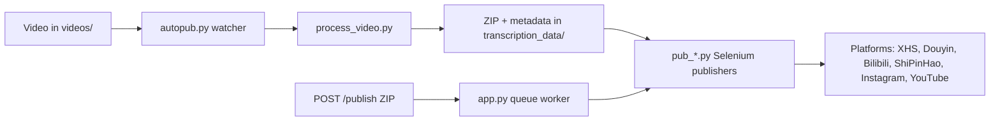

[English](../README.md) · [العربية](README.ar.md) · [Español](README.es.md) · [Français](README.fr.md) · [日本語](README.ja.md) · [한국어](README.ko.md) · [Tiếng Việt](README.vi.md) · [中文 (简体)](README.zh-Hans.md) · [中文（繁體）](README.zh-Hant.md) · [Deutsch](README.de.md) · [Русский](README.ru.md)


[](https://github.com/lachlanchen/lachlanchen/blob/main/figs/banner.png)

<div align="center">

# AutoPublish

<p align="center">
  <strong>스크립트 우선, 브라우저 기반 멀티 플랫폼 숏폼 게시 자동화.</strong><br/>
  <sub>설치, 런타임, 큐 모드, 플랫폼 자동화 워크플로를 위한 운영 매뉴얼.</sub>
</p>

</div>

[](#prerequisites)
[](#system-overview)
[](#running-the-tornado-service-apppy)
[](#platform-specific-notes)
[](#running-the-tornado-service-apppy)
[](#pwa-frontend-pwa)
[](https://github.com/sponsors/lachlanchen)
[](#table-of-contents)
[](#license)
[](#configuration)
[](#security--ops-checklist)
[](#raspberry-pi--linux-service-setup)

[](#usage)
[](#preparing-browser-sessions)
[](#metadata--zip-format)

| 이동 | 링크 |
| --- | --- |
| 첫 설정 | [시작하기](#start-here) |
| 로컬 watcher 실행 | [CLI 파이프라인 실행 (`autopub.py`)](#running-the-cli-pipeline-autopubpy) |
| HTTP 큐로 실행 | [Tornado 서비스 실행 (`app.py`)](#running-the-tornado-service-apppy) |
| 서비스로 배포 | [Raspberry Pi / Linux 서비스 설정](#raspberry-pi--linux-service-setup) |
| 프로젝트 지원 | [Support](#support-autopublish) |

짧은 형식의 영상 콘텐츠를 여러 중국권 및 글로벌 크리에이터 플랫폼에 배포하기 위한 자동화 툴킷입니다. 이 프로젝트는 Tornado 기반 서비스, Selenium 자동화 봇, 로컬 파일 감시 워크플로를 결합해 `videos/` 폴더에 영상을 넣으면 최종적으로 XiaoHongShu, Douyin, Bilibili, WeChat Channels(ShiPinHao), Instagram, 그리고 선택적으로 YouTube에 업로드됩니다.

리포지토리는 의도적으로 저수준으로 구성되어 있습니다. 대부분의 설정은 Python 파일과 셸 스크립트에 직접 존재합니다. 이 문서는 설치, 런타임, 확장 지점을 다루는 운영 매뉴얼입니다.

> ⚙️ **운영 철학**: 이 프로젝트는 숨겨진 추상화 계층보다 명시적 스크립트와 직접 브라우저 자동화를 우선시합니다.
> ✅ **이 README의 공식 정책**: 기술 세부사항을 유지한 뒤 가독성과 탐색성을 개선합니다.
> 🌍 **현지화 상태 (이 작업 공간 기준 2026년 2월 28일 검증)**: `i18n/`에는 현재 아랍어, 독일어, 스페인어, 프랑스어, 일본어, 한국어, 러시아어, 베트남어, 중국어 간체, 중국어 번체 버전이 포함되어 있습니다.

### 빠른 탐색

| 원함 | 이동 |
| --- | --- |
| 첫 게시 실행 | [빠른 시작 체크리스트](#quick-start-checklist) |
| 런타임 모드 비교 | [런타임 모드 한눈에 보기](#runtime-modes-at-a-glance) |
| 인증 정보 및 경로 설정 | [설정](#configuration) |
| API 모드로 큐 작업 실행 | [Tornado 서비스 실행 (`app.py`)](#running-the-tornado-service-apppy) |
| 복붙으로 검증 | [예시](#examples) |
| Raspberry Pi/Linux에 설정 | [Raspberry Pi / Linux 서비스 설정](#raspberry-pi--linux-service-setup) |

<a id="start-here"></a>
## 시작하기

이 저장소를 처음 사용하는 경우 아래 순서로 진행하세요.

1. [Prerequisites](#prerequisites)와 [Installation](#installation)을 확인합니다.
2. [설정](#configuration)에서 시크릿 값과 절대 경로를 구성합니다.
3. [브라우저 세션 준비](#preparing-browser-sessions)에서 플랫폼별 브라우저 세션을 준비합니다.
4. [사용법](#usage)에서 실행 모드 하나를 선택합니다: `autopub.py`(watcher) 또는 `app.py`(API queue).
5. [예시](#examples)의 명령으로 동작을 검증합니다.

<a id="overview"></a>
## 개요

AutoPublish는 현재 두 가지 실제 운영 모드를 지원합니다.

1. **CLI watcher 모드 (`autopub.py`)**: 폴더 기반 수집 및 게시 파이프라인.
2. **API queue 모드 (`app.py`)**: HTTP(`/publish`, `/publish/queue`)로 ZIP 업로드 기반 게시.

이 프로젝트는 추상화 오케스트레이션 플랫폼보다 투명한 스크립트 우선 워크플로우를 선호하는 운영자를 대상으로 설계되었습니다.

<a id="runtime-modes-at-a-glance"></a>
### 런타임 모드 한눈에 보기

| 모드 | 진입점 | 입력 | 적합한 사용 시점 | 출력 동작 |
| --- | --- | --- | --- | --- |
| CLI watcher | `autopub.py` | `videos/`에 들어온 파일 | 로컬 운영자 워크플로 및 cron/service 루프 | 감지된 영상을 처리하고 즉시 선택한 플랫폼에 게시 |
| API queue 서비스 | `app.py` | `POST /publish`로 업로드한 ZIP | 외부 시스템 연동 및 원격 트리거 | 요청을 수락해 큐에 넣고 worker 순서대로 실행 |

<a id="platform-coverage-snapshot"></a>
### 플랫폼 커버리지 스냅샷

| 플랫폼 | 게시 모듈 | 로그인 헬퍼 | 제어 포트 | CLI 모드 | API 모드 |
| --- | --- | --- | --- | --- | --- |
| XiaoHongShu | `pub_xhs.py` | `login_xiaohongshu.py` | `5003` | ✅ | ✅ |
| Douyin | `pub_douyin.py` | `login_douyin.py` | `5004` | ✅ | ✅ |
| Bilibili | `pub_bilibili.py` | N/A | `5005` | ✅ | ✅ |
| ShiPinHao (WeChat Channels) | `pub_shipinhao.py` | `login_shipinhao.py` | `5006` | Optional | ✅ |
| Instagram | `pub_instagram.py` | `login_instagram.py` | `5007` | Optional | ✅ |
| YouTube | `pub_y2b.py` | N/A | `9222` | Optional | ✅ |

<a id="quick-snapshot"></a>
## 빠른 요약

| 항목 | 값 | 색상 표시 |
| --- | --- | --- |
| 기본 언어 | Python 3.10+ |  |
| 핵심 런타임 | CLI watcher (`autopub.py`) + Tornado queue 서비스 (`app.py`) |  |
| 자동화 엔진 | Selenium + remote-debug Chromium 세션 |  |
| 입력 형식 | Raw 영상 (`videos/`) 및 ZIP 번들 (`/publish`) |  |
| 현재 저장소 경로 | `/home/lachlan/ProjectsLFS/AutoPublish` |  |
| 적합 사용자 | 다중 플랫폼 숏폼 파이프라인을 운영하는 크리에이터/운영 엔지니어 |  |

<a id="operational-safety-snapshot"></a>
### 운영 안정성 요약

| 항목 | 현재 상태 | 조치 |
| --- | --- | --- |
| 하드코딩 경로 | 여러 모듈/스크립트에 존재 | 운영 전 호스트별 경로 상수 업데이트 |
| 브라우저 로그인 상태 | 필수 | 플랫폼별 영구 remote-debug 프로필 유지 |
| CAPTCHA 처리 | 필요 시 통합 가능 | 2Captcha/Turing 자격 증명 필요 시 설정 |
| 라이선스 선언 | 최상위 `LICENSE` 미탐지 | 재배포 전 유지보수자에게 사용 조건 확인 |

<a id="compatibility--assumptions"></a>
### 호환성 및 가정

| 항목 | 현재 가정 |
| --- | --- |
| Python | 3.10+ |
| 런타임 환경 | Chromium을 구동할 수 있는 GUI 표시기가 있는 Linux 데스크톱/서버 |
| 브라우저 제어 방식 | 영구 프로필 디렉터리를 사용하는 remote debugging 세션 |
| 기본 API 포트 | `8081` (`app.py --port`) |
| 처리 백엔드 | `upload_url` + `process_url` 접근 가능 및 유효한 ZIP 반환 |
| 본 문서 작성 워크스페이스 | `/home/lachlan/ProjectsLFS/AutoPublish` |

---

<a id="table-of-contents"></a>
## 목차

- [시작하기](#start-here)
- [개요](#overview)
- [런타임 모드 한눈에 보기](#runtime-modes-at-a-glance)
- [플랫폼 커버리지 스냅샷](#platform-coverage-snapshot)
- [빠른 요약](#quick-snapshot)
- [운영 안정성 요약](#operational-safety-snapshot)
- [호환성 및 가정](#compatibility--assumptions)
- [시스템 개요](#system-overview)
- [기능](#features)
- [프로젝트 구조](#project-structure)
- [저장소 구성](#repository-layout)
- [사전 요구사항](#prerequisites)
- [설치](#installation)
- [설정](#configuration)
- [설정 검증 체크리스트](#configuration-verification-checklist)
- [브라우저 세션 준비](#preparing-browser-sessions)
- [사용법](#usage)
- [예시](#examples)
- [메타데이터 및 ZIP 형식](#metadata--zip-format)
- [데이터 및 산출물 라이프사이클](#data--artifact-lifecycle)
- [플랫폼별 참고사항](#platform-specific-notes)
- [Raspberry Pi / Linux 서비스 설정](#raspberry-pi--linux-service-setup)
- [레거시 macOS 스크립트](#legacy-macos-scripts)
- [문제 해결 및 유지관리](#troubleshooting--maintenance)
- [FAQ](#faq)
- [시스템 확장](#extending-the-system)
- [빠른 시작 체크리스트](#quick-start-checklist)
- [개발 노트](#development-notes)
- [로드맵](#roadmap)
- [기여](#contributing)
- [보안 및 운영 체크리스트](#security--ops-checklist)
- [라이선스](#license)
- [감사의 말](#acknowledgements)
- [❤️ Support](#support-autopublish)

---

<a id="system-overview"></a>
## 시스템 개요

🎯 **원본 미디어에서 게시물까지의 엔드투엔드 흐름**:



작동 흐름:

1. **원본 자산 수집**: `videos/`에 영상을 넣습니다. watcher(예: `autopub.py` 또는 스케줄러/서비스)가 `videos_db.csv`와 `processed.csv`를 사용해 새 파일을 감지합니다.
2. **자산 생성**: `process_video.VideoProcessor`가 영상을 처리 서버(`upload_url` + `process_url`)로 업로드하고 ZIP 패키지를 받아옵니다. 패키지에는 다음이 포함됩니다.
   - 편집/인코딩된 영상 (`<stem>.mp4`)
   - 커버 이미지
   - `{stem}_metadata.json` (현지화된 제목, 설명, 태그 등을 포함)
3. **게시**: 메타데이터를 기반으로 `pub_*.py`의 Selenium 게시 모듈이 동작합니다. 각 모듈은 remote-debug 포트와 영구 사용자 데이터 디렉터리를 사용해 이미 실행 중인 Chromium/Chrome 인스턴스에 연결합니다.
4. **웹 제어 평면(선택)**: `app.py`가 `/publish`를 노출해 사전 생성 ZIP을 받아 압축 해제하고 동일한 게시 모듈 큐로 전달합니다. 브라우저 세션 재시작과 로그인 헬퍼(`login_*.py`) 호출도 처리합니다.
5. **지원 모듈**: `load_env.py`는 `~/.bashrc`에서 비밀 값을 불러오고, `utils.py`는 창 포커스·QR 처리·메일 유틸리티 헬퍼를 제공하며, `solve_captcha_*.py`는 Turing/2Captcha 연동으로 CAPTCHA 대응을 처리합니다.

<a id="features"></a>
## 기능

✨ **실무형 스크립트 우선 자동화**를 위해 설계:

- 멀티 플랫폼 게시: XiaoHongShu, Douyin, Bilibili, ShiPinHao(WeChat Channels), Instagram, YouTube(선택)
- 두 가지 운영 모드: CLI watcher 파이프라인 (`autopub.py`)과 API queue 서비스 (`app.py` + `/publish` + `/publish/queue`)
- `ignore_*` 파일로 플랫폼별 임시 비활성화 스위치
- remote-debug 브라우저 세션 재사용과 영구 프로필 관리
- 선택적 QR/CAPTCHA 자동화와 이메일 알림 헬퍼
- 별도 프론트엔드 빌드가 필요 없는 PWA (`pwa/`) 업로더 UI
- Linux/Raspberry Pi 자동화용 스크립트 제공 (`scripts/`)

### 기능 매트릭스

| 기능 | CLI (`autopub.py`) | API (`app.py`) |
| --- | --- | --- |
| 입력 소스 | 로컬 `videos/` watcher | `POST /publish`로 업로드한 ZIP |
| 큐잉 | 내부 파일 기반 진행 | 명시적 인메모리 작업 큐 |
| 플랫폼 플래그 | CLI 인수 (`--pub-*`) + `ignore_*` | 쿼리 인수 (`publish_*`) + `ignore_*` |
| 적합 대상 | 단일 호스트 운영자 워크플로 | 외부 시스템 연동 및 원격 트리거 |

---

<a id="project-structure"></a>
## 프로젝트 구조

상위 소스/런타임 구성:

```text
AutoPublish/
├── README.md
├── app.py
├── autopub.py
├── process_video.py
├── load_env.py
├── utils.py
├── pub_*.py                  # 플랫폼 게시 모듈
├── login_*.py                # 플랫폼 로그인/세션 헬퍼
├── solve_captcha_*.py
├── smtp.py
├── smtp_test_simple.py
├── send_email_qreader.py
├── requirements.txt
├── requirements.autopub.txt
├── .env.example
├── setup_raspberrypi.md
├── scripts/
├── pwa/
├── figs/
├── .github/FUNDING.yml
├── i18n/                     # 다국어 README
├── videos/                   # 런타임 입력 산출물
├── logs/, logs-autopub/      # 런타임 로그
├── temp/, temp_screenshot/   # 런타임 임시 산출물
├── videos_db.csv
└── processed.csv
```

<a id="repository-layout"></a>
## 저장소 레이아웃

🗂️ **주요 모듈과 역할**:

| 경로 | 용도 |
| --- | --- |
| `app.py` | `/publish`, `/publish/queue`를 제공하는 Tornado 서비스. 내부 게시 큐와 worker 스레드 포함 |
| `autopub.py` | CLI watcher: `videos/`를 스캔해 새 파일을 처리하고 게시기를 병렬로 실행 |
| `process_video.py` | 영상을 처리 백엔드로 업로드하고 반환한 ZIP을 저장 |
| `pub_xhs.py`, `pub_douyin.py`, `pub_bilibili.py`, `pub_shipinhao.py`, `pub_instagram.py`, `pub_y2b.py` | 플랫폼별 Selenium 자동화 모듈 |
| `login_xiaohongshu.py`, `login_douyin.py`, `login_shipinhao.py`, `login_instagram.py` | 세션 검사 및 QR 로그인 흐름 |
| `utils.py` | 공유 자동화 헬퍼 (창 포커스, QR/메일 유틸, 진단 도구) |
| `load_env.py` | 셸 프로필(`~/.bashrc`)에서 환경변수 로드 및 민감 로그 마스킹 |
| `smtp.py`, `smtp_test_simple.py`, `send_email_qreader.py` | SMTP/SendGrid 헬퍼 및 테스트 스크립트 |
| `solve_captcha_2captcha.py`, `solve_captcha_turing.py` | CAPTCHA solver 통합 |
| `scripts/` | 서비스 설정 및 운영 스크립트 (Raspberry Pi/Linux + legacy 자동화) |
| `pwa/` | ZIP 미리보기 및 게시 제출용 정적 PWA |
| `setup_raspberrypi.md` | Raspberry Pi 프로비저닝 단계별 가이드 |
| `.env.example` | 환경변수 템플릿 (자격 증명, 경로, CAPTCHA 키) |
| `.github/FUNDING.yml` | 후원/펀딩 설정 |
| `logs/`, `logs-autopub/`, `temp/`, `temp_screenshot/`, `videos/` | 런타임 산출물과 로그(대부분 .gitignore 대상) |

---

<a id="prerequisites"></a>
## 사전 요구사항

🧰 **최초 실행 전 설치 항목**

### 운영 체제 및 도구

- X 세션이 있는 Linux 데스크톱/서버 (`DISPLAY=:1`은 제공 스크립트에서 자주 사용)
- Chromium/Chrome 및 일치하는 ChromeDriver
- GUI/미디어 도구: `xdotool`, `ffmpeg`, `zip`, `unzip`
- Python 3.10+ (venv 또는 Conda)

### Python 의존성

최소 런타임 설치:

```bash
pip install selenium tornado requests requests-toolbelt sendgrid qreader opencv-python webdriver-manager
```

저장소 기준 종속성:

```bash
python -m pip install -r requirements.txt
```

가벼운 서비스 설치(`requirements.autopub.txt`):

```bash
python -m pip install -r requirements.autopub.txt
```

`requirements.autopub.txt`에는 다음이 포함되어 있습니다.
- `selenium`, `webdriver-manager`, `tornado`, `requests`, `requests-toolbelt`, `sendgrid`, `qreader`, `opencv-python`, `numpy`, `pillow`, `twocaptcha`

### 선택: sudo 사용자 생성

```bash
sudo useradd -m -s /bin/bash -G sudo <USERNAME> && echo "<USERNAME>:<PASSWORD>" | sudo chpasswd
```

---

<a id="installation"></a>
## 설치

🚀 **새 환경에서의 초기 설정**:

1. 저장소 복제:

```bash
git clone https://github.com/lachlanchen/AutoPublish.git
cd AutoPublish
```

2. 가상환경 생성 및 활성화(v. 예시):

```bash
python3 -m venv .venv
source .venv/bin/activate
python -m pip install -U pip
python -m pip install -r requirements.txt
```

3. 환경변수 파일 준비:

```bash
cp .env.example .env
# .env에 값 입력 (버전 관리 금지)
```

4. 셸 프로필 값 기반 실행을 위해 환경 로드:

```bash
source ~/.bashrc
python load_env.py
```

참고: `load_env.py`는 `~/.bashrc`를 기준으로 작성되어 있습니다. 다른 셸 프로필을 사용한다면 해당 환경에 맞게 수정하세요.

---

<a id="configuration"></a>
## 설정

🔐 **자격 증명 설정 후, 호스트별 경로를 확인하세요**

### 환경 변수

리포지토리는 환경 변수에서 자격 증명과 브라우저/런타임 경로를 기대합니다. `.env.example`부터 시작하세요.

| 변수 | 설명 |
| --- | --- |
| `FROM_EMAIL`, `TO_EMAIL`, `APP_PASSWORD` | QR/로그인 알림용 SMTP 자격 증명 |
| `SENDGRID_API_KEY` | SendGrid API를 사용하는 이메일 흐름의 키 |
| `APIKEY_2CAPTCHA` | 2Captcha API 키 |
| `TULING_USERNAME`, `TULING_PASSWORD`, `TULING_ID` | Turing CAPTCHA 자격 증명 |
| `DOUYIN_LOGIN_PASSWORD` | Douyin 이중 인증 보조 |
| `INSTAGRAM_*`, `CHROME_*`, `CHROMEDRIVER_PATH` | Instagram/브라우저 드라이버 오버라이드 |
| `AUTOPUBLISH_BROWSER_BIN`, `AUTOPUBLISH_CHROMEDRIVER`, `AUTOPUBLISH_DISPLAY` | `app.py`에서 선호하는 전역 브라우저/드라이버/표시기 설정 |

### 경로 상수(중요)

📌 **가장 잦은 기동 이슈**: 하드코딩 절대경로.

여러 모듈에 아직 하드코딩 경로가 남아 있습니다. 호스트에 맞게 갱신하세요:

| 파일 | 상수 | 의미 |
| --- | --- | --- |
| `app.py` | `logs_folder_root`, `autopublish_folder_root`, `videos_db_path`, `processed_path`, `transcription_root`, `upload_url`, `process_url` | API 서비스 루트 및 백엔드 엔드포인트 |
| `autopub.py` | `logs_folder_path`, `autopublish_folder_path`, `videos_db_path`, `processed_path`, `transcription_path`, `upload_url`, `process_url`, `chromedriver_path` | CLI watcher 루트 및 백엔드 엔드포인트 |
| `scripts/run_autopub.sh`, `scripts/setup_autopub.sh` | Python/Conda/리포지토리/로그의 절대 경로 | 레거시/macOS 위주의 래퍼 |
| `utils.py` | cover 처리 헬퍼의 FFmpeg 경로 가정 | 미디어 도구 경로 호환 |

요약 경로 참고:
- 현재 작업 공간의 기본 경로는 `/home/lachlan/ProjectsLFS/AutoPublish`입니다.
- 일부 코드와 스크립트는 여전히 `/home/lachlan/Projects/auto-publish` 또는 `/Users/lachlan/...`를 참조합니다.
- 운영 전 로컬 환경에 맞게 경로를 보정하세요.

### ignore_*로 플랫폼 토글

🧩 **빠른 안전 스위치**: `ignore_*` 파일 하나만 생성하면 해당 게시기를 코드 수정 없이 비활성화할 수 있습니다.

게시 플래그는 ignore 파일로도 제어됩니다. 비활성화하려면 빈 파일을 만드세요:

```bash
touch ignore_xhs ignore_douyin ignore_bilibili ignore_shipinhao ignore_instagram ignore_y2b
```

필요 시 파일을 삭제해 다시 활성화할 수 있습니다.

### 설정 검증 체크리스트

`.env`와 경로 상수 적용 후 아래 명령으로 빠르게 검증하세요:

```bash
python -c "import os;print('AUTOPUBLISH_BROWSER_BIN=', os.getenv('AUTOPUBLISH_BROWSER_BIN'));print('AUTOPUBLISH_CHROMEDRIVER=', os.getenv('AUTOPUBLISH_CHROMEDRIVER'));print('DISPLAY=', os.getenv('DISPLAY') or os.getenv('AUTOPUBLISH_DISPLAY'))"
python -c "from load_env import load_env_from_bashrc; load_env_from_bashrc(); print('Environment load OK')"
python -c "import os; p=os.getenv('AUTOPUBLISH_CHROMEDRIVER') or os.getenv('CHROMEDRIVER_PATH') or '/usr/bin/chromedriver'; print(p, 'exists=', os.path.exists(p))"
```

어떤 값이라도 누락되면 게시를 실행하기 전에 `.env`, `~/.bashrc`, 혹은 스크립트 상수 경로를 업데이트하세요.

---

<a id="preparing-browser-sessions"></a>
## 브라우저 세션 준비

🌐 **신뢰성 있는 Selenium 게시를 위해 세션 지속은 필수**입니다.

1. 플랫폼별 사용자 프로필 폴더 생성:

```bash
mkdir -p ~/chromium_dev_session_{5003,5004,5005,5006,5007,9222}
mkdir -p ~/chromium_dev_session_logs
```

2. 원격 디버깅으로 브라우저 실행 (XiaoHongShu 예시):

```bash
DISPLAY=:1 chromium-browser \
  --remote-debugging-port=5003 \
  --user-data-dir="$HOME/chromium_dev_session_5003" \
  https://creator.xiaohongshu.com/creator/post \
  > "$HOME/chromium_dev_session_logs/chromium_xhs.log" 2>&1 &
```

3. 각 플랫폼/프로필에서 수동 로그인 수행.

4. Selenium 연결 가능 여부 확인:

```python
from selenium import webdriver
opts = webdriver.ChromeOptions()
opts.add_experimental_option("debuggerAddress", "127.0.0.1:5003")
driver = webdriver.Chrome(options=opts)
print(driver.title)
driver.quit()
```

보안 참고:
- `app.py`에는 현재 하드코딩된 sudo 비밀번호 자리표시자(`password = "1"`)가 포함되어 있습니다. 실제 배포 전 교체하세요.

---

<a id="usage"></a>
## 사용법

▶️ **두 가지 런타임 모드 사용 가능**: CLI watcher 및 API queue 서비스.

<a id="running-the-cli-pipeline-autopubpy"></a>
### CLI 파이프라인 실행 (`autopub.py`)

1. 감시 대상 폴더(`videos/` 또는 구성한 `autopublish_folder_path`)에 원본 영상을 넣습니다.
2. 실행:

```bash
python autopub.py --use-cache --pub-xhs --pub-douyin --pub-bilibili
```

플래그:

| 플래그 | 의미 |
| --- | --- |
| `--pub-xhs`, `--pub-douyin`, `--pub-bilibili` | 선택한 플랫폼만 게시할 때 사용합니다. 지정하지 않으면 기본으로 세 플랫폼이 활성화됩니다. |
| `--test` | 퍼블리셔 테스트 모드(플랫폼별 동작은 다를 수 있음) |
| `--use-cache` | 기존 `transcription_data/<video>/<video>.zip` 재사용 |

비디오당 CLI 처리 흐름:
- `process_video.py`로 업로드/처리
- `transcription_data/<video>/`로 ZIP 압축 해제
- 선택한 게시기를 `ThreadPoolExecutor`로 실행
- 추적 상태를 `videos_db.csv` 및 `processed.csv`에 기록

<a id="running-the-tornado-service-apppy"></a>
### Tornado 서비스 실행 (`app.py`)

🛰️ **API 모드**는 ZIP을 생성하는 외부 시스템에 적합합니다.

서버 시작:

```bash
python app.py --refresh-time 1800 --port 8081
```

API 엔드포인트 요약:

| 엔드포인트 | 메서드 | 목적 |
| --- | --- | --- |
| `/publish` | `POST` | ZIP 바이트 업로드 및 게시 작업 큐잉 |
| `/publish/queue` | `GET` | 큐, 작업 이력, 게시 상태 조회 |

### `POST /publish`

📤 **ZIP 바이트 업로드로 게시 작업 큐잉**:

- 헤더: `Content-Type: application/octet-stream`
- 필수 쿼리/폼 인자: `filename` (ZIP 파일명)
- 선택 불린: `publish_xhs`, `publish_douyin`, `publish_bilibili`, `publish_shipinhao`, `publish_instagram`, `publish_y2b`, `test`
- 본문: raw ZIP 바이트

예시:

```bash
curl -X POST "http://localhost:8081/publish?filename=demo.zip&publish_xhs=true&publish_instagram=true&publish_y2b=true" \
  --data-binary @demo.zip \
  -H "Content-Type: application/octet-stream"
```

현재 동작:
- 요청이 수락되면 큐에 추가됩니다.
- 응답에는 즉시 `status: queued`, `job_id`, `queue_size`가 JSON으로 반환됩니다.
- worker 스레드가 직렬로 작업을 처리합니다.

### `GET /publish/queue`

📊 **큐 상태와 진행 중인 작업 모니터링**.

큐 상태/이력 JSON 조회:

```bash
curl "http://localhost:8081/publish/queue"
```

응답 필드 예시:
- `status`, `jobs`, `queue_size`, `is_publishing`

### 브라우저 자동 새로고침 스레드

♻️ 장시간 실행에서 세션 만료를 줄이기 위해 주기적으로 브라우저를 새로고침합니다.

`app.py`는 `--refresh-time` 간격으로 백그라운드 새로고침 스레드를 돌리며 로그인 상태 검사 훅을 사용합니다. 새로고침 대기에는 무작위 지연이 적용될 수 있습니다.

<a id="pwa-frontend-pwa"></a>
### PWA 프런트엔드 (`pwa/`)

🖥️ ZIP 수동 업로드와 큐 상태 확인용 경량 정적 UI.

로컬에서 UI 실행:

```bash
cd pwa
python -m http.server 5173
```

`http://localhost:5173`을 열고 백엔드 기본 URL(예: `http://lazyingart:8081`)을 설정하세요.

PWA 기능:
- ZIP 드래그 앤 드롭 미리보기
- 게시 대상 토글 + 테스트 모드
- `/publish`로 제출, `/publish/queue` 정기 조회

### 명령어 모음

🧷 **가장 많이 쓰는 명령어를 한데 모음**.

| 작업 | 명령 |
| --- | --- |
| 전체 의존성 설치 | `python -m pip install -r requirements.txt` |
| 경량 런타임 의존성 설치 | `python -m pip install -r requirements.autopub.txt` |
| 쉘 기반 env 로드 | `source ~/.bashrc && python load_env.py` |
| API 큐 서버 시작 | `python app.py --refresh-time 1800 --port 8081` |
| CLI watcher 파이프라인 시작 | `python autopub.py --use-cache --pub-xhs --pub-douyin --pub-bilibili` |
| ZIP을 큐로 제출 | `curl -X POST "http://localhost:8081/publish?filename=demo.zip" --data-binary @demo.zip -H "Content-Type: application/octet-stream"` |
| 큐 상태 조회 | `curl -s "http://localhost:8081/publish/queue"` |
| 로컬 PWA 실행 | `cd pwa && python -m http.server 5173` |

---

<a id="examples"></a>
## 예시

🧪 **복사/붙여넣기 가능한 smoke-test 명령**:

### 예시 0: 환경 로드 후 API 서버 시작

```bash
source ~/.bashrc
python load_env.py
python app.py --refresh-time 1800 --port 8081
```

### 예시 A: CLI 게시 실행

```bash
python autopub.py --pub-xhs --pub-douyin --use-cache
```

### 예시 B: API 게시 실행 (단일 ZIP)

```bash
curl -X POST "http://localhost:8081/publish?filename=my_bundle.zip&publish_bilibili=true&test=true" \
  --data-binary @my_bundle.zip \
  -H "Content-Type: application/octet-stream"
```

### 예시 C: 큐 상태 조회

```bash
curl -s "http://localhost:8081/publish/queue"
```

### 예시 D: SMTP 헬퍼 smoke test

```bash
python smtp.py
python smtp_test_simple.py
```

---

<a id="metadata--zip-format"></a>
## 메타데이터 및 ZIP 형식

📦 **ZIP 계약은 핵심**입니다. 파일명과 메타데이터 키가 게시기 기대값과 일치해야 합니다.

최소 ZIP 구성:

```text
<stem>_metadata.json
<video_filename>.mp4
<cover_filename>.jpg
```

`metadata`는 CN 게시기에서 사용되며, `metadata["english_version"]`는 YouTube 게시기에 선택적으로 전달됩니다.

모듈이 주로 사용하는 필드:
- `title`, `brief_description`, `middle_description`, `long_description`
- `tags` (해시태그 목록)
- `video_filename`, `cover_filename`
- 각 `pub_*.py`에서 구현된 플랫폼 특화 필드

ZIP을 외부에서 생성할 경우 키와 파일명이 게시기 기대 규격과 일치하도록 유지하세요.

<a id="data--artifact-lifecycle"></a>
## 데이터 및 산출물 라이프사이클

파이프라인은 운영자가 의도적으로 보관, 회전, 정리해야 할 로컬 산출물을 생성합니다.

| 산출물 | 위치 | 생성 주체 | 중요성 |
| --- | --- | --- | --- |
| 입력 영상 | `videos/` | 수동 투입 또는 상위 동기화 | CLI watcher의 원본 미디어 |
| 처리 ZIP 결과물 | `transcription_data/<stem>/<stem>.zip` | `process_video.py` | `--use-cache` 재사용용 페이로드 |
| 추출된 게시 자산 | `transcription_data/<stem>/...` | `autopub.py` / `app.py`의 ZIP 해제 | 게시 준비 파일 및 메타데이터 |
| 게시 로그 | `logs/`, `logs-autopub/` | CLI/API 런타임 | 장애 진단 및 감사 추적 |
| 브라우저 로그 | `~/chromium_dev_session_logs/*.log`(또는 chrome prefix) | 브라우저 시작 스크립트 | 세션/포트/시작 이슈 진단 |
| 추적 CSV | `videos_db.csv`, `processed.csv` | CLI watcher | 중복 처리 방지 |

권장 운영:
- `transcription_data/`, `temp/`, 오래된 로그는 주기적으로 정리/아카이브해 디스크 압박 방지.

<a id="platform-specific-notes"></a>
## 플랫폼별 참고사항

🧭 플랫폼별 포트 지도 + 모듈 책임:

| 플랫폼 | 포트 | 모듈 | 비고 |
| --- | --- | --- | --- |
| XiaoHongShu | 5003 | `pub_xhs.py`, `login_xiaohongshu.py` | QR 재로그인 흐름; 제목 정제 및 해시태그 사용이 metadata 기반 |
| Douyin | 5004 | `pub_douyin.py`, `login_douyin.py` | 업로드 완료 확인 및 재시도 경로가 플랫폼별로 취약; 로그 모니터링 필요 |
| Bilibili | 5005 | `pub_bilibili.py` | `solve_captcha_2captcha.py`, `solve_captcha_turing.py` 캡차 훅 사용 가능 |
| ShiPinHao (WeChat Channels) | 5006 | `pub_shipinhao.py`, `login_shipinhao.py` | 세션 갱신 신뢰도는 빠른 QR 승인에 좌우됨 |
| Instagram | 5007 | `pub_instagram.py`, `login_instagram.py` | API 모드에서 `publish_instagram=true`로 제어; `.env.example`에 관련 env 있음 |
| YouTube | 9222 | `pub_y2b.py` | `english_version` 메타데이터 블록 사용; `ignore_y2b`로 비활성화 |

<a id="raspberry-pi--linux-service-setup"></a>
## Raspberry Pi / Linux 서비스 설정

🐧 **항상 켜둬야 하는 호스트에 권장**.

전체 호스트 부트스트랩은 [`setup_raspberrypi.md`](setup_raspberrypi.md) 문서를 따르세요.

빠른 파이프라인 구성:

```bash
export AUTOPUB_USER=<USERNAME>
export AUTOPUB_REPO=/home/<USERNAME>/Projects/autopub
sudo -E ./scripts/setup_autopub_pipeline.sh
```

이 스크립트는 다음을 오케스트레이션합니다:
- `scripts/setup_envs.sh`
- `scripts/setup_virtual_desktop_service.sh`
- `scripts/download_and_setup_driver.sh`
- `scripts/setup_autopub_service.sh`

tmux에서 수동 실행:

```bash
./scripts/start_autopub_tmux.sh
```

서비스/포트 확인:

```bash
systemctl status autopub.service autopub-vnc.service
sudo ss -ltnp | grep 590
```

호환성 참고:
- 구버전 문서/스크립트는 `virtual-desktop.service`를 참조할 수 있습니다. 현재 설정 스크립트는 `autopub-vnc.service`를 설치합니다.

<a id="legacy-macos-scripts"></a>
## 레거시 macOS 스크립트

🍎 레거시 래퍼는 과거 로컬 환경 호환을 위해 남아 있습니다.

아직 다음 파일이 포함되어 있습니다.
- `scripts/run_autopub.sh`
- `scripts/setup_autopub.sh`

해당 파일들에는 절대 `/Users/lachlan/...` 경로와 Conda 가정이 들어 있습니다. 필요 시 그 워크플로를 유지하되, 경로/venv/도구 설정을 호스트에 맞게 수정하세요.

<a id="troubleshooting--maintenance"></a>
## 문제 해결 및 유지관리

🛠️ **문제가 발생하면 먼저 여기서 확인**하세요.

- **호스트별 경로 불일치**: `/Users/lachlan/...` 또는 `/home/lachlan/Projects/auto-publish` 아래에서 파일 누락 오류가 난다면, 이 저장소 경로를 실제 호스트 경로(`/home/lachlan/ProjectsLFS/AutoPublish`)로 정렬하세요.
- **비밀 키 위생**: push 전에 `~/.local/bin/detect-secrets scan` 실행. 노출된 자격 증명은 즉시 회전.
- **처리 백엔드 오류**: `process_video.py`에서 "Failed to get the uploaded file path"가 나오면 업로드 응답 JSON에 `file_path`가 있고 처리 엔드포인트가 ZIP 바이트를 반환하는지 확인.
- **ChromeDriver 버전 불일치**: DevTools 연결 오류가 나면 Chrome/Chromium과 드라이버 버전을 맞추거나 `webdriver-manager`로 대체.
- **브라우저 포커스 이슈**: `bring_to_front`는 창 제목 일치에 의존합니다(Chromium/Chrome 명칭 차이로 실패 가능).
- **CAPTCHA 간헐 발생**: 2Captcha/Turing 자격증명을 설정하고 solver 출력 연동.
- **오래된 락 파일**: 예약 작업이 시작되지 않으면 `autopub.lock`(레거시 플로우)을 확인하고 제거.
- **로그 확인 위치**: `logs/`, `logs-autopub/`, `~/chromium_dev_session_logs/*.log`, 그리고 서비스 journal 로그.

<a id="faq"></a>
## FAQ

**Q: API 모드와 CLI watcher 모드를 동시에 실행할 수 있나요?**  
A: 가능하지만 입력과 브라우저 세션을 분리하지 않으면 권장되지 않습니다. 두 모드가 같은 게시기/파일/포트를 동시에 사용할 수 있습니다.

**Q: `/publish`에서 queued가 즉시 반환되는데 게시가 안 되는 건 왜죠?**  
A: `app.py`는 먼저 작업을 큐에 넣고 worker가 순차 처리합니다. `/publish/queue`, `is_publishing`, 서비스 로그를 확인하세요.

**Q: 이미 `.env`를 쓰고 있는데도 `load_env.py`가 필요합니까?**  
A: `start_autopub_tmux.sh`는 `.env`를 읽을 수 있지만, 일부 직접 실행은 shell 환경 로딩에 의존합니다. `.env`와 쉘 export를 일치시키는 것이 안전합니다.

**Q: API 업로드의 최소 ZIP 규격은 무엇인가요?**  
A: 유효한 `{stem}_metadata.json`과 영상/커버 파일명이 메타데이터 키(`video_filename`, `cover_filename`)와 일치해야 합니다.

**Q: headless 모드는 지원되나요?**  
A: 일부 모듈에서 headless 관련 변수는 있지만, 공식 문서의 주 운영 모드는 영구 프로필 기반 GUI 브라우저 세션입니다.

<a id="extending-the-system"></a>
## 시스템 확장

🧱 **새 플랫폼 추가 및 운영 안정성 개선 포인트**.

- **새 플랫폼 추가**: `pub_*.py`를 복사하고 선택자/흐름을 업데이트한 뒤 QR 재인증이 필요하면 `login_*.py`를 추가한 뒤 `app.py`와 `autopub.py`에서 플래그·큐 처리를 연결합니다.
- **설정 추상화**: 산재한 상수를 구조화된 config(`config.yaml`/`.env` + 타입 모델)로 통합해 멀티 호스트를 지원.
- **자격 증명 보강**: 하드코딩/셸 노출형 비밀 흐름을 안전한 비밀 관리로 전환 (`sudo -A`, keychain, vault/secret manager).
- **컨테이너화**: Chromium, ChromeDriver, Python 런타임, 가상 디스플레이를 하나의 배포 단위로 패키징.

<a id="quick-start-checklist"></a>
## 빠른 시작 체크리스트

✅ **첫 게시 성공을 위한 최소 경로**.

1. 이 저장소를 clone 후 의존성 설치(`pip install -r requirements.txt` 또는 경량 `requirements.autopub.txt`).
2. `app.py`, `autopub.py`, 실행할 스크립트의 하드코딩 경로 상수 업데이트.
3. 셸 프로필 또는 `.env`에 필수 자격 증명 설정 후 `python load_env.py`로 로딩 검증.
4. remote-debug 브라우저 프로필 폴더 생성 후 각 플랫폼 세션 1회 실행.
5. 각 플랫폼에서 수동 로그인 완료.
6. API 모드(`python app.py --port 8081`) 또는 CLI 모드(`python autopub.py --use-cache ...`) 시작.
7. 샘플 ZIP(API) 또는 샘플 영상 파일(CLI) 1개 제출 후 `logs/` 확인.
8. push 전에 secrets 스캔 실행.

---

<a id="development-notes"></a>
## 개발 노트

🧬 **현재 개발 기준**: 수동 포맷팅 + smoke test.

- Python은 기존 4칸 들여쓰기와 수동 포맷을 따릅니다.
- 현재 자동화 테스트 스위트는 없습니다. smoke test로 대체:
  - 샘플 영상을 `autopub.py`로 하나 처리
  - `/publish`에 ZIP 하나 업로드 후 `/publish/queue` 모니터
  - 각 대상 플랫폼을 수동으로 검증
- 새 스크립트 추가 시 빠른 dry-run을 위한 `if __name__ == "__main__":` 엔트리포인트를 넣으세요.
- 플랫폼 변경은 가능한 한 모듈 단위로 격리(`pub_*`, `login_*`, `ignore_*` 토글).
- 런타임 산출물(`videos/*`, `logs*/*`, `transcription_data/*`, `ignore_*`)은 로컬 위주이며 대부분 gitignore.

<a id="roadmap"></a>
## 로드맵

🗺️ **현재 코드 제약에 기반한 우선 개선 항목**.

현재 코드 구조 및 기존 노트 기준 예정/희망 항목:

1. 산재한 하드코딩 경로를 중앙 설정(`.env`/YAML + 타입 모델)으로 교체.
2. 하드코딩 sudo 비밀번호 패턴 제거 및 안전한 프로세스 제어 방식으로 전환.
3. 플랫폼별 UI 상태 감지 강화 및 재시도 로직 개선으로 게시 신뢰도 향상.
4. 지원 플랫폼 확대(예: Kuaishou 등 추가 크리에이터 플랫폼).
5. 런타임을 재현 가능한 배포 단위(컨테이너 + virtual display profile)로 패키징.
6. ZIP 계약 및 큐 실행에 대한 자동 통합 체크 도입.

<a id="contributing"></a>
## 기여

🤝 PR은 초점이 분명하고 재현 가능하며 런타임 가정을 명확히 적어주세요.

기여를 환영합니다.

1. 포크 후 작업 브랜치를 만듭니다.
2. 변경은 작고 명령형으로 유지합니다(커밋 예시: "Wait for YouTube checks before publishing").
3. PR에 운영 검증 메모를 포함하세요:
   - 환경 가정
   - 브라우저/세션 재시작
   - UI 흐름 변경 시 관련 로그/스크린샷
4. 실제 비밀 값은 커밋하지 않습니다(`.env`는 무시됨, `.env.example`은 형식 참조 용).

새 게시 모듈을 추가할 때는 아래 항목을 함께 반영하세요:
- `pub_<platform>.py`
- 선택: `login_<platform>.py`
- `app.py`에서 API 플래그 및 큐 처리
- 필요 시 `autopub.py`에서 CLI 연동
- `ignore_<platform>` 토글 처리
- README 업데이트

<a id="security--ops-checklist"></a>
## 보안 및 운영 체크리스트

실서비스 유사 실행 전:

1. `.env`가 로컬에 존재하고 git에 추적되지 않는지 확인.
2. 과거 노출 의심 자격 증명은 회전/제거.
3. 코드 경로 내 placeholder 민감 값을 교체(예: `app.py`의 sudo 비밀번호 placeholder).
4. 대량 실행 전 `ignore_*` 토글이 의도된 상태인지 확인.
5. 플랫폼별 브라우저 프로필을 분리하고 최소 권한 계정을 사용.
6. 이슈 공유 전 로그에 비밀이 노출되지 않는지 확인.
7. push 전 `detect-secrets`(또는 동등 도구) 실행.

<a id="support-autopublish"></a>
## ❤️ Support

| Donate | PayPal | Stripe |
| --- | --- | --- |
| [](https://chat.lazying.art/donate) | [](https://paypal.me/RongzhouChen) | [](https://buy.stripe.com/aFadR8gIaflgfQV6T4fw400) |

## License

현재 저장소 스냅샷에는 `LICENSE` 파일이 없습니다.

이 초안 가정:
- 사용/재배포 조건은 maintainer가 명시적 라이선스 파일을 추가할 때까지 미정입니다.

권장 다음 단계:
- 최상위 `LICENSE`(예: MIT/Apache-2.0/GPL-3.0)를 추가하고 이 섹션을 갱신하세요.

> 📝 라이선스 파일이 추가되기 전까지 상업적/내부 재배포 가정은 확정되지 않았으므로 유지보수자와 직접 확인하세요.

---

<a id="acknowledgements"></a>
## Acknowledgements

- Maintainer 및 sponsor 프로필: [@lachlanchen](https://github.com/lachlanchen)
- Funding 설정 출처: [`.github/FUNDING.yml`](.github/FUNDING.yml)
- 이 저장소에서 참조된 생태계 서비스: Selenium, Tornado, SendGrid, 2Captcha, Turing captcha APIs.
