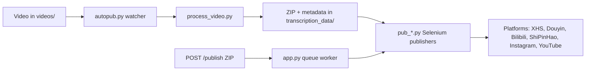

[English](../README.md) · [العربية](README.ar.md) · [Español](README.es.md) · [Français](README.fr.md) · [日本語](README.ja.md) · [한국어](README.ko.md) · [Tiếng Việt](README.vi.md) · [中文 (简体)](README.zh-Hans.md) · [中文（繁體）](README.zh-Hant.md) · [Deutsch](README.de.md) · [Русский](README.ru.md)


[](https://github.com/lachlanchen/lachlanchen/blob/main/figs/banner.png)

# AutoPublish

<p align="center">
  <strong>스크립트 우선, 브라우저 구동 기반의 다중 플랫폼 쇼츠 게시 자동화.</strong><br/>
  <sub>설치, 런타임, 큐 모드, 플랫폼 자동화 워크플로를 위한 표준 운영 매뉴얼입니다.</sub>
</p>

[](#prerequisites)
[](#system-overview)
[](#running-the-tornado-service-apppy)
[](#platform-specific-notes)
[](#running-the-tornado-service-apppy)
[](#pwa-frontend-pwa)
[](https://github.com/sponsors/lachlanchen)
[](#table-of-contents)
[](#license)
[](#configuration)
[](#security--ops-checklist)
[](#raspberry-pi--linux-service-setup)

| 이동 | 링크 |
| --- | --- |
| 처음 시작할 때 | [시작하기](#start-here) |
| 로컬 감시 모드 실행 | [CLI 파이프라인 실행 (`autopub.py`)](#running-the-cli-pipeline-autopubpy) |
| HTTP 큐로 실행 | [Tornado 서비스 실행 (`app.py`)](#running-the-tornado-service-apppy) |
| 서비스로 배포 | [라즈베리 파이 / Linux 서비스 설정](#raspberry-pi--linux-service-setup) |
| 프로젝트 지원 | [지원하기](#support-autopublish) |

짧은 형식의 영상 콘텐츠를 여러 중국/해외 크리에이터 플랫폼으로 배포하기 위한 자동화 도구 모음입니다. 이 프로젝트는 Tornado 기반 서비스, Selenium 자동화 봇, 로컬 파일 감시 워크플로를 결합해 `videos/` 폴더에 파일을 넣으면 최종적으로 XiaoHongShu, Douyin, Bilibili, WeChat Channels(ShiPinHao), Instagram, 필요 시 YouTube로 업로드되는 흐름을 만듭니다.

이 저장소는 의도적으로 저수준 구조를 유지합니다. 대부분의 설정은 Python 파일과 셸 스크립트에 있으며, 이 문서는 설치, 실행, 확장 지점을 정리한 운영 매뉴얼입니다.

> ⚙️ **운영 철학**: 이 프로젝트는 숨겨진 추상화 계층보다 명시적인 스크립트와 직접적인 브라우저 자동화를 우선합니다.
> ✅ **이 README의 원칙**: 기술적 디테일을 우선 보존한 뒤 가독성과 탐색성을 개선합니다.
> 🌍 **현지화 상태 (이 작업 공간에서 2026년 2월 28일 기준 검증)**: `i18n/`에는 현재 아랍어, 독일어, 스페인어, 프랑스어, 일본어, 한국어, 러시아어, 베트남어, 중국어 간체/번체 번역본이 포함됩니다.

### 빠른 탐색

| 원하면 | 이동할 곳 |
| --- | --- |
| 첫 게시를 실행하고 싶다 | [빠른 시작 체크리스트](#quick-start-checklist) |
| 런타임 모드를 비교한다 | [런타임 모드 한눈에 보기](#runtime-modes-at-a-glance) |
| 인증정보와 경로를 구성한다 | [설정](#configuration) |
| API 모드와 큐 작업을 시작한다 | [Tornado 서비스 실행 (`app.py`)](#running-the-tornado-service-apppy) |
| 복붙 가능한 예시로 검증한다 | [예시](#examples) |
| 라즈베리 파이/리눅스에 배치한다 | [라즈베리 파이 / Linux 서비스 설정](#raspberry-pi--linux-service-setup) |

<a id="start-here"></a>
## 시작하기

이 저장소가 처음이라면 다음 순서대로 진행하세요.

1. [사전 준비](#prerequisites)와 [설치](#installation)를 읽습니다.
2. [설정](#configuration)에서 비밀 키와 절대 경로를 구성합니다.
3. [브라우저 세션 준비](#preparing-browser-sessions)로 세션을 만듭니다.
4. [사용법](#usage)에서 운영 모드를 하나 선택합니다: `autopub.py`(감시자) 또는 `app.py`(API 큐).
5. [예시](#examples)에 있는 명령으로 동작을 확인합니다.

<a id="overview"></a>
## 개요

AutoPublish는 현재 두 가지 운영 모드를 제공합니다.

1. **CLI 감시자 모드 (`autopub.py`)**: 폴더 기반 입력 처리 및 게시.
2. **API 큐 모드 (`app.py`)**: HTTP(``/publish``, ``/publish/queue``)를 통한 ZIP 업로드 기반 게시.

이 도구는 추상 오케스트레이션 플랫폼보다 투명한 스크립트 기반 워크플로를 선호하는 운영자를 대상으로 설계되었습니다.

<a id="runtime-modes-at-a-glance"></a>
### 런타임 모드 한눈에 보기

| 모드 | 진입점 | 입력 | 적합한 사용처 | 출력 동작 |
| --- | --- | --- | --- | --- |
| CLI 감시자 | `autopub.py` | `videos/`에 새 파일 | 로컬 운영자 워크플로, cron/service 루프 | 감지된 영상을 처리하고 선택한 플랫폼에 즉시 게시 |
| API 큐 서비스 | `app.py` | `POST /publish`로 ZIP 업로드 | 상위 시스템 연동 및 원격 트리거 | 작업을 큐에 넣고 발행자에서 순차 실행 |

<a id="platform-coverage-snapshot"></a>
### 플랫폼 커버리지 스냅샷

| 플랫폼 | 게시 모듈 | 로그인 헬퍼 | 제어 포트 | CLI 모드 | API 모드 |
| --- | --- | --- | --- | --- | --- |
| XiaoHongShu | `pub_xhs.py` | `login_xiaohongshu.py` | `5003` | ✅ | ✅ |
| Douyin | `pub_douyin.py` | `login_douyin.py` | `5004` | ✅ | ✅ |
| Bilibili | `pub_bilibili.py` | 해당 없음 | `5005` | ✅ | ✅ |
| ShiPinHao (WeChat Channels) | `pub_shipinhao.py` | `login_shipinhao.py` | `5006` | 선택 | ✅ |
| Instagram | `pub_instagram.py` | `login_instagram.py` | `5007` | 선택 | ✅ |
| YouTube | `pub_y2b.py` | 해당 없음 | `9222` | 선택 | ✅ |

<a id="quick-snapshot"></a>
## 빠른 요약

| 항목 | 값 |
| --- | --- |
| 기본 언어 | Python 3.10+ |
| 핵심 런타임 | CLI 감시자 (`autopub.py`) + Tornado 큐 서비스 (`app.py`) |
| 자동화 엔진 | Selenium + 원격 디버깅 Chromium 세션 |
| 입력 형식 | Raw 동영상 (`videos/`) 및 ZIP 번들 (`/publish`) |
| 현재 저장소 경로 | `/home/lachlan/ProjectsLFS/AutoPublish` |
| 권장 사용자 | 다중 플랫폼 쇼츠 파이프라인을 운영하는 크리에이터/운영 엔지니어 |

<a id="operational-safety-snapshot"></a>
### 운영 안전성 요약

| 항목 | 현재 상태 | 조치 |
| --- | --- | --- |
| 하드코딩 경로 | 여러 모듈/스크립트에 존재 | 운영 전 호스트 기준 경로 상수 수정 |
| 브라우저 로그인 상태 | 필수 | 플랫폼별 영속 프로필을 유지 |
| 캡차 처리 | 선택적 연동 가능 | 필요 시 2Captcha/Turing 자격증명 구성 |
| 라이선스 선언 | 최상위 `LICENSE` 파일 없음 | 재배포 전 유지관리자에게 사용 조건 확인 |

<a id="compatibility--assumptions"></a>
### 호환성 및 가정

| 항목 | 이 저장소의 현재 가정 |
| --- | --- |
| Python | 3.10+ |
| 실행 환경 | Chromium이 동작 가능한 GUI가 있는 Linux 데스크톱/서버 |
| 브라우저 제어 방식 | 영구 프로필 디렉터리를 가진 원격 디버깅 세션 |
| 기본 API 포트 | `8081` (`app.py --port`) |
| 처리 백엔드 | `upload_url` + `process_url`이 접근 가능하고 유효한 ZIP 응답을 반환해야 함 |
| 이 초안의 작업 공간 | `/home/lachlan/ProjectsLFS/AutoPublish` |

---

<a id="table-of-contents"></a>
## 목차

- [시작하기](#start-here)
- [개요](#overview)
- [런타임 모드 한눈에 보기](#runtime-modes-at-a-glance)
- [플랫폼 커버리지 스냅샷](#platform-coverage-snapshot)
- [빠른 요약](#quick-snapshot)
- [운영 안전성 요약](#operational-safety-snapshot)
- [호환성 및 가정](#compatibility--assumptions)
- [시스템 개요](#system-overview)
- [기능](#features)
- [프로젝트 구조](#project-structure)
- [저장소 레이아웃](#repository-layout)
- [사전 준비](#prerequisites)
- [설치](#installation)
- [설정](#configuration)
- [설정 검증 체크리스트](#configuration-verification-checklist)
- [브라우저 세션 준비](#preparing-browser-sessions)
- [사용법](#usage)
- [예시](#examples)
- [메타데이터 및 ZIP 형식](#metadata--zip-format)
- [데이터 및 산출물 생명주기](#data--artifact-lifecycle)
- [플랫폼별 참고사항](#platform-specific-notes)
- [라즈베리 파이 / Linux 서비스 설정](#raspberry-pi--linux-service-setup)
- [레거시 macOS 스크립트](#legacy-macos-scripts)
- [문제 해결 및 유지보수](#troubleshooting--maintenance)
- [FAQ](#faq)
- [시스템 확장](#extending-the-system)
- [빠른 시작 체크리스트](#quick-start-checklist)
- [개발 노트](#development-notes)
- [로드맵](#roadmap)
- [기여](#contributing)
- [보안 및 운영 체크리스트](#security--ops-checklist)
- [라이선스](#license)
- [감사의 말](#acknowledgements)
- [프로젝트 지원](#support-autopublish)

---

<a id="system-overview"></a>
## 시스템 개요

🎯 원본 미디어에서 게시된 포스트까지의 **엔드투엔드 흐름**:



작동 흐름 한눈에 보기:

1. **원본 영상 수집**: `videos/` 안에 영상을 넣습니다. 감시자(`autopub.py` 또는 스케줄러/서비스)는 `videos_db.csv`와 `processed.csv`를 기준으로 새 파일을 감지합니다.
2. **자산 생성**: `process_video.VideoProcessor`가 파일을 처리 서버(`upload_url` 및 `process_url`)에 업로드하고 ZIP 패키지를 돌려받습니다. 이 패키지에는 다음이 포함됩니다.
   - 편집/인코딩된 영상 (`<stem>.mp4`)
   - 표지 이미지
   - `{stem}_metadata.json` (현지화된 제목, 설명, 태그 등)
3. **게시 단계**: 메타데이터를 기반으로 `pub_*.py`의 Selenium 게시 모듈이 동작합니다. 각 모듈은 이미 실행 중인 Chromium/Chrome 인스턴스에 원격 디버깅 포트와 영속 사용자 데이터 디렉터리로 붙습니다.
4. **웹 제어면(옵션)**: `app.py`는 `/publish`를 노출해 미리 생성된 ZIP 번들을 수신하고 압축을 풀어 같은 게시 모듈 큐에 등록합니다. 브라우저 세션 갱신 및 로그인 헬퍼(`login_*.py`) 실행도 트리거할 수 있습니다.
5. **지원 모듈**: `load_env.py`는 `~/.bashrc`에서 비밀키를 주입하고, `utils.py`는 창 포커스/QR 처리/메일 유틸리티 보조 함수를 제공하며, `solve_captcha_*.py`는 캡차 발생 시 Turing/2Captcha와 통합합니다.

<a id="features"></a>
## 기능

✨ **실무형 스크립트 우선 자동화**로 설계되었습니다.

- 다중 플랫폼 게시: XiaoHongShu, Douyin, Bilibili, ShiPinHao(WeChat Channels), Instagram, YouTube(선택).
- 두 가지 동작 모드: CLI 감시자 파이프라인 (`autopub.py`) 및 API 큐 서비스 (`app.py` + `/publish` + `/publish/queue`).
- 플랫폼별 임시 비활성화 스위치: `ignore_*` 파일.
- 원격 디버깅 세션 재사용 및 영구 프로필 유지.
- 선택적 QR/캡차 자동화 및 메일 알림 헬퍼.
- 포함된 PWA(`pwa/`) 업로더 UI는 별도 프런트엔드 빌드 불필요.
- Linux/Raspberry Pi 자동화 서비스 스크립트 (`scripts/`).

### 기능 매트릭스

| 기능 | CLI (`autopub.py`) | API (`app.py`) |
| --- | --- | --- |
| 입력 소스 | 로컬 `videos/` 감시 | `POST /publish`로 업로드한 ZIP |
| 큐잉 | 파일 기반 내부 진행 | 인메모리 작업 큐 명시적 사용 |
| 플랫폼 플래그 | CLI 인수 (`--pub-*`) + `ignore_*` | 쿼리 인수 (`publish_*`) + `ignore_*` |
| 적합한 대상 | 단일 호스트 운영 워크플로 | 외부 시스템 연동 및 원격 트리거 |

---

<a id="project-structure"></a>
## 프로젝트 구조

상위 소스/런타임 배치:

```text
AutoPublish/
├── README.md
├── app.py
├── autopub.py
├── process_video.py
├── load_env.py
├── utils.py
├── pub_*.py                  # 플랫폼 게시 모듈
├── login_*.py                # 플랫폼 로그인/세션 헬퍼
├── solve_captcha_*.py
├── smtp.py
├── smtp_test_simple.py
├── send_email_qreader.py
├── requirements.txt
├── requirements.autopub.txt
├── .env.example
├── setup_raspberrypi.md
├── scripts/
├── pwa/
├── figs/
├── .github/FUNDING.yml
├── i18n/                     # 다국어 README
├── videos/                   # 런타임 입력 산출물
├── logs/, logs-autopub/      # 런타임 로그
├── temp/, temp_screenshot/   # 런타임 임시 산출물
├── videos_db.csv
└── processed.csv
```

참고: `transcription_data/`는 실행 시 처리/게시 흐름에서 사용되며, 실행 후에 나타날 수 있습니다.

<a id="repository-layout"></a>
## 저장소 레이아웃

🗂️ **주요 모듈 역할**:

| 경로 | 목적 |
| --- | --- |
| `app.py` | `/publish`와 `/publish/queue`를 노출하는 Tornado 서비스. 내부 게시 큐와 worker 스레드 포함. |
| `autopub.py` | CLI 감시자: `videos/`를 스캔하고 새 파일을 처리한 뒤 게시 모듈을 병렬 호출. |
| `process_video.py` | 영상을 처리 백엔드로 업로드하고 반환된 ZIP 패키지를 저장. |
| `pub_xhs.py`, `pub_douyin.py`, `pub_bilibili.py`, `pub_shipinhao.py`, `pub_instagram.py`, `pub_y2b.py` | 플랫폼별 Selenium 자동화 모듈. |
| `login_xiaohongshu.py`, `login_douyin.py`, `login_shipinhao.py`, `login_instagram.py` | 세션 확인 및 QR 로그인 흐름. |
| `utils.py` | 공유 자동화 헬퍼(창 포커스, QR/메일 보조 도구, 진단 헬퍼). |
| `load_env.py` | 쉘 프로필(`~/.bashrc`)에서 환경 변수를 불러오고 민감 로그를 마스킹. |
| `smtp.py`, `smtp_test_simple.py`, `send_email_qreader.py` | SMTP/SendGrid 헬퍼 및 테스트 스크립트. |
| `solve_captcha_2captcha.py`, `solve_captcha_turing.py` | 캡차 솔버 통합. |
| `scripts/` | Raspberry Pi/Linux 및 레거시 자동화를 위한 서비스 스크립트. |
| `pwa/` | ZIP 미리보기 및 게시 제출용 정적 PWA. |
| `setup_raspberrypi.md` | Raspberry Pi 프로비저닝 단계별 가이드. |
| `.env.example` | 환경 변수 템플릿(자격 증명, 경로, 캡차 키). |
| `.github/FUNDING.yml` | 후원/펀딩 설정. |
| `logs/`, `logs-autopub/`, `temp/`, `temp_screenshot/`, `videos/` | 런타임 산출물 및 로그(대부분 gitignore). |

---

<a id="prerequisites"></a>
## 사전 준비

🧰 **첫 실행 전에 먼저 설치할 항목**:

### 운영 체제 및 도구

- GUI 표시 장치가 있는 Linux 데스크톱/서버 (`DISPLAY=:1`가 제공 스크립트에서 흔함).
- Chromium/Chrome 및 일치하는 ChromeDriver.
- GUI/미디어 보조 도구: `xdotool`, `ffmpeg`, `zip`, `unzip`.
- Python 3.10+ (venv 또는 Conda).

### Python 의존성

필수 최소 런타임:

```bash
pip install selenium tornado requests requests-toolbelt sendgrid qreader opencv-python webdriver-manager
```

저장소 의존성 일치:

```bash
python -m pip install -r requirements.txt
```

경량 서비스 설치(기본적으로 setup 스크립트에서 사용):

```bash
python -m pip install -r requirements.autopub.txt
```

`requirements.autopub.txt`에는 다음이 포함됩니다.
- `selenium`, `webdriver-manager`, `tornado`, `requests`, `requests-toolbelt`, `sendgrid`, `qreader`, `opencv-python`, `numpy`, `pillow`, `twocaptcha`.

### 선택: sudo 사용자 생성

```bash
sudo useradd -m -s /bin/bash -G sudo <USERNAME> && echo "<USERNAME>:<PASSWORD>" | sudo chpasswd
```

---

<a id="installation"></a>
## 설치

🚀 **깨끗한 환경에서의 설치**:

1. 저장소 클론:

```bash
git clone https://github.com/lachlanchen/AutoPublish.git
cd AutoPublish
```

2. 가상 환경 생성 후 활성화(예: `venv`):

```bash
python3 -m venv .venv
source .venv/bin/activate
python -m pip install -U pip
python -m pip install -r requirements.txt
```

3. 환경 변수 준비:

```bash
cp .env.example .env
# 값 입력 (.env는 커밋하지 마세요)
```

4. 쉘 프로필 값 읽기용 스크립트 실행:

```bash
source ~/.bashrc
python load_env.py
```

참고: `load_env.py`는 `~/.bashrc` 기준으로 동작합니다. 환경에서 다른 쉘 프로필을 사용한다면 그에 맞춰 수정하세요.

---

<a id="configuration"></a>
## 설정

🔐 **자격 증명 설정 후, 호스트별 경로를 확인하세요**.

### 환경 변수

이 프로젝트는 환경 변수에서 자격 증명 및 선택적 브라우저/런타임 경로를 읽습니다. `.env.example`에서 시작하세요:

| 변수 | 설명 |
| --- | --- |
| `FROM_EMAIL`, `TO_EMAIL`, `APP_PASSWORD` | QR/로그인 알림용 SMTP 인증 정보. |
| `SENDGRID_API_KEY` | SendGrid API를 사용하는 이메일 흐름용 키. |
| `APIKEY_2CAPTCHA` | 2Captcha API 키. |
| `TULING_USERNAME`, `TULING_PASSWORD`, `TULING_ID` | Turing 캡차 자격 증명. |
| `DOUYIN_LOGIN_PASSWORD` | Douyin 2차 검증 보조값. |
| `INSTAGRAM_*`, `CHROME_*`, `CHROMEDRIVER_PATH` | Instagram/브라우저 드라이버 오버라이드. |
| `AUTOPUBLISH_BROWSER_BIN`, `AUTOPUBLISH_CHROMEDRIVER`, `AUTOPUBLISH_DISPLAY` | `app.py`의 전역 브라우저/드라이버/디스플레이 오버라이드. |

### 경로 상수 (중요)

📌 **가장 흔한 시작 이슈**: 하드코딩된 절대 경로 미해결.

일부 모듈은 여전히 하드코딩 경로를 사용합니다. 호스트에 맞게 수정하세요.

| 파일 | 상수 | 의미 |
| --- | --- | --- |
| `app.py` | `logs_folder_root`, `autopublish_folder_root`, `videos_db_path`, `processed_path`, `transcription_root`, `upload_url`, `process_url`. | API 서비스 루트 및 백엔드 엔드포인트. |
| `autopub.py` | `logs_folder_path`, `autopublish_folder_path`, `videos_db_path`, `processed_path`, `transcription_path`, `upload_url`, `process_url`, `chromedriver_path`. | CLI 감시자 루트 및 백엔드 엔드포인트. |
| `scripts/run_autopub.sh`, `scripts/setup_autopub.sh` | Python/Conda/저장소/로그 경로의 절대 경로 | 레거시/ macOS 지향 래퍼. |
| `utils.py` | 표지 처리 헬퍼의 FFmpeg 경로 가정. | 미디어 도구 경로 호환성. |

저장소 경로 참고:
- 현재 이 작업 공간의 경로는 `/home/lachlan/ProjectsLFS/AutoPublish`입니다.
- 일부 코드/스크립트는 여전히 `/home/lachlan/Projects/auto-publish` 또는 `/Users/lachlan/...`를 참조합니다.
- 프로덕션 사용 전 반드시 경로를 로컬 환경에 맞게 유지하세요.

### `ignore_*`를 통한 플랫폼 토글

🧩 **빠른 안전 스위치**: `ignore_*` 파일 하나를 건드리면 코드 수정 없이 게시를 비활성화할 수 있습니다.

게시 플래그도 ignore 파일로 제어됩니다. 비활성화하려면 빈 파일을 만듭니다.

```bash
touch ignore_xhs ignore_douyin ignore_bilibili ignore_shipinhao ignore_instagram ignore_y2b
```

해당 파일을 지우면 다시 활성화됩니다.

<a id="configuration-verification-checklist"></a>
### 설정 검증 체크리스트

`.env`와 경로 상수 설정 후 빠르게 검증하세요.

```bash
python -c "import os;print('AUTOPUBLISH_BROWSER_BIN=', os.getenv('AUTOPUBLISH_BROWSER_BIN'));print('AUTOPUBLISH_CHROMEDRIVER=', os.getenv('AUTOPUBLISH_CHROMEDRIVER'));print('DISPLAY=', os.getenv('DISPLAY') or os.getenv('AUTOPUBLISH_DISPLAY'))"
python -c "from load_env import load_env_from_bashrc; load_env_from_bashrc(); print('Environment load OK')"
python -c "import os; p=os.getenv('AUTOPUBLISH_CHROMEDRIVER') or os.getenv('CHROMEDRIVER_PATH') or '/usr/bin/chromedriver'; print(p, 'exists=', os.path.exists(p))"
```

어떤 값이 누락되면 게시 실행 전 `.env`, `~/.bashrc`, 또는 스크립트 상수에서 수정하세요.

---

<a id="preparing-browser-sessions"></a>
## 브라우저 세션 준비

🌐 **신뢰성 있는 Selenium 게시를 위해 세션 영속성은 필수**입니다.

1. 플랫폼별 전용 프로필 폴더 생성:

```bash
mkdir -p ~/chromium_dev_session_{5003,5004,5005,5006,5007,9222}
mkdir -p ~/chromium_dev_session_logs
```

2. 원격 디버깅으로 브라우저 세션 시작(예: XiaoHongShu):

```bash
DISPLAY=:1 chromium-browser \
  --remote-debugging-port=5003 \
  --user-data-dir="$HOME/chromium_dev_session_5003" \
  https://creator.xiaohongshu.com/creator/post \
  > "$HOME/chromium_dev_session_logs/chromium_xhs.log" 2>&1 &
```

3. 각 플랫폼/프로필마다 수동으로 로그인.

4. Selenium이 붙는지 확인:

```python
from selenium import webdriver
opts = webdriver.ChromeOptions()
opts.add_experimental_option("debuggerAddress", "127.0.0.1:5003")
driver = webdriver.Chrome(options=opts)
print(driver.title)
driver.quit()
```

보안 참고:
- `app.py`에는 현재 브라우저 재시작 로직에서 하드코딩된 `password = "1"`이 들어가 있습니다. 실제 배포 전 교체하세요.

<a id="usage"></a>
## 사용법

▶️ **두 가지 운영 모드**를 사용할 수 있습니다: CLI 감시자와 API 큐 서비스.

<a id="running-the-cli-pipeline-autopubpy"></a>
### CLI 파이프라인 실행 (`autopub.py`)

1. 감시 디렉터리(`videos/` 또는 설정한 `autopublish_folder_path`)에 소스 영상을 넣습니다.
2. 실행:

```bash
python autopub.py --use-cache --pub-xhs --pub-douyin --pub-bilibili
```

플래그:

| 플래그 | 의미 |
| --- | --- |
| `--pub-xhs`, `--pub-douyin`, `--pub-bilibili` | 게시 대상을 선택한 플랫폼으로 제한. 아무 값도 지정하지 않으면 기본적으로 세 가지가 모두 활성화됩니다. |
| `--test` | 게시기별로 동작이 달라지는 테스트 모드 전달. |
| `--use-cache` | 존재할 경우 기존 `transcription_data/<video>/<video>.zip` 재사용. |

영상당 CLI 흐름:
- `process_video.py`로 업로드/처리.
- `transcription_data/<video>/`에 ZIP을 추출.
- `ThreadPoolExecutor`로 선택된 게시자 실행.
- `videos_db.csv`와 `processed.csv`에 추적 상태를 추가.

<a id="running-the-tornado-service-apppy"></a>
### Tornado 서비스 실행 (`app.py`)

🛰️ **API 모드**는 ZIP 번들을 생성하는 외부 시스템과 유용하게 맞물립니다.

서버 시작:

```bash
python app.py --refresh-time 1800 --port 8081
```

API 엔드포인트 요약:

| 엔드포인트 | 메서드 | 목적 |
| --- | --- | --- |
| `/publish` | `POST` | ZIP 바이트 업로드 후 게시 작업을 큐에 등록 |
| `/publish/queue` | `GET` | 큐 상태, 이력, 게시 상태 조회 |

<a id="post-publish"></a>
### `POST /publish`

📤 **ZIP 바이트를 직접 업로드해 게시 작업을 등록**합니다.

- 헤더: `Content-Type: application/octet-stream`
- 필수 쿼리/폼 인수: `filename` (ZIP 파일명)
- 선택 불리언: `publish_xhs`, `publish_douyin`, `publish_bilibili`, `publish_shipinhao`, `publish_instagram`, `publish_y2b`, `test`
- 바디: 원시 ZIP 바이트

예시:

```bash
curl -X POST "http://localhost:8081/publish?filename=demo.zip&publish_xhs=true&publish_instagram=true&publish_y2b=true" \
  --data-binary @demo.zip \
  -H "Content-Type: application/octet-stream"
```

현재 코드 동작:
- 요청을 수락해 큐에 넣습니다.
- 즉시 `status: queued`, `job_id`, `queue_size`를 포함한 JSON 응답 반환.
- worker 스레드가 큐를 순차 처리합니다.

<a id="get-publish-queue"></a>
### `GET /publish/queue`

📊 **큐 상태 및 진행 중 작업을 확인**합니다.

큐 상태/이력 JSON을 반환합니다.

```bash
curl "http://localhost:8081/publish/queue"
```

응답 필드에는 `status`, `jobs`, `queue_size`, `is_publishing`가 포함됩니다.

<a id="browser-refresh-thread"></a>
### 브라우저 새로고침 스레드

♻️ 주기적 브라우저 새로고침은 장기 가동 시 세션 스테일 실패를 줄여 줍니다.

`app.py`는 `--refresh-time` 간격으로 백그라운드 새로고침 스레드를 실행하고 로그인 검사 훅을 연결합니다. 새로고침 대기 시간에 무작위 지연이 포함됩니다.

<a id="pwa-frontend-pwa"></a>
### PWA 프런트엔드 (`pwa/`)

🖥️ 수동 ZIP 업로드 및 큐 조회용 경량 정적 UI.

정적 UI 실행:

```bash
cd pwa
python -m http.server 5173
```

`http://localhost:5173`을 열고 백엔드 기본 URL을 설정합니다(예: `http://lazyingart:8081`).

PWA 기능:
- 드래그/드롭 ZIP 미리보기.
- 게시 대상 토글 + 테스트 모드.
- `/publish` 전송 및 `/publish/queue` 폴링.

<a id="command-palette"></a>
### 주요 명령 목록

🧷 **가장 자주 쓰는 명령을 한 곳에 모았습니다**.

| 작업 | 명령 |
| --- | --- |
| 전체 의존성 설치 | `python -m pip install -r requirements.txt` |
| 경량 런타임 의존성 설치 | `python -m pip install -r requirements.autopub.txt` |
| 쉘 기반 환경 변수 로드 | `source ~/.bashrc && python load_env.py` |
| API 큐 서버 시작 | `python app.py --refresh-time 1800 --port 8081` |
| CLI 감시 파이프라인 시작 | `python autopub.py --use-cache --pub-xhs --pub-douyin --pub-bilibili` |
| 큐에 ZIP 제출 | `curl -X POST "http://localhost:8081/publish?filename=demo.zip" --data-binary @demo.zip -H "Content-Type: application/octet-stream"` |
| 큐 상태 조회 | `curl -s "http://localhost:8081/publish/queue"` |
| 로컬 PWA 제공 | `cd pwa && python -m http.server 5173` |

---

<a id="examples"></a>
## 예시

🧪 **복사/붙여넣기 가능한 스모크 테스트 명령**:

### 예시 0: 환경 로드 및 API 서버 시작

```bash
source ~/.bashrc
python load_env.py
python app.py --refresh-time 1800 --port 8081
```

### 예시 A: CLI 게시 실행

```bash
python autopub.py --pub-xhs --pub-douyin --use-cache
```

### 예시 B: API 게시 실행(단일 ZIP)

```bash
curl -X POST "http://localhost:8081/publish?filename=my_bundle.zip&publish_bilibili=true&test=true" \
  --data-binary @my_bundle.zip \
  -H "Content-Type: application/octet-stream"
```

### 예시 C: 큐 상태 확인

```bash
curl -s "http://localhost:8081/publish/queue"
```

### 예시 D: SMTP 헬퍼 스모크 테스트

```bash
python smtp.py
python smtp_test_simple.py
```

---

<a id="metadata--zip-format"></a>
## 메타데이터 및 ZIP 형식

📦 **ZIP 계약은 중요합니다**: 파일명과 메타데이터 키를 게시 모듈 기대값과 일치시켜야 합니다.

필수 ZIP 구성:

```text
<stem>_metadata.json
<video_filename>.mp4
<cover_filename>.jpg
```

`metadata`는 CN 게시 모듈이 사용하며, 선택적으로 `metadata["english_version"]`가 YouTube 게시기에 전달됩니다.

모듈에서 일반적으로 사용하는 필드:
- `title`, `brief_description`, `middle_description`, `long_description`
- `tags` (해시태그 목록)
- `video_filename`, `cover_filename`
- 플랫폼별 추가 필드 (`pub_*.py`별로 구현)

ZIP을 외부에서 생성한다면, 키와 파일명을 모듈 기대치와 맞게 유지하세요.

<a id="data--artifact-lifecycle"></a>
## 데이터 및 산출물 생명주기

파이프라인은 운영자가 의도적으로 보존/회전/정리해야 하는 로컬 산출물을 만듭니다:

| 산출물 | 위치 | 생성 주체 | 중요성 |
| --- | --- | --- | --- |
| 입력 영상 | `videos/` | 수동 업로드 또는 상위 동기화 | CLI 감시 모드의 원본 미디어 |
| 처리 ZIP 결과 | `transcription_data/<stem>/<stem>.zip` | `process_video.py` | `--use-cache` 재사용용 |
| 추출 게시 자산 | `transcription_data/<stem>/...` | `autopub.py` / `app.py`의 ZIP 추출 | 게시 모듈용 파일과 메타데이터 |
| 게시 로그 | `logs/`, `logs-autopub/` | CLI/API 런타임 | 실패 분석 및 감사 추적 |
| 브라우저 로그 | `~/chromium_dev_session_logs/*.log` (또는 chrome 접두사) | 브라우저 시작 스크립트 | 세션/포트/시작 이슈 진단 |
| 추적 CSV | `videos_db.csv`, `processed.csv` | CLI 감시자 | 중복 처리 방지 |

운영 권장:
- `transcription_data/`, `temp/`, 오래된 로그를 정기적으로 정리/아카이브해 디스크 압박을 방지하세요.

---

<a id="platform-specific-notes"></a>
## 플랫폼별 참고사항

🧭 각 게시기별 **포트 맵 + 모듈 소유권**:

| 플랫폼 | 포트 | 모듈 | 비고 |
| --- | --- | --- | --- |
| XiaoHongShu | 5003 | `pub_xhs.py`, `login_xiaohongshu.py` | QR 재로그인 흐름. 제목 정리와 해시태그 사용은 메타데이터에서 반영. |
| Douyin | 5004 | `pub_douyin.py`, `login_douyin.py` | 업로드 완료 확인과 재시도 경로가 플랫폼마다 매우 민감; 로그를 면밀히 확인. |
| Bilibili | 5005 | `pub_bilibili.py` | 캡차 훅은 `solve_captcha_2captcha.py`, `solve_captcha_turing.py` 사용 가능. |
| ShiPinHao (WeChat Channels) | 5006 | `pub_shipinhao.py`, `login_shipinhao.py` | 세션 갱신 신뢰도를 위해 빠른 QR 승인 필요. |
| Instagram | 5007 | `pub_instagram.py`, `login_instagram.py` | API 모드에서 `publish_instagram=true`로 제어; `.env.example`에서 관련 env 사용 가능. |
| YouTube | 9222 | `pub_y2b.py` | `english_version` 메타데이터 블록 사용; `ignore_y2b`로 비활성화. |

<a id="raspberry-pi--linux-service-setup"></a>
## 라즈베리 파이 / Linux 서비스 설정

🐧 **항상 켜 둬야 하는 호스트에 권장**합니다.

전체 부트스트랩은 [`setup_raspberrypi.md`](setup_raspberrypi.md)를 따르세요.

간단한 파이프라인 설정:

```bash
export AUTOPUB_USER=<USERNAME>
export AUTOPUB_REPO=/home/<USERNAME>/Projects/autopub
sudo -E ./scripts/setup_autopub_pipeline.sh
```

이 스크립트는 다음을 순서대로 실행합니다.
- `scripts/setup_envs.sh`
- `scripts/setup_virtual_desktop_service.sh`
- `scripts/download_and_setup_driver.sh`
- `scripts/setup_autopub_service.sh`

tmux에서 서비스를 수동 실행:

```bash
./scripts/start_autopub_tmux.sh
```

서비스/포트 확인:

```bash
systemctl status autopub.service autopub-vnc.service
sudo ss -ltnp | grep 590
```

호환성 참고:
- 일부 구 문서/스크립트는 여전히 `virtual-desktop.service`를 참조합니다. 현재 저장소의 setup 스크립트는 `autopub-vnc.service`를 설치합니다.

<a id="legacy-macos-scripts"></a>
## 레거시 macOS 스크립트

🍎 과거 로컬 환경 호환성을 위해 레거시 래퍼가 남아 있습니다.

저장소에는 여전히 레거시 macOS 중심 래퍼가 포함되어 있습니다.
- `scripts/run_autopub.sh`
- `scripts/setup_autopub.sh`

이 파일들은 절대 경로(`/Users/lachlan/...`)와 Conda 가정을 포함합니다. 해당 워크플로를 쓰는 경우 유지하되 경로/venv/도구 설정을 호스트 맞게 바꾸세요.

<a id="troubleshooting--maintenance"></a>
## 문제 해결 및 유지보수

🛠️ **문제가 발생하면 여기부터 확인**하세요.

- **머신 간 경로 이동**: 오류 메시지에 `/Users/lachlan/...` 또는 `/home/lachlan/Projects/auto-publish`가 있으면 상수 경로를 `/home/lachlan/ProjectsLFS/AutoPublish`로 맞추세요.
- **비밀키 위생**: 푸시 전 `~/.local/bin/detect-secrets scan`을 실행. 유출된 자격 증명은 즉시 회수.
- **처리 백엔드 오류**: `process_video.py`에서 "Failed to get the uploaded file path"가 보이면 업로드 응답 JSON에 `file_path`가 있는지, 처리 엔드포인트가 ZIP 바이트를 반환하는지 확인.
- **ChromeDriver 불일치**: DevTools 연결 오류가 발생하면 Chrome/Chromium과 드라이버 버전을 맞추거나 `webdriver-manager`로 전환.
- **브라우저 포커스 문제**: `bring_to_front`는 창 제목 매칭에 의존합니다(브라우저 제목 차이로 깨질 수 있음).
- **캡차 개입**: 2Captcha/Turing 자격 증명을 구성하고 필요한 곳에서 솔버 출력을 연동.
- **오래된 락 파일**: 스케줄 실행이 시작되지 않으면 프로세스 상태를 확인하고 `autopub.lock`을 제거(레거시 흐름).
- **확인할 로그**: `logs/`, `logs-autopub/`, `~/chromium_dev_session_logs/*.log`, 서비스 journal 로그.

<a id="faq"></a>
## 자주 묻는 질문

**Q: API 모드와 CLI 감시 모드를 동시에 실행할 수 있나요?**  
A: 가능하지만 입력과 브라우저 세션을 분리하지 않으면 권장되지 않습니다. 두 모드가 동일 게시기, 파일, 포트를 경합할 수 있습니다.

**Q: `/publish`가 queued라고 뜨는데 게시가 안 보입니다.**  
A: `app.py`는 먼저 작업을 큐에 넣고, worker가 백그라운드에서 순차 실행합니다. `/publish/queue`, `is_publishing`, 서비스 로그를 확인하세요.

**Q: 이미 `.env`를 쓰고 있는데 `load_env.py`가 꼭 필요한가요?**  
A: `start_autopub_tmux.sh`는 `.env`가 있으면 로드하고, 일부 직접 실행은 쉘 환경을 사용합니다. `.env`와 쉘 내보내기 값을 일치시키면 예기치 않은 동작을 줄일 수 있습니다.

**Q: API 업로드의 최소 ZIP 조건은 무엇인가요?**  
A: 유효한 ZIP에 `{stem}_metadata.json`와 메타데이터 키와 일치하는 비디오/커버 파일명(`video_filename`, `cover_filename`)이 있어야 합니다.

**Q: headless 모드가 지원되나요?**  
A: 일부 모듈에 관련 변수는 있지만, 본 저장소의 주 운영 모드는 영속 프로필이 있는 GUI 기반 브라우저 세션입니다.

<a id="extending-the-system"></a>
## 시스템 확장

🧱 **새 플랫폼 추가 및 안전성 개선 확장 포인트**:

- **새 플랫폼 추가**: `pub_*.py`를 복제하고 셀렉터/흐름을 업데이트한 뒤, 필요 시 `login_*.py`를 추가하고 `app.py`와 `autopub.py`에서 플래그·큐 핸들링을 연결하세요.
- **설정 추상화**: 산재한 상수를 구조화된 설정(`config.yaml`/`.env` + 타입 모델)로 이동해 다중 호스트 운영을 개선.
- **자격 증명 하드닝**: 코드 내 하드코딩/셸 노출 민감 흐름을 `sudo -A`, keychain, vault/secret manager 등으로 교체.
- **컨테이너화**: Chromium/ChromeDriver, Python 런타임, 가상 디스플레이를 하나의 배포 단위로 패키징해 클라우드/서버에서 사용.

<a id="quick-start-checklist"></a>
## 빠른 시작 체크리스트

✅ **첫 게시 성공까지의 최소 경로**.

1. 저장소를 클론하고 의존성 설치(`pip install -r requirements.txt` 또는 경량 `requirements.autopub.txt`).
2. `app.py`, `autopub.py`, 실행할 스크립트의 하드코딩 경로 상수 수정.
3. `.env` 또는 쉘 프로필에서 필수 인증정보를 내보내고 `python load_env.py`로 로딩 확인.
4. 각 플랫폼별 원격 디버깅 브라우저 프로필 폴더를 만들고 세션을 한번 실행.
5. 대상 플랫폼별로 수동 로그인 수행.
6. API 모드(`python app.py --port 8081`) 또는 CLI 모드(`python autopub.py --use-cache ...`) 중 하나 시작.
7. 샘플 ZIP(API) 또는 샘플 영상 파일(CLI) 하나를 제출하고 `logs/` 확인.
8. 푸시 전 비밀 검사 수행.

<a id="development-notes"></a>
## 개발 노트

🧬 **현재 개발 기준선**: 수동 정렬 + 스모크 테스트.

- Python 스타일은 기존 4칸 들여쓰기와 수동 포맷팅을 따름.
- 공식 자동 테스트 스위트는 없으므로 스모크 테스트 의존:
  - `autopub.py`에서 샘플 영상 하나 처리
  - `/publish`에 ZIP 하나 전송 후 `/publish/queue` 모니터링
  - 각 대상 플랫폼 수동 검증
- 새 스크립트 추가 시 빠른 로컬 실행을 위한 `if __name__ == "__main__":` 엔트리포인트를 포함하세요.
- 플랫폼 변경은 가능한 한 격리해 적용 (`pub_*`, `login_*`, `ignore_*` 토글).
- 런타임 산출물(`videos/*`, `logs*/*`, `transcription_data/*`, `ignore_*`)은 로컬 사용 전제이며 대부분 gitignore.

<a id="roadmap"></a>
## 로드맵

🗺️ **현재 코드 제약에서 반영된 우선 개선 항목**.

현재 코드 구조와 기록을 기준으로 한 계획/요구사항:

1. 산재한 하드코딩 경로를 중앙 설정(`.env`/YAML + 타입 모델)으로 대체.
2. 하드코딩된 sudo 비밀번호 패턴을 제거하고 더 안전한 프로세스 제어로 이전.
3. 플랫폼별 UI 상태 판별을 강화한 재시도 및 안정성 개선.
4. 플랫폼 지원 확대(예: Kuaishou 등 다른 크리에이터 플랫폼).
5. 재현 가능한 배포 단위(컨테이너 + 가상 디스플이브 프로파일)로 런타임 패키징.
6. ZIP 계약 검증 및 큐 실행을 검증하는 자동 통합 점검 추가.

<a id="contributing"></a>
## 기여

🤝 PR은 목적이 분명하고, 재현 가능하며, 런타임 가정을 명확히 기술해 주세요.

기여를 환영합니다.

1. Fork 후 포커스 브랜치 생성.
2. 커밋은 작게, 동사형으로 작성(예: “Wait for YouTube checks before publishing”).
3. PR에는 수동 검증 노트 포함:
   - 환경 가정
   - 브라우저/세션 재시작
   - UI 흐름 변경 시 관련 로그/스크린샷
4. 실제 비밀값은 절대 커밋하지 마세요(`.env`는 무시됨; 형태 확인은 `.env.example` 사용).

새 게시 모듈을 추가할 때는 다음을 모두 연동하세요.
- `pub_<platform>.py`
- 선택적 `login_<platform>.py`
- `app.py`의 API 플래그 및 큐 처리
- 필요 시 `autopub.py`의 CLI 연동
- `ignore_<platform>` 토글 처리
- README 업데이트

<a id="security--ops-checklist"></a>
## 보안 및 운영 체크리스트

운영 유사 상태로 실행하기 전:

1. `.env`가 로컬에 있고 Git 추적되지 않는지 확인.
2. 과거에 커밋된 정황이 있는 자격 증명 회수/교체.
3. 코드 내 플레이스홀더 민감값 교체(예: `app.py`의 sudo 비밀번호 플레이스홀더).
4. 일괄 실행 전 `ignore_*` 스위치가 의도대로 설정되었는지 확인.
5. 플랫폼별 브라우저 프로필이 분리되어 있는지, 최소권한 계정인지 확인.
6. 로그에 비밀값이 노출되지 않는지 점검 후 이슈 공유.
7. 푸시 전에 `detect-secrets`(또는 동등한 도구) 실행.

<a id="support-autopublish"></a>
## ❤️ Support

| Donate | PayPal | Stripe |
|---|---|---|
| [](https://chat.lazying.art/donate) | [](https://paypal.me/RongzhouChen) | [](https://buy.stripe.com/aFadR8gIaflgfQV6T4fw400) |

💖 커뮤니티 후원은 인프라 운영비, 안정성 작업, 새 플랫폼 통합에 직접적으로 쓰입니다.

AutoPublish는 다중 플랫폼 크리에이터 도구를 오픈이고 수정 가능한 형태로 유지하려는 큰 노력의 일부입니다. 기부금은 다음에 도움을 줍니다.

- Selenium 인프라, 처리 API, 클라우드 GPU 운영 지속.
- 새 플랫폼 게시 모듈(예: Kuaishou, Instagram Reels) 추가 및 기존 봇의 안정성 개선.
- 독립 크리에이터를 위한 문서, 시작용 데이터셋, 튜토리얼 확장.

### 추가 후원 수단

<div align="center">
<table style="margin:0 auto; text-align:center; border-collapse:collapse;">
  <tr>
    <td style="text-align:center; vertical-align:middle; padding:6px 12px;">
      <a href="https://chat.lazying.art/donate">https://chat.lazying.art/donate</a>
    </td>
    <td style="text-align:center; vertical-align:middle; padding:6px 12px;">
      <a href="https://chat.lazying.art/donate"></a>
    </td>
  </tr>
  <tr>
    <td style="text-align:center; vertical-align:middle; padding:6px 12px;">
      <a href="https://paypal.me/RongzhouChen">
        
      </a>
    </td>
    <td style="text-align:center; vertical-align:middle; padding:6px 12px;">
      <a href="https://buy.stripe.com/aFadR8gIaflgfQV6T4fw400">
        
      </a>
    </td>
  </tr>
  <tr>
    <td style="text-align:center; vertical-align:middle; padding:6px 12px;"><strong>WeChat</strong></td>
    <td style="text-align:center; vertical-align:middle; padding:6px 12px;"><strong>Alipay</strong></td>
  </tr>
  <tr>
    <td style="text-align:center; vertical-align:middle; padding:6px 12px;"></td>
    <td style="text-align:center; vertical-align:middle; padding:6px 12px;"></td>
  </tr>
</table>
</div>

**후원 / Donate**

- 후원은 크리에이터 자동화 연구, 개발, 운영 비용을 지탱하는 큰 힘이 됩니다.
- 여러분의 지원은 서버와 연구개발 비용으로 쓰여 다중 플랫폼 게시 도구의 지속적인 공개 개선을 가능하게 합니다.
- 지속적인 후원으로 더 많은 독립 스튜디오가 번거로움 없이 모든 플랫폼에 게시할 수 있습니다.

다음 경로도 이용 가능합니다.
- GitHub Sponsors: <https://github.com/sponsors/lachlanchen>
- 프로젝트 링크: <https://lazying.art>, <https://chat.lazying.art>, <https://onlyideas.art>

---

<a id="license"></a>
## 라이선스

현재 이 저장소 스냅샷에는 `LICENSE` 파일이 없습니다.

이 초안의 가정:
- 유지관리자가 명시적 라이선스 파일을 추가할 때까지 사용 및 재배포 조건을 미정으로 봅니다.

권장 다음 단계:
- 최상위에 `LICENSE`를 추가하고(예: MIT/Apache-2.0/GPL-3.0) 해당 섹션을 업데이트하세요.

> 📝 라이선스 파일이 추가되기 전까지 상업/내부 재배포 가정은 미확정이며, 유지관리자에게 직접 확인하세요.

---

<a id="acknowledgements"></a>
## 감사

- 유지관리자/후원자 프로필: [@lachlanchen](https://github.com/lachlanchen)
- 펀딩 설정 소스: [`.github/FUNDING.yml`](.github/FUNDING.yml)
- 저장소에서 참조하는 생태계 서비스: Selenium, Tornado, SendGrid, 2Captcha, Turing captcha API.
