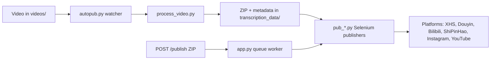

[English](../README.md) · [العربية](README.ar.md) · [Español](README.es.md) · [Français](README.fr.md) · [日本語](README.ja.md) · [한국어](README.ko.md) · [Tiếng Việt](README.vi.md) · [中文 (简体)](README.zh-Hans.md) · [中文（繁體）](README.zh-Hant.md) · [Deutsch](README.de.md) · [Русский](README.ru.md)


[](https://github.com/lachlanchen/lachlanchen/blob/main/figs/banner.png)

# AutoPublish

<p align="center">
  <strong>Автоматизация публикации коротких видео для нескольких платформ с акцентом на скрипты и управление через браузер.</strong><br/>
  <sub>Единое операционное руководство по настройке, запуску, очереди и рабочим процессам автоматизации платформ.</sub>
</p>

[](#prerequisites)
[](#system-overview)
[](#running-the-tornado-service-apppy)
[](#platform-specific-notes)
[](#running-the-tornado-service-apppy)
[](#pwa-frontend-pwa)
[](https://github.com/sponsors/lachlanchen)
[](#table-of-contents)
[](#license)
[](#configuration)
[](#security--ops-checklist)
[](#raspberry-pi--linux-service-setup)

| Перейти | Ссылка |
| --- | --- |
| Первый запуск | [Начните здесь](#start-here) |
| Запуск через локальный watcher | [CLI pipeline (`autopub.py`)](#running-the-cli-pipeline-autopubpy) |
| Запуск через HTTP-очередь | [Запуск Tornado сервиса (`app.py`)](#running-the-tornado-service-apppy) |
| Поднять как сервис | [Настройка Raspberry Pi / Linux Service](#raspberry-pi--linux-service-setup) |
| Поддержка проекта | [Поддержать](#support-autopublish) |

Инструментарий для автоматической публикации короткого видео на несколько китайских и международных платформ для авторов. Проект сочетает сервис на Tornado, Selenium-боты и локальный workflow по наблюдению за каталогом, чтобы добавление видео в папку приводило к его публикации на XiaoHongShu, Douyin, Bilibili, WeChat Channels (ShiPinHao), Instagram и при необходимости YouTube.

Репозиторий намеренно остается низкоуровневым: основная конфигурация находится в Python-файлах и shell-скриптах. Этот документ — операционное руководство по установке, запуску и расширению.

> ⚙️ **Операционная философия**: этот проект отдает приоритет явным скриптам и прямой автоматизации браузера вместо скрытых абстракций.
> ✅ **Канон для этого README**: сохранить технические детали, затем повысить удобство чтения и находчивость.
> 🌍 **Статус локализации (проверено в рабочем пространстве на 2026-02-28)**: в `i18n/` сейчас есть версии Arabic, German, Spanish, French, Japanese, Korean, Russian, Vietnamese, Simplified Chinese и Traditional Chinese.

### Быстрая навигация

| Я хочу... | Перейти |
| --- | --- |
| Сделать первую публикацию | [Чеклист быстрого старта](#quick-start-checklist) |
| Сравнить режимы запуска | [Режимы запуска за одну страницу](#runtime-modes-at-a-glance) |
| Настроить секреты и пути | [Configuration](#configuration) |
| Запустить API и очередь | [Запуск Tornado сервиса (`app.py`)](#running-the-tornado-service-apppy) |
| Проверить командами | [Примеры](#examples) |
| Настроить на Raspberry Pi/Linux | [Настройка Raspberry Pi / Linux Service](#raspberry-pi--linux-service-setup) |

## <a id="start-here"></a> Начало работы

Если вы впервые в этом репозитории, действуйте в такой последовательности:

1. Прочитайте [Prerequisites](#prerequisites) и [Installation](#installation).
2. Настройте секреты и абсолютные пути в [Configuration](#configuration).
3. Подготовьте браузерные сессии в [Preparing Browser Sessions](#preparing-browser-sessions).
4. Выберите режим запуска в [Usage](#usage): `autopub.py` (watcher) или `app.py` (API queue).
5. Протестируйте с командами из [Examples](#examples).

## <a id="overview"></a> Обзор

AutoPublish на данный момент поддерживает два рабочих режима:

1. **CLI watcher mode (`autopub.py`)** для приёма файлов из папки и публикации.
2. **API queue mode (`app.py`)** для публикации ZIP через HTTP (`/publish`, `/publish/queue`).

Решение ориентировано на операторов, которым нужны прозрачные скриптовые процессы вместо абстрактных оркестраторов.

### <a id="runtime-modes-at-a-glance"></a> Режимы запуска с одного взгляда

| Режим | Точка входа | Входные данные | Лучшее применение | Поведение вывода |
| --- | --- | --- | --- | --- |
| CLI watcher | `autopub.py` | Файлы, помещённые в `videos/` | Локальные рабочие процессы оператора и cron/service циклы | Обрабатывает найденные видео и сразу публикует на выбранные платформы |
| API queue service | `app.py` | ZIP-загрузка в `POST /publish` | Интеграции с апстрим-системами и удалённым триггером | Принимает задания, ставит их в очередь и выполняет публикацию в порядке очереди worker |

### <a id="platform-coverage-snapshot"></a> Поддерживаемые платформы

| Платформа | Модуль публикации | Помощник входа | Порт управления | Режим CLI | Режим API |
| --- | --- | --- | --- | --- | --- |
| XiaoHongShu | `pub_xhs.py` | `login_xiaohongshu.py` | `5003` | ✅ | ✅ |
| Douyin | `pub_douyin.py` | `login_douyin.py` | `5004` | ✅ | ✅ |
| Bilibili | `pub_bilibili.py` | N/A | `5005` | ✅ | ✅ |
| ShiPinHao (WeChat Channels) | `pub_shipinhao.py` | `login_shipinhao.py` | `5006` | Optional | ✅ |
| Instagram | `pub_instagram.py` | `login_instagram.py` | `5007` | Optional | ✅ |
| YouTube | `pub_y2b.py` | N/A | `9222` | Optional | ✅ |

### <a id="quick-snapshot"></a> Краткий срез

| Параметр | Значение |
| --- | --- |
| Основной язык | Python 3.10+ |
| Основные среды | CLI watcher (`autopub.py`) + Tornado queue service (`app.py`) |
| Ядро автоматизации | Selenium + remote-debug Chromium session |
| Форматы входа | Исходные видео (`videos/`) и ZIP-пакеты (`/publish`) |
| Текущий путь репозитория | `/home/lachlan/ProjectsLFS/AutoPublish` |
| Целевая аудитория | Создатели и ops-инженеры, управляющие мультиплатформенными short-video пайплайнами |

### <a id="operational-safety-snapshot"></a> Снимок по операционной безопасности

| Тема | Текущее состояние | Действие |
| --- | --- | --- |
| Жёстко зафиксированные пути | Присутствуют в нескольких модулях/скриптах | Обновите константы путей под хост перед продакшн-запуском |
| Состояние сессии в браузере | Обязательно | Храните постоянные remote-debug профили по платформам |
| Обработка captcha | Доступны optional-интеграции | Настройте учётные данные 2Captcha/Turing при необходимости |
| Лицензия | Файл `LICENSE` на верхнем уровне не найден | Согласуйте условия использования с мейнтейнером перед переиспользованием |

### <a id="compatibility--assumptions"></a> Совместимость и допущения

| Пункт | Текущее допущение в репозитории |
| --- | --- |
| Python | 3.10+ |
| Среда выполнения | Linux desktop/server с доступным GUI для Chromium |
| Режим управления браузером | Сессии remote-debug с сохранёнными директориями профилей |
| Основной API-порт | `8081` (`app.py --port`) |
| Бэкенд обработки | `upload_url` + `process_url` должны быть доступны и возвращать корректный ZIP |
| Рабочий путь для этого черновика | `/home/lachlan/ProjectsLFS/AutoPublish` |

---

## <a id="table-of-contents"></a> Оглавление

- [Start Here](#start-here)
- [Overview](#overview)
- [Runtime Modes at a Glance](#runtime-modes-at-a-glance)
- [Platform Coverage Snapshot](#platform-coverage-snapshot)
- [Quick Snapshot](#quick-snapshot)
- [Operational Safety Snapshot](#operational-safety-snapshot)
- [Compatibility & Assumptions](#compatibility--assumptions)
- [System Overview](#system-overview)
- [Features](#features)
- [Project Structure](#project-structure)
- [Repository Layout](#repository-layout)
- [Prerequisites](#prerequisites)
- [Installation](#installation)
- [Configuration](#configuration)
- [Configuration Verification Checklist](#configuration-verification-checklist)
- [Preparing Browser Sessions](#preparing-browser-sessions)
- [Usage](#usage)
- [Examples](#examples)
- [Metadata & ZIP Format](#metadata--zip-format)
- [Data & Artifact Lifecycle](#data--artifact-lifecycle)
- [Platform-Specific Notes](#platform-specific-notes)
- [Raspberry Pi / Linux Service Setup](#raspberry-pi--linux-service-setup)
- [Legacy macOS Scripts](#legacy-macos-scripts)
- [Troubleshooting & Maintenance](#troubleshooting--maintenance)
- [FAQ](#faq)
- [Extending the System](#extending-the-system)
- [Quick Start Checklist](#quick-start-checklist)
- [Development Notes](#development-notes)
- [Roadmap](#roadmap)
- [Contributing](#contributing)
- [Security & Ops Checklist](#security--ops-checklist)
- [License](#license)
- [Acknowledgements](#acknowledgements)
- [Support](#support-autopublish)

---

## <a id="system-overview"></a> Обзор системы

🎯 **Полный путь** от сырого медиа до опубликованных постов:



Схема в двух словах:

1. **Приём исходного материала**: разместите видео в `videos/`. Сборщик (`autopub.py` или планировщик/сервис) обнаруживает новые файлы через `videos_db.csv` и `processed.csv`.
2. **Подготовка ассетов**: `process_video.VideoProcessor` отправляет файл на сервер обработки контента (`upload_url` и `process_url`), который возвращает ZIP-пакет с:
   - отредактированным/перекодированным видео (`<stem>.mp4`),
   - обложкой,
   - `{stem}_metadata.json` с локализованными заголовками, описаниями, тегами и т. д.
3. **Публикация**: метаданные управляют Selenium-публикаторами в `pub_*.py`. Каждый публикатор подключается к уже запущенному Chromium/Chrome через remote-debugging port и постоянные каталоги пользовательских данных.
4. **Веб-плоскость управления (необязательно)**: `app.py` открывает `/publish`, принимает заранее собранные ZIP-пакеты, распаковывает их и отправляет задачи публикации тем же публикаторам. Он также может перезапускать browser sessions и вызывать login helpers (`login_*.py`).
5. **Вспомогательные модули**: `load_env.py` подгружает секреты из `~/.bashrc`, `utils.py` предоставляет утилиты (фокус окна, работа с QR, почтовые helpers), а `solve_captcha_*.py` интегрируются с Turing/2Captcha при появлении captcha.

## <a id="features"></a> Возможности

✨ **Сделано для прагматичной script-first автоматизации**:

- Мультиплатформенная публикация: XiaoHongShu, Douyin, Bilibili, ShiPinHao (WeChat Channels), Instagram, YouTube (опционально).
- Два режима работы: pipeline с watcher (`autopub.py`) и API queue service (`app.py` + `/publish` + `/publish/queue`).
- Временное отключение платформ через файлы `ignore_*`.
- Повторное использование браузерных сессий через remote-debug с постоянными профилями.
- Опциональная автоматизация QR/captcha и почтовые уведомления.
- PWA (`pwa/`) не требует отдельной сборки frontend.
- Скрипты для Linux/Raspberry Pi под настройку сервиса (`scripts/`).

### <a id="feature-matrix"></a> Матрица возможностей

| Возможность | CLI (`autopub.py`) | API (`app.py`) |
| --- | --- | --- |
| Источник входа | Локальный watcher `videos/` | Загруженный ZIP через `POST /publish` |
| Очередь | Прогон по файлам на уровне внутреннего состояния | Явная in-memory очередь заданий |
| Флаги платформ | CLI args (`--pub-*`) + `ignore_*` | Query args (`publish_*`) + `ignore_*` |
| Лучший сценарий | Локальный workflow оператора | Внешние системы и удалённый триггер |

---

## <a id="project-structure"></a> Структура проекта

Высокоуровневая структура исходников и runtime:

```text
AutoPublish/
├── README.md
├── app.py
├── autopub.py
├── process_video.py
├── load_env.py
├── utils.py
├── pub_*.py                  # platform publishers
├── login_*.py                # platform login/session helpers
├── solve_captcha_*.py
├── smtp.py
├── smtp_test_simple.py
├── send_email_qreader.py
├── requirements.txt
├── requirements.autopub.txt
├── .env.example
├── setup_raspberrypi.md
├── scripts/
├── pwa/
├── figs/
├── .github/FUNDING.yml
├── i18n/                     # multilingual READMEs
├── videos/                   # runtime input artifacts
├── logs/, logs-autopub/      # runtime logs
├── temp/, temp_screenshot/   # runtime temp artifacts
├── videos_db.csv
└── processed.csv
```

Примечание: `transcription_data/` используется во время обработки и публикации и может появиться после запуска.

## <a id="repository-layout"></a> Layout репозитория

🗂️ **Ключевые модули и их назначение**:

| Path | Назначение |
| --- | --- |
| `app.py` | Tornado-сервис с `/publish` и `/publish/queue`, встроенной очередью и worker thread. |
| `autopub.py` | CLI watcher: сканирует `videos/`, обрабатывает новые файлы и вызывает publisher-ы параллельно. |
| `process_video.py` | Загружает видео в backend обработки и сохраняет возвращённые ZIP-пакеты. |
| `pub_xhs.py`, `pub_douyin.py`, `pub_bilibili.py`, `pub_shipinhao.py`, `pub_instagram.py`, `pub_y2b.py` | Модули Selenium для каждой платформы. |
| `login_xiaohongshu.py`, `login_douyin.py`, `login_shipinhao.py`, `login_instagram.py` | Проверки сессии и QR-потоки входа. |
| `utils.py` | Общие помощники автоматизации (фокус окна, QR/mail helpers, диагностические helpers). |
| `load_env.py` | Загружает env vars из shell-профиля (`~/.bashrc`) и маскирует чувствительные логи. |
| `smtp.py`, `smtp_test_simple.py`, `send_email_qreader.py` | SMTP/SendGrid helper и тестовые скрипты. |
| `solve_captcha_2captcha.py`, `solve_captcha_turing.py` | Интеграции с captcha solver-ами. |
| `scripts/` | Скрипты развертывания и операций сервиса (Raspberry Pi/Linux + legacy automation). |
| `pwa/` | Статический PWA для предпросмотра ZIP и отправки на публикацию. |
| `setup_raspberrypi.md` | Пошаговое руководство по подготовке Raspberry Pi. |
| `.env.example` | Шаблон переменных окружения (credentials, пути, captcha keys). |
| `.github/FUNDING.yml` | Конфигурация спонсорства/фандрайзинга. |
| `logs/`, `logs-autopub/`, `temp/`, `temp_screenshot/`, `videos/` | Артефакты рантайма и логи (многие игнорируются git). |

---

## <a id="prerequisites"></a> Требования

🧰 **Установите это перед первым запуском**.

### <a id="operating-system-and-tools"></a> Операционная система и инструменты

- Linux desktop/server с X session (`DISPLAY=:1` обычно используется в скриптах).
- Chromium/Chrome и соответствующий ChromeDriver.
- GUI/media утилиты: `xdotool`, `ffmpeg`, `zip`, `unzip`.
- Python 3.10+ (venv или Conda).

### <a id="python-dependencies"></a> Зависимости Python

Минимальный runtime-набор:

```bash
pip install selenium tornado requests requests-toolbelt sendgrid qreader opencv-python webdriver-manager
```

Соответствие репозиторию:

```bash
python -m pip install -r requirements.txt
```

Для облегчённой установки сервиса (по умолчанию используется setup скриптами):

```bash
python -m pip install -r requirements.autopub.txt
```

`requirements.autopub.txt` содержит:
- `selenium`, `webdriver-manager`, `tornado`, `requests`, `requests-toolbelt`, `sendgrid`, `qreader`, `opencv-python`, `numpy`, `pillow`, `twocaptcha`.

### <a id="optional-create-a-sudo-user"></a> Опционально: создать пользователя с sudo

```bash
sudo useradd -m -s /bin/bash -G sudo <USERNAME> && echo "<USERNAME>:<PASSWORD>" | sudo chpasswd
```

---

## <a id="installation"></a> Установка

🚀 **Настройка на чистой машине**:

1. Клонируйте репозиторий:

```bash
git clone https://github.com/lachlanchen/AutoPublish.git
cd AutoPublish
```

2. Создайте и активируйте окружение (пример с `venv`):

```bash
python3 -m venv .venv
source .venv/bin/activate
python -m pip install -U pip
python -m pip install -r requirements.txt
```

3. Подготовьте переменные окружения:

```bash
cp .env.example .env
# fill values in .env (do not commit)
```

4. Подгрузите переменные для скриптов, которые читают shell profile:

```bash
source ~/.bashrc
python load_env.py
```

Примечание: `load_env.py` ориентирован на `~/.bashrc`; если у вас другой shell-профиль, адаптируйте его соответственно.

---

## <a id="configuration"></a> Конфигурация

🔐 **Сначала задайте credentials, затем проверьте host-специфичные пути**.

### <a id="environment-variables"></a> Переменные окружения

Проект ожидает credentials и optional browser/runtime пути из env. Начинайте с `.env.example`:

| Переменная | Описание |
| --- | --- |
| `FROM_EMAIL`, `TO_EMAIL`, `APP_PASSWORD` | SMTP credentials для QR/login уведомлений. |
| `SENDGRID_API_KEY` | Ключ SendGrid для email flow, где используются SendGrid API. |
| `APIKEY_2CAPTCHA` | API-ключ для 2Captcha. |
| `TULING_USERNAME`, `TULING_PASSWORD`, `TULING_ID` | Учетные данные Turing captcha. |
| `DOUYIN_LOGIN_PASSWORD` | Вспомогательный пароль/код для второй проверки Douyin. |
| `INSTAGRAM_*`, `CHROME_*`, `CHROMEDRIVER_PATH` | Переопределения для Instagram/browser драйвера. |
| `AUTOPUBLISH_BROWSER_BIN`, `AUTOPUBLISH_CHROMEDRIVER`, `AUTOPUBLISH_DISPLAY` | Глобальные override для браузера/драйвера/дисплея в `app.py`. |

### <a id="path-constants-important"></a> Константы путей (важно)

📌 **Чаще всего проблема на старте** — неразрешённые или неверные абсолютные пути.

В нескольких модулях остаются hard-coded paths. Обновите их под ваш хост:

| Файл | Константа(ы) | Назначение |
| --- | --- | --- |
| `app.py` | `logs_folder_root`, `autopublish_folder_root`, `videos_db_path`, `processed_path`, `transcription_root`, `upload_url`, `process_url`. | Корни API-сервиса и backend-endpoint-ов. |
| `autopub.py` | `logs_folder_path`, `autopublish_folder_path`, `videos_db_path`, `processed_path`, `transcription_path`, `upload_url`, `process_url`, `chromedriver_path`. | Корни CLI watcher и backend-endpoint-ов. |
| `scripts/run_autopub.sh`, `scripts/setup_autopub.sh` | Абсолютные пути к Python/Conda/repo/log каталогам. | Legacy/macOS-ориентированные wrappers. |
| `utils.py` | Предположения о пути FFmpeg в helper-ах обработки обложек. | Совместимость путей media-инструментов. |

Важно для репозитория:
- Текущий путь репозитория в этом workspace: `/home/lachlan/ProjectsLFS/AutoPublish`.
- Часть кода и скриптов всё ещё ссылается на `/home/lachlan/Projects/auto-publish` или `/Users/lachlan/...`.
- Сохраните и скорректируйте эти пути локально перед production-пользованием.

### <a id="platform-toggles-via-ignore*"></a> Переключатели платформ через `ignore_*`

🧩 **Быстрый safety switch**: создание пустого файла `ignore_*` отключает publisher без правок кода.

Флаги публикации также ограничиваются ignore файлами. Создайте пустой файл для отключения платформы:

```bash
touch ignore_xhs ignore_douyin ignore_bilibili ignore_shipinhao ignore_instagram ignore_y2b
```

Удалите соответствующий файл, чтобы снова включить.

### <a id="configuration-verification-checklist"></a> Чеклист проверки конфигурации

Запустите быструю валидацию после заполнения `.env` и констант путей:

```bash
python -c "import os;print('AUTOPUBLISH_BROWSER_BIN=', os.getenv('AUTOPUBLISH_BROWSER_BIN'));print('AUTOPUBLISH_CHROMEDRIVER=', os.getenv('AUTOPUBLISH_CHROMEDRIVER'));print('DISPLAY=', os.getenv('DISPLAY') or os.getenv('AUTOPUBLISH_DISPLAY'))"
python -c "from load_env import load_env_from_bashrc; load_env_from_bashrc(); print('Environment load OK')"
python -c "import os; p=os.getenv('AUTOPUBLISH_CHROMEDRIVER') or os.getenv('CHROMEDRIVER_PATH') or '/usr/bin/chromedriver'; print(p, 'exists=', os.path.exists(p))"
```

Если какое-либо значение отсутствует, обновите `.env`, `~/.bashrc` или константы скрипта до запуска publisher-ов.

---

## <a id="preparing-browser-sessions"></a> Подготовка браузерных сессий

🌐 **Сессионная устойчивость обязательна** для надежной Selenium-публикации.

1. Создайте выделенные папки профиля:

```bash
mkdir -p ~/chromium_dev_session_{5003,5004,5005,5006,5007,9222}
mkdir -p ~/chromium_dev_session_logs
```

2. Запустите сессии браузера с remote debugging (пример для XiaoHongShu):

```bash
DISPLAY=:1 chromium-browser \
  --remote-debugging-port=5003 \
  --user-data-dir="$HOME/chromium_dev_session_5003" \
  https://creator.xiaohongshu.com/creator/post \
  > "$HOME/chromium_dev_session_logs/chromium_xhs.log" 2>&1 &
```

3. Один раз выполните ручной вход для каждой платформы/профиля.

4. Проверьте, что Selenium может подключиться:

```python
from selenium import webdriver
opts = webdriver.ChromeOptions()
opts.add_experimental_option("debuggerAddress", "127.0.0.1:5003")
driver = webdriver.Chrome(options=opts)
print(driver.title)
driver.quit()
```

Примечание по безопасности:
- В `app.py` пока есть placeholder sudo-пароля (`password = "1"`) для логики рестарта браузера. Замените это до реального deployment.

---

## <a id="usage"></a> Использование

▶️ **Доступно два режима выполнения**: CLI watcher и API queue service.

### <a id="running-the-cli-pipeline-autopubpy"></a> Запуск CLI pipeline (`autopub.py`)

1. Положите исходные видео в watch-каталог (`videos/` или ваш `autopublish_folder_path`).
2. Запустите:

```bash
python autopub.py --use-cache --pub-xhs --pub-douyin --pub-bilibili
```

Флаги:

| Флаг | Значение |
| --- | --- |
| `--pub-xhs`, `--pub-douyin`, `--pub-bilibili` | Ограничить публикацию выбранными платформами. Если не передан ни один флаг, по умолчанию включены все три. |
| `--test` | Тестовый режим для publisher-ов (поведение зависит от модуля). |
| `--use-cache` | Использовать существующий `transcription_data/<video>/<video>.zip`, если он есть. |

Цикл CLI на видео:
- Upload/process через `process_video.py`.
- Извлечение ZIP в `transcription_data/<video>/`.
- Запуск выбранных publisher-ов через `ThreadPoolExecutor`.
- Добавление статуса в `videos_db.csv` и `processed.csv`.

### <a id="running-the-tornado-service-apppy"></a> Запуск Tornado service (`app.py`)

🛰️ **API режим** полезен для внешних систем, которые генерируют ZIP-пакеты.

Запуск сервера:

```bash
python app.py --refresh-time 1800 --port 8081
```

Кратко по endpoint-ам:

| Endpoint | Метод | Назначение |
| --- | --- | --- |
| `/publish` | `POST` | Загрузка ZIP bytes и постановка в очередь publish job |
| `/publish/queue` | `GET` | Просмотр очереди, истории и состояния публикации |

### <a id="post-publish"></a> `POST /publish`

📤 **Поставьте задачу публикации в очередь**, загрузив ZIP bytes напрямую.

- Header: `Content-Type: application/octet-stream`
- Обязательный query/form arg: `filename` (имя ZIP)
- Optional boolean-параметры: `publish_xhs`, `publish_douyin`, `publish_bilibili`, `publish_shipinhao`, `publish_instagram`, `publish_y2b`, `test`
- Body: raw ZIP bytes

Пример:

```bash
curl -X POST "http://localhost:8081/publish?filename=demo.zip&publish_xhs=true&publish_instagram=true&publish_y2b=true" \
  --data-binary @demo.zip \
  -H "Content-Type: application/octet-stream"
```

Текущее поведение в коде:
- Запрос принимается и ставится в очередь.
- Немедленный ответ возвращает JSON с `status: queued`, `job_id` и `queue_size`.
- Worker thread последовательно обрабатывает задания из очереди.

### <a id="get-publish-queue"></a> `GET /publish/queue`

📊 **Следите за здоровьем очереди и активными задачами**.

Возврат JSON с состоянием/историей очереди:

```bash
curl "http://localhost:8081/publish/queue"
```

Поля ответа:
- `status`, `jobs`, `queue_size`, `is_publishing`.

### <a id="browser-refresh-thread"></a> Поток обновления браузера

♻️ Периодический refresh браузера снижает частоту падений из‑за устаревших сессий при долгом uptime.

`app.py` запускает фоновый refresh thread с интервалом `--refresh-time` и хуками проверки логина. В sleep включена рандомизированная задержка.

### <a id="pwa-frontend-pwa"></a> PWA frontend (`pwa/`)

🖥️ Легкий статический UI для ручной загрузки ZIP и просмотра очереди.

Запуск локально:

```bash
cd pwa
python -m http.server 5173
```

Откройте `http://localhost:5173` и укажите base URL backend (например, `http://lazyingart:8081`).

Возможности PWA:
- Drag/drop предпросмотр ZIP.
- Переключатели целевых платформ + test mode.
- Отправка в `/publish` и опрос `/publish/queue`.

### <a id="command-palette"></a> Command Palette

🧷 **Наиболее используемые команды в одном месте**.

| Задача | Команда |
| --- | --- |
| Установить все зависимости | `python -m pip install -r requirements.txt` |
| Установить легковесные зависимости runtime | `python -m pip install -r requirements.autopub.txt` |
| Подгрузить env из shell | `source ~/.bashrc && python load_env.py` |
| Запустить API queue server | `python app.py --refresh-time 1800 --port 8081` |
| Запустить CLI watcher pipeline | `python autopub.py --use-cache --pub-xhs --pub-douyin --pub-bilibili` |
| Отправить ZIP в очередь | `curl -X POST "http://localhost:8081/publish?filename=demo.zip" --data-binary @demo.zip -H "Content-Type: application/octet-stream"` |
| Просмотреть статус очереди | `curl -s "http://localhost:8081/publish/queue"` |
| Запустить локальный PWA | `cd pwa && python -m http.server 5173` |

---

## <a id="examples"></a> Примеры

🧪 **Copy/paste команды для smoke-тестов**:

### Example 0: Загрузка окружения и запуск API-сервера

```bash
source ~/.bashrc
python load_env.py
python app.py --refresh-time 1800 --port 8081
```

### Example A: Запуск CLI publish

```bash
python autopub.py --pub-xhs --pub-douyin --use-cache
```

### Example B: Запуск API publish (один ZIP)

```bash
curl -X POST "http://localhost:8081/publish?filename=my_bundle.zip&publish_bilibili=true&test=true" \
  --data-binary @my_bundle.zip \
  -H "Content-Type: application/octet-stream"
```

### Example C: Проверить состояние очереди

```bash
curl -s "http://localhost:8081/publish/queue"
```

### Example D: Проверка SMTP helper

```bash
python smtp.py
python smtp_test_simple.py
```

---

## <a id="metadata--zip-format"></a> Метаданные и ZIP-формат

📦 **Контракт ZIP критичен**: соблюдайте соответствие имен файлов и ключей метаданных ожиданиям publisher-ов.

Ожидаемое содержимое ZIP (минимум):

```text
<stem>_metadata.json
<video_filename>.mp4
<cover_filename>.jpg
```

`metadata` управляет CN publisher-ами; optional `metadata["english_version"]` используется YouTube-публикатором.

Часто используемые поля модулей:
- `title`, `brief_description`, `middle_description`, `long_description`
- `tags` (список hashtag)
- `video_filename`, `cover_filename`
- платформо-специфичные поля, реализованные в отдельных `pub_*.py`

Если вы формируете ZIP во внешнем процессе, держите ключи и имена файлов согласованными с ожиданиями модулей.

## <a id="data--artifact-lifecycle"></a> Жизненный цикл данных и артефактов

Пайплайн создает локальные артефакты, которые нужно сознательно хранить, ротацией или очисткой:

| Артефакт | Локация | Источник | Почему важно |
| --- | --- | --- | --- |
| Входные видео | `videos/` | Ручной drop или upstream sync | Исходный медиа-контент для CLI watcher режима |
| ZIP обработки | `transcription_data/<stem>/<stem>.zip` | `process_video.py` | Повторно используемые payload для `--use-cache` |
| Извлеченные publish assets | `transcription_data/<stem>/...` | Извлечение ZIP в `autopub.py` / `app.py` | Готовые файлы и метаданные для publisher-ов |
| Логи публикации | `logs/`, `logs-autopub/` | CLI/API runtime | Диагностика ошибок и аудиторская трассировка |
| Логи браузера | `~/chromium_dev_session_logs/*.log` (или chrome prefix) | Скрипты запуска браузера | Диагностика сессий, портов и стартовых ошибок |
| Tracking CSV | `videos_db.csv`, `processed.csv` | CLI watcher | Защита от повторной обработки |

Рекомендация по housekeeping:
- Добавьте периодическую очистку/архивацию старых `transcription_data/`, `temp/` и логов, чтобы избегать переполнения диска.

## <a id="platform-specific-notes"></a> Платформенно-специфические заметки

🧭 **Карта портов и владелец модулей** для каждой платформы.

| Платформа | Порт | Модуль(и) | Примечания |
| --- | --- | --- | --- |
| XiaoHongShu | 5003 | `pub_xhs.py`, `login_xiaohongshu.py` | QR re-login flow; санитизация заголовков и использование hashtag из metadata. |
| Douyin | 5004 | `pub_douyin.py`, `login_douyin.py` | Проверки завершения загрузки и пути retry платформенно хрупкие; внимательно следите за логами. |
| Bilibili | 5005 | `pub_bilibili.py` | Доступны captcha-хуки через `solve_captcha_2captcha.py` и `solve_captcha_turing.py`. |
| ShiPinHao (WeChat Channels) | 5006 | `pub_shipinhao.py`, `login_shipinhao.py` | Быстрое подтверждение QR важно для надежности обновления сессии. |
| Instagram | 5007 | `pub_instagram.py`, `login_instagram.py` | В API режиме через `publish_instagram=true`; env vars есть в `.env.example`. |
| YouTube | 9222 | `pub_y2b.py` | Использует metadata-блок `english_version`; отключается через `ignore_y2b`. |

## <a id="raspberry-pi--linux-service-setup"></a> Настройка Raspberry Pi / Linux Service

🐧 **Рекомендуется для всегда-включенных хостов**.

Для полной настройки системы смотрите [`setup_raspberrypi.md`](setup_raspberrypi.md).

Быстрая настройка пайплайна:

```bash
export AUTOPUB_USER=<USERNAME>
export AUTOPUB_REPO=/home/<USERNAME>/Projects/autopub
sudo -E ./scripts/setup_autopub_pipeline.sh
```

Это оркестрирует:
- `scripts/setup_envs.sh`
- `scripts/setup_virtual_desktop_service.sh`
- `scripts/download_and_setup_driver.sh`
- `scripts/setup_autopub_service.sh`

Запуск сервиса вручную в tmux:

```bash
./scripts/start_autopub_tmux.sh
```

Проверить сервисы/порты:

```bash
systemctl status autopub.service autopub-vnc.service
sudo ss -ltnp | grep 590
```

Примечание по совместимости:
- В старых документах/скриптах всё ещё встречается `virtual-desktop.service`; текущие скрипты устанавливают `autopub-vnc.service`.

## <a id="legacy-macos-scripts"></a> Legacy macOS скрипты

🍎 Legacy wrappers сохранены для совместимости со старыми локальными настройками.

Репозиторий до сих пор включает:
- `scripts/run_autopub.sh`
- `scripts/setup_autopub.sh`

Они содержат абсолютные `/Users/lachlan/...` пути и предположения про Conda. Сохраняйте, если вы ими пользуетесь, но обновите paths/venv/tooling под ваш хост.

## <a id="troubleshooting--maintenance"></a> Устранение проблем и обслуживание

🛠️ **Если что-то ломается, начните здесь**.

- **Дрейф путей между машинами**: если ошибки ссылаются на отсутствующие файлы в `/Users/lachlan/...` или `/home/lachlan/Projects/auto-publish`, синхронизируйте константы с вашим путём (`/home/lachlan/ProjectsLFS/AutoPublish` в этом workspace).
- **Гигиена секретов**: запускайте `~/.local/bin/detect-secrets scan` перед push. Ротируйте утекшие credentials.
- **Ошибки processing backend**: если `process_video.py` пишет “Failed to get the uploaded file path,” проверьте, что JSON ответа upload содержит `file_path`, а endpoint обработки возвращает ZIP bytes.
- **Несовпадение ChromeDriver**: при ошибках DevTools connection согласуйте версии Chrome/Chromium и driver (или переключитесь на `webdriver-manager`).
- **Проблемы с фокусом окна**: `bring_to_front` зависит от совпадения заголовков окна (различия в названиях Chromium/Chrome могут ломать это).
- **Промежуточные captcha**: настройте 2Captcha/Turing credentials и интегрируйте solver-outputs по необходимости.
- **Устаревшие lock-файлы**: если запуски по расписанию не стартуют, проверьте состояние процесса и удалите stale `autopub.lock` (legacy script flow).
- **Логи для диагностики**: `logs/`, `logs-autopub/`, `~/chromium_dev_session_logs/*.log`, плюс service journal logs.

## <a id="faq"></a> FAQ

**Q: Могу ли я запускать API и CLI watcher одновременно?**  
A: Да, но не рекомендуется, если вы не изолировали входные данные и браузерные сессии. Оба режима могут конкурировать за одни и те же publisher-ы, файлы и порты.

**Q: Почему `/publish` возвращает queued, но публикации пока не видно?**  
A: `app.py` сначала ставит задания в очередь, а потом background worker обрабатывает их последовательно. Проверяйте `/publish/queue`, `is_publishing` и логи сервиса.

**Q: Нужен ли `load_env.py`, если я уже использую `.env`?**  
A: `start_autopub_tmux.sh` читает `.env`, если он есть, но некоторые прямые запуски зависят от загрузки переменных shell. Лучше держать `.env` и shell-экспорт синхронизированными.

**Q: Какой минимальный ZIP-контракт для API загрузок?**  
A: Корректный ZIP с `{stem}_metadata.json` и video/cover именами, которые совпадают с ключами `video_filename` и `cover_filename`.

**Q: Поддерживается ли headless режим?**  
A: В некоторых модулях есть headless-настройки, но основной и документированный режим репозитория — GUI-сессии с постоянными профилями.

## <a id="extending-the-system"></a> Расширение системы

🧱 **Точки расширения** для новых платформ и более безопасной эксплуатации.

- **Добавление новой платформы**: скопируйте `pub_*.py`, обновите селекторы и flow, добавьте `login_*.py` при необходимости QR re-auth, затем подключите флаги и обработку очереди в `app.py` и CLI wiring в `autopub.py`.
- **Абстракция конфигурации**: мигрируйте разбросанные константы в структурированный config (`config.yaml`/`.env` + typed model) для multi-host работы.
- **Усиление хранения credentials**: замените хардкод/запросы в shell на более безопасное хранение (`sudo -A`, keychain, vault/secret manager).
- **Контейнеризация**: упакуйте Chromium/ChromeDriver + Python runtime + virtual display в единый единый deployable блок для облака/сервера.

## <a id="quick-start-checklist"></a> Чеклист быстрого старта

✅ **Минимальный путь к первой успешной публикации**.

1. Клонируйте репозиторий и установите зависимости (`pip install -r requirements.txt` или `requirements.autopub.txt`).
2. Обновите hard-coded path-константы в `app.py`, `autopub.py` и любых скриптах, которые планируете запускать.
3. Экспортируйте обязательные credentials в shell profile или `.env`; запустите `python load_env.py` для проверки.
4. Создайте папки remote-debug профилей и поднимите каждую нужную сессию платформы хотя бы один раз.
5. Ручной вход в каждую целевую платформу в её профиле.
6. Запустите API режим (`python app.py --port 8081`) или CLI режим (`python autopub.py --use-cache ...`).
7. Отправьте один тестовый ZIP (API) или одно видео для CLI и посмотрите `logs/`.
8. Перед каждым push выполняйте сканирование секретов.

## <a id="development-notes"></a> Заметки по разработке

🧬 **Текущая база разработки** (ручное форматирование + smoke testing).

- Python-стиль соответствует существующему 4-space indentation и ручному форматированию.
- Формального автоматического тест-сьюта сейчас нет; используйте smoke tests:
  - обработайте одно видео через `autopub.py`;
  - отправьте один ZIP в `/publish` и отслеживайте `/publish/queue`;
  - вручную проверьте каждую целевую платформу.
- При добавлении новых скриптов добавляйте компактный entrypoint `if __name__ == "__main__":` для быстрого dry-run.
- По возможности изолируйте изменения по платформам (`pub_*`, `login_*`, `ignore_*` toggles).
- Runtime-артефакты (`videos/*`, `logs*/*`, `transcription_data/*`, `ignore_*`) обычно локальны и в основном игнорируются git.

---

## <a id="roadmap"></a> Дорожная карта

🗺️ **Приоритетные улучшения с учётом текущих ограничений кода**.

Планируемые/желаемые улучшения (на основе текущей структуры и заметок):

1. Заменить разрозненные hard-coded пути на централизованную конфигурацию (`.env`/YAML + typed models).
2. Убрать hard-coded шаблоны sudo-паролей и перейти на более безопасное управление процессами.
3. Повысить надежность публикации через более сильные retries и более точное определение состояний UI для каждой платформы.
4. Расширить список платформ (например, Kuaishou и другие creator-платформы).
5. Упаковать runtime в воспроизводимые deployable-юниты (container + virtual display profile).
6. Добавить автоматические интеграционные проверки ZIP-контракта и выполнения очереди.

## <a id="contributing"></a> Участие в разработке

🤝 Делайте PR сфокусированными, воспроизводимыми и явными в runtime-предпосылках.

Вклады приветствуются.

1. Сделайте fork и создайте фокусированный branch.
2. Держите коммиты маленькими и в императивном стиле (пример из истории: “Wait for YouTube checks before publishing”).
3. Добавляйте в PR заметки ручной проверки:
   - assumptions по окружению,
   - рестарты браузеров/sessions,
   - релевантные логи/скриншоты для UI flow.
4. Никогда не коммитьте реальные секреты (`.env` игнорируется; `.env.example` только для структуры).

Если добавляете новые модули publisher, подключайте все:
- `pub_<platform>.py`
- опционально `login_<platform>.py`
- API флаги и queue handling в `app.py`
- CLI wiring в `autopub.py` (если нужно)
- обработку `ignore_<platform>`
- обновление README

## <a id="security--ops-checklist"></a> Security & Ops чеклист

Перед запуском в production-like среде:

1. Убедитесь, что `.env` существует локально и не отслеживается git.
2. Поверните/удалите исторические credentials, которые могли быть закоммичены.
3. Замените placeholder-секреты в путях кода (например, sudo password placeholder в `app.py`).
4. Проверьте, что выключатели `ignore_*` заданы намеренно перед batch runs.
5. Убедитесь, что browser профили изолированы по платформам и используются минимально-привилегированные учётки.
6. Убедитесь, что логи не раскрывают секреты перед расшариванием отчётов.
7. Запускайте `detect-secrets` (или эквивалент) перед push.

<a id="support-autopublish"></a>
## ❤️ Support

| Donate | PayPal | Stripe |
|---|---|---|
| [](https://chat.lazying.art/donate) | [](https://paypal.me/RongzhouChen) | [](https://buy.stripe.com/aFadR8gIaflgfQV6T4fw400) |

💖 Поддержка сообщества финансирует инфраструктуру, устойчивость пайплайна и интеграцию новых платформ.

AutoPublish — часть более широкой инициативы по сохранению открытых и расширяемых инструментов для мультиплатформенного контента. Донаты помогают:

- Поддерживать Selenium farm, processing API и cloud GPU онлайн.
- Добавлять новых publisher-ов (Kuaishou, Instagram Reels и др.) и улучать надежность текущих ботов.
- Публиковать больше документации, датасетов для старта и туториалов для независимых создателей.

Также доступны:
- GitHub Sponsors: <https://github.com/sponsors/lachlanchen>
- Ссылки проекта: <https://lazying.art>, <https://chat.lazying.art>, <https://onlyideas.art>

---

## <a id="license"></a> Лицензия

Файл `LICENSE` в этом снапшоте репозитория отсутствует.

Допущение для этого черновика:
- Считайте вопросы использования и распространения неурегулированными, пока мейнтейнер не добавит явный файл лицензии.

Рекомендуемое следующее действие:
- Добавить top-level `LICENSE` (например MIT/Apache-2.0/GPL-3.0) и обновить этот раздел.

> 📝 Пока файл лицензии не добавлен, считаете, что коммерческое/внутреннее распространение остаётся неурегулированным; уточняйте это напрямую у мейнтейнера.

---

## <a id="acknowledgements"></a> Благодарности

- Профиль мейнтейнера и спонсора: [@lachlanchen](https://github.com/lachlanchen)
- Источник конфигурации funding: [`.github/FUNDING.yml`](.github/FUNDING.yml)
- Сервисы экосистемы, упомянутые в репозитории: Selenium, Tornado, SendGrid, 2Captcha, Turing captcha APIs.
