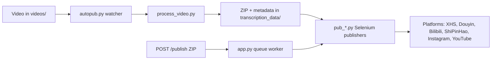

[English](../README.md) · [العربية](README.ar.md) · [Español](README.es.md) · [Français](README.fr.md) · [日本語](README.ja.md) · [한국어](README.ko.md) · [Tiếng Việt](README.vi.md) · [中文 (简体)](README.zh-Hans.md) · [中文（繁體）](README.zh-Hant.md) · [Deutsch](README.de.md) · [Русский](README.ru.md)


[](https://github.com/lachlanchen/lachlanchen/blob/main/figs/banner.png)

# AutoPublish

<p align="center">
  <strong>Công cụ đăng nội dung video ngắn đa nền tảng theo hướng script-first và điều khiển trình duyệt.</strong><br/>
  <sub>Tài liệu vận hành chuẩn cho việc setup, chạy runtime, chế độ hàng đợi và quy trình tự động hóa trên nhiều nền tảng.</sub>
</p>

[](#prerequisites)
[](#system-overview)
[](#running-the-tornado-service-apppy)
[](#platform-specific-notes)
[](#running-the-tornado-service-apppy)
[](#pwa-frontend-pwa)
[](https://github.com/sponsors/lachlanchen)
[](#table-of-contents)
[](#license)
[](#configuration)
[](#security--ops-checklist)
[](#raspberry-pi--linux-service-setup)

| Jump to | Link |
| --- | --- |
| First-time setup | [Start Here](#start-here) |
| Run with local watcher | [Running the CLI pipeline (`autopub.py`)](#running-the-cli-pipeline-autopubpy) |
| Run via HTTP queue | [Running the Tornado service (`app.py`)](#running-the-tornado-service-apppy) |
| Deploy as service | [Raspberry Pi / Linux Service Setup](#raspberry-pi--linux-service-setup) |
| Support the project | [Support](#support-autopublish) |

Bộ công cụ tự động hóa để phân phối nội dung video ngắn lên nhiều nền tảng sáng tạo của Trung Quốc và quốc tế. Dự án kết hợp một service dựa trên Tornado, các bot Selenium và quy trình theo dõi thư mục cục bộ, để khi bạn bỏ video vào thư mục, nó sẽ cuối cùng được upload lên XiaoHongShu, Douyin, Bilibili, WeChat Channels (ShiPinHao), Instagram và tùy chọn YouTube.

Kho mã này được thiết kế theo hướng low-level: phần lớn cấu hình nằm trong các file Python và shell script. Tài liệu này là sổ tay vận hành chính thức, bao phủ phần setup, runtime và các điểm mở rộng.

> ⚙️ **Triết lý vận hành**: dự án ưu tiên script rõ ràng và tự động hóa trình duyệt trực tiếp hơn là các lớp trừu tượng ẩn.
> ✅ **Chính sách chuẩn cho README**: giữ nguyên chi tiết kỹ thuật rồi mới tối ưu tính dễ đọc và khả năng khám phá.
> 🌍 **Tình trạng bản địa hóa (đã kiểm chứng tại workspace vào ngày 28 tháng 2, 2026)**: `i18n/` hiện có bản tiếng Ả Rập, Đức, Tây Ban Nha, Pháp, Nhật, Hàn, Nga, Việt, Trung giản thể và Trung phồn thể.

### Quick Navigation

| Tôi muốn... | Đi đến |
| --- | --- |
| Chạy lần đầu tiên | [Quick Start Checklist](#quick-start-checklist) |
| So sánh chế độ chạy | [Runtime Modes at a Glance](#runtime-modes-at-a-glance) |
| Cấu hình credentials và đường dẫn | [Configuration](#configuration) |
| Khởi chạy chế độ API và queue jobs | [Running the Tornado service (`app.py`)](#running-the-tornado-service-apppy) |
| Kiểm tra nhanh bằng lệnh copy/paste | [Examples](#examples) |
| Thiết lập trên Raspberry Pi/Linux | [Raspberry Pi / Linux Service Setup](#raspberry-pi--linux-service-setup) |

## Start Here

Nếu bạn mới dùng repo này, hãy làm theo thứ tự:

1. Đọc [Prerequisites](#prerequisites) và [Installation](#installation).
2. Cấu hình secrets và đường dẫn tuyệt đối trong [Configuration](#configuration).
3. Chuẩn bị browser debug sessions trong [Preparing Browser Sessions](#preparing-browser-sessions).
4. Chọn một chế độ runtime trong [Usage](#usage): `autopub.py` (watcher) hoặc `app.py` (API queue).
5. Xác thực bằng các lệnh trong [Examples](#examples).

## Overview

AutoPublish hiện hỗ trợ hai chế độ runtime production:

1. **CLI watcher mode (`autopub.py`)** cho ingest và publish theo thư mục.
2. **API queue mode (`app.py`)** cho publish theo ZIP qua HTTP (`/publish`, `/publish/queue`).

Hệ thống hướng tới người vận hành thích workflow minh bạch, script-first thay vì các nền tảng orchestration trừu tượng.

### Runtime Modes at a Glance

| Mode | Entry point | Input | Best for | Output behavior |
| --- | --- | --- | --- | --- |
| CLI watcher | `autopub.py` | File được thả vào `videos/` | Workflow vận hành local và vòng cron/service | Xử lý video phát hiện được và publish ngay đến các nền tảng đã chọn |
| API queue service | `app.py` | Upload ZIP tới `POST /publish` | Tích hợp với hệ thống upstream và trigger từ xa | Nhận job, đưa vào hàng đợi, rồi chạy publish theo thứ tự worker |

### Platform Coverage Snapshot

| Platform | Publisher module | Login helper | Control port | CLI mode | API mode |
| --- | --- | --- | --- | --- | --- |
| XiaoHongShu | `pub_xhs.py` | `login_xiaohongshu.py` | `5003` | ✅ | ✅ |
| Douyin | `pub_douyin.py` | `login_douyin.py` | `5004` | ✅ | ✅ |
| Bilibili | `pub_bilibili.py` | N/A | `5005` | ✅ | ✅ |
| ShiPinHao (WeChat Channels) | `pub_shipinhao.py` | `login_shipinhao.py` | `5006` | Optional | ✅ |
| Instagram | `pub_instagram.py` | `login_instagram.py` | `5007` | Optional | ✅ |
| YouTube | `pub_y2b.py` | N/A | `9222` | Optional | ✅ |

## Quick Snapshot

| What | Value |
| --- | --- |
| Primary language | Python 3.10+ |
| Main runtimes | CLI watcher (`autopub.py`) + Tornado queue service (`app.py`) |
| Automation engine | Selenium + remote-debug Chromium sessions |
| Input formats | Raw videos (`videos/`) và ZIP bundles (`/publish`) |
| Current repo workspace path | `/home/lachlan/ProjectsLFS/AutoPublish` |
| Ideal users | Creators/ops engineers quản lý pipeline video ngắn đa nền tảng |

### Operational Safety Snapshot

| Topic | Current state | Action |
| --- | --- | --- |
| Hard-coded paths | Có ở nhiều module/script | Cập nhật hằng số path theo host trước khi chạy production |
| Browser login state | Bắt buộc | Giữ remote-debug profiles persistence cho từng nền tảng |
| Captcha handling | Có tích hợp tùy chọn | Cấu hình credentials 2Captcha/Turing khi cần |
| License declaration | Chưa thấy `LICENSE` ở root | Xác nhận lại điều khoản dùng lại với maintainer trước khi tái phân phối |

### Compatibility & Assumptions

| Item | Current assumption in this repo |
| --- | --- |
| Python | 3.10+ |
| Runtime environment | Linux desktop/server có GUI display cho Chromium |
| Browser control mode | Remote debugging sessions với profile thư mục persistent |
| Primary API port | `8081` (`app.py --port`) |
| Processing backend | `upload_url` + `process_url` phải truy cập được và trả về ZIP hợp lệ |
| Workspace used for this draft | `/home/lachlan/ProjectsLFS/AutoPublish` |

---

## Table of Contents

- [Start Here](#start-here)
- [Overview](#overview)
- [Runtime Modes at a Glance](#runtime-modes-at-a-glance)
- [Platform Coverage Snapshot](#platform-coverage-snapshot)
- [Quick Snapshot](#quick-snapshot)
- [Operational Safety Snapshot](#operational-safety-snapshot)
- [Compatibility & Assumptions](#compatibility--assumptions)
- [System Overview](#system-overview)
- [Features](#features)
- [Project Structure](#project-structure)
- [Repository Layout](#repository-layout)
- [Prerequisites](#prerequisites)
- [Installation](#installation)
- [Configuration](#configuration)
- [Configuration Verification Checklist](#configuration-verification-checklist)
- [Preparing Browser Sessions](#preparing-browser-sessions)
- [Usage](#usage)
- [Examples](#examples)
- [Metadata & ZIP Format](#metadata--zip-format)
- [Data & Artifact Lifecycle](#data--artifact-lifecycle)
- [Platform-Specific Notes](#platform-specific-notes)
- [Raspberry Pi / Linux Service Setup](#raspberry-pi--linux-service-setup)
- [Legacy macOS Scripts](#legacy-macos-scripts)
- [Troubleshooting & Maintenance](#troubleshooting--maintenance)
- [FAQ](#faq)
- [Extending the System](#extending-the-system)
- [Quick Start Checklist](#quick-start-checklist)
- [Development Notes](#development-notes)
- [Roadmap](#roadmap)
- [Contributing](#contributing)
- [Security & Ops Checklist](#security--ops-checklist)
- [License](#license)
- [Acknowledgements](#acknowledgements)
- [Support](#support-autopublish)

---

## System Overview

🎯 **Dòng chảy end-to-end** từ media thô đến bài đã đăng:



Quy trình nhanh:

1. **Raw footage intake**: đặt video vào `videos/`. Watcher (là `autopub.py` hoặc scheduler/service) sẽ phát hiện file mới thông qua `videos_db.csv` và `processed.csv`.
2. **Asset generation**: `process_video.VideoProcessor` upload file lên content-processing server (`upload_url` và `process_url`) và nhận về gói ZIP gồm:
   - video đã chỉnh sửa/mã hóa (`<stem>.mp4`),
   - ảnh bìa,
   - `{stem}_metadata.json` với title, description, tags theo ngôn ngữ local.
3. **Publishing**: metadata điều khiển các publisher trong `pub_*.py`. Mỗi publisher sẽ gắn vào phiên Chromium/Chrome đang chạy sẵn qua remote-debug port và thư mục user-data persistent.
4. **Web control plane (tùy chọn)**: `app.py` expose `/publish`, nhận trước ZIP đã build, giải nén và đẩy jobs publish vào queue cho cùng các publisher. Nó cũng có thể refresh browser session và trigger login helpers (`login_*.py`).
5. **Support modules**: `load_env.py` nạp secrets từ `~/.bashrc`, `utils.py` cung cấp helper (đưa cửa sổ lên trên, xử lý QR, helper gửi mail), và `solve_captcha_*.py` tích hợp Turing/2Captcha khi gặp captcha.

## Features

✨ **Thiết kế cho automation thực dụng, ưu tiên script-first**:

- Publish đa nền tảng: XiaoHongShu, Douyin, Bilibili, ShiPinHao (WeChat Channels), Instagram, YouTube (tùy chọn).
- Hai chế độ hoạt động: CLI watcher pipeline (`autopub.py`) và API queue service (`app.py` + `/publish` + `/publish/queue`).
- Công tắc tắt tạm thời theo nền tảng qua file `ignore_*`.
- Tái sử dụng remote-debug browser-session với profile persistent.
- Tự động hóa QR/captcha tùy chọn và helper thông báo email.
- Không cần build frontend cho PWA uploader UI đi kèm (`pwa/`).
- Script tự động hóa Linux/Raspberry Pi cho service setup (`scripts/`).

### Feature Matrix

| Capability | CLI (`autopub.py`) | API (`app.py`) |
| --- | --- | --- |
| Nguồn đầu vào | Local `videos/` watcher | Upload ZIP qua `POST /publish` |
| Queueing | Tiến trình nội bộ theo file | In-memory job queue rõ ràng |
| Platform flags | CLI args (`--pub-*`) + `ignore_*` | Query args (`publish_*`) + `ignore_*` |
| Mức phù hợp | Workflow người vận hành single-host | Tích hợp hệ thống ngoài và trigger từ xa |

---

## Project Structure

Sơ đồ source/runtime cấp cao:

```text
AutoPublish/
├── README.md
├── app.py
├── autopub.py
├── process_video.py
├── load_env.py
├── utils.py
├── pub_*.py                  # platform publishers
├── login_*.py                # platform login/session helpers
├── solve_captcha_*.py
├── smtp.py
├── smtp_test_simple.py
├── send_email_qreader.py
├── requirements.txt
├── requirements.autopub.txt
├── .env.example
├── setup_raspberrypi.md
├── scripts/
├── pwa/
├── figs/
├── .github/FUNDING.yml
├── i18n/                     # multilingual READMEs
├── videos/                   # runtime input artifacts
├── logs/, logs-autopub/      # runtime logs
├── temp/, temp_screenshot/   # runtime temp artifacts
├── videos_db.csv
└── processed.csv
```

Lưu ý: `transcription_data/` được dùng trong luồng xử lý/publish và có thể xuất hiện sau khi chạy.

## Repository Layout

🗂️ **Các module chính và chức năng**:

| Path | Purpose |
| --- | --- |
| `app.py` | Tornado service expose `/publish` và `/publish/queue`, có publish queue nội bộ + worker thread. |
| `autopub.py` | CLI watcher: quét `videos/`, xử lý file mới, và gọi các publisher song song. |
| `process_video.py` | Upload video lên backend processing và lưu ZIP bundle trả về. |
| `pub_xhs.py`, `pub_douyin.py`, `pub_bilibili.py`, `pub_shipinhao.py`, `pub_instagram.py`, `pub_y2b.py` | Module Selenium automation theo từng nền tảng. |
| `login_xiaohongshu.py`, `login_douyin.py`, `login_shipinhao.py`, `login_instagram.py` | Kiểm tra session và flow đăng nhập QR. |
| `utils.py` | Helper dùng chung cho automation (window focus, QR helper, mail helper, diagnostics). |
| `load_env.py` | Nạp biến môi trường từ shell profile (`~/.bashrc`) và mask log nhạy cảm. |
| `smtp.py`, `smtp_test_simple.py`, `send_email_qreader.py` | Helper SMTP/SendGrid và script test. |
| `solve_captcha_2captcha.py`, `solve_captcha_turing.py` | Tích hợp giải captcha. |
| `scripts/` | Script setup và vận hành service (Raspberry Pi/Linux + legacy automation). |
| `pwa/` | PWA tĩnh để preview ZIP và submit publish. |
| `setup_raspberrypi.md` | Hướng dẫn provisioning Raspberry Pi từng bước. |
| `.env.example` | Template biến môi trường (credentials, paths, captcha keys). |
| `.github/FUNDING.yml` | Cấu hình tài trợ/funding. |
| `logs/`, `logs-autopub/`, `temp/`, `temp_screenshot/`, `videos/` | Artefact và logs runtime (đa phần gitignored). |

---

## Prerequisites

🧰 **Cài các thứ này trước khi chạy lần đầu**.

### Operating system and tools

- Linux desktop/server có X session (`DISPLAY=:1` thường gặp trong script mẫu).
- Chromium/Chrome và ChromeDriver tương thích.
- Công cụ GUI/media: `xdotool`, `ffmpeg`, `zip`, `unzip`.
- Python 3.10+ (venv hoặc Conda).

### Python dependencies

Bộ runtime tối thiểu:

```bash
pip install selenium tornado requests requests-toolbelt sendgrid qreader opencv-python webdriver-manager
```

Đồng bộ với repo:

```bash
python -m pip install -r requirements.txt
```

Cho cài service nhẹ (mặc định setup scripts dùng):

```bash
python -m pip install -r requirements.autopub.txt
```

`requirements.autopub.txt` gồm:
- `selenium`, `webdriver-manager`, `tornado`, `requests`, `requests-toolbelt`, `sendgrid`, `qreader`, `opencv-python`, `numpy`, `pillow`, `twocaptcha`.

### Optional: create a sudo user

```bash
sudo useradd -m -s /bin/bash -G sudo <USERNAME> && echo "<USERNAME>:<PASSWORD>" | sudo chpasswd
```

---

## Installation

🚀 **Setup từ máy sạch**:

1. Clone repository:

```bash
git clone https://github.com/lachlanchen/AutoPublish.git
cd AutoPublish
```

2. Tạo và kích hoạt môi trường (ví dụ với `venv`):

```bash
python3 -m venv .venv
source .venv/bin/activate
python -m pip install -U pip
python -m pip install -r requirements.txt
```

3. Chuẩn bị env vars:

```bash
cp .env.example .env
# điền giá trị trong .env (đừng commit)
```

4. Nạp biến cho các script đọc từ shell profile:

```bash
source ~/.bashrc
python load_env.py
```

Ghi chú: `load_env.py` được viết cho `~/.bashrc`; nếu môi trường của bạn dùng profile khác, hãy chỉnh tương ứng.

---

## Configuration

🔐 **Set credentials, rồi xác nhận path theo host**.

### Environment variables

Dự án đọc credentials và (tùy chọn) browser/runtime paths từ environment variables. Bắt đầu từ `.env.example`:

| Variable | Description |
| --- | --- |
| `FROM_EMAIL`, `TO_EMAIL`, `APP_PASSWORD` | Credentials SMTP cho thông báo QR/login. |
| `SENDGRID_API_KEY` | Khóa SendGrid cho luồng email dùng SendGrid APIs. |
| `APIKEY_2CAPTCHA` | Khóa API 2Captcha. |
| `TULING_USERNAME`, `TULING_PASSWORD`, `TULING_ID` | Credentials captcha Turing. |
| `DOUYIN_LOGIN_PASSWORD` | Trợ giúp xác minh 2FA của Douyin. |
| `INSTAGRAM_*`, `CHROME_*`, `CHROMEDRIVER_PATH` | Ghi đè Instagram/browser driver. |
| `AUTOPUBLISH_BROWSER_BIN`, `AUTOPUBLISH_CHROMEDRIVER`, `AUTOPUBLISH_DISPLAY` | Ghi đè browser/driver/display global trong `app.py`. |

### Path constants (important)

📌 **Vấn đề startup thường gặp nhất**: hard-coded absolute path chưa tương thích host.

Nhiều module vẫn còn hard-coded paths. Cập nhật theo host của bạn:

| File | Constant(s) | Meaning |
| --- | --- | --- |
| `app.py` | `logs_folder_root`, `autopublish_folder_root`, `videos_db_path`, `processed_path`, `transcription_root`, `upload_url`, `process_url`. | Gốc của API service và endpoint backend. |
| `autopub.py` | `logs_folder_path`, `autopublish_folder_path`, `videos_db_path`, `processed_path`, `transcription_path`, `upload_url`, `process_url`, `chromedriver_path`. | Gốc của CLI watcher và endpoint backend. |
| `scripts/run_autopub.sh`, `scripts/setup_autopub.sh` | Các đường dẫn tuyệt đối tới Python/Conda/repo/log. | Wrapper cũ thiên hướng macOS. |
| `utils.py` | Giả định path FFmpeg trong helper xử lý cover. | Tương thích path cho media tooling. |

Ghi chú repo quan trọng:
- Đường dẫn repo trong workspace hiện tại là `/home/lachlan/ProjectsLFS/AutoPublish`.
- Một vài code/script vẫn tham chiếu `/home/lachlan/Projects/auto-publish` hoặc `/Users/lachlan/...`.
- Giữ và điều chỉnh các đường dẫn này cục bộ trước khi chạy production.

### Platform toggles via `ignore_*`

🧩 **Nút dừng nhanh**: chỉ cần chạm file `ignore_*` là tắt publisher mà không sửa code.

Các flag publish cũng chịu tác động của ignore file. Tạo file rỗng để disable một nền tảng:

```bash
touch ignore_xhs ignore_douyin ignore_bilibili ignore_shipinhao ignore_instagram ignore_y2b
```

Xóa file tương ứng để bật lại.

### Configuration Verification Checklist

Chạy kiểm tra nhanh sau khi set `.env` và path constants:

```bash
python -c "import os;print('AUTOPUBLISH_BROWSER_BIN=', os.getenv('AUTOPUBLISH_BROWSER_BIN'));print('AUTOPUBLISH_CHROMEDRIVER=', os.getenv('AUTOPUBLISH_CHROMEDRIVER'));print('DISPLAY=', os.getenv('DISPLAY') or os.getenv('AUTOPUBLISH_DISPLAY'))"
python -c "from load_env import load_env_from_bashrc; load_env_from_bashrc(); print('Environment load OK')"
python -c "import os; p=os.getenv('AUTOPUBLISH_CHROMEDRIVER') or os.getenv('CHROMEDRIVER_PATH') or '/usr/bin/chromedriver'; print(p, 'exists=', os.path.exists(p))"
```

Nếu thiếu giá trị nào, hãy update `.env`, `~/.bashrc` hoặc hằng số ở cấp script trước khi chạy publish.

---

## Preparing Browser Sessions

🌐 **Session persistence bắt buộc** để Selenium publish đáng tin cậy.

1. Tạo thư mục profile riêng:

```bash
mkdir -p ~/chromium_dev_session_{5003,5004,5005,5006,5007,9222}
mkdir -p ~/chromium_dev_session_logs
```

2. Khởi chạy browser session với remote debugging (ví dụ cho XiaoHongShu):

```bash
DISPLAY=:1 chromium-browser \
  --remote-debugging-port=5003 \
  --user-data-dir="$HOME/chromium_dev_session_5003" \
  https://creator.xiaohongshu.com/creator/post \
  > "$HOME/chromium_dev_session_logs/chromium_xhs.log" 2>&1 &
```

3. Đăng nhập thủ công một lần cho từng nền tảng/profile.

4. Kiểm tra Selenium có thể attach:

```python
from selenium import webdriver
opts = webdriver.ChromeOptions()
opts.add_experimental_option("debuggerAddress", "127.0.0.1:5003")
driver = webdriver.Chrome(options=opts)
print(driver.title)
driver.quit()
```

Ghi chú bảo mật:
- `app.py` hiện có placeholder mật khẩu sudo hard-code (`password = "1"`) dùng trong logic restart browser. Thay thế trước khi triển khai thật.

---

## Usage

▶️ **Có hai runtime mode**: CLI watcher và API queue service.

### Running the CLI pipeline (`autopub.py`)

1. Đặt video nguồn vào thư mục watch (`videos/` hoặc `autopublish_folder_path` bạn cấu hình).
2. Chạy:

```bash
python autopub.py --use-cache --pub-xhs --pub-douyin --pub-bilibili
```

Các flag:

| Flag | Meaning |
| --- | --- |
| `--pub-xhs`, `--pub-douyin`, `--pub-bilibili` | Giới hạn publish theo các nền tảng đã chọn. Nếu không truyền flag nào, mặc định bật cả ba. |
| `--test` | Chế độ test truyền vào publisher (hành vi tùy module). |
| `--use-cache` | Tái sử dụng `transcription_data/<video>/<video>.zip` nếu có. |

Luồng CLI cho từng video:
- Upload/process qua `process_video.py`.
- Giải nén ZIP vào `transcription_data/<video>/`.
- Gọi publisher đã chọn qua `ThreadPoolExecutor`.
- Ghi trạng thái theo dõi vào `videos_db.csv` và `processed.csv`.

### Running the Tornado service (`app.py`)

🛰️ **API mode** hữu ích cho hệ thống ngoài tạo ZIP bundle.

Khởi chạy server:

```bash
python app.py --refresh-time 1800 --port 8081
```

Tóm tắt endpoint:

| Endpoint | Method | Purpose |
| --- | --- | --- |
| `/publish` | `POST` | Upload ZIP bytes và enqueue publish job |
| `/publish/queue` | `GET` | Xem queue, lịch sử job, trạng thái publish |

### `POST /publish`

📤 **Đẩy publish job vào hàng đợi** bằng cách upload trực tiếp ZIP bytes.

- Header: `Content-Type: application/octet-stream`
- Query/form arg bắt buộc: `filename` (tên file ZIP)
- Boolean tùy chọn: `publish_xhs`, `publish_douyin`, `publish_bilibili`, `publish_shipinhao`, `publish_instagram`, `publish_y2b`, `test`
- Body: raw ZIP bytes

Ví dụ:

```bash
curl -X POST "http://localhost:8081/publish?filename=demo.zip&publish_xhs=true&publish_instagram=true&publish_y2b=true" \
  --data-binary @demo.zip \
  -H "Content-Type: application/octet-stream"
```

Hành vi thực tế trong code:
- Request được chấp nhận và vào queue.
- Response ngay lập tức trả về JSON gồm `status: queued`, `job_id`, `queue_size`.
- Worker thread xử lý tuần tự các job.

### `GET /publish/queue`

📊 **Theo dõi sức khỏe queue và jobs đang chạy**.

Lấy JSON trạng thái/lịch sử queue:

```bash
curl "http://localhost:8081/publish/queue"
```

Các trường trả về gồm:
- `status`, `jobs`, `queue_size`, `is_publishing`.

### Browser refresh thread

♻️ Thread refresh định kỳ giảm lỗi session stale trong thời gian chạy dài.

`app.py` chạy background refresh thread theo khoảng `--refresh-time` và gắn hook login checks. Thời gian sleep có hành vi random delay.

### PWA frontend (`pwa/`)

🖥️ Giao diện web tĩnh nhẹ để upload ZIP thủ công và quan sát queue.

Chạy UI local:

```bash
cd pwa
python -m http.server 5173
```

Mở `http://localhost:5173` và set backend base URL (ví dụ `http://lazyingart:8081`).

Khả năng của PWA:
- Preview ZIP bằng kéo/thả.
- Bật/tắt nền tảng publish + test mode.
- Gửi lên `/publish` và poll `/publish/queue`.

### Command Palette

🧷 **Những lệnh dùng nhiều nhất gộp lại**.

| Task | Command |
| --- | --- |
| Install full dependencies | `python -m pip install -r requirements.txt` |
| Install lightweight runtime dependencies | `python -m pip install -r requirements.autopub.txt` |
| Load shell-based env vars | `source ~/.bashrc && python load_env.py` |
| Start API queue server | `python app.py --refresh-time 1800 --port 8081` |
| Start CLI watcher pipeline | `python autopub.py --use-cache --pub-xhs --pub-douyin --pub-bilibili` |
| Submit ZIP to queue | `curl -X POST "http://localhost:8081/publish?filename=demo.zip" --data-binary @demo.zip -H "Content-Type: application/octet-stream"` |
| Inspect queue status | `curl -s "http://localhost:8081/publish/queue"` |
| Serve local PWA | `cd pwa && python -m http.server 5173` |

---

## Examples

🧪 **Lệnh smoke-test có thể copy/paste**:

### Example 0: Load environment and start API server

```bash
source ~/.bashrc
python load_env.py
python app.py --refresh-time 1800 --port 8081
```

### Example A: CLI publish run

```bash
python autopub.py --pub-xhs --pub-douyin --use-cache
```

### Example B: API publish run (single ZIP)

```bash
curl -X POST "http://localhost:8081/publish?filename=my_bundle.zip&publish_bilibili=true&test=true" \
  --data-binary @my_bundle.zip \
  -H "Content-Type: application/octet-stream"
```

### Example C: Check queue status

```bash
curl -s "http://localhost:8081/publish/queue"
```

### Example D: SMTP helper smoke test

```bash
python smtp.py
python smtp_test_simple.py
```

---

## Metadata & ZIP Format

📦 **Hợp đồng ZIP rất quan trọng**: giữ đúng tên file và metadata keys theo đúng publisher expectations.

Nội dung ZIP tối thiểu:

```text
<stem>_metadata.json
<video_filename>.mp4
<cover_filename>.jpg
```

`metadata` dùng cho publisher Trung Quốc; `metadata["english_version"]` (tùy chọn) cấp cho publisher YouTube.

Các field thường dùng trong module:
- `title`, `brief_description`, `middle_description`, `long_description`
- `tags` (danh sách hashtag)
- `video_filename`, `cover_filename`
- các field riêng từng nền tảng trong từng file `pub_*.py`

Nếu bạn tạo ZIP từ bên ngoài, giữ nguyên keys và tên file đúng với kỳ vọng của module.

## Data & Artifact Lifecycle

Pipeline tạo các artifact local mà operator cần giữ, xoay vòng hoặc dọn dẹp có chủ đích:

| Artifact | Location | Produced by | Why it matters |
| --- | --- | --- | --- |
| Input videos | `videos/` | Drop thủ công hoặc đồng bộ upstream | Nguồn media cho CLI watcher mode |
| Processing ZIP output | `transcription_data/<stem>/<stem>.zip` | `process_video.py` | Payload tái sử dụng cho `--use-cache` |
| Extracted publish assets | `transcription_data/<stem>/...` | Giải nén ZIP trong `autopub.py` / `app.py` | File và metadata sẵn cho publisher |
| Publish logs | `logs/`, `logs-autopub/` | Runtime CLI/API | Truy vết lỗi và audit trail |
| Browser logs | `~/chromium_dev_session_logs/*.log` (hoặc chrome prefix) | Script khởi động browser | Chẩn đoán session/port/startup |
| Tracking CSVs | `videos_db.csv`, `processed.csv` | CLI watcher | Tránh xử lý trùng |

Khuyến nghị housekeeping:
- Đặt job dọn dẹp/archive định kỳ cho `transcription_data/`, `temp/`, và logs cũ để tránh đầy ổ đĩa.

---

## Platform-Specific Notes

🧭 **Port map + ownership module** cho từng publisher.

| Platform | Port | Module(s) | Notes |
| --- | --- | --- | --- |
| XiaoHongShu | 5003 | `pub_xhs.py`, `login_xiaohongshu.py` | Có flow re-login bằng QR; title sanitize và hashtag lấy từ metadata. |
| Douyin | 5004 | `pub_douyin.py`, `login_douyin.py` | Kiểm tra upload hoàn tất và retry path khá dễ vỡ theo nền tảng; nên theo dõi log sát. |
| Bilibili | 5005 | `pub_bilibili.py` | Có hook captcha qua `solve_captcha_2captcha.py` và `solve_captcha_turing.py`. |
| ShiPinHao (WeChat Channels) | 5006 | `pub_shipinhao.py`, `login_shipinhao.py` | Duyệt QR nhanh giúp session refresh ổn định hơn. |
| Instagram | 5007 | `pub_instagram.py`, `login_instagram.py` | Kiểm soát trong API mode bằng `publish_instagram=true`; biến env có trong `.env.example`. |
| YouTube | 9222 | `pub_y2b.py` | Dùng metadata block `english_version`; tắt bằng `ignore_y2b`. |

---

## Raspberry Pi / Linux Service Setup

🐧 **Khuyến nghị cho host chạy liên tục**.

Để bootstrap host đầy đủ, theo [setup_raspberrypi.md](setup_raspberrypi.md).

Setup pipeline nhanh:

```bash
export AUTOPUB_USER=<USERNAME>
export AUTOPUB_REPO=/home/<USERNAME>/Projects/autopub
sudo -E ./scripts/setup_autopub_pipeline.sh
```

Lệnh này điều phối:
- `scripts/setup_envs.sh`
- `scripts/setup_virtual_desktop_service.sh`
- `scripts/download_and_setup_driver.sh`
- `scripts/setup_autopub_service.sh`

Chạy service thủ công trong tmux:

```bash
./scripts/start_autopub_tmux.sh
```

Validate services/ports:

```bash
systemctl status autopub.service autopub-vnc.service
sudo ss -ltnp | grep 590
```

Ghi chú tương thích:
- Một số tài liệu/script cũ vẫn nói đến `virtual-desktop.service`; script setup hiện tại của repo cài `autopub-vnc.service`.

---

## Legacy macOS Scripts

🍎 Wrapper legacy vẫn được giữ để tương thích với workflow local cũ.

Repo vẫn còn các wrapper kiểu macOS:
- `scripts/run_autopub.sh`
- `scripts/setup_autopub.sh`

Trong đó có các path tuyệt đối `/Users/lachlan/...` và giả định Conda. Giữ lại nếu bạn vẫn dùng flow đó, nhưng phải cập nhật path/venv/tooling theo host.

---

## Troubleshooting & Maintenance

🛠️ **Nếu gặp lỗi, bắt đầu check tại đây**.

- **Path drift giữa máy**: nếu lỗi báo thiếu file trong `/Users/lachlan/...` hoặc `/home/lachlan/Projects/auto-publish`, hãy chỉnh constants theo host path (`/home/lachlan/ProjectsLFS/AutoPublish` trong workspace này).
- **Secrets hygiene**: chạy `~/.local/bin/detect-secrets scan` trước khi push. Rotate bất kỳ credential nào đã lộ.
- **Lỗi processing backend**: nếu `process_video.py` in `Failed to get the uploaded file path`, kiểm tra JSON trả về upload có `file_path` và endpoint processing trả ZIP bytes.
- **ChromeDriver mismatch**: nếu gặp lỗi kết nối DevTools, đồng bộ phiên bản Chrome/Chromium và driver (hoặc đổi sang `webdriver-manager`).
- **Browser focus issues**: `bring_to_front` phụ thuộc khớp title cửa sổ (tên Chromium/Chrome khác nhau có thể làm fail).
- **Captcha ngắt luồng**: cấu hình credentials 2Captcha/Turing và tích hợp output solver khi cần.
- **Stale lock files**: nếu lịch chạy không bao giờ start, kiểm tra process state và xóa `autopub.lock` cũ (flow script legacy).
- **Logs cần inspect**: `logs/`, `logs-autopub/`, `~/chromium_dev_session_logs/*.log`, cùng journal logs của service.

## FAQ

**Q: Tôi có thể chạy API mode và CLI watcher cùng lúc không?**  
A: Có thể làm được, nhưng không khuyến nghị nếu chưa isolate inputs và browser sessions. Cả hai mode có thể tranh chấp cùng publisher, file và ports.

**Q: Vì sao `/publish` trả về queued nhưng chưa thấy gì published?**  
A: `app.py` enqueue jobs trước, sau đó worker nền xử lý tuần tự. Kiểm tra `/publish/queue`, `is_publishing`, và logs service.

**Q: Tôi có cần `load_env.py` nếu đã dùng `.env` rồi không?**  
A: `start_autopub_tmux.sh` sẽ source `.env` nếu có, còn một số run trực tiếp lại dựa vào shell exports. Giữ cho cả `.env` và shell exports nhất quán để tránh surprise.

**Q: Hợp đồng ZIP tối thiểu cho API upload là gì?**  
A: Một ZIP hợp lệ gồm `{stem}_metadata.json` và tên video/cover trùng với metadata keys (`video_filename`, `cover_filename`).

**Q: Có hỗ trợ headless mode không?**  
A: Một số module có biến liên quan headless, nhưng chế độ vận hành chủ đạo và được tài liệu hóa là GUI-backed browser sessions với profile persistent.

---

## Extending the System

🧱 **Các điểm mở rộng** cho nền tảng mới và vận hành an toàn hơn.

- **Thêm platform mới**: copy module `pub_*.py`, cập nhật selector/flow, thêm `login_*.py` nếu cần QR re-auth, rồi nối flags và queue handling trong `app.py` và wiring CLI trong `autopub.py`.
- **Trừu tượng hóa config**: gom các constant rải rác sang config có cấu trúc (`config.yaml`/`.env` + typed model) cho multi-host.
- **Mở khóa lưu trữ credential an toàn hơn**: thay các luồng hard-coded hoặc lộ qua shell bằng secret management an toàn (`sudo -A`, keychain, vault/secret manager).
- **Containerization**: đóng gói Chromium/ChromeDriver + Python runtime + virtual display thành một đơn vị triển khai dùng được cho cloud/server.

---

## Quick Start Checklist

✅ **Con đường nhanh nhất để publish thành công lần đầu**.

1. Clone repo và cài dependencies (`pip install -r requirements.txt` hoặc bản nhẹ `requirements.autopub.txt`).
2. Cập nhật các constant hard-coded trong `app.py`, `autopub.py`, và script bạn sẽ chạy.
3. Export credentials cần thiết trong shell profile hoặc `.env`; chạy `python load_env.py` để xác thực.
4. Tạo thư mục profile remote-debug browser và khởi chạy từng phiên nền tảng cần thiết ít nhất 1 lần.
5. Đăng nhập thủ công trên mỗi nền tảng đích trong profile tương ứng.
6. Start API mode (`python app.py --port 8081`) hoặc CLI mode (`python autopub.py --use-cache ...`).
7. Đẩy một ZIP mẫu (API mode) hoặc một file video mẫu (CLI mode) rồi xem `logs/`.
8. Chạy secrets scanning trước mỗi lần push.

---

## Development Notes

🧬 **Baseline phát triển hiện tại** (format thủ công + smoke testing).

- Style Python theo 4-space indentation và format thủ công hiện tại.
- Chưa có test suite tự động chính thức; dựa vào smoke test:
  - xử lý một video mẫu qua `autopub.py`;
  - post một ZIP tới `/publish` và theo dõi `/publish/queue`;
  - xác minh thủ công từng nền tảng mục tiêu.
- Thêm entrypoint nhỏ `if __name__ == "__main__":` khi thêm script mới để tiện dry-run.
- Cô lập thay đổi theo nền tảng càng nhiều càng tốt (`pub_*`, `login_*`, `ignore_*`).
- Runtime artifacts (`videos/*`, `logs*/*`, `transcription_data/*`, `ignore_*`) kỳ vọng ở local và phần lớn bị gitignore.

---

## Roadmap

🗺️ **Các cải tiến ưu tiên theo ràng buộc mã hiện tại**.

Các cải tiến mong muốn (dựa trên cấu trúc code và ghi chú hiện tại):

1. Thay thế hard-coded path rải rác bằng config trung tâm (`.env`/YAML + typed models).
2. Loại bỏ mẫu password sudo hard-coded và chuyển control process sang cơ chế an toàn hơn.
3. Tăng độ tin cậy publish với retry mạnh hơn và detection UI-state tốt hơn theo từng nền tảng.
4. Mở rộng nền tảng (ví dụ Kuaishou hoặc các creator platforms khác).
5. Đóng gói runtime thành đơn vị triển khai tái lập (container + virtual display profile).
6. Thêm kiểm tra tích hợp tự động cho ZIP contract và queue execution.

---

## Contributing

🤝 Giữ PR tập trung, có thể reproduce, và nêu rõ giả định runtime.

Đóng góp luôn được hoan nghênh.

1. Fork và tạo branch tập trung.
2. Giữ commit nhỏ, chủ động (ví dụ trong lịch sử: “Wait for YouTube checks before publishing”).
3. Ghi chú xác thực thủ công trong PR:
   - assumptions môi trường,
   - restart browser/session,
   - logs/screenshot liên quan cho thay đổi UI flow.
4. Không commit secret thật (`.env` đã gitignore; dùng `.env.example` để tham chiếu cấu trúc).

Nếu thêm module publisher mới, cần nối đủ:
- `pub_<platform>.py`
- `login_<platform>.py` (tùy chọn)
- API flags + queue handling trong `app.py`
- CLI wiring trong `autopub.py` (nếu cần)
- xử lý `ignore_<platform>` toggle
- cập nhật README

## Security & Ops Checklist

Trước khi chạy production-like:

1. Xác nhận `.env` tồn tại local và không bị track bởi git.
2. Rotate/remove mọi credentials có thể đã từng được commit.
3. Thay placeholder nhạy cảm trong code paths (ví dụ placeholder password sudo trong `app.py`).
4. Kiểm tra các switch `ignore_*` có chủ đích trước batch run.
5. Đảm bảo browser profile được tách theo nền tảng và dùng tài khoản ít quyền.
6. Kiểm tra logs không lộ secrets trước khi chia sẻ issue report.
7. Chạy `detect-secrets` (hoặc tương đương) trước push.

<a id="support-autopublish"></a>
## ❤️ Support

| Donate | PayPal | Stripe |
|---|---|---|
| [](https://chat.lazying.art/donate) | [](https://paypal.me/RongzhouChen) | [](https://buy.stripe.com/aFadR8gIaflgfQV6T4fw400) |

💖 Support từ cộng đồng giúp duy trì hạ tầng, tăng độ ổn định, và phát triển nền tảng mới.

AutoPublish nằm trong nỗ lực rộng hơn để giữ bộ công cụ creator đa nền tảng mở và dễ tùy biến. Quyên góp giúp:

- Giữ cho Selenium farm, processing API, và cloud GPUs hoạt động.
- Phát hành thêm các publisher mới (Kuaishou, Instagram Reels, v.v.) cùng fix độ ổn định cho bot hiện có.
- Chia sẻ thêm tài liệu, bộ dữ liệu khởi đầu và hướng dẫn cho creator độc lập.

### Additional Donation Options

<div align="center">
<table style="margin:0 auto; text-align:center; border-collapse:collapse;">
  <tr>
    <td style="text-align:center; vertical-align:middle; padding:6px 12px;">
      <a href="https://chat.lazying.art/donate">https://chat.lazying.art/donate</a>
    </td>
    <td style="text-align:center; vertical-align:middle; padding:6px 12px;">
      <a href="https://chat.lazying.art/donate"></a>
    </td>
  </tr>
  <tr>
    <td style="text-align:center; vertical-align:middle; padding:6px 12px;">
      <a href="https://paypal.me/RongzhouChen">
        
      </a>
    </td>
    <td style="text-align:center; vertical-align:middle; padding:6px 12px;">
      <a href="https://buy.stripe.com/aFadR8gIaflgfQV6T4fw400">
        
      </a>
    </td>
  </tr>
  <tr>
    <td style="text-align:center; vertical-align:middle; padding:6px 12px;"><strong>WeChat</strong></td>
    <td style="text-align:center; vertical-align:middle; padding:6px 12px;"><strong>Alipay</strong></td>
  </tr>
  <tr>
    <td style="text-align:center; vertical-align:middle; padding:6px 12px;"></td>
    <td style="text-align:center; vertical-align:middle; padding:6px 12px;"></td>
  </tr>
</table>
</div>

**支援 / Donate**

- ご支援はクリエイター自動化の研究・開発・運用コストをまかなう大きな力になります。
- 你的支持将用于服务器与研发，帮助作者持续开放改进跨平台发布工具链。
- Your support keeps the pipelines alive so more independent studios can publish everywhere with less busywork.

Also available via:
- GitHub Sponsors: <https://github.com/sponsors/lachlanchen>
- Project links: <https://lazying.art>, <https://chat.lazying.art>, <https://onlyideas.art>

---

## License

Hiện không có file `LICENSE` trong snapshot repository này.

Giả định cho bản nháp:
- Xử lý/redistribution cho tới khi maintainer thêm file license rõ ràng vẫn chưa được định nghĩa.

Đề xuất tiếp theo:
- Thêm file `LICENSE` ở mức root (ví dụ MIT/Apache-2.0/GPL-3.0) và cập nhật lại phần này.

> 📝 Cho đến khi có file license, coi các giả định về phân phối thương mại/nội bộ là chưa xác thực và cần xác nhận trực tiếp với maintainer.

---

## Acknowledgements

- Người duy trì và profile tài trợ: [@lachlanchen](https://github.com/lachlanchen)
- Nguồn cấu hình funding: [`.github/FUNDING.yml`](.github/FUNDING.yml)
- Các dịch vụ hệ sinh thái được nhắc đến trong repo: Selenium, Tornado, SendGrid, 2Captcha, Turing captcha APIs.
