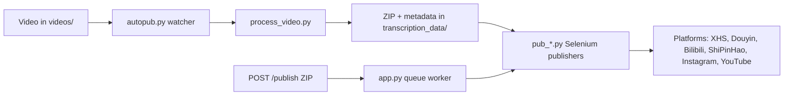

[English](../README.md) · [العربية](README.ar.md) · [Español](README.es.md) · [Français](README.fr.md) · [日本語](README.ja.md) · [한국어](README.ko.md) · [Tiếng Việt](README.vi.md) · [中文 (简体)](README.zh-Hans.md) · [中文（繁體）](README.zh-Hant.md) · [Deutsch](README.de.md) · [Русский](README.ru.md)


[](https://github.com/lachlanchen/lachlanchen/blob/main/figs/banner.png)

<div align="center">

# AutoPublish

<p align="center">
  <strong>Script-first, browser-driven multi-platform short-video publishing.</strong><br/>
  <sub>Canonical operations manual for setup, runtime, queue mode, and platform automation workflows.</sub>
</p>

</div>

[](#prerequisites)
[](#system-overview)
[](#running-the-tornado-service-apppy)
[](#platform-specific-notes)
[](#running-the-tornado-service-apppy)
[](#pwa-frontend-pwa)
[](https://github.com/sponsors/lachlanchen)
[](#table-of-contents)
[](#license)
[](#configuration)
[](#security--ops-checklist)
[](#raspberry-pi--linux-service-setup)

[](#usage)
[](#preparing-browser-sessions)
[](#metadata--zip-format)

| Điều hướng nhanh | Liên kết |
| --- | --- |
| Cài đặt lần đầu | [Start Here](#start-here) |
| Chạy bằng local watcher | [Running the CLI pipeline (`autopub.py`)](#running-the-cli-pipeline-autopubpy) |
| Chạy qua HTTP queue | [Running the Tornado service (`app.py`)](#running-the-tornado-service-apppy) |
| Triển khai dưới dạng service | [Raspberry Pi / Linux Service Setup](#raspberry-pi--linux-service-setup) |
| Hỗ trợ dự án | [Support](#support-autopublish) |

Bộ công cụ tự động hóa để phân phối nội dung video ngắn tới nhiều nền tảng nhà sáng tạo của Trung Quốc và quốc tế. Dự án kết hợp service dựa trên Tornado, các bot Selenium và quy trình làm việc với trình theo dõi thư mục cục bộ để khi bạn bỏ một video vào thư mục, sau đó hệ thống sẽ đăng tải lên XiaoHongShu, Douyin, Bilibili, WeChat Channels (ShiPinHao), Instagram và tùy chọn YouTube.

Kho mã này được xây dựng theo hướng low-level: hầu hết cấu hình nằm trong các file Python và script shell. Tài liệu này là sổ tay vận hành, bao gồm phần setup, chạy runtime và các điểm mở rộng.

> ⚙️ **Triết lý vận hành**: dự án ưu tiên các script rõ ràng và tự động hóa trình duyệt trực tiếp hơn là lớp trừu tượng ẩn.
> ✅ **Chính sách chuẩn cho README này**: giữ nguyên chi tiết kỹ thuật, sau đó cải thiện tính dễ đọc và dễ khám phá.
> 🌍 **Tình trạng bản địa hóa (đã kiểm chứng trong workspace vào ngày 28 tháng 2, 2026)**: `i18n/` hiện có bản tiếng Ả Rập, Đức, Tây Ban Nha, Pháp, Nhật, Hàn, Việt, Trung giản thể và Trung phồn thể.

### Quick Navigation

| Tôi muốn... | Đi tới |
| --- | --- |
| Chạy lần xuất bản đầu tiên | [Quick Start Checklist](#quick-start-checklist) |
| So sánh chế độ runtime | [Runtime Modes at a Glance](#runtime-modes-at-a-glance) |
| Cấu hình credentials và đường dẫn | [Configuration](#configuration) |
| Khởi chạy chế độ API và queue jobs | [Running the Tornado service (`app.py`)](#running-the-tornado-service-apppy) |
| Kiểm tra nhanh bằng lệnh copy/paste | [Examples](#examples) |
| Cài đặt trên Raspberry Pi/Linux | [Raspberry Pi / Linux Service Setup](#raspberry-pi--linux-service-setup) |

## Start Here

Nếu bạn mới làm quen với repo này, hãy làm theo trình tự sau:

1. Đọc [Prerequisites](#prerequisites) và [Installation](#installation).
2. Cấu hình secrets và đường dẫn tuyệt đối trong [Configuration](#configuration).
3. Chuẩn bị browser debug sessions trong [Preparing Browser Sessions](#preparing-browser-sessions).
4. Chọn một chế độ runtime trong [Usage](#usage): `autopub.py` (watcher) hoặc `app.py` (API queue).
5. Xác thực qua các lệnh trong [Examples](#examples).

## Overview

AutoPublish hiện hỗ trợ hai chế độ runtime production:

<div align="center">


</div>

1. **CLI watcher mode (`autopub.py`)** cho ingestion và xuất bản theo thư mục.
2. **API queue mode (`app.py`)** cho xuất bản qua ZIP bằng HTTP (`/publish`, `/publish/queue`).

Dự án được thiết kế cho những người vận hành ưa thích workflow minh bạch, script-first, thay vì các nền tảng orchestration trừu tượng.

### Runtime Modes at a Glance

| Mode | Entry point | Input | Phù hợp nhất cho | Hành vi đầu ra |
| --- | --- | --- | --- | --- |
| CLI watcher | `autopub.py` | File được thả vào `videos/` | Workflow vận hành local và vòng cron/service | Xử lý video phát hiện được và xuất bản ngay lên các nền tảng đã chọn |
| API queue service | `app.py` | Upload ZIP tới `POST /publish` | Tích hợp với hệ thống upstream và trigger từ xa | Chấp nhận jobs, đưa vào hàng đợi và xử lý xuất bản theo thứ tự worker |

### Platform Coverage Snapshot

| Platform | Publisher module | Login helper | Control port | CLI mode | API mode |
| --- | --- | --- | --- | --- | --- |
| XiaoHongShu | `pub_xhs.py` | `login_xiaohongshu.py` | `5003` | ✅ | ✅ |
| Douyin | `pub_douyin.py` | `login_douyin.py` | `5004` | ✅ | ✅ |
| Bilibili | `pub_bilibili.py` | N/A | `5005` | ✅ | ✅ |
| ShiPinHao (WeChat Channels) | `pub_shipinhao.py` | `login_shipinhao.py` | `5006` | Optional | ✅ |
| Instagram | `pub_instagram.py` | `login_instagram.py` | `5007` | Optional | ✅ |
| YouTube | `pub_y2b.py` | N/A | `9222` | Optional | ✅ |

## Quick Snapshot

| What | Value | Color cue |
| --- | --- | --- |
| Ngôn ngữ chính | Python 3.10+ |  |
| Runtime chính | CLI watcher (`autopub.py`) + Tornado queue service (`app.py`) |  |
| Automation engine | Selenium + remote-debug Chromium sessions |  |
| Input formats | Raw videos (`videos/`) và ZIP bundles (`/publish`) |  |
| Workspace hiện tại của repo | `/home/lachlan/ProjectsLFS/AutoPublish` |  |
| Người dùng lý tưởng | Creators/ops engineers quản lý pipeline video ngắn đa nền tảng |  |

### Operational Safety Snapshot

| Topic | Current state | Hành động |
| --- | --- | --- |
| Hard-coded paths | Có ở nhiều module/script | Cập nhật constants path theo từng máy chủ trước khi chạy production |
| Browser login state | Bắt buộc | Giữ persistent remote-debug profile cho từng nền tảng |
| Captcha handling | Có tích hợp tùy chọn | Cấu hình credentials 2Captcha/Turing nếu cần |
| License declaration | Không phát hiện file `LICENSE` ở top-level | Xác nhận điều khoản sử dụng với maintainer trước khi phân phối lại |

### Compatibility & Assumptions

| Item | Current assumption in this repo |
| --- | --- |
| Python | 3.10+ |
| Runtime environment | Linux desktop/server có GUI display cho Chromium |
| Chế độ điều khiển browser | Remote debugging sessions với thư mục profile persistent |
| Primary API port | `8081` (`app.py --port`) |
| Processing backend | `upload_url` + `process_url` phải truy cập được và trả về ZIP hợp lệ |
| Workspace dùng cho bản nháp này | `/home/lachlan/ProjectsLFS/AutoPublish` |

---

## Table of Contents

- [Start Here](#start-here)
- [Overview](#overview)
- [Runtime Modes at a Glance](#runtime-modes-at-a-glance)
- [Platform Coverage Snapshot](#platform-coverage-snapshot)
- [Quick Snapshot](#quick-snapshot)
- [Operational Safety Snapshot](#operational-safety-snapshot)
- [Compatibility & Assumptions](#compatibility--assumptions)
- [System Overview](#system-overview)
- [Features](#features)
- [Project Structure](#project-structure)
- [Repository Layout](#repository-layout)
- [Prerequisites](#prerequisites)
- [Installation](#installation)
- [Configuration](#configuration)
- [Configuration Verification Checklist](#configuration-verification-checklist)
- [Preparing Browser Sessions](#preparing-browser-sessions)
- [Usage](#usage)
- [Examples](#examples)
- [Metadata & ZIP Format](#metadata--zip-format)
- [Data & Artifact Lifecycle](#data--artifact-lifecycle)
- [Platform-Specific Notes](#platform-specific-notes)
- [Raspberry Pi / Linux Service Setup](#raspberry-pi--linux-service-setup)
- [Legacy macOS Scripts](#legacy-macos-scripts)
- [Troubleshooting & Maintenance](#troubleshooting--maintenance)
- [FAQ](#faq)
- [Extending the System](#extending-the-system)
- [Quick Start Checklist](#quick-start-checklist)
- [Development Notes](#development-notes)
- [Roadmap](#roadmap)
- [Contributing](#contributing)
- [Security & Ops Checklist](#security--ops-checklist)
- [License](#license)
- [Acknowledgements](#acknowledgements)
- [Support](#support-autopublish)

---

## System Overview

🎯 **Luồng end-to-end** từ media thô tới bài đã xuất bản:



Quy trình tổng quát:

1. **Nhận raw footage**: Đặt video vào `videos/`. Watcher (là `autopub.py` hoặc scheduler/service) sẽ phát hiện file mới thông qua `videos_db.csv` và `processed.csv`.
2. **Sinh asset**: `process_video.VideoProcessor` upload file lên server xử lý nội dung (`upload_url` và `process_url`) rồi trả về package ZIP gồm:
   - video đã encode/chỉnh sửa (`<stem>.mp4`),
   - ảnh bìa,
   - `{stem}_metadata.json` chứa tiêu đề, mô tả, thẻ... theo ngôn ngữ.
3. **Publishing**: Metadata điều khiển các Selenium publisher trong `pub_*.py`. Mỗi publisher gắn vào một phiên Chromium/Chrome đang chạy sẵn qua remote debugging port cùng user-data folder persistent.
4. **Web control plane (tùy chọn)**: `app.py` expose endpoint `/publish`, nhận ZIP đã build, giải nén và đẩy publish job vào cùng queue. Nó cũng có thể refresh phiên browser và trigger login helper (`login_*.py`).
5. **Support modules**: `load_env.py` nạp secrets từ `~/.bashrc`; `utils.py` cung cấp helper (focus cửa sổ, xử lý QR, helper email), và `solve_captcha_*.py` tích hợp Turing/2Captcha khi captcha xuất hiện.

## Features

✨ **Thiết kế cho automation thực dụng, kiểu script-first**:

- Đăng đa nền tảng: XiaoHongShu, Douyin, Bilibili, ShiPinHao (WeChat Channels), Instagram, YouTube (tùy chọn).
- Hai chế độ chạy: pipeline watcher CLI (`autopub.py`) và API queue service (`app.py` + `/publish` + `/publish/queue`).
- Tắt tạm thời theo nền tảng bằng file `ignore_*`.
- Reuse remote-debug browser-session với profile persistent.
- Tùy chọn tự động hóa QR/captcha và helper gửi thông báo email.
- Không yêu cầu build frontend cho PWA (`pwa/`) uploader UI.
- Script automation Linux/Raspberry Pi cho service setup (`scripts/`).

### Feature Matrix

| Capability | CLI (`autopub.py`) | API (`app.py`) |
| --- | --- | --- |
| Nguồn đầu vào | Local `videos/` watcher | ZIP upload qua `POST /publish` |
| Queueing | Tiến trình file-based nội bộ | In-memory job queue rõ ràng |
| Platform flags | CLI args (`--pub-*`) + `ignore_*` | Query args (`publish_*`) + `ignore_*` |
| Tối ưu nhất cho | Workflow người vận hành single-host | Hệ thống bên ngoài và trigger từ xa |

---

## Project Structure

Bố cục source/runtime cấp cao:

```text
AutoPublish/
├── README.md
├── app.py
├── autopub.py
├── process_video.py
├── load_env.py
├── utils.py
├── pub_*.py                  # platform publishers
├── login_*.py                # platform login/session helpers
├── solve_captcha_*.py
├── smtp.py
├── smtp_test_simple.py
├── send_email_qreader.py
├── requirements.txt
├── requirements.autopub.txt
├── .env.example
├── setup_raspberrypi.md
├── scripts/
├── pwa/
├── figs/
├── .github/FUNDING.yml
├── i18n/                     # multilingual READMEs
├── videos/                   # runtime input artifacts
├── logs/, logs-autopub/      # runtime logs
├── temp/, temp_screenshot/   # runtime temp artifacts
├── videos_db.csv
└── processed.csv
```

Ghi chú: `transcription_data/` được dùng tại runtime trong luồng processing/publishing và có thể xuất hiện sau khi chạy.

## Repository Layout

🗂️ **Các module và phần việc chính**:

| Path | Mục đích |
| --- | --- |
| `app.py` | Tornado service expose `/publish` và `/publish/queue`, có queue nội bộ và worker thread. |
| `autopub.py` | CLI watcher: quét `videos/`, xử lý file mới và gọi publisher song song. |
| `process_video.py` | Upload video lên processing backend và lưu ZIP đã trả về. |
| `pub_xhs.py`, `pub_douyin.py`, `pub_bilibili.py`, `pub_shipinhao.py`, `pub_instagram.py`, `pub_y2b.py` | Module Selenium theo từng platform. |
| `login_xiaohongshu.py`, `login_douyin.py`, `login_shipinhao.py`, `login_instagram.py` | Kiểm tra phiên đăng nhập và flow QR login. |
| `utils.py` | Helper dùng chung cho automation (focus cửa sổ, helper QR/mail, diagnostics). |
| `load_env.py` | Load env vars từ shell profile (`~/.bashrc`) và mask log nhạy cảm. |
| `smtp.py`, `smtp_test_simple.py`, `send_email_qreader.py` | Công cụ SMTP/SendGrid và test script. |
| `solve_captcha_2captcha.py`, `solve_captcha_turing.py` | Tích hợp giải captcha. |
| `scripts/` | Script setup và operations (Raspberry Pi/Linux + automation legacy). |
| `pwa/` | PWA tĩnh cho xem trước ZIP và submit publish. |
| `setup_raspberrypi.md` | Hướng dẫn provisioning Raspberry Pi từng bước. |
| `.env.example` | Mẫu biến môi trường (credentials, paths, captcha keys). |
| `.github/FUNDING.yml` | Cấu hình sponsor/funding. |
| `logs/`, `logs-autopub/`, `temp/`, `temp_screenshot/`, `videos/` | Artifacts và logs runtime (nhiều phần nằm ngoài git). |

---

## Prerequisites

🧰 **Cài đặt các thứ này trước lần chạy đầu tiên**.

### Operating system and tools

- Linux desktop/server với X session (`DISPLAY=:1` thường gặp trong các script kèm theo).
- Chromium/Chrome và ChromeDriver tương thích.
- Công cụ GUI/media: `xdotool`, `ffmpeg`, `zip`, `unzip`.
- Python 3.10+ (venv hoặc Conda).

### Python dependencies

Minimal runtime set:

```bash
pip install selenium tornado requests requests-toolbelt sendgrid qreader opencv-python webdriver-manager
```

Repository parity:

```bash
python -m pip install -r requirements.txt
```

For lightweight service installs (used by setup scripts by default):

```bash
python -m pip install -r requirements.autopub.txt
```

`requirements.autopub.txt` chứa:
- `selenium`, `webdriver-manager`, `tornado`, `requests`, `requests-toolbelt`, `sendgrid`, `qreader`, `opencv-python`, `numpy`, `pillow`, `twocaptcha`.

### Optional: create a sudo user

```bash
sudo useradd -m -s /bin/bash -G sudo <USERNAME> && echo "<USERNAME>:<PASSWORD>" | sudo chpasswd
```

---

## Installation

🚀 **Cài đặt từ máy sạch**:

1. Clone repository:

```bash
git clone https://github.com/lachlanchen/AutoPublish.git
cd AutoPublish
```

2. Tạo và kích hoạt môi trường (ví dụ với `venv`):

```bash
python3 -m venv .venv
source .venv/bin/activate
python -m pip install -U pip
python -m pip install -r requirements.txt
```

3. Chuẩn bị biến môi trường:

```bash
cp .env.example .env
# điền giá trị vào .env (không commit)
```

4. Nạp biến cho script đọc giá trị từ shell profile:

```bash
source ~/.bashrc
python load_env.py
```

Ghi chú: `load_env.py` làm việc quanh `~/.bashrc`; nếu bạn dùng shell profile khác, hãy chỉnh cho phù hợp.

---

## Configuration

🔐 **Thiết lập credentials, rồi kiểm tra path theo máy chủ**.

### Environment variables

Dự án cần credentials và các đường dẫn browser/runtime từ environment variables. Bắt đầu từ `.env.example`:

| Variable | Mô tả |
| --- | --- |
| `FROM_EMAIL`, `TO_EMAIL`, `APP_PASSWORD` | SMTP credentials cho thông báo QR/login. |
| `SENDGRID_API_KEY` | SendGrid key cho luồng email dùng SendGrid APIs. |
| `APIKEY_2CAPTCHA` | API key 2Captcha. |
| `TULING_USERNAME`, `TULING_PASSWORD`, `TULING_ID` | Credentials captcha Turing. |
| `DOUYIN_LOGIN_PASSWORD` | Trợ giúp kiểm chứng hai bước của Douyin. |
| `INSTAGRAM_*`, `CHROME_*`, `CHROMEDRIVER_PATH` | Override cho Instagram/browser driver. |
| `AUTOPUBLISH_BROWSER_BIN`, `AUTOPUBLISH_CHROMEDRIVER`, `AUTOPUBLISH_DISPLAY` | Override toàn cục browser/driver/display trong `app.py`. |

### Path constants (important)

📌 **Vấn đề startup hay gặp nhất**: path hard-coded không đúng.

Một số module vẫn còn hard-coded absolute paths. Hãy cập nhật cho máy chủ của bạn:

| File | Constant(s) | Ý nghĩa |
| --- | --- | --- |
| `app.py` | `logs_folder_root`, `autopublish_folder_root`, `videos_db_path`, `processed_path`, `transcription_root`, `upload_url`, `process_url`. | API service roots và backend endpoints. |
| `autopub.py` | `logs_folder_path`, `autopublish_folder_path`, `videos_db_path`, `processed_path`, `transcription_path`, `upload_url`, `process_url`, `chromedriver_path`. | CLI watcher roots và backend endpoints. |
| `scripts/run_autopub.sh`, `scripts/setup_autopub.sh` | Absolute paths cho Python/Conda/repo/log. | Wrapper kiểu legacy/macOS. |
| `utils.py` | Giả định đường dẫn FFmpeg trong các helper xử lý cover. | Tính tương thích công cụ media. |

Ghi chú về repository:
- Đường dẫn repo hiện tại trong workspace là `/home/lachlan/ProjectsLFS/AutoPublish`.
- Một vài code/script vẫn tham chiếu `/home/lachlan/Projects/auto-publish` hoặc `/Users/lachlan/...`.
- Hãy giữ và chỉnh local các path này trước khi dùng production.

### Platform toggles via `ignore_*`

🧩 **Công tắc an toàn nhanh**: tạo/sờ vào file `ignore_*` để tắt nền tảng đó mà không cần sửa code.

Publishing flags cũng dựa trên ignore files. Tạo file trống để disable nền tảng:

```bash
touch ignore_xhs ignore_douyin ignore_bilibili ignore_shipinhao ignore_instagram ignore_y2b
```

Xóa file tương ứng để bật lại.

### Configuration Verification Checklist

Chạy kiểm tra nhanh sau khi set `.env` và path constants:

```bash
python -c "import os;print('AUTOPUBLISH_BROWSER_BIN=', os.getenv('AUTOPUBLISH_BROWSER_BIN'));print('AUTOPUBLISH_CHROMEDRIVER=', os.getenv('AUTOPUBLISH_CHROMEDRIVER'));print('DISPLAY=', os.getenv('DISPLAY') or os.getenv('AUTOPUBLISH_DISPLAY'))"
python -c "from load_env import load_env_from_bashrc; load_env_from_bashrc(); print('Environment load OK')"
python -c "import os; p=os.getenv('AUTOPUBLISH_CHROMEDRIVER') or os.getenv('CHROMEDRIVER_PATH') or '/usr/bin/chromedriver'; print(p, 'exists=', os.path.exists(p))"
```

Nếu thiếu value nào, cập nhật `.env`, `~/.bashrc`, hoặc constants cấp script trước khi chạy publishers.

---

## Preparing Browser Sessions

🌐 **Session persistence là bắt buộc** để Selenium publish ổn định.

1. Tạo folder profile riêng:

```bash
mkdir -p ~/chromium_dev_session_{5003,5004,5005,5006,5007,9222}
mkdir -p ~/chromium_dev_session_logs
```

2. Mở phiên browser với remote debugging (ví dụ XiaoHongShu):

```bash
DISPLAY=:1 chromium-browser \
  --remote-debugging-port=5003 \
  --user-data-dir="$HOME/chromium_dev_session_5003" \
  https://creator.xiaohongshu.com/creator/post \
  > "$HOME/chromium_dev_session_logs/chromium_xhs.log" 2>&1 &
```

3. Đăng nhập thủ công một lần cho từng nền tảng/profile.

4. Kiểm tra Selenium có thể attach:

```python
from selenium import webdriver
opts = webdriver.ChromeOptions()
opts.add_experimental_option("debuggerAddress", "127.0.0.1:5003")
driver = webdriver.Chrome(options=opts)
print(driver.title)
driver.quit()
```

Lưu ý bảo mật:
- `app.py` hiện có hard-coded placeholder mật khẩu sudo (`password = "1"`) dùng cho logic restart browser. Hãy thay bằng giá trị an toàn trước deploy thực tế.

---

## Usage

▶️ **Có 2 runtime mode**: CLI watcher và API queue service.

### Running the CLI pipeline (`autopub.py`)

1. Đưa video nguồn vào thư mục theo dõi (`videos/` hoặc `autopublish_folder_path` đã cấu hình).
2. Chạy:

```bash
python autopub.py --use-cache --pub-xhs --pub-douyin --pub-bilibili
```

Flags:

| Flag | Ý nghĩa |
| --- | --- |
| `--pub-xhs`, `--pub-douyin`, `--pub-bilibili` | Giới hạn xuất bản trên nền tảng đã chọn. Nếu không truyền flag, 3 nền tảng mặc định bật. |
| `--test` | Chế độ test truyền xuống publishers (hành vi tùy theo platform module). |
| `--use-cache` | Dùng lại `transcription_data/<video>/<video>.zip` nếu đã có. |

CLI flow per video:
- Upload/process qua `process_video.py`.
- Giải nén ZIP vào `transcription_data/<video>/`.
- Gọi các publisher đã chọn qua `ThreadPoolExecutor`.
- Ghi trạng thái theo dõi vào `videos_db.csv` và `processed.csv`.

### Running the Tornado service (`app.py`)

🛰️ **API mode** phù hợp với hệ thống bên ngoài tạo ZIP bundle.

Start server:

```bash
python app.py --refresh-time 1800 --port 8081
```

API endpoint summary:

| Endpoint | Method | Mục đích |
| --- | --- | --- |
| `/publish` | `POST` | Upload ZIP bytes và enqueue publish job |
| `/publish/queue` | `GET` | Kiểm tra queue, lịch sử job, và publish state |

### `POST /publish`

📤 **Queue một publish job** bằng cách upload trực tiếp ZIP bytes.

- Header: `Content-Type: application/octet-stream`
- Query/form arg bắt buộc: `filename` (tên ZIP)
- Optional booleans: `publish_xhs`, `publish_douyin`, `publish_bilibili`, `publish_shipinhao`, `publish_instagram`, `publish_y2b`, `test`
- Body: raw ZIP bytes

Ví dụ:

```bash
curl -X POST "http://localhost:8081/publish?filename=demo.zip&publish_xhs=true&publish_instagram=true&publish_y2b=true" \
  --data-binary @demo.zip \
  -H "Content-Type: application/octet-stream"
```

Hành vi hiện tại trong code:
- Request được chấp nhận và đưa vào queue.
- Response trả nhanh JSON gồm `status: queued`, `job_id`, và `queue_size`.
- Worker thread xử lý jobs tuần tự.

### `GET /publish/queue`

📊 **Theo dõi sức khỏe queue và in-flight jobs**.

Trả về queue status/history JSON:

```bash
curl "http://localhost:8081/publish/queue"
```

Các field trả về gồm:
- `status`, `jobs`, `queue_size`, `is_publishing`.

### Browser refresh thread

♻️ Refresh trình duyệt định kỳ giúp giảm lỗi session lỗi thời trong thời gian chạy dài.

`app.py` chạy background refresh thread theo interval `--refresh-time` và hooks trong login checks. Sleep giữa các lần refresh có hành vi randomized delay.

### PWA frontend (`pwa/`)

🖥️ Giao diện web tĩnh nhẹ cho upload ZIP thủ công và xem queue.

Chạy UI local:

```bash
cd pwa
python -m http.server 5173
```

Mở `http://localhost:5173` và đặt backend base URL (ví dụ `http://lazyingart:8081`).

Khả năng của PWA:
- Drag/drop preview ZIP.
- Publish-target toggles + test mode.
- Gửi `POST /publish` và poll `GET /publish/queue`.

### Command Palette

🧷 **Những lệnh dùng nhiều nhất gom tại một chỗ**.

| Task | Command |
| --- | --- |
| Cài dependency đầy đủ | `python -m pip install -r requirements.txt` |
| Cài dependency nhẹ cho runtime | `python -m pip install -r requirements.autopub.txt` |
| Load shell-based env vars | `source ~/.bashrc && python load_env.py` |
| Start API queue server | `python app.py --refresh-time 1800 --port 8081` |
| Start CLI watcher pipeline | `python autopub.py --use-cache --pub-xhs --pub-douyin --pub-bilibili` |
| Submit ZIP to queue | `curl -X POST "http://localhost:8081/publish?filename=demo.zip" --data-binary @demo.zip -H "Content-Type: application/octet-stream"` |
| Inspect queue status | `curl -s "http://localhost:8081/publish/queue"` |
| Serve local PWA | `cd pwa && python -m http.server 5173` |

---

## Examples

🧪 **Lệnh smoke-test copy/paste**:

### Example 0: Load environment và khởi động API server

```bash
source ~/.bashrc
python load_env.py
python app.py --refresh-time 1800 --port 8081
```

### Example A: CLI publish run

```bash
python autopub.py --pub-xhs --pub-douyin --use-cache
```

### Example B: API publish run (single ZIP)

```bash
curl -X POST "http://localhost:8081/publish?filename=my_bundle.zip&publish_bilibili=true&test=true" \
  --data-binary @my_bundle.zip \
  -H "Content-Type: application/octet-stream"
```

### Example C: Check queue status

```bash
curl -s "http://localhost:8081/publish/queue"
```

### Example D: SMTP helper smoke test

```bash
python smtp.py
python smtp_test_simple.py
```

---

## Metadata & ZIP Format

📦 **Hợp đồng ZIP rất quan trọng**: giữ đúng tên file và metadata keys khớp đúng kỳ vọng của publisher.

Nội dung ZIP tối thiểu kỳ vọng (minimum):

```text
<stem>_metadata.json
<video_filename>.mp4
<cover_filename>.jpg
```

`metadata` đi theo phía CN publishers; `metadata["english_version"]` là tùy chọn cho YouTube publisher.

Các field thường dùng bởi các module:
- `title`, `brief_description`, `middle_description`, `long_description`
- `tags` (danh sách hashtag)
- `video_filename`, `cover_filename`
- các field riêng nền tảng như đã cài trong từng file `pub_*.py` tương ứng

Nếu bạn generate ZIP ở bên ngoài, hãy giữ keys và tên file khớp module expectations.

## Data & Artifact Lifecycle

Pipeline tạo các artifact local mà operator cần lưu, xoay vòng hoặc dọn dẹp có chủ đích:

| Artifact | Location | Produced by | Tầm quan trọng |
| --- | --- | --- | --- |
| Video input | `videos/` | Drop thủ công hoặc sync upstream | Nguồn media cho CLI watcher mode |
| Processing ZIP output | `transcription_data/<stem>/<stem>.zip` | `process_video.py` | Payload có thể tái dùng cho `--use-cache` |
| Extracted publish assets | `transcription_data/<stem>/...` | Giải nén ZIP trong `autopub.py` / `app.py` | File đã sẵn sàng cho publisher |
| Publish logs | `logs/`, `logs-autopub/` | Runtime CLI/API | Dò lỗi và audit trail |
| Browser logs | `~/chromium_dev_session_logs/*.log` (hoặc chrome prefix) | Browser startup scripts | Chẩn đoán session/port/startup issue |
| Tracking CSVs | `videos_db.csv`, `processed.csv` | CLI watcher | Tránh xử lý trùng lặp |

Khuyến nghị housekeeping:
- Thêm job dọn dẹp/lưu trữ định kỳ cho `transcription_data/`, `temp/`, và logs cũ để tránh hết đĩa.

## Platform-Specific Notes

🧭 **Port map + ownership module** cho từng publisher.

| Platform | Port | Module(s) | Ghi chú |
| --- | --- | --- | --- |
| XiaoHongShu | 5003 | `pub_xhs.py`, `login_xiaohongshu.py` | QR re-login flow; sanitize title và cách dùng hashtag từ metadata. |
| Douyin | 5004 | `pub_douyin.py`, `login_douyin.py` | Kiểm tra hoàn tất upload và nhánh retry còn yếu; theo dõi log chặt. |
| Bilibili | 5005 | `pub_bilibili.py` | Có captcha hooks qua `solve_captcha_2captcha.py` và `solve_captcha_turing.py`. |
| ShiPinHao (WeChat Channels) | 5006 | `pub_shipinhao.py`, `login_shipinhao.py` | Phê duyệt QR nhanh giúp refresh session ổn định hơn. |
| Instagram | 5007 | `pub_instagram.py`, `login_instagram.py` | Điều khiển trong API mode với `publish_instagram=true`; env vars có trong `.env.example`. |
| YouTube | 9222 | `pub_y2b.py` | Dùng metadata block `english_version`; tắt bằng `ignore_y2b`. |

## Raspberry Pi / Linux Service Setup

🐧 **Khuyến nghị cho máy chủ chạy liên tục**.

Để bootstrap host toàn bộ, xem [`setup_raspberrypi.md`](setup_raspberrypi.md).

Quick pipeline setup:

```bash
export AUTOPUB_USER=<USERNAME>
export AUTOPUB_REPO=/home/<USERNAME>/Projects/autopub
sudo -E ./scripts/setup_autopub_pipeline.sh
```

Nó sẽ tổ chức chạy:
- `scripts/setup_envs.sh`
- `scripts/setup_virtual_desktop_service.sh`
- `scripts/download_and_setup_driver.sh`
- `scripts/setup_autopub_service.sh`

Chạy service thủ công trong tmux:

```bash
./scripts/start_autopub_tmux.sh
```

Validate services/ports:

```bash
systemctl status autopub.service autopub-vnc.service
sudo ss -ltnp | grep 590
```

Compatibility note:
- Một số tài liệu/script cũ vẫn nói đến `virtual-desktop.service`; các setup script hiện tại trong repo cài `autopub-vnc.service`.

## Legacy macOS Scripts

🍎 Wrapper legacy vẫn giữ để tương thích với môi trường local cũ.

Repo vẫn còn các wrapper macOS-oriented:
- `scripts/run_autopub.sh`
- `scripts/setup_autopub.sh`

Những file này có path tuyệt đối `/Users/lachlan/...` và giả định Conda. Giữ nếu bạn vẫn dùng flow đó, nhưng hãy đổi lại path/venv/tooling cho phù hợp host.

## Troubleshooting & Maintenance

🛠️ **Nếu có lỗi, bắt đầu ở đây trước**.

- **Path drift giữa các máy**: nếu lỗi báo thiếu file trong `/Users/lachlan/...` hoặc `/home/lachlan/Projects/auto-publish`, align constants về path máy bạn (`/home/lachlan/ProjectsLFS/AutoPublish` trong workspace này).
- **Secrets hygiene**: chạy `~/.local/bin/detect-secrets scan` trước khi push. Rotate mọi credentials bị lộ.
- **Processing backend errors**: nếu `process_video.py` in ra "Failed to get the uploaded file path", kiểm tra response JSON có `file_path` và endpoint processing trả về ZIP bytes.
- **ChromeDriver mismatch**: nếu lỗi DevTools connection, đồng bộ phiên bản Chrome/Chromium và driver (hoặc chuyển sang `webdriver-manager`).
- **Browser focus issues**: `bring_to_front` phụ thuộc vào window title matching (sự khác biệt tên Chromium/Chrome có thể làm vỡ).
- **Captcha interrupts**: cấu hình credentials 2Captcha/Turing và tích hợp output solver khi cần.
- **Stale lock files**: nếu chạy theo lịch không khởi động, kiểm tra trạng thái process và xóa `autopub.lock` cũ (luồng script legacy).
- **Logs cần xem**: `logs/`, `logs-autopub/`, `~/chromium_dev_session_logs/*.log`, cộng với service journal logs.

## FAQ

**Q: Tôi có thể chạy API mode và CLI watcher mode cùng lúc không?**  
A: Có thể, nhưng không khuyến khích trừ khi bạn tách biệt inputs và browser sessions rõ ràng. Cả hai có thể tranh chấp publisher, file và port giống nhau.

**Q: Tại sao `/publish` trả về queued mà chưa thấy bài nào được xuất bản?**  
A: `app.py` enqueue job trước, sau đó worker nền xử lý tuần tự. Kiểm tra `/publish/queue`, `is_publishing`, và logs service.

**Q: Tôi có cần `load_env.py` khi đã dùng `.env` rồi?**  
A: `start_autopub_tmux.sh` source `.env` nếu có, còn một số lần chạy trực tiếp lại phụ thuộc shell environment loading. Giữ cả `.env` và shell exports nhất quán để tránh bất ngờ.

**Q: ZIP contract tối thiểu cho API uploads là gì?**  
A: ZIP hợp lệ gồm `{stem}_metadata.json`, cộng thêm video và cover filenames khớp metadata keys (`video_filename`, `cover_filename`).

**Q: Có hỗ trợ headless mode không?**  
A: Một số module có biến liên quan headless, nhưng chế độ vận hành chính và đã được tài liệu hóa trong repo là session browser GUI có profile persistent.

## Extending the System

🧱 **Điểm mở rộng** cho nền tảng mới và vận hành an toàn hơn.

- **Thêm nền tảng mới**: sao chép một module `pub_*.py`, cập nhật selectors/flow, thêm `login_*.py` nếu cần QR re-auth, rồi gắn cờ và queue handling ở `app.py` và wiring CLI trong `autopub.py`.
- **Config abstraction**: gom rải constants vào cấu hình có cấu trúc (`config.yaml`/`.env` + typed model) cho multi-host.
- **Credential storage hardening**: thay thế luồng nhạy cảm hard-coded hoặc lộ trong shell bằng cơ chế secret management an toàn (`sudo -A`, keychain, vault/secret manager).
- **Containerization**: đóng gói Chromium/ChromeDriver + runtime Python + virtual display thành một đơn vị deploy được dùng cho cloud/server.

## Quick Start Checklist

✅ **Con đường ngắn nhất để xuất bản thành công đầu tiên**.

1. Clone repository và cài dependency (`pip install -r requirements.txt` hoặc `requirements.autopub.txt` nhẹ hơn).
2. Update hard-coded path constants trong `app.py`, `autopub.py`, và mọi script bạn sẽ chạy.
3. Export credentials cần thiết trong shell profile hoặc `.env`; chạy `python load_env.py` để validate load.
4. Tạo remote-debug browser profile folders và mở mỗi required platform session ít nhất 1 lần.
5. Đăng nhập thủ công trên từng nền tảng đích trong profile tương ứng.
6. Start API mode (`python app.py --port 8081`) hoặc CLI mode (`python autopub.py --use-cache ...`).
7. Submit một sample ZIP (API mode) hoặc một sample video (CLI mode) rồi kiểm tra `logs/`.
8. Chạy quét secret trước mỗi lần push.

## Development Notes

🧬 **Baseline phát triển hiện tại** (định dạng thủ công + smoke testing).

- Python style theo phong cách 4-space indentation và format thủ công đã có.
- Không có test suite tự động hiện tại; dùng smoke tests:
  - xử lý một sample video qua `autopub.py`;
  - POST một ZIP lên `/publish` rồi theo dõi `/publish/queue`;
  - xác thực thủ công từng nền tảng đích.
- Thêm entrypoint nhỏ `if __name__ == "__main__":` khi thêm script mới để dry-run nhanh.
- Giữ thay đổi platform theo từng vùng riêng biệt (`pub_*`, `login_*`, `ignore_*` toggles).
- Artifacts runtime (`videos/*`, `logs*/*`, `transcription_data/*`, `ignore_*`) mặc định là local và thường bị gitignore.

## Roadmap

🗺️ **Ưu tiên cải tiến theo ràng buộc code hiện tại**.

Kế hoạch cải tiến mong muốn (dựa vào cấu trúc code hiện tại và ghi chú đã có):

1. Thay thế hard-coded path rải rác bằng config trung tâm (`.env`/YAML + typed models).
2. Loại bỏ sudo password hard-coded và chuyển cơ chế điều khiển process sang phương án an toàn hơn.
3. Cải thiện độ tin cậy publish với retry mạnh hơn và nhận diện trạng thái UI tốt hơn từng nền tảng.
4. Mở rộng nền tảng hỗ trợ (ví dụ Kuaishou hoặc các nền tảng creator khác).
5. Đóng gói runtime thành deployment unit tái lập (`container + virtual display profile`).
6. Thêm kiểm tra tích hợp tự động cho ZIP contract và queue execution.

## Contributing

🤝 Giữ PR tập trung, tái lập được, và nêu rõ runtime assumptions.

Đóng góp được chào đón.

1. Fork và tạo branch tập trung.
2. Giữ commit nhỏ và câu chữ mệnh lệnh rõ ràng (ví dụ trong lịch sử: “Wait for YouTube checks before publishing”).
3. Ghi rõ ghi chú xác minh thủ công trong PR:
   - assumptions môi trường,
   - restart browser/session,
   - log/screenshot liên quan khi đổi UI flow.
4. Không bao giờ commit secrets thật (`.env` đã ignore; dùng `.env.example` để tham chiếu shape).

Nếu thêm module publisher mới, hãy nối tất cả:
- `pub_<platform>.py`
- `login_<platform>.py` tùy chọn
- API flags và queue handling trong `app.py`
- Wiring CLI trong `autopub.py` (nếu cần)
- `ignore_<platform>` toggle handling
- Cập nhật README

## Security & Ops Checklist

Trước khi chạy kiểu production-like:

1. Xác nhận `.env` tồn tại local và không bị track trong git.
2. Rotate/remove mọi credentials có thể đã từng commit lịch sử.
3. Thay thế value nhạy cảm hard-coded trong code path (ví dụ sudo password placeholder trong `app.py`).
4. Kiểm tra các switch `ignore_*` có chủ đích trước batch run.
5. Đảm bảo browser profiles tách biệt theo platform và dùng account tối thiểu quyền.
6. Kiểm tra logs không lộ secret trước khi chia sẻ report.
7. Chạy `detect-secrets` (hoặc công cụ tương đương) trước khi push.

<a id="support-autopublish"></a>
## ❤️ Support

| Donate | PayPal | Stripe |
| --- | --- | --- |
| [](https://chat.lazying.art/donate) | [](https://paypal.me/RongzhouChen) | [](https://buy.stripe.com/aFadR8gIaflgfQV6T4fw400) |

## License

Không có file `LICENSE` nào hiện diện trong snapshot repository này.

Giả định cho bản nháp này:
- Coi việc sử dụng và phân phối là chưa xác định cho đến khi maintainer thêm file license rõ ràng và cập nhật mục này.

Recommended next action:
- Add a top-level `LICENSE` (for example MIT/Apache-2.0/GPL-3.0) and update this section accordingly.

> 📝 Cho đến khi file license được thêm, các giả định phân phối thương mại/nội bộ vẫn chưa rõ và cần xác nhận trực tiếp với maintainer.

## Acknowledgements

- Maintainer và profile sponsor: [@lachlanchen](https://github.com/lachlanchen)
- Nguồn cấu hình tài trợ: [`.github/FUNDING.yml`](.github/FUNDING.yml)
- Ecosystem services được tham chiếu trong repo: Selenium, Tornado, SendGrid, 2Captcha, Turing captcha APIs.
