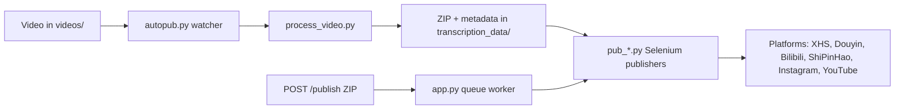

[English](../README.md) · [العربية](README.ar.md) · [Español](README.es.md) · [Français](README.fr.md) · [日本語](README.ja.md) · [한국어](README.ko.md) · [Tiếng Việt](README.vi.md) · [中文 (简体)](README.zh-Hans.md) · [中文（繁體）](README.zh-Hant.md) · [Deutsch](README.de.md) · [Русский](README.ru.md)


[](https://github.com/lachlanchen/lachlanchen/blob/main/figs/banner.png)

# AutoPublish

<p align="center">
  <strong>脚本优先、浏览器驱动的多平台短视频发布方案。</strong><br/>
  <sub>面向安装、运行、队列模式和各平台自动化流程的官方操作手册。</sub>
</p>

[](#prerequisites)
[](#system-overview)
[](#running-the-tornado-service-apppy)
[](#platform-specific-notes)
[](#running-the-tornado-service-apppy)
[](#pwa-frontend-pwa)
[](https://github.com/sponsors/lachlanchen)
[](#table-of-contents)
[](#license)
[](#configuration)
[](#security--ops-checklist)
[](#raspberry-pi--linux-service-setup)

| Jump to | Link |
| --- | --- |
| First-time setup | [Start Here](#start-here) |
| Run with local watcher | [Running the CLI pipeline (`autopub.py`)](#running-the-cli-pipeline-autopubpy) |
| Run via HTTP queue | [Running the Tornado service (`app.py`)](#running-the-tornado-service-apppy) |
| Deploy as service | [Raspberry Pi / Linux Service Setup](#raspberry-pi--linux-service-setup) |
| Support the project | [Support](#support-autopublish) |


仓库刻意保持低层实现风格：大部分配置直接写在 Python 文件与脚本里。这份文档是一本可执行的操作手册，涵盖安装、运行和扩展点。

> ⚙️ **运维理念**：本项目偏好显式脚本和直接浏览器自动化，而非隐式封装层。
> ✅ **本 README 的规范策略**：先保留技术细节，再提升可读性与可发现性。

### Quick Navigation

| I want to... | Go here |
| --- | --- |
| Run my first publish | [Quick Start Checklist](#quick-start-checklist) |
| Compare runtime modes | [Runtime Modes at a Glance](#runtime-modes-at-a-glance) |
| Configure credentials and paths | [Configuration](#configuration) |
| Launch API mode and queue jobs | [Running the Tornado service (`app.py`)](#running-the-tornado-service-apppy) |
| Validate with copy/paste commands | [Examples](#examples) |
| Set up on Raspberry Pi/Linux | [Raspberry Pi / Linux Service Setup](#raspberry-pi--linux-service-setup) |

## Start Here

如果你是首次接触本仓库，请按以下顺序执行：

1. 阅读 [Prerequisites](#prerequisites) 与 [Installation](#installation)。
2. 在 [Configuration](#configuration) 配置密钥与绝对路径。
3. 在 [Preparing Browser Sessions](#preparing-browser-sessions) 中准备浏览器调试会话。
4. 在 [Usage](#usage) 里选择运行模式：`autopub.py`（文件监控）或 `app.py`（HTTP 队列）。
5. 使用 [Examples](#examples) 中的命令进行验证。

## Overview

AutoPublish 目前支持两种正式运行模式：

1. **CLI 监控模式（`autopub.py`）**：基于文件夹输入进行采集和发布。
2. **API 队列模式（`app.py`）**：通过 HTTP 的 ZIP 上传（`/publish`, `/publish/queue`）进行发布。

该项目面向偏好透明、脚本优先流程的操作者，而不是抽象编排平台。

### Runtime Modes at a Glance

| Mode | Entry point | Input | Best for | Output behavior |
| --- | --- | --- | --- | --- |
| CLI watcher | `autopub.py` | Files dropped into `videos/` | 本地操作者流程和 cron/service 循环 | 发现新视频后立即处理并发布到所选平台 |
| API queue service | `app.py` | ZIP upload to `POST /publish` | 与上游系统对接和远端触发 | 接收任务、排入队列，并按 worker 顺序执行发布 |

### Platform Coverage Snapshot

| Platform | Publisher module | Login helper | Control port | CLI mode | API mode |
| --- | --- | --- | --- | --- | --- |
| XiaoHongShu | `pub_xhs.py` | `login_xiaohongshu.py` | `5003` | ✅ | ✅ |
| Douyin | `pub_douyin.py` | `login_douyin.py` | `5004` | ✅ | ✅ |
| Bilibili | `pub_bilibili.py` | N/A | `5005` | ✅ | ✅ |
| ShiPinHao (WeChat Channels) | `pub_shipinhao.py` | `login_shipinhao.py` | `5006` | Optional | ✅ |
| Instagram | `pub_instagram.py` | `login_instagram.py` | `5007` | Optional | ✅ |
| YouTube | `pub_y2b.py` | N/A | `9222` | Optional | ✅ |

## Quick Snapshot

| What | Value |
| --- | --- |
| Primary language | Python 3.10+ |
| Main runtimes | CLI watcher (`autopub.py`) + Tornado queue service (`app.py`) |
| Automation engine | Selenium + remote-debug Chromium sessions |
| Input formats | Raw videos (`videos/`) and ZIP bundles (`/publish`) |
| Current repo workspace path | `/home/lachlan/ProjectsLFS/AutoPublish` |
| Ideal users | 管理多平台短视频流程的创作者/运维工程师 |

### Operational Safety Snapshot

| Topic | Current state | Action |
| --- | --- | --- |
| Hard-coded paths | 仍在多个模块/脚本中存在 | 上线前按主机更新路径常量 |
| Browser login state | 必要 | 为每个平台保留持久化 remote-debug profile |
| Captcha handling | 可选集成可用 | 如有需要配置 2Captcha/Turing 凭据 |
| License declaration | 未检测到顶层 `LICENSE` 文件 | 发布/再分发前先向维护者确认许可 |

### Compatibility & Assumptions

| Item | Current assumption in this repo |
| --- | --- |
| Python | 3.10+ |
| Runtime environment | Linux 桌面/服务器，并可供 Chromium 使用 GUI 显示 |
| Browser control mode | 使用远程调试会话与持久化配置目录 |
| Primary API port | `8081`（`app.py --port`） |
| Processing backend | `upload_url` + `process_url` 必须可访问且返回有效 ZIP |
| Workspace used for this draft | `/home/lachlan/ProjectsLFS/AutoPublish` |

---

## Table of Contents

- [Start Here](#start-here)
- [Overview](#overview)
- [Runtime Modes at a Glance](#runtime-modes-at-a-glance)
- [Platform Coverage Snapshot](#platform-coverage-snapshot)
- [Quick Snapshot](#quick-snapshot)
- [Operational Safety Snapshot](#operational-safety-snapshot)
- [Compatibility & Assumptions](#compatibility--assumptions)
- [System Overview](#system-overview)
- [Features](#features)
- [Project Structure](#project-structure)
- [Repository Layout](#repository-layout)
- [Prerequisites](#prerequisites)
- [Installation](#installation)
- [Configuration](#configuration)
- [Configuration Verification Checklist](#configuration-verification-checklist)
- [Preparing Browser Sessions](#preparing-browser-sessions)
- [Usage](#usage)
- [Examples](#examples)
- [Metadata & ZIP Format](#metadata--zip-format)
- [Data & Artifact Lifecycle](#data--artifact-lifecycle)
- [Platform-Specific Notes](#platform-specific-notes)
- [Raspberry Pi / Linux Service Setup](#raspberry-pi--linux-service-setup)
- [Legacy macOS Scripts](#legacy-macos-scripts)
- [Troubleshooting & Maintenance](#troubleshooting--maintenance)
- [FAQ](#faq)
- [Extending the System](#extending-the-system)
- [Quick Start Checklist](#quick-start-checklist)
- [Development Notes](#development-notes)
- [Roadmap](#roadmap)
- [Contributing](#contributing)
- [Security & Ops Checklist](#security--ops-checklist)
- [License](#license)
- [Acknowledgements](#acknowledgements)
- [Support](#support-autopublish)

---

## System Overview

🎯 **从原始素材到发布帖子的端到端流程**：



流程速览：

1. **原始素材进入**：将视频放到 `videos/`。监控器（`autopub.py` 或调度服务）通过 `videos_db.csv` 与 `processed.csv` 发现新文件。
2. **资产生成**：`process_video.VideoProcessor` 将文件上传到内容处理服务（`upload_url` 和 `process_url`），返回 ZIP 包，包含：
   - 编辑后的/编码后的视频（`<stem>.mp4`）
   - 封面图
   - `{stem}_metadata.json`，含本地化标题、描述、标签等
3. **发布**：`pub_*.py` 里的 Selenium 发布器读取 metadata。每个发布器会通过 remote-debug 端口和持久化 user-data 目录，附着到已启动的 Chromium/Chrome 实例。
4. **Web 控制平面（可选）**：`app.py` 提供 `/publish`，接收预打包的 ZIP，解包后入队给发布器。它也可以刷新浏览器会话并触发登录助手（`login_*.py`）。
5. **支持模块**：`load_env.py` 从 `~/.bashrc` 注入环境变量，`utils.py` 提供通用方法（窗口聚焦、二维码处理、邮件工具），`solve_captcha_*.py` 在验证码出现时接入 Turing/2Captcha。

## Features

✨ **为务实、脚本优先的自动化而设计**：

- 多平台发布：小红书（XiaoHongShu）、抖音（Douyin）、Bilibili、视频号（ShiPinHao）、Instagram、YouTube（可选）。
- 两种运行模式：CLI 监控管道（`autopub.py`）和 API 队列服务（`app.py` + `/publish` + `/publish/queue`）。
- 通过 `ignore_*` 文件提供逐平台的临时禁用开关。
- Remote-debug 浏览器会话复用，使用持久化 profile。
- 可选的二维码/验证码自动化，以及邮件通知工具。
- `pwa/` 上传 UI 无需前端构建。
- Linux/Raspberry Pi 的服务化脚本（`scripts/`）。

### Feature Matrix

| Capability | CLI (`autopub.py`) | API (`app.py`) |
| --- | --- | --- |
| Input source | 本地 `videos/` watcher | 上传 ZIP 到 `POST /publish` |
| Queueing | 文件级内建推进 | 显式内存任务队列 |
| Platform flags | CLI 参数（`--pub-*`）+ `ignore_*` | 查询参数（`publish_*`）+ `ignore_*` |
| Best fit | 单机操作者流程 | 外部系统接入与远程触发 |

---

## Project Structure

仓库的高层源码/运行布局：

```text
AutoPublish/
├── README.md
├── app.py
├── autopub.py
├── process_video.py
├── load_env.py
├── utils.py
├── pub_*.py                  # platform publishers
├── login_*.py                # platform login/session helpers
├── solve_captcha_*.py
├── smtp.py
├── smtp_test_simple.py
├── send_email_qreader.py
├── requirements.txt
├── requirements.autopub.txt
├── .env.example
├── setup_raspberrypi.md
├── scripts/
├── pwa/
├── figs/
├── .github/FUNDING.yml
├── i18n/                     # multilingual READMEs
├── videos/                   # runtime input artifacts
├── logs/, logs-autopub/      # runtime logs
├── temp/, temp_screenshot/   # runtime temp artifacts
├── videos_db.csv
└── processed.csv
```

说明：`transcription_data/` 在处理/发布流程中会按运行时生成。

## Repository Layout

🗂️ **核心模块与作用**：

| Path | Purpose |
| --- | --- |
| `app.py` | Tornado 服务，暴露 `/publish` 和 `/publish/queue`，内置发布队列与 worker 线程。 |
| `autopub.py` | CLI 监控器：扫描 `videos/`，处理新文件，并并行调用发布器。 |
| `process_video.py` | 将视频上传到处理后端并保存返回的 ZIP 包。 |
| `pub_xhs.py`, `pub_douyin.py`, `pub_bilibili.py`, `pub_shipinhao.py`, `pub_instagram.py`, `pub_y2b.py` | 各平台 Selenium 自动化模块。 |
| `login_xiaohongshu.py`, `login_douyin.py`, `login_shipinhao.py`, `login_instagram.py` | 会话校验与二维码登录流程。 |
| `utils.py` | 通用自动化辅助（窗口聚焦、二维码/邮件工具、诊断辅助）。 |
| `load_env.py` | 从 shell 配置文件（`~/.bashrc`）加载环境变量，并脱敏敏感日志。 |
| `smtp.py`, `smtp_test_simple.py`, `send_email_qreader.py` | SMTP/SendGrid 辅助与测试脚本。 |
| `solve_captcha_2captcha.py`, `solve_captcha_turing.py` | 验证码解题服务集成。 |

---

## Prerequisites

🧰 **首次运行前请先安装以下内容**。

### Operating system and tools

- Linux 桌面/服务器并具备 X 会话（示例脚本常见 `DISPLAY=:1`）。
- Chromium/Chrome 及匹配的 ChromeDriver。
- GUI/媒体工具：`xdotool`、`ffmpeg`、`zip`、`unzip`。
- Python 3.10+（venv 或 Conda）。

### Python dependencies

最小运行依赖：

```bash
pip install selenium tornado requests requests-toolbelt sendgrid qreader opencv-python webdriver-manager
```

仓库依赖：

```bash
python -m pip install -r requirements.txt
```

轻量服务依赖（脚本默认使用）：

```bash
python -m pip install -r requirements.autopub.txt
```

`requirements.autopub.txt` 包含：
- `selenium`, `webdriver-manager`, `tornado`, `requests`, `requests-toolbelt`, `sendgrid`, `qreader`, `opencv-python`, `numpy`, `pillow`, `twocaptcha`.

### Optional: create a sudo user

```bash
sudo useradd -m -s /bin/bash -G sudo <USERNAME> && echo "<USERNAME>:<PASSWORD>" | sudo chpasswd
```

---

## Installation

🚀 **在干净环境中执行安装**：

1. 克隆仓库：

```bash
git clone https://github.com/lachlanchen/AutoPublish.git
cd AutoPublish
```

2. 创建并激活虚拟环境（以 `venv` 为例）：

```bash
python3 -m venv .venv
source .venv/bin/activate
python -m pip install -U pip
python -m pip install -r requirements.txt
```

3. 准备环境变量文件：

```bash
cp .env.example .env
# fill values in .env (do not commit)
```

4. 为读取 shell 配置值的脚本加载环境变量：

```bash
source ~/.bashrc
python load_env.py
```

注意：`load_env.py` 以 `~/.bashrc` 为核心；如果你的环境使用其他 shell 配置文件，请按需调整。

---

## Configuration

🔐 **先设置凭据，再校验主机相关路径**。

### Environment variables

仓库从环境变量读取凭据与可选浏览器/运行时路径。先从 `.env.example` 开始：

| Variable | Description |
| --- | --- |
| `FROM_EMAIL`, `TO_EMAIL`, `APP_PASSWORD` | 用于二维码/登录通知的 SMTP 凭据。 |
| `SENDGRID_API_KEY` | SendGrid API 密钥。 |
| `APIKEY_2CAPTCHA` | 2Captcha API 密钥。 |
| `TULING_USERNAME`, `TULING_PASSWORD`, `TULING_ID` | Turing 验证码凭据。 |
| `DOUYIN_LOGIN_PASSWORD` | 抖音二次校验辅助码。 |
| `INSTAGRAM_*`, `CHROME_*`, `CHROMEDRIVER_PATH` | Instagram 与浏览器驱动相关覆盖配置。 |
| `AUTOPUBLISH_BROWSER_BIN`, `AUTOPUBLISH_CHROMEDRIVER`, `AUTOPUBLISH_DISPLAY` | `app.py` 使用的全局浏览器/驱动/显示覆盖。 |

### Path constants (important)

📌 **最常见的启动问题**：硬编码绝对路径未按主机调整。

多个模块仍含硬编码路径，请按你的主机修改：

| File | Constant(s) | Meaning |
| --- | --- | --- |
| `app.py` | `logs_folder_root`, `autopublish_folder_root`, `videos_db_path`, `processed_path`, `transcription_root`, `upload_url`, `process_url`. | API 服务根路径与后端端点。 |
| `autopub.py` | `logs_folder_path`, `autopublish_folder_path`, `videos_db_path`, `processed_path`, `transcription_path`, `upload_url`, `process_url`, `chromedriver_path`. | CLI 监控器根路径与后端端点。 |
| `scripts/run_autopub.sh`, `scripts/setup_autopub.sh` | Python/Conda/repo/log 的绝对路径。 | 旧版/macOS 定向封装脚本。 |
| `utils.py` | 封面处理 helper 中关于 FFmpeg 的路径假设。 | 媒体工具路径兼容性。 |

本仓库关键路径说明：
- 当前仓库路径在本工作区为 `/home/lachlan/ProjectsLFS/AutoPublish`。
- 部分代码和脚本仍引用 `/home/lachlan/Projects/auto-publish` 或 `/Users/lachlan/...`。
- 上线前请在本地保留并修正这些路径。

### Platform toggles via `ignore_*`

🧩 **快速安全开关**：添加 `ignore_*` 文件即可停用某个平台，无需改代码。

发布开关同样受 ignore 文件控制。创建空文件以禁用指定平台：

```bash
touch ignore_xhs ignore_douyin ignore_bilibili ignore_shipinhao ignore_instagram ignore_y2b
```

删除对应文件可重新启用。

### Configuration Verification Checklist

设置 `.env` 与路径常量后，执行以下快速校验：

```bash
python -c "import os;print('AUTOPUBLISH_BROWSER_BIN=', os.getenv('AUTOPUBLISH_BROWSER_BIN'));print('AUTOPUBLISH_CHROMEDRIVER=', os.getenv('AUTOPUBLISH_CHROMEDRIVER'));print('DISPLAY=', os.getenv('DISPLAY') or os.getenv('AUTOPUBLISH_DISPLAY'))"
python -c "from load_env import load_env_from_bashrc; load_env_from_bashrc(); print('Environment load OK')"
python -c "import os; p=os.getenv('AUTOPUBLISH_CHROMEDRIVER') or os.getenv('CHROMEDRIVER_PATH') or '/usr/bin/chromedriver'; print(p, 'exists=', os.path.exists(p))"
```

若任一值缺失，请在 `.env`、`~/.bashrc` 或脚本级常量中补齐后再运行。

---

## Preparing Browser Sessions

🌐 **可靠 Selenium 发布的前提是会话持久化**。

1. 创建专用配置目录：

```bash
mkdir -p ~/chromium_dev_session_{5003,5004,5005,5006,5007,9222}
mkdir -p ~/chromium_dev_session_logs
```

2. 使用 remote debugging 启动浏览器（以小红书为例）：

```bash
DISPLAY=:1 chromium-browser \
  --remote-debugging-port=5003 \
  --user-data-dir="$HOME/chromium_dev_session_5003" \
  https://creator.xiaohongshu.com/creator/post \
  > "$HOME/chromium_dev_session_logs/chromium_xhs.log" 2>&1 &
```

3. 每个平台/每个 profile 手动登录一次。

4. 验证 Selenium 可附着：

```python
from selenium import webdriver
opts = webdriver.ChromeOptions()
opts.add_experimental_option("debuggerAddress", "127.0.0.1:5003")
driver = webdriver.Chrome(options=opts)
print(driver.title)
driver.quit()
```

安全提示：
- `app.py` 目前包含一个硬编码的 sudo 密码占位符（`password = "1"`）用于浏览器重启逻辑。请在真实部署前替换。

---

## Usage

▶️ **支持两种运行模式**：CLI 监控器和 API 队列服务。

### Running the CLI pipeline (`autopub.py`)

1. 将源视频放入 `videos/`（或你配置的 `autopublish_folder_path`）。
2. 执行：

```bash
python autopub.py --use-cache --pub-xhs --pub-douyin --pub-bilibili
```

参数说明：

| Flag | Meaning |
| --- | --- |
| `--pub-xhs`, `--pub-douyin`, `--pub-bilibili` | 仅发布到指定平台。若不传则默认启用三者全部。 |
| `--test` | 向发布器传递测试模式（各平台实现行为可能不同）。 |
| `--use-cache` | 如果可用，则复用现有 `transcription_data/<video>/<video>.zip`。 |

CLI 每个视频执行流程：
- 通过 `process_video.py` 上传并处理。
- 将 ZIP 解压到 `transcription_data/<video>/`。
- 通过 `ThreadPoolExecutor` 启动选定发布器。
- 将追踪状态写入 `videos_db.csv` 和 `processed.csv`。

### Running the Tornado service (`app.py`)

🛰️ **API 模式适用于生产 ZIP 包的外部系统**。

启动服务：

```bash
python app.py --refresh-time 1800 --port 8081
```

API 接口汇总：

| Endpoint | Method | Purpose |
| --- | --- | --- |
| `/publish` | `POST` | 上传 ZIP 字节并入队发布任务 |
| `/publish/queue` | `GET` | 查看队列、任务历史与发布状态 |

### `POST /publish`

📤 **上传 ZIP 字节直接入队发布任务**。

- Header: `Content-Type: application/octet-stream`
- 必需 query/form 参数：`filename`（ZIP 文件名）
- 可选布尔参数：`publish_xhs`, `publish_douyin`, `publish_bilibili`, `publish_shipinhao`, `publish_instagram`, `publish_y2b`, `test`
- Body: 原始 ZIP 字节

示例：

```bash
curl -X POST "http://localhost:8081/publish?filename=demo.zip&publish_xhs=true&publish_instagram=true&publish_y2b=true" \
  --data-binary @demo.zip \
  -H "Content-Type: application/octet-stream"
```

当前代码行为：
- 请求会被接受并入队。
- 即时响应返回包含 `status: queued`、`job_id`、`queue_size` 的 JSON。
- Worker 线程按顺序处理队列任务。

### `GET /publish/queue`

📊 **观察队列健康与进行中的任务**。

返回队列/历史 JSON：

```bash
curl "http://localhost:8081/publish/queue"
```

返回字段包括：
- `status`, `jobs`, `queue_size`, `is_publishing`。

### Browser refresh thread

♻️ 周期性刷新浏览器可降低长时间运行下会话陈旧导致的失败。

`app.py` 按 `--refresh-time` 周期运行后台刷新线程，并挂接登录检查。刷新 sleep 包含随机延迟。

### PWA frontend (`pwa/`)

🖥️ 轻量静态 UI，用于手动上传 ZIP 和查看队列。

本地启动静态页面：

```bash
cd pwa
python -m http.server 5173
```

打开 `http://localhost:5173` 并设置后端 base URL（如 `http://lazyingart:8081`）。

PWA 功能：
- 拖拽 ZIP 预览。
- 发布目标切换与测试模式。
- 提交到 `/publish` 并轮询 `/publish/queue`。

### Command Palette

🧷 **常用命令集中展示**。

| Task | Command |
| --- | --- |
| Install full dependencies | `python -m pip install -r requirements.txt` |
| Install lightweight runtime dependencies | `python -m pip install -r requirements.autopub.txt` |
| Load shell-based env vars | `source ~/.bashrc && python load_env.py` |
| Start API queue server | `python app.py --refresh-time 1800 --port 8081` |
| Start CLI watcher pipeline | `python autopub.py --use-cache --pub-xhs --pub-douyin --pub-bilibili` |
| Submit ZIP to queue | `curl -X POST "http://localhost:8081/publish?filename=demo.zip" --data-binary @demo.zip -H "Content-Type: application/octet-stream"` |
| Inspect queue status | `curl -s "http://localhost:8081/publish/queue"` |
| Serve local PWA | `cd pwa && python -m http.server 5173` |

---

## Examples

🧪 **可直接复制运行的 smoke test 命令**：

### Example 0: Load environment and start API server

```bash
source ~/.bashrc
python load_env.py
python app.py --refresh-time 1800 --port 8081
```

### Example A: CLI publish run

```bash
python autopub.py --pub-xhs --pub-douyin --use-cache
```

### Example B: API publish run (single ZIP)

```bash
curl -X POST "http://localhost:8081/publish?filename=my_bundle.zip&publish_bilibili=true&test=true" \
  --data-binary @my_bundle.zip \
  -H "Content-Type: application/octet-stream"
```

### Example C: Check queue status

```bash
curl -s "http://localhost:8081/publish/queue"
```

### Example D: SMTP helper smoke test

```bash
python smtp.py
python smtp_test_simple.py
```

---

## Metadata & ZIP Format

📦 **ZIP 契约很重要**：文件名与 metadata key 必须与发布器预期一致。

最小期望 ZIP 内容：

```text
<stem>_metadata.json
<video_filename>.mp4
<cover_filename>.jpg
```

`metadata` 驱动中国平台发布；可选的 `metadata["english_version"]` 用于 YouTube 发布器。

模块常用字段：
- `title`, `brief_description`, `middle_description`, `long_description`
- `tags`（标签列表）
- `video_filename`, `cover_filename`
- 各平台 `pub_*.py` 中实现的特定字段

如果你从外部生成 ZIP，请确保 key 和文件名与模块预期一致。

## Data & Artifact Lifecycle

流水线会生成本地产物，建议保留、轮换或清理：

| Artifact | Location | Produced by | Why it matters |
| --- | --- | --- | --- |
| Input videos | `videos/` | 手动放入或上游同步 | CLI 监控模式的源素材 |
| Processing ZIP output | `transcription_data/<stem>/<stem>.zip` | `process_video.py` | 为 `--use-cache` 提供可复用负载 |
| Extracted publish assets | `transcription_data/<stem>/...` | `autopub.py` / `app.py` 中解 ZIP | 发布器可直接使用的文件和 metadata |
| Publish logs | `logs/`, `logs-autopub/` | CLI/API 运行时 | 故障排查与审计 |
| Browser logs | `~/chromium_dev_session_logs/*.log`（或 chrome 前缀） | 浏览器启动脚本 | 排查会话/端口/启动问题 |
| Tracking CSVs | `videos_db.csv`, `processed.csv` | CLI 监控器 | 避免重复处理 |

建议的运维动作：
- 增加定期清理/归档任务，处理旧的 `transcription_data/`、`temp/` 和旧日志，避免磁盘耗尽。

## Platform-Specific Notes

🧭 **各发布器端口与归属模块**：

| Platform | Port | Module(s) | Notes |
| --- | --- | --- | --- |
| XiaoHongShu | 5003 | `pub_xhs.py`, `login_xiaohongshu.py` | 支持二维码重登录；标题清洗与 hashtag 使用来自 metadata。 |
| Douyin | 5004 | `pub_douyin.py`, `login_douyin.py` | 上传完成检查与重试路径对平台变更较敏感；请密切关注日志。 |
| Bilibili | 5005 | `pub_bilibili.py` | 可通过 `solve_captcha_2captcha.py` 与 `solve_captcha_turing.py` 接入验证码。 |
| ShiPinHao (WeChat Channels) | 5006 | `pub_shipinhao.py`, `login_shipinhao.py` | 快速二维码确认对会话刷新稳定性很关键。 |
| Instagram | 5007 | `pub_instagram.py`, `login_instagram.py` | 在 API 模式使用 `publish_instagram=true` 控制；`.env.example` 中有相关变量。 |
| YouTube | 9222 | `pub_y2b.py` | 使用 `english_version` metadata 块；可通过 `ignore_y2b` 禁用。 |

## Raspberry Pi / Linux Service Setup

🐧 **适用于 24/7 常驻主机**。

完整主机引导请参考 [`setup_raspberrypi.md`](setup_raspberrypi.md)。

快速流水线配置：

```bash
export AUTOPUB_USER=<USERNAME>
export AUTOPUB_REPO=/home/<USERNAME>/Projects/autopub
sudo -E ./scripts/setup_autopub_pipeline.sh
```

该流程会编排：
- `scripts/setup_envs.sh`
- `scripts/setup_virtual_desktop_service.sh`
- `scripts/download_and_setup_driver.sh`
- `scripts/setup_autopub_service.sh`

手动在 tmux 中启动服务：

```bash
./scripts/start_autopub_tmux.sh
```

验证服务与端口：

```bash
systemctl status autopub.service autopub-vnc.service
sudo ss -ltnp | grep 590
```

兼容性说明：
- 部分旧文档/脚本仍使用 `virtual-desktop.service`；当前仓库安装的是 `autopub-vnc.service`。

## Legacy macOS Scripts

🍎 仓库仍保留旧版 macOS 兼容封装。

该仓库仍包含老式 macOS 取向封装脚本：
- `scripts/run_autopub.sh`
- `scripts/setup_autopub.sh`

这些脚本中包含绝对 `/Users/lachlan/...` 路径和 Conda 假设。如果你依赖该流程，可继续保留，但需按主机更新路径、venv 和工具链。

## Troubleshooting & Maintenance

🛠️ **出现问题时，先从这里开始**。

- **跨主机路径漂移**：若报错显示缺少 `/Users/lachlan/...` 或 `/home/lachlan/Projects/auto-publish` 下文件，请将常量调整到当前主机路径（本工作区为 `/home/lachlan/ProjectsLFS/AutoPublish`）。
- **凭据管理**：推送前运行 `~/.local/bin/detect-secrets scan`。如有泄露需立即轮换凭据。
- **处理后端错误**：如果 `process_video.py` 打印 “Failed to get the uploaded file path,”，请确认上传响应 JSON 包含 `file_path` 且处理端点返回 ZIP 二进制。
- **ChromeDriver 不匹配**：若出现 DevTools 连接错误，请对齐 Chrome/Chromium 与驱动版本（或改用 `webdriver-manager`）。
- **浏览器焦点问题**：`bring_to_front` 依赖窗口标题匹配（Chromium/Chrome 的命名差异可能导致失效）。
- **验证码中断**：配置 2Captcha/Turing 凭据，并在需要处接入 solver 输出。
- **过期锁文件**：如果定时运行始终不启动，检查进程状态并移除陈旧 `autopub.lock`（旧脚本流程）。
- **建议查看日志**：`logs/`, `logs-autopub/`, `~/chromium_dev_session_logs/*.log`，以及服务 journal 日志。

## FAQ

**Q: 可以同时运行 API 模式和 CLI 监控模式吗？**
A: 可以，但不推荐，除非你已明确隔离输入与浏览器会话。两种模式会竞争同一批发布器、文件和端口。

**Q: 为什么 `/publish` 返回 queued 但暂时没看到发布结果？**
A: `app.py` 先入队任务，再由后台 worker 串行处理。请查看 `/publish/queue`、`is_publishing` 以及服务日志。

**Q: 我已经有 `.env`，还需要 `load_env.py` 吗？**
A: `start_autopub_tmux.sh` 会在存在 `.env` 时读取；部分直接运行方式仍依赖 shell 环境变量。建议保持 `.env` 与 shell 导出值一致。

**Q: API 上传的 ZIP 最低契约是什么？**
A: 需要合法 ZIP，包含 `{stem}_metadata.json`，并且视频和封面文件名与 metadata key（`video_filename`, `cover_filename`）匹配。

**Q: 是否支持无头模式？**
A: 某些模块定义了 headless 相关变量，但本项目主文档和首选运行方式是使用带 GUI 的持久化浏览器会话。

## Extending the System

🧱 **新平台与更稳健运维的扩展点**：

- **新增平台**：复制一个 `pub_*.py` 模块，更新 selector/流程，必要时添加 `login_*.py` 供二维码重认证，然后在 `app.py` 与 `autopub.py` 中接入平台参数与队列。
- **配置抽象**：将分散常量迁移到结构化配置（`config.yaml`/`.env` + 类型化模型），以支持多主机。
- **凭据加固**：用更安全的方式替换硬编码或 shell 暴露敏感流程（`sudo -A`、keychain、vault/secret manager）。
- **容器化**：把 Chromium/ChromeDriver、Python 运行时和虚拟显示打包为可部署单元，便于云端/服务器使用。

## Quick Start Checklist

✅ **第一次成功发布的最小路径**。

1. 克隆仓库并安装依赖（`pip install -r requirements.txt` 或轻量 `requirements.autopub.txt`）。
2. 更新 `app.py`、`autopub.py` 及你会运行的脚本中的硬编码路径常量。
3. 在 shell 配置或 `.env` 中导出所需凭据；运行 `python load_env.py` 验证加载。
4. 创建 remote-debug 浏览器 profile 文件夹，并启动每个平台一次。
5. 在各目标平台 profile 中完成手动登录。
6. 启动 API 模式（`python app.py --port 8081`）或 CLI 模式（`python autopub.py --use-cache ...`）。
7. 提交一个样本 ZIP（API）或样本视频（CLI）并检查 `logs/`。
8. 每次提交前执行密钥扫描。

## Development Notes

🧬 **当前开发基线**（手工格式化 + smoke test）。

- Python 风格沿用既有 4 空格缩进和手工格式。
- 当前仓库没有完整自动化测试体系；依赖 smoke test：
  - 使用 `autopub.py` 处理一支样本视频；
  - 向 `/publish` 提交一个 ZIP 并观察 `/publish/queue`；
  - 手动验证每个目标平台。
- 新增脚本时请包含一个简短 `if __name__ == "__main__":` 入口，便于快速 dry-run。
- 尽量隔离平台变更（`pub_*`、`login_*`、`ignore_*` 切换）。
- 运行期产物（`videos/*`、`logs*/*`、`transcription_data/*`、`ignore_*`）通常是本地数据，大多被 git 忽略。

## Roadmap

🗺️ **基于当前代码约束整理的优先改进项**。

规划/期望改进（基于当前代码结构与现有注释）：

1. 用集中式配置（`.env`/YAML + 类型模型）替换散落的硬编码路径。
2. 去除硬编码 sudo 密码写法，改为更安全的进程控制机制。
3. 通过更强重试与更好的 UI 状态检测提升平台发布稳定性。
4. 扩展平台支持（例如快手或其他创作者平台）。
5. 将运行环境封装为可复现部署单元（容器 + 虚拟显示 profile）。
6. 增加 ZIP 契约与队列执行的自动化集成检查。

## Contributing

🤝 **请保持 PR 聚焦、可复现，并明确运行时假设**。

欢迎贡献。

1. Fork 并创建聚焦分支。
2. 保持提交粒度小，并使用祈使句（历史示例："Wait for YouTube checks before publishing"）。
3. 在 PR 中加入手动验收说明：
   - 环境假设
   - 浏览器/会话重启情况
   - UI 流程变更相关日志或截图
4. 不要提交真实凭据（`.env` 会被忽略，`.env.example` 仅用于结构示例）。

若新增发布模块，请一并接入：
- `pub_<platform>.py`
- 可选 `login_<platform>.py`
- `app.py` 的 API 参数与队列处理
- `autopub.py` 中的 CLI 路径（如需要）
- `ignore_<platform>` 切换逻辑
- README 更新

## Security & Ops Checklist

进入生产级运行前请先完成：

1. 确认本地存在 `.env` 且未纳入 git。
2. 清理/轮换历史遗留可能泄露的凭据。
3. 替换代码中的敏感占位值（例如 `app.py` 中的 sudo 密码占位）。
4. 确认批量运行前 `ignore_*` 开关符合预期。
5. 确保各平台浏览器 profile 隔离，且使用最小权限账号。
6. 确认日志发布前不泄漏敏感信息。
7. 推送前运行 `detect-secrets`（或同类工具）。

<a id="support-autopublish"></a>
## ❤️ Support

| Donate | PayPal | Stripe |
|---|---|---|
| [](https://chat.lazying.art/donate) | [](https://paypal.me/RongzhouChen) | [](https://buy.stripe.com/aFadR8gIaflgfQV6T4fw400) |

💖 社区支持资金用于基础设施、稳定性工程和新增平台集成。

AutoPublish 属于更大范围的开源创作者工具链，目标是保持跨平台发布能力可维护、可扩展、可改造。捐助可用于：

- 保持 Selenium 节点、处理 API 与云端 GPU 持续在线。
- 推进新发布器（如快手、Instagram Reels 等）并修复现有机器人稳定性。
- 输出更多文档、启动脚本和独立创作者教程。

## License

当前仓库快照内未检测到 `LICENSE` 文件。

本草案当前假设：
- 在维护者补充正式许可文件前，使用与再分发均为未定义。

建议后续行动：
- 添加顶层 `LICENSE`（如 MIT/Apache-2.0/GPL-3.0）并同步更新本段说明。

> 📝 在添加许可证文件前，请将商业/内部再分发假设视为待确认事项，并直接向维护者确认。

---

## Acknowledgements

- 维护者与赞助主页：[ @lachlanchen](https://github.com/lachlanchen)
- 赞助配置来源：[` .github/FUNDING.yml`](.github/FUNDING.yml)
- 仓库引用的生态服务：Selenium、Tornado、SendGrid、2Captcha、Turing captcha APIs。
