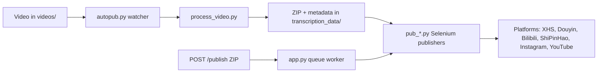

[English](../README.md) · [العربية](README.ar.md) · [Español](README.es.md) · [Français](README.fr.md) · [日本語](README.ja.md) · [한국어](README.ko.md) · [Tiếng Việt](README.vi.md) · [中文 (简体)](README.zh-Hans.md) · [中文（繁體）](README.zh-Hant.md) · [Deutsch](README.de.md) · [Русский](README.ru.md)


[](https://github.com/lachlanchen/lachlanchen/blob/main/figs/banner.png)

<div align="center">

# AutoPublish

<p align="center">
  <strong>脚本优先、浏览器驱动的多平台短视频发布方案。</strong><br/>
  <sub>适用于安装、运行、队列模式与各平台自动化流程的权威操作手册。</sub>
</p>

</div>

[](#prerequisites)
[](#system-overview)
[](#running-the-tornado-service-apppy)
[](#platform-specific-notes)
[](#running-the-tornado-service-apppy)
[](#pwa-frontend-pwa)
[](https://github.com/sponsors/lachlanchen)
[](#table-of-contents)
[](#license)
[](#configuration)
[](#security--ops-checklist)
[](#raspberry-pi--linux-service-setup)

[](#usage)
[](#preparing-browser-sessions)
[](#metadata--zip-format)

| Jump to | Link |
| --- | --- |
| 首次设置 | [Start Here](#start-here) |
| 本地 watcher 方式运行 | [Running the CLI pipeline (`autopub.py`)](#running-the-cli-pipeline-autopubpy) |
| 通过 HTTP 队列运行 | [Running the Tornado service (`app.py`)](#running-the-tornado-service-apppy) |
| 部署为服务 | [Raspberry Pi / Linux Service Setup](#raspberry-pi--linux-service-setup) |
| 支持项目 | [Support](#support-autopublish) |

面向多平台短视频发布的自动化工具：支持中国及国际创作平台。项目由 Tornado 服务、Selenium 自动化机器人和本地文件监听工作流组成，通过将视频放入目录，最终将内容发布到小红书、抖音、B 站、微信视频号、Instagram 以及可选的 YouTube。

仓库刻意保持底层透明：大多数配置放在 Python 文件与 shell 脚本里。本文档是一本操作手册，覆盖安装、运行与扩展点。

> ⚙️ **运维理念**：本项目倾向于使用明确可见的脚本和直接浏览器自动化，而非隐藏的抽象层。
> ✅ **本 README 的规范策略**：先保留技术细节，再提升可读性和可发现性。

### Quick Navigation

| 我想要... | 前往 |
| --- | --- |
| 执行首次发布 | [Quick Start Checklist](#quick-start-checklist) |
| 对比运行模式 | [Runtime Modes at a Glance](#runtime-modes-at-a-glance) |
| 配置凭据与路径 | [Configuration](#configuration) |
| 启动 API 模式与队列任务 | [Running the Tornado service (`app.py`)](#running-the-tornado-service-apppy) |
| 使用可复制命令进行验证 | [Examples](#examples) |
| 在 Raspberry Pi/Linux 上部署 | [Raspberry Pi / Linux Service Setup](#raspberry-pi--linux-service-setup) |

## Start Here

如果你是第一次接触本仓库，请按以下顺序执行：

1. 阅读 [Prerequisites](#prerequisites) 和 [Installation](#installation)。
2. 在 [Configuration](#configuration) 中配置凭据和绝对路径。
3. 在 [Preparing Browser Sessions](#preparing-browser-sessions) 中准备浏览器调试会话。
4. 在 [Usage](#usage) 里选择一种运行模式：`autopub.py`（watcher）或 `app.py`（API queue）。
5. 用 [Examples](#examples) 中的命令验证。

## Overview

AutoPublish 目前支持两种生产环境运行模式：

<div align="center">


</div>

1. **CLI watcher 模式（`autopub.py`）**：基于文件夹的采集与发布。
2. **API queue 模式（`app.py`）**：通过 HTTP（`/publish`、`/publish/queue`）使用 ZIP 的 API 发布。

该项目更适合偏向透明、脚本优先的操作者，而非抽象编排平台。

### Runtime Modes at a Glance

| 模式 | 入口 | 输入 | 最佳场景 | 输出行为 |
| --- | --- | --- | --- | --- |
| CLI watcher | `autopub.py` | 放入 `videos/` 的文件 | 本地操作者流程与 cron/service 循环 | 发现视频后立即处理并发布到所选平台 |
| API queue 服务 | `app.py` | 上传 ZIP 到 `POST /publish` | 与上游系统集成与远程触发 | 接收作业后入队，并由 worker 按顺序执行 |

### Platform Coverage Snapshot

| 平台 | 发布模块 | 登录辅助 | 控制端口 | CLI 模式 | API 模式 |
| --- | --- | --- | --- | --- | --- |
| XiaoHongShu | `pub_xhs.py` | `login_xiaohongshu.py` | `5003` | ✅ | ✅ |
| Douyin | `pub_douyin.py` | `login_douyin.py` | `5004` | ✅ | ✅ |
| Bilibili | `pub_bilibili.py` | N/A | `5005` | ✅ | ✅ |
| ShiPinHao (WeChat Channels) | `pub_shipinhao.py` | `login_shipinhao.py` | `5006` | Optional | ✅ |
| Instagram | `pub_instagram.py` | `login_instagram.py` | `5007` | Optional | ✅ |
| YouTube | `pub_y2b.py` | N/A | `9222` | Optional | ✅ |

## Quick Snapshot

| 项目 | 数值 | 颜色提示 |
| --- | --- | --- |
| 主要语言 | Python 3.10+ |  |
| 主要运行模式 | CLI watcher（`autopub.py`）+ Tornado 队列服务（`app.py`） |  |
| 自动化引擎 | Selenium + remote-debug Chromium 会话 |  |
| 输入格式 | 原始视频（`videos/`）与 ZIP 包（`/publish`） |  |
| 当前仓库路径 | `/home/lachlan/ProjectsLFS/AutoPublish` |  |
| 目标用户 | 多平台短视频流程的创作者 / 运营工程师 |  |

### Operational Safety Snapshot

| 主题 | 当前状态 | 动作 |
| --- | --- | --- |
| 硬编码路径 | 在多个模块/脚本中仍然存在 | 上线前按主机更新路径常量 |
| 浏览器登录状态 | 必要 | 为每个平台保留持久化 remote-debug profile |
| 验证码处理 | 可选集成可用 | 若有需要配置 2Captcha/Turing 凭据 |
| 许可证说明 | 未检测到顶层 `LICENSE` 文件 | 发布前先与维护者确认使用条款 |

### Compatibility & Assumptions

| 项目 | 仓库当前假设 |
| --- | --- |
| Python | 3.10+ |
| 运行环境 | 可用 GUI 的 Linux 桌面/服务器 |
| 浏览器控制模式 | 带持久化 profile 目录的远程调试会话 |
| 主要 API 端口 | `8081`（`app.py --port`） |
| 处理后端 | `upload_url` 与 `process_url` 可访问并返回有效 ZIP |
| 本草案使用的工作区 | `/home/lachlan/ProjectsLFS/AutoPublish` |

---

## Table of Contents

- [Start Here](#start-here)
- [Overview](#overview)
- [Runtime Modes at a Glance](#runtime-modes-at-a-glance)
- [Platform Coverage Snapshot](#platform-coverage-snapshot)
- [Quick Snapshot](#quick-snapshot)
- [Operational Safety Snapshot](#operational-safety-snapshot)
- [Compatibility & Assumptions](#compatibility--assumptions)
- [System Overview](#system-overview)
- [Features](#features)
- [Project Structure](#project-structure)
- [Repository Layout](#repository-layout)
- [Prerequisites](#prerequisites)
- [Installation](#installation)
- [Configuration](#configuration)
- [Configuration Verification Checklist](#configuration-verification-checklist)
- [Preparing Browser Sessions](#preparing-browser-sessions)
- [Usage](#usage)
- [Examples](#examples)
- [Metadata & ZIP Format](#metadata--zip-format)
- [Data & Artifact Lifecycle](#data--artifact-lifecycle)
- [Platform-Specific Notes](#platform-specific-notes)
- [Raspberry Pi / Linux Service Setup](#raspberry-pi--linux-service-setup)
- [Legacy macOS Scripts](#legacy-macos-scripts)
- [Troubleshooting & Maintenance](#troubleshooting--maintenance)
- [FAQ](#faq)
- [Extending the System](#extending-the-system)
- [Quick Start Checklist](#quick-start-checklist)
- [Development Notes](#development-notes)
- [Roadmap](#roadmap)
- [Contributing](#contributing)
- [Security & Ops Checklist](#security--ops-checklist)
- [License](#license)
- [Acknowledgements](#acknowledgements)
- [❤️ Support](#support-autopublish)

---

## System Overview

🎯 **从原始媒体到正式发布的端到端流程**：



流程概览：

1. **原始素材接入**：将视频放入 `videos/`。监听器（`autopub.py` 或调度器/服务）通过 `videos_db.csv` 与 `processed.csv` 发现新文件。
2. **素材产出**：`process_video.VideoProcessor` 会将文件上传到内容处理服务（`upload_url` 与 `process_url`），并返回一个 ZIP，内含：
   - 已编辑/转码后的视频（`<stem>.mp4`）
   - 封面图片
   - 包含本地化标题、简介、标签等的 `{stem}_metadata.json`
3. **发布**：`pub_*.py` 中的 Selenium 发布器读取元数据。每个发布器会使用远程调试端口和持久化 user-data 目录，附着到已启动的 Chromium/Chrome 实例。
4. **Web 控制平面（可选）**：`app.py` 提供 `/publish`，接收预先打包的 ZIP、解包后入队并交给同一套发布器执行。同时也会刷新浏览器会话并触发登录辅助工具（`login_*.py`）。
5. **支持模块**：`load_env.py` 从 `~/.bashrc` 注入环境变量；`utils.py` 提供助手函数（窗口聚焦、二维码处理、邮件工具）；`solve_captcha_*.py` 在验证码出现时接入 Turing/2Captcha。

## Features

✨ **面向实用、脚本优先自动化**：

- 多平台发布：XiaoHongShu、Douyin、Bilibili、ShiPinHao（微信视频号）、Instagram、YouTube（可选）。
- 两种运行模式：CLI watcher 流水线（`autopub.py`）和 API 队列服务（`app.py` + `/publish` + `/publish/queue`）。
- 通过 `ignore_*` 文件实现按平台的临时禁用开关。
- 远程调试会话重用，带持久化 profile。
- 可选 QR/验证码自动化与邮件通知辅助。
- 内置 PWA（`pwa/`）上传界面无需前端构建。
- 提供 Linux/Raspberry Pi 自动化脚本（`scripts/`）。

### Feature Matrix

| 能力 | CLI（`autopub.py`） | API（`app.py`） |
| --- | --- | --- |
| 输入源 | 本地 `videos/` 监听 | 通过 `POST /publish` 上传 ZIP |
| 队列 | 基于文件的内部进度 | 显式内存作业队列 |
| 平台参数 | CLI 参数（`--pub-*`）+ `ignore_*` | 查询参数（`publish_*`）+ `ignore_*` |
| 最佳场景 | 单机操作流程 | 外部系统集成与远程触发 |

---

## Project Structure

整体源码与运行时布局：

```text
AutoPublish/
├── README.md
├── app.py
├── autopub.py
├── process_video.py
├── load_env.py
├── utils.py
├── pub_*.py                  # platform publishers
├── login_*.py                # platform login/session helpers
├── solve_captcha_*.py
├── smtp.py
├── smtp_test_simple.py
├── send_email_qreader.py
├── requirements.txt
├── requirements.autopub.txt
├── .env.example
├── setup_raspberrypi.md
├── scripts/
├── pwa/
├── figs/
├── .github/FUNDING.yml
├── i18n/                     # multilingual READMEs
├── videos/                   # runtime input artifacts
├── logs/, logs-autopub/      # runtime logs
├── temp/, temp_screenshot/   # runtime temp artifacts
├── videos_db.csv
└── processed.csv
```

说明：`transcription_data/` 在运行时会被处理/发布流程使用，执行后可能出现。

## Repository Layout

🗂️ **关键模块及用途**：

| 路径 | 用途 |
| --- | --- |
| `app.py` | Tornado 服务，暴露 `/publish` 与 `/publish/queue`，包含发布队列和 worker 线程。 |
| `autopub.py` | CLI watcher：扫描 `videos/`，处理新文件，并并行调用各发布器。 |
| `process_video.py` | 将视频上传到处理后端并保存返回的 ZIP 包。 |
| `pub_xhs.py`, `pub_douyin.py`, `pub_bilibili.py`, `pub_shipinhao.py`, `pub_instagram.py`, `pub_y2b.py` | 每个平台对应的 Selenium 自动化模块。 |
| `login_xiaohongshu.py`, `login_douyin.py`, `login_shipinhao.py`, `login_instagram.py` | 会话检查与 QR 登录流程。 |
| `utils.py` | 通用自动化辅助（窗口聚焦、二维码/邮件工具、诊断工具）。 |
| `load_env.py` | 从 shell 配置（`~/.bashrc`）读取环境变量并对敏感日志进行掩码。 |
| `smtp.py`, `smtp_test_simple.py`, `send_email_qreader.py` | SMTP/SendGrid 辅助与测试脚本。 |
| `solve_captcha_2captcha.py`, `solve_captcha_turing.py` | 验证码 solver 集成。 |
| `scripts/` | 服务化与运维脚本（Raspberry Pi/Linux + legacy 自动化）。 |
| `pwa/` | 供 ZIP 预览与提交发布的静态 PWA。 |
| `setup_raspberrypi.md` | Raspberry Pi 配置分步说明。 |
| `.env.example` | 环境变量模板（凭据、路径、验证码密钥）。 |
| `.github/FUNDING.yml` | sponsor/funding 配置。 |
| `logs/`, `logs-autopub/`, `temp/`, `temp_screenshot/`, `videos/` | 运行产物与日志（多数在 .gitignore 中）。 |

---

## Prerequisites

🧰 **首次运行前请先安装**。

### Operating system and tools

- Linux 桌面/服务器并具备 X 会话（脚本中的常见设置是 `DISPLAY=:1`）。
- Chromium/Chrome 与匹配的 ChromeDriver。
- GUI/媒体工具：`xdotool`、`ffmpeg`、`zip`、`unzip`。
- Python 3.10+（venv 或 Conda）。

### Python dependencies

最小运行依赖：

```bash
pip install selenium tornado requests requests-toolbelt sendgrid qreader opencv-python webdriver-manager
```

仓库统一依赖：

```bash
python -m pip install -r requirements.txt
```

轻量服务安装（默认供 setup 脚本使用）：

```bash
python -m pip install -r requirements.autopub.txt
```

`requirements.autopub.txt` 包含：
- `selenium`、`webdriver-manager`、`tornado`、`requests`、`requests-toolbelt`、`sendgrid`、`qreader`、`opencv-python`、`numpy`、`pillow`、`twocaptcha`。

### Optional: create a sudo user

```bash
sudo useradd -m -s /bin/bash -G sudo <USERNAME> && echo "<USERNAME>:<PASSWORD>" | sudo chpasswd
```

---

## Installation

🚀 **从全新机器进行安装**：

1. 克隆仓库：

```bash
git clone https://github.com/lachlanchen/AutoPublish.git
cd AutoPublish
```

2. 创建并激活环境（以 `venv` 为例）：

```bash
python3 -m venv .venv
source .venv/bin/activate
python -m pip install -U pip
python -m pip install -r requirements.txt
```

3. 准备环境变量：

```bash
cp .env.example .env
# 填写 .env（切勿提交）
```

4. 加载 shell 环境变量，供读取脚本使用：

```bash
source ~/.bashrc
python load_env.py
```

说明：`load_env.py` 以 `~/.bashrc` 为默认实现；若使用其他 shell profile，请按实际调整。

---

## Configuration

🔐 **先配置凭据，再确认主机相关路径**。

### Environment variables

项目使用环境变量读取凭据与可选的浏览器/运行参数。先从 `.env.example` 起步：

| 变量 | 说明 |
| --- | --- |
| `FROM_EMAIL`, `TO_EMAIL`, `APP_PASSWORD` | 用于二维码/登录通知的 SMTP 凭据。 |
| `SENDGRID_API_KEY` | 使用 SendGrid API 时所需的 key。 |
| `APIKEY_2CAPTCHA` | 2Captcha 的 API key。 |
| `TULING_USERNAME`, `TULING_PASSWORD`, `TULING_ID` | Turing 验证码凭据。 |
| `DOUYIN_LOGIN_PASSWORD` | 抖音二次校验辅助。 |
| `INSTAGRAM_*`, `CHROME_*`, `CHROMEDRIVER_PATH` | Instagram 与浏览器驱动覆盖参数。 |
| `AUTOPUBLISH_BROWSER_BIN`, `AUTOPUBLISH_CHROMEDRIVER`, `AUTOPUBLISH_DISPLAY` | `app.py` 中的全局浏览器/驱动/显示覆盖。 |

### Path constants (important)

📌 **最常见的启动问题**：硬编码绝对路径未对齐。

部分模块仍保留硬编码路径，需按你的主机调整：

| 文件 | 常量 | 含义 |
| --- | --- | --- |
| `app.py` | `logs_folder_root`, `autopublish_folder_root`, `videos_db_path`, `processed_path`, `transcription_root`, `upload_url`, `process_url`. | API 服务根路径与后端 endpoint。 |
| `autopub.py` | `logs_folder_path`, `autopublish_folder_path`, `videos_db_path`, `processed_path`, `transcription_path`, `upload_url`, `process_url`, `chromedriver_path`. | CLI watcher 根路径与后端 endpoint。 |
| `scripts/run_autopub.sh`, `scripts/setup_autopub.sh` | Python/Conda/仓库/日志等的绝对路径。 | legacy/macOS 风格的封装脚本。 |
| `utils.py` | 封面处理辅助中对 FFmpeg 路径的假设。 | 媒体工具路径兼容。 |

重要仓库说明：
- 本工作区的当前仓库路径为 `/home/lachlan/ProjectsLFS/AutoPublish`。
- 部分代码与脚本仍引用 `/home/lachlan/Projects/auto-publish` 或 `/Users/lachlan/...`。
- 上线前请本地覆盖/修正这些路径。

### Platform toggles via `ignore_*`

🧩 **快速安全开关**：新建 `ignore_*` 文件即可禁用该平台，无需改代码。

发布开关同时受到 ignore 文件控制。创建空文件以停用某平台：

```bash
touch ignore_xhs ignore_douyin ignore_bilibili ignore_shipinhao ignore_instagram ignore_y2b
```

删除对应文件可恢复启用。

### Configuration Verification Checklist

在设置 `.env` 与路径常量后执行以下快速校验：

```bash
python -c "import os;print('AUTOPUBLISH_BROWSER_BIN=', os.getenv('AUTOPUBLISH_BROWSER_BIN'));print('AUTOPUBLISH_CHROMEDRIVER=', os.getenv('AUTOPUBLISH_CHROMEDRIVER'));print('DISPLAY=', os.getenv('DISPLAY') or os.getenv('AUTOPUBLISH_DISPLAY'))"
python -c "from load_env import load_env_from_bashrc; load_env_from_bashrc(); print('Environment load OK')"
python -c "import os; p=os.getenv('AUTOPUBLISH_CHROMEDRIVER') or os.getenv('CHROMEDRIVER_PATH') or '/usr/bin/chromedriver'; print(p, 'exists=', os.path.exists(p))"
```

若任一值缺失，请先更新 `.env`、`~/.bashrc` 或脚本级常量后再启动发布流程。

---

## Preparing Browser Sessions

🌐 **可靠发布的前提是会话持久化**。

1. 为每个平台创建独立配置目录：

```bash
mkdir -p ~/chromium_dev_session_{5003,5004,5005,5006,5007,9222}
mkdir -p ~/chromium_dev_session_logs
```

2. 以远程调试方式启动浏览器（以小红书为例）：

```bash
DISPLAY=:1 chromium-browser \
  --remote-debugging-port=5003 \
  --user-data-dir="$HOME/chromium_dev_session_5003" \
  https://creator.xiaohongshu.com/creator/post \
  > "$HOME/chromium_dev_session_logs/chromium_xhs.log" 2>&1 &
```

3. 每个平台手动登录一次。

4. 验证 Selenium 是否能附着：

```python
from selenium import webdriver
opts = webdriver.ChromeOptions()
opts.add_experimental_option("debuggerAddress", "127.0.0.1:5003")
driver = webdriver.Chrome(options=opts)
print(driver.title)
driver.quit()
```

安全提示：
- `app.py` 中目前存在硬编码 sudo 密码占位符（`password = "1"`），用于浏览器重启逻辑。请在真实部署前替换。

---

## Usage

▶️ **当前可用两种运行模式**：CLI watcher 与 API queue 服务。

### Running the CLI pipeline (`autopub.py`)

1. 将源视频放入监听目录（`videos/` 或你配置的 `autopublish_folder_path`）。
2. 执行：

```bash
python autopub.py --use-cache --pub-xhs --pub-douyin --pub-bilibili
```

参数：

| 参数 | 含义 |
| --- | --- |
| `--pub-xhs`, `--pub-douyin`, `--pub-bilibili` | 限定发布到选定平台。若未传入，默认启用全部三个平台。 |
| `--test` | 测试模式，会影响各发布模块行为。 |
| `--use-cache` | 若存在 `transcription_data/<video>/<video>.zip`，则复用现有 ZIP。 |

每个视频的 CLI 流程：
- 通过 `process_video.py` 上传并处理。
- 解压 ZIP 到 `transcription_data/<video>/`。
- 使用 `ThreadPoolExecutor` 启动选定发布器。
- 将状态写入 `videos_db.csv` 与 `processed.csv`。

### Running the Tornado service (`app.py`)

🛰️ **API 模式** 适用于外部系统生成 ZIP 的场景。

启动服务：

```bash
python app.py --refresh-time 1800 --port 8081
```

API 接口汇总：

| 接口 | 方法 | 用途 |
| --- | --- | --- |
| `/publish` | `POST` | 上传 ZIP 字节并入队发布任务 |
| `/publish/queue` | `GET` | 查看队列、历史与发布状态 |

### `POST /publish`

📤 **上传 ZIP 字节以创建发布任务**。

- 请求头：`Content-Type: application/octet-stream`
- 必需参数：`filename`（ZIP 文件名）
- 可选布尔值：`publish_xhs`, `publish_douyin`, `publish_bilibili`, `publish_shipinhao`, `publish_instagram`, `publish_y2b`, `test`
- 请求体：原始 ZIP 字节流

示例：

```bash
curl -X POST "http://localhost:8081/publish?filename=demo.zip&publish_xhs=true&publish_instagram=true&publish_y2b=true" \
  --data-binary @demo.zip \
  -H "Content-Type: application/octet-stream"
```

当前代码行为：
- 请求会被接受并入队。
- 即刻返回 JSON，包括 `status: queued`、`job_id`、`queue_size`。
- worker 线程按顺序处理队列任务。

### `GET /publish/queue`

📊 **观察队列健康度与进行中的任务**。

返回队列状态与历史 JSON：

```bash
curl "http://localhost:8081/publish/queue"
```

返回字段包括：
- `status`, `jobs`, `queue_size`, `is_publishing`。

### Browser refresh thread

♻️ **定期刷新浏览器会减少长时运行中的过期会话问题**。

`app.py` 会用 `--refresh-time` 间隔运行后台刷新线程，并结合登录检查。刷新间隔包含随机抖动。

### PWA frontend (`pwa/`)

🖥️ **用于手工 ZIP 提交和队列查看的轻量静态 UI**。

本地运行：

```bash
cd pwa
python -m http.server 5173
```

打开 `http://localhost:5173`，并设置后端基础地址（例如 `http://lazyingart:8081`）。

PWA 功能：
- 拖拽 ZIP 预览。
- 发布目标开关与测试模式。
- 提交到 `/publish`，并轮询 `/publish/queue`。

### Command Palette

🧷 **常用命令汇总**。

| 任务 | 命令 |
| --- | --- |
| 安装全部依赖 | `python -m pip install -r requirements.txt` |
| 安装轻量运行依赖 | `python -m pip install -r requirements.autopub.txt` |
| 加载基于 shell 的环境变量 | `source ~/.bashrc && python load_env.py` |
| 启动 API 队列服务 | `python app.py --refresh-time 1800 --port 8081` |
| 启动 CLI watcher 流水线 | `python autopub.py --use-cache --pub-xhs --pub-douyin --pub-bilibili` |
| 提交 ZIP 到队列 | `curl -X POST "http://localhost:8081/publish?filename=demo.zip" --data-binary @demo.zip -H "Content-Type: application/octet-stream"` |
| 查看队列状态 | `curl -s "http://localhost:8081/publish/queue"` |
| 启动本地 PWA | `cd pwa && python -m http.server 5173` |

---

## Examples

🧪 **可直接复制的冒烟命令**：

### Example 0: 加载环境并启动 API 服务

```bash
source ~/.bashrc
python load_env.py
python app.py --refresh-time 1800 --port 8081
```

### Example A: CLI 发布执行

```bash
python autopub.py --pub-xhs --pub-douyin --use-cache
```

### Example B: API 发布执行（单个 ZIP）

```bash
curl -X POST "http://localhost:8081/publish?filename=my_bundle.zip&publish_bilibili=true&test=true" \
  --data-binary @my_bundle.zip \
  -H "Content-Type: application/octet-stream"
```

### Example C: 查询队列状态

```bash
curl -s "http://localhost:8081/publish/queue"
```

### Example D: SMTP 辅助冒烟测试

```bash
python smtp.py
python smtp_test_simple.py
```

---

## Metadata & ZIP Format

📦 **ZIP 契约非常关键**：文件名与元数据字段必须与发布器预期一致。

ZIP 最小内容：

```text
<stem>_metadata.json
<video_filename>.mp4
<cover_filename>.jpg
```

`metadata` 驱动 CN 平台发布；可选的 `metadata["english_version"]` 用于 YouTube 发布器。

模块常用字段：
- `title`、`brief_description`、`middle_description`、`long_description`
- `tags`（标签列表）
- `video_filename`、`cover_filename`
- 各平台特定字段（按各 `pub_*.py` 定义）

若你在外部生成 ZIP，请保证键名和文件名与模块要求对齐。

## Data & Artifact Lifecycle

流水线会生成供运营保留、轮换或清理的本地产物：

| 产物 | 位置 | 生成方 | 作用 |
| --- | --- | --- | --- |
| 输入视频 | `videos/` | 手工投放或上游同步 | CLI watcher 的源素材 |
| 处理后的 ZIP 输出 | `transcription_data/<stem>/<stem>.zip` | `process_video.py` | 可被 `--use-cache` 重用 |
| 解压后的发布资产 | `transcription_data/<stem>/...` | `autopub.py` / `app.py` 的 ZIP 解压 | 发布器可直接使用的素材和元数据 |
| 发布日志 | `logs/`, `logs-autopub/` | CLI/API 运行时 | 故障排查与审计 |
| 浏览器日志 | `~/chromium_dev_session_logs/*.log`（或 chrome 前缀） | 浏览器启动脚本 | 诊断会话、端口、启动异常 |
| 跟踪 CSV | `videos_db.csv`, `processed.csv` | CLI watcher | 防止重复处理 |

建议：
- 为 `transcription_data/`、`temp/` 与历史日志设置定期清理/归档，避免磁盘被长期占满。

---

## Platform-Specific Notes

🧭 **端口映射与模块归属**：

| 平台 | 端口 | 模块 | 说明 |
| --- | --- | --- | --- |
| XiaoHongShu | 5003 | `pub_xhs.py`, `login_xiaohongshu.py` | QR 重登录流程；从元数据读取标题去重与 hashtag 规则。 |
| Douyin | 5004 | `pub_douyin.py`, `login_douyin.py` | 上传完成校验与重试路径较脆弱，需重点监控日志。 |
| Bilibili | 5005 | `pub_bilibili.py` | 可通过 `solve_captcha_2captcha.py` 与 `solve_captcha_turing.py` 接入验证码。 |
| ShiPinHao (WeChat Channels) | 5006 | `pub_shipinhao.py`, `login_shipinhao.py` | 快速完成二维码确认对会话刷新稳定性很关键。 |
| Instagram | 5007 | `pub_instagram.py`, `login_instagram.py` | API 模式中通过 `publish_instagram=true` 控制；环境变量见 `.env.example`。 |
| YouTube | 9222 | `pub_y2b.py` | 使用 `english_version` 元数据区块；可用 `ignore_y2b` 禁用。 |

---

## Raspberry Pi / Linux Service Setup

🐧 **推荐用于 7x24 小时主机**。

完整主机引导请参考 [`setup_raspberrypi.md`](setup_raspberrypi.md)。

快速服务化设置：

```bash
export AUTOPUB_USER=<USERNAME>
export AUTOPUB_REPO=/home/<USERNAME>/Projects/autopub
sudo -E ./scripts/setup_autopub_pipeline.sh
```

该脚本会协调执行：
- `scripts/setup_envs.sh`
- `scripts/setup_virtual_desktop_service.sh`
- `scripts/download_and_setup_driver.sh`
- `scripts/setup_autopub_service.sh`

在 tmux 中手动启动服务：

```bash
./scripts/start_autopub_tmux.sh
```

验证服务与端口：

```bash
systemctl status autopub.service autopub-vnc.service
sudo ss -ltnp | grep 590
```

兼容说明：
- 旧文档/脚本仍可能引用 `virtual-desktop.service`；当前仓库的 setup 脚本会安装 `autopub-vnc.service`。

---

## Legacy macOS Scripts

🍎 仓库仍保留 legacy macOS 包装脚本：

- `scripts/run_autopub.sh`
- `scripts/setup_autopub.sh`

这些脚本含有固定 `/Users/lachlan/...` 路径与 Conda 假设。若你依赖该工作流，请保留并按你的主机更新路径与环境。

---

## Troubleshooting & Maintenance

🛠️ **出现问题优先从这里开始**。

- **机器间路径漂移**：若报错中出现 `/Users/lachlan/...` 或 `/home/lachlan/Projects/auto-publish`，请把常量对齐到本机路径（本工作区应为 `/home/lachlan/ProjectsLFS/AutoPublish`）。
- **密钥卫生**：提交前运行 `~/.local/bin/detect-secrets scan`。旋转任何已泄露凭据。
- **处理后端错误**：如果 `process_video.py` 输出 `Failed to get the uploaded file path`，请检查上传返回 JSON 是否包含 `file_path`，并确认处理端返回 ZIP 字节。
- **ChromeDriver 不匹配**：若出现 DevTools 连接报错，请对齐 Chromium/Chrome 与 driver 版本，或改用 `webdriver-manager`。
- **浏览器焦点问题**：`bring_to_front` 依赖窗口标题匹配，Chromium/Chrome 的命名差异可能导致失效。
- **验证码中断**：配置 2Captcha/Turing 凭据，并在需要时接入 solver 输出。
- **锁文件残留**：若定时任务始终不启动，请检查进程状态并删除遗留 `autopub.lock`（legacy 流程）。
- **日志排查位置**：`logs/`、`logs-autopub/`、`~/chromium_dev_session_logs/*.log`，以及 systemd journal。

## FAQ

**Q: 我可以同时运行 API 模式和 CLI watcher 吗？**  
A: 可以，但不推荐，除非你严格隔离输入和浏览器会话。两者可能竞争同一组发布器、文件和端口。

**Q: 为什么 `/publish` 显示 queued 但尚未看到发布结果？**  
A: `app.py` 先入队，再由后台 worker 串行处理。请检查 `/publish/queue`、`is_publishing` 与服务日志。

**Q: 如果我已经用 `.env`，还需要 `load_env.py` 吗？**  
A: `start_autopub_tmux.sh` 会在存在时读取 `.env`，但部分直接运行路径仍依赖 shell 环境变量。保持 `.env` 与 shell export 一致，可减少意外。

**Q: API 上传对 ZIP 有什么最小契约？**  
A: 需要包含 `{stem}_metadata.json`，并且视频与封面文件名与元数据中的 `video_filename`、`cover_filename` 对应。

**Q: 支持无头模式吗？**  
A: 某些模块有无头相关变量，但仓库公开文档和实践默认均为带持久化 profile 的 GUI 浏览器。

---

## Extending the System

🧱 **新平台与安全增强的扩展点**：

- **新增平台**：复制一份 `pub_*.py`，更新 selector/流程，若需要二维码重认证再补 `login_*.py`，再在 `app.py` 与 `autopub.py` 中接入 flags 与队列。 
- **配置抽象**：将散落常量迁移到结构化配置（`config.yaml`/`.env` + typed model），便于多主机。 
- **凭据安全强化**：将硬编码或 shell 明文路径改为更安全的管理方式（`sudo -A`、密钥链、vault/secret manager）。
- **容器化**：将 Chromium/ChromeDriver + Python 运行时 + 虚拟显示打包为可复现部署单元，支持云端/服务器使用。

## Quick Start Checklist

✅ **最小化成功发布路径**。

1. 克隆仓库并安装依赖（`pip install -r requirements.txt` 或轻量版 `requirements.autopub.txt`）。
2. 更新 `app.py`、`autopub.py` 以及你将执行的脚本里的硬编码路径。
3. 在 shell profile 或 `.env` 中导出必需凭据；执行 `python load_env.py` 验证加载。
4. 创建 remote-debug 浏览器 profile 文件夹，并一次性启动每个平台会话。
5. 在每个目标平台分别完成首次手工登录。
6. 启动 API 模式（`python app.py --port 8081`）或 CLI 模式（`python autopub.py --use-cache ...`）。
7. 提交一个示例 ZIP（API）或一个示例视频（CLI），并检查 `logs/`。
8. 每次提交前运行 secrets 扫描。

## Development Notes

🧬 **当前开发基线**（手工格式化 + 冒烟测试）。

- Python 风格沿用现有 4 空格缩进和手工排版。
- 当前没有正式自动化测试套件，依赖冒烟测试：
  - 用 `autopub.py` 处理一个样本视频；
  - 向 `/publish` 提交一个 ZIP 并观察 `/publish/queue`；
  - 逐平台人工验证结果。
- 新增脚本时请保留 `if __name__ == "__main__":` 入口，便于快速 dry-run。
- 将平台改动尽量隔离（`pub_*`、`login_*`、`ignore_*`）。
- 运行时产物（`videos/*`, `logs*/*`, `transcription_data/*`, `ignore_*`）通常为本地文件，且多由 git 忽略。

## Roadmap

🗺️ **当前代码约束下的优先级改进**。

计划/预期改进（基于现有代码结构与现有备注）：

1. 用集中配置（`.env`/YAML + typed model）替代散落的硬编码路径。
2. 去除硬编码 sudo 密码模式，改为更安全的进程控制方案。
3. 通过更强重试与更稳 UI 状态检测提高发布可靠性。
4. 扩展平台覆盖，例如 Kuaishou 或其他创作者平台。
5. 将运行时打包成可复现部署单元（容器 + 虚拟显示 profile）。
6. 增加 ZIP 契约和队列执行的自动化集成检查。

## Contributing

🤝 建议保持 PR 专注、可复现、对运行假设描述清晰。

欢迎贡献。

1. Fork 并创建聚焦分支。
2. 保持提交颗粒小且为命令式（历史示例："Wait for YouTube checks before publishing"）。
3. 在 PR 中补充人工验证说明：
   - 环境假设，
   - 浏览器/会话重启信息，
   - 与 UI 流相关的关键日志或截图。
4. 切勿提交真实凭据（`.env` 已被忽略；仅用 `.env.example` 说明字段）。

新增发布模块时，请同步更新：
- `pub_<platform>.py`
- 可选 `login_<platform>.py`
- `app.py` 中 API flags 与队列处理
- （如需要）`autopub.py` 中 CLI 路由
- `ignore_<platform>` 开关处理
- README 文档

## Security & Ops Checklist

上生产前请确认：

1. 本地存在 `.env`，且未被 Git 跟踪。
2. 轮换或移除可能历史提交过的凭据。
3. 替换代码中的敏感占位符（例如 `app.py` 中的 sudo 密码）。
4. 批量运行前确认 `ignore_*` 开关设置符合预期。
5. 确认浏览器 profile 按平台隔离，并使用最小权限账户。
6. 共享日志前确认不含敏感信息。
7. 推送前运行 `detect-secrets`（或同类工具）。

<a id="support-autopublish"></a>
## ❤️ Support

| Donate | PayPal | Stripe |
| --- | --- | --- |
| [](https://chat.lazying.art/donate) | [](https://paypal.me/RongzhouChen) | [](https://buy.stripe.com/aFadR8gIaflgfQV6T4fw400) |

## License

当前仓库快照中未包含 `LICENSE` 文件。

本草案的假设：
- 在维护者补充明确许可证前，请将使用与再分发行为视为未定义。

后续建议：
- 添加顶层 `LICENSE`（例如 MIT/Apache-2.0/GPL-3.0）并相应更新该段。

> 📝 在正式添加许可证前，请直接向维护者确认商业或内部再分发相关假设仍未明确。

---

## Acknowledgements

- 维护者与赞助主页：[ @lachlanchen](https://github.com/lachlanchen)
- 资金配置来源：[`.github/FUNDING.yml`](.github/FUNDING.yml)
- 仓库所涉及的生态服务：Selenium, Tornado, SendGrid, 2Captcha, Turing captcha APIs。
