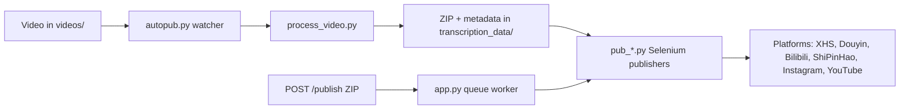

[English](../README.md) · [العربية](README.ar.md) · [Español](README.es.md) · [Français](README.fr.md) · [日本語](README.ja.md) · [한국어](README.ko.md) · [Tiếng Việt](README.vi.md) · [中文 (简体)](README.zh-Hans.md) · [中文（繁體）](README.zh-Hant.md) · [Deutsch](README.de.md) · [Русский](README.ru.md)


<div align="center">

[](https://github.com/lachlanchen/lachlanchen/blob/main/figs/banner.png)

# AutoPublish

<p align="center">
  <strong>脚本优先、浏览器驱动的多平台短视频发布方案。</strong><br/>
  <sub>面向安装、运行、队列模式和各平台自动化流程的权威操作手册。</sub>
</p>

</div>

[](#prerequisites)
[](#system-overview)
[](#running-the-tornado-service-apppy)
[](#platform-specific-notes)
[](#running-the-tornado-service-apppy)
[](#pwa-frontend-pwa)
[](https://github.com/sponsors/lachlanchen)
[](#table-of-contents)
[](#license)
[](#configuration)
[](#security--ops-checklist)
[](#raspberry-pi--linux-service-setup)

[](#usage)
[](#preparing-browser-sessions)
[](#metadata--zip-format)

| 跳转 | 链接 |
| --- | --- |
| 首次使用 | [Start Here](#start-here) |
| 本地 watcher 模式 | [Running the CLI pipeline (`autopub.py`)](#running-the-cli-pipeline-autopubpy) |
| 通过 HTTP 队列运行 | [Running the Tornado service (`app.py`)](#running-the-tornado-service-apppy) |
| 部署为服务 | [Raspberry Pi / Linux Service Setup](#raspberry-pi--linux-service-setup) |
| 支持项目 | [Support](#support-autopublish) |


仓库有意保持低层实现：多数配置直接写在 Python 文件和 shell 脚本中。本文档是操作手册，覆盖安装、运行和扩展点。

> ⚙️ **运维理念**：本项目优先采用显式脚本和直接浏览器自动化，而不是隐藏式抽象层。
> ✅ **本 README 的规范策略**：优先保留技术细节，再提升可读性和可发现性。

### 快速导航

| 我想要... | 前往 |
| --- | --- |
| 执行首次发布 | [Quick Start Checklist](#quick-start-checklist) |
| 对比运行模式 | [Runtime Modes at a Glance](#runtime-modes-at-a-glance) |
| 配置凭证与路径 | [Configuration](#configuration) |
| 启动 API 模式和队列任务 | [Running the Tornado service (`app.py`)](#running-the-tornado-service-apppy) |
| 使用粘贴命令进行验证 | [Examples](#examples) |
| 在 Raspberry Pi/Linux 上部署 | [Raspberry Pi / Linux Service Setup](#raspberry-pi--linux-service-setup) |

## Start Here

如果你是第一次接触本仓库，请按以下顺序执行：

1. 阅读 [Prerequisites](#prerequisites) 与 [Installation](#installation)。
2. 在 [Configuration](#configuration) 配置凭据与绝对路径。
3. 在 [Preparing Browser Sessions](#preparing-browser-sessions) 准备浏览器调试会话。
4. 在 [Usage](#usage) 中选择运行模式：`autopub.py`（watcher）或 `app.py`（API queue）。
5. 使用 [Examples](#examples) 中的命令进行验证。

## Overview

AutoPublish 目前支持两种正式运行模式：

1. **CLI watcher 模式（`autopub.py`）**：基于文件夹的采集与发布。
2. **API queue 模式（`app.py`）**：通过 HTTP（`/publish`、`/publish/queue`）上传 ZIP 进行发布。

该项目面向偏向透明、脚本优先流程的运营人员，而非抽象编排平台。

### Runtime Modes at a Glance

| 模式 | 入口 | 输入 | 最适场景 | 输出行为 |
| --- | --- | --- | --- | --- |
| CLI watcher | `autopub.py` | 放入 `videos/` 的文件 | 本机运营流程与 cron/service 循环 | 检测到新视频后立即处理并发布到选定平台 |
| API queue 服务 | `app.py` | 上传 ZIP 到 `POST /publish` | 与上游系统集成及远端触发 | 接收任务、入队并按 worker 顺序执行发布 |

### Platform Coverage Snapshot

| 平台 | 发布模块 | 登录辅助 | 控制端口 | CLI 模式 | API 模式 |
| --- | --- | --- | --- | --- | --- |
| XiaoHongShu | `pub_xhs.py` | `login_xiaohongshu.py` | `5003` | ✅ | ✅ |
| Douyin | `pub_douyin.py` | `login_douyin.py` | `5004` | ✅ | ✅ |
| Bilibili | `pub_bilibili.py` | N/A | `5005` | ✅ | ✅ |
| ShiPinHao (WeChat Channels) | `pub_shipinhao.py` | `login_shipinhao.py` | `5006` | Optional | ✅ |
| Instagram | `pub_instagram.py` | `login_instagram.py` | `5007` | Optional | ✅ |
| YouTube | `pub_y2b.py` | N/A | `9222` | Optional | ✅ |

## Quick Snapshot

| 项目 | 值 | 颜色提示 |
| --- | --- | --- |
| 主要语言 | Python 3.10+ |  |
| 主要运行方式 | CLI watcher（`autopub.py`）+ Tornado 队列服务（`app.py`） |  |
| 自动化引擎 | Selenium + remote-debug Chromium 会话 |  |
| 输入格式 | 原始视频（`videos/`）与 ZIP 包（`/publish`） |  |
| 当前仓库路径 | `/home/lachlan/ProjectsLFS/AutoPublish` |  |
| 目标用户 | 管理多平台短视频流程的创作者/运营工程师 |  |

### Operational Safety Snapshot

| 主题 | 当前状态 | 动作 |
| --- | --- | --- |
| 硬编码路径 | 在多个模块和脚本中仍然存在 | 上线前按主机更新路径常量 |
| 浏览器登录状态 | 必要 | 为每个平台保留持久化 remote-debug profile |
| 验证码处理 | 可选集成可用 | 如有需要配置 2Captcha / Turing 凭据 |
| 许可声明 | 未检测到顶层 `LICENSE` 文件 | 补充前请先向维护者确认用途 | 

### Compatibility & Assumptions

| 项目 | 本仓库当前假设 |
| --- | --- |
| Python | 3.10+ |
| 运行环境 | 有 GUI 显示可供 Chromium 使用的 Linux 桌面/服务器 |
| 浏览器控制模式 | 使用持久化 profile 目录的远程调试会话 |
| 主要 API 端口 | `8081`（`app.py --port`） |
| 处理后端 | `upload_url` 与 `process_url` 可访问且返回有效 ZIP |
| 本草稿的工作区 | `/home/lachlan/ProjectsLFS/AutoPublish` |

---

## Table of Contents

- [Start Here](#start-here)
- [Overview](#overview)
- [Runtime Modes at a Glance](#runtime-modes-at-a-glance)
- [Platform Coverage Snapshot](#platform-coverage-snapshot)
- [Quick Snapshot](#quick-snapshot)
- [Operational Safety Snapshot](#operational-safety-snapshot)
- [Compatibility & Assumptions](#compatibility--assumptions)
- [System Overview](#system-overview)
- [Features](#features)
- [Project Structure](#project-structure)
- [Repository Layout](#repository-layout)
- [Prerequisites](#prerequisites)
- [Installation](#installation)
- [Configuration](#configuration)
- [Configuration Verification Checklist](#configuration-verification-checklist)
- [Preparing Browser Sessions](#preparing-browser-sessions)
- [Usage](#usage)
- [Examples](#examples)
- [Metadata & ZIP Format](#metadata--zip-format)
- [Data & Artifact Lifecycle](#data--artifact-lifecycle)
- [Platform-Specific Notes](#platform-specific-notes)
- [Raspberry Pi / Linux Service Setup](#raspberry-pi--linux-service-setup)
- [Legacy macOS Scripts](#legacy-macos-scripts)
- [Troubleshooting & Maintenance](#troubleshooting--maintenance)
- [FAQ](#faq)
- [Extending the System](#extending-the-system)
- [Quick Start Checklist](#quick-start-checklist)
- [Development Notes](#development-notes)
- [Roadmap](#roadmap)
- [Contributing](#contributing)
- [Security & Ops Checklist](#security--ops-checklist)
- [Support](#support-autopublish)
- [License](#license)
- [Acknowledgements](#acknowledgements)

---

## System Overview

🎯 **从原始素材到已发布内容的端到端流程**：



流程一览：

1. **素材接入**：将视频放入 `videos/`。watcher（`autopub.py` 或调度器/service）会使用 `videos_db.csv` 与 `processed.csv` 检测新文件。
2. **资产生成**：`process_video.VideoProcessor` 将文件上传到内容处理服务器（`upload_url` 与 `process_url`），返回包含以下内容的 ZIP 包：
   - 已编辑/转码视频（`<stem>.mp4`）
   - 封面图
   - `{stem}_metadata.json`，包含本地化标题、描述、标签等
3. **发布执行**：`pub_*.py` 的 Selenium 发布器读取元数据。每个发布器都会通过远程调试端口和持久化 user-data 目录连接已启动的 Chromium/Chrome 实例。
4. **Web 控制面（可选）**：`app.py` 提供 `/publish`，接收预先打包 ZIP、解包后入队并交给同一套发布器执行。它也可刷新浏览器会话并触发登录辅助脚本（`login_*.py`）。
5. **辅助模块**：`load_env.py` 从 `~/.bashrc` 注入环境变量；`utils.py` 提供通用工具（窗口聚焦、二维码处理、邮件工具）；`solve_captcha_*.py` 在出现验证码时与 Turing / 2Captcha 联动。

## Features

✨ **面向务实、脚本优先自动化**：

- 多平台发布：XiaoHongShu、Douyin、Bilibili、ShiPinHao（微信视频号）、Instagram、YouTube（可选）。
- 两种运行模式：CLI watcher 管线（`autopub.py`）和 API 队列服务（`app.py` + `/publish` + `/publish/queue`）。
- 通过 `ignore_*` 文件实现平台级临时禁用开关。
- 远程调试浏览器会话复用，带持久化 profile。
- 可选 QR/验证码自动化与邮件通知辅助。
- 不需要前端构建，内置 PWA（`pwa/`）上传 UI。
- 提供 Linux/Raspberry Pi 服务化脚本（`scripts/`）。

### Feature Matrix

| 能力 | CLI（`autopub.py`） | API（`app.py`） |
| --- | --- | --- |
| 输入来源 | 本地 `videos/` watcher | 通过 `POST /publish` 上传 ZIP |
| 队列 | 基于文件的内部推进 | 显式内存队列 |
| 平台开关 | CLI 参数（`--pub-*`）+ `ignore_*` | 查询参数（`publish_*`）+ `ignore_*` |
| 适用场景 | 单机运营工作流 | 外部系统对接与远端触发 |

---

## Project Structure

高层源代码 / 运行时布局：

```text
AutoPublish/
├── README.md
├── app.py
├── autopub.py
├── process_video.py
├── load_env.py
├── utils.py
├── pub_*.py                  # platform publishers
├── login_*.py                # platform login/session helpers
├── solve_captcha_*.py
├── smtp.py
├── smtp_test_simple.py
├── send_email_qreader.py
├── requirements.txt
├── requirements.autopub.txt
├── .env.example
├── setup_raspberrypi.md
├── scripts/
├── pwa/
├── figs/
├── .github/FUNDING.yml
├── i18n/                     # multilingual READMEs
├── videos/                   # runtime input artifacts
├── logs/, logs-autopub/      # runtime logs
├── temp/, temp_screenshot/   # runtime temp artifacts
├── videos_db.csv
└── processed.csv
```

说明：`transcription_data/` 在处理/发布流程中会在运行时生成，并可能在执行后出现。

## Repository Layout

🗂️ **关键模块说明**：

| 路径 | 用途 |
| --- | --- |
| `README.md` | 主说明文档（英文） |
| `app.py` | Tornado 服务，提供 `/publish` 与 `/publish/queue`，并具备内部发布队列和 worker 线程。 |
| `autopub.py` | CLI watcher：扫描 `videos/`，处理新文件，并并发调用发布模块。 |
| `process_video.py` | 上传视频到处理后端并保存返回的 ZIP 包。 |
| `pub_xhs.py`, `pub_douyin.py`, `pub_bilibili.py`, `pub_shipinhao.py`, `pub_instagram.py`, `pub_y2b.py` | 各平台 Selenium 自动化发布模块。 |
| `login_xiaohongshu.py`, `login_douyin.py`, `login_shipinhao.py`, `login_instagram.py` | 会话校验与二维码登录流程。 |
| `utils.py` | 共享自动化辅助（窗口聚焦、QR 与邮件工具、诊断辅助）。 |
| `load_env.py` | 从 shell 配置（`~/.bashrc`）加载环境变量并脱敏日志。 |
| `smtp.py`, `smtp_test_simple.py`, `send_email_qreader.py` | SMTP/SendGrid 辅助与测试脚本。 |
| `solve_captcha_2captcha.py`, `solve_captcha_turing.py` | 验证码识别集成。 |
| `scripts/` | 服务与运维脚本（Raspberry Pi/Linux + legacy 自动化）。 |
| `pwa/` | 用于 ZIP 预览与发布提交的静态 PWA。 |
| `setup_raspberrypi.md` | Raspberry Pi 部署的详细步骤。 |
| `.env.example` | 环境变量模板（凭据、路径、验证码密钥）。 |
| `.github/FUNDING.yml` | 赞助与资金配置。 |
| `logs/`, `logs-autopub/`, `temp/`, `temp_screenshot/`, `videos/` | 运行产物与日志（多数被 `.gitignore`）。 |

---

## Prerequisites

🧰 **首次运行前请先安装**：

### 操作系统与工具

- Linux 桌面/服务器，带 X 会话（提供的脚本中常用 `DISPLAY=:1`）。
- Chromium/Chrome 及匹配版本的 ChromeDriver。
- GUI/媒体工具：`xdotool`、`ffmpeg`、`zip`、`unzip`。
- Python 3.10+（venv 或 Conda）。

### Python 依赖

最小运行集：

```bash
pip install selenium tornado requests requests-toolbelt sendgrid qreader opencv-python webdriver-manager
```

仓库标准安装：

```bash
python -m pip install -r requirements.txt
```

轻量服务安装（setup 脚本默认）：

```bash
python -m pip install -r requirements.autopub.txt
```

`requirements.autopub.txt` 包含：
- `selenium`, `webdriver-manager`, `tornado`, `requests`, `requests-toolbelt`, `sendgrid`, `qreader`, `opencv-python`, `numpy`, `pillow`, `twocaptcha`。

### 可选：创建 sudo 用户

```bash
sudo useradd -m -s /bin/bash -G sudo <USERNAME> && echo "<USERNAME>:<PASSWORD>" | sudo chpasswd
```

---

## Installation

🚀 **从干净机器开始设置**：

1. 克隆仓库：

```bash
git clone https://github.com/lachlanchen/AutoPublish.git
cd AutoPublish
```

2. 创建并激活环境（以 venv 为例）：

```bash
python3 -m venv .venv
source .venv/bin/activate
python -m pip install -U pip
python -m pip install -r requirements.txt
```

3. 配置环境变量：

```bash
cp .env.example .env
# 在 .env 中填充变量（不要提交）
```

4. 为读取 shell profile 的脚本加载变量：

```bash
source ~/.bashrc
python load_env.py
```

说明：`load_env.py` 默认读取 `~/.bashrc`；若你的 shell 使用其他 profile，请按实际环境调整。

---

## Configuration

🔐 **先设置凭据，再校验主机相关路径**。

### 环境变量

项目从环境变量读取凭据和可选的浏览器/运行路径。请从 `.env.example` 开始：

| 变量 | 说明 |
| --- | --- |
| `FROM_EMAIL`, `TO_EMAIL`, `APP_PASSWORD` | 用于二维码/登录通知的 SMTP 凭据。 |
| `SENDGRID_API_KEY` | SendGrid 的 API key，用于走 SendGrid 的邮件流程。 |
| `APIKEY_2CAPTCHA` | 2Captcha 的 API key。 |
| `TULING_USERNAME`, `TULING_PASSWORD`, `TULING_ID` | Turing 验证码凭据。 |
| `DOUYIN_LOGIN_PASSWORD` | Douyin 二次校验辅助。 |
| `INSTAGRAM_*`, `CHROME_*`, `CHROMEDRIVER_PATH` | Instagram 与浏览器驱动的覆盖变量。 |
| `AUTOPUBLISH_BROWSER_BIN`, `AUTOPUBLISH_CHROMEDRIVER`, `AUTOPUBLISH_DISPLAY` | `app.py` 中的全局浏览器/驱动/display 覆盖参数。 |

### 路径常量（重要）

📌 **最常见启动问题**：硬编码绝对路径未按主机更新。

若干模块仍保留硬编码路径，请改为你的机器路径：

| 文件 | 常量 | 含义 |
| --- | --- | --- |
| `app.py` | `logs_folder_root`, `autopublish_folder_root`, `videos_db_path`, `processed_path`, `transcription_root`, `upload_url`, `process_url` | API 服务根目录和处理端点 |
| `autopub.py` | `logs_folder_path`, `autopublish_folder_path`, `videos_db_path`, `processed_path`, `transcription_path`, `upload_url`, `process_url`, `chromedriver_path` | CLI watcher 根目录和处理端点 |
| `scripts/run_autopub.sh`, `scripts/setup_autopub.sh` | Python/Conda/仓库/日志目录的绝对路径 | 旧版/macOS 方向的包装脚本 |
| `utils.py` | 封面处理函数中的 FFmpeg 路径假设 | 媒体工具路径兼容性 |

仓库说明：
- 本次工作区的仓库路径是 `/home/lachlan/ProjectsLFS/AutoPublish`。
- 部分代码和脚本仍引用 `/home/lachlan/Projects/auto-publish` 或 `/Users/lachlan/...`。
- 上线前请先在本地替换这些路径。

### 通过 `ignore_*` 切换平台

🧩 **快速安全开关**：创建或删除 `ignore_*` 文件即可禁用对应平台，无需改代码。

发布开关也受 ignore 文件控制。创建空文件以禁用某平台：

```bash
touch ignore_xhs ignore_douyin ignore_bilibili ignore_shipinhao ignore_instagram ignore_y2b
```

删除对应文件可恢复启用。

### 配置校验清单

设置 `.env` 与路径常量后执行快速校验：

```bash
python -c "import os;print('AUTOPUBLISH_BROWSER_BIN=', os.getenv('AUTOPUBLISH_BROWSER_BIN'));print('AUTOPUBLISH_CHROMEDRIVER=', os.getenv('AUTOPUBLISH_CHROMEDRIVER'));print('DISPLAY=', os.getenv('DISPLAY') or os.getenv('AUTOPUBLISH_DISPLAY'))"
python -c "from load_env import load_env_from_bashrc; load_env_from_bashrc(); print('Environment load OK')"
python -c "import os; p=os.getenv('AUTOPUBLISH_CHROMEDRIVER') or os.getenv('CHROMEDRIVER_PATH') or '/usr/bin/chromedriver'; print(p, 'exists=', os.path.exists(p))"
```

若有缺失值，请先更新 `.env`、`~/.bashrc` 或脚本内常量，再运行发布流程。

---

## Preparing Browser Sessions

🌐 **会话持久化对稳定发布是必需的**。

1. 创建独立 profile 文件夹：

```bash
mkdir -p ~/chromium_dev_session_{5003,5004,5005,5006,5007,9222}
mkdir -p ~/chromium_dev_session_logs
```

2. 启动远程调试浏览器（以 XiaoHongShu 为例）：

```bash
DISPLAY=:1 chromium-browser \
  --remote-debugging-port=5003 \
  --user-data-dir="$HOME/chromium_dev_session_5003" \
  https://creator.xiaohongshu.com/creator/post \
  > "$HOME/chromium_dev_session_logs/chromium_xhs.log" 2>&1 &
```

3. 针对每个平台/profile 手动登录一次。

4. 验证 Selenium 可连接：

```python
from selenium import webdriver
opts = webdriver.ChromeOptions()
opts.add_experimental_option("debuggerAddress", "127.0.0.1:5003")
driver = webdriver.Chrome(options=opts)
print(driver.title)
driver.quit()
```

安全说明：
- `app.py` 当前包含一个硬编码 sudo 密码占位（`password = "1"`），用于浏览器重启逻辑；正式部署前务必替换。

---

## Usage

▶️ **支持两种运行模式**：CLI watcher 与 API queue service。

### Running the CLI pipeline (`autopub.py`)

1. 将源视频放入监听目录（`videos/` 或配置后的 `autopublish_folder_path`）。
2. 运行：

```bash
python autopub.py --use-cache --pub-xhs --pub-douyin --pub-bilibili
```

参数说明：

| 参数 | 含义 |
| --- | --- |
| `--pub-xhs`, `--pub-douyin`, `--pub-bilibili` | 仅发布到指定平台。若未传递则默认启用上述三个平台。 |
| `--test` | 启用测试模式传给发布器（不同模块行为可能不同）。 |
| `--use-cache` | 使用已有的 `transcription_data/<video>/<video>.zip`（若存在）。 |

每个视频的 CLI 流程：
- 通过 `process_video.py` 上传并处理。
- 将 ZIP 解压到 `transcription_data/<video>/`。
- 通过 `ThreadPoolExecutor` 启动选择的平台发布器。
- 将状态写入 `videos_db.csv` 和 `processed.csv`。

### Running the Tornado service (`app.py`)

🛰️ **API 模式适合输出 ZIP 的外部系统集成**。

启动服务：

```bash
python app.py --refresh-time 1800 --port 8081
```

API 接口摘要：

| 接口 | 方法 | 用途 |
| --- | --- | --- |
| `/publish` | `POST` | 上传 ZIP 并将发布任务入队 |
| `/publish/queue` | `GET` | 查看队列、任务历史与发布状态 |

### `POST /publish`

📤 **通过上传 ZIP 直接入队发布任务**。

- Header: `Content-Type: application/octet-stream`
- 必要查询参数: `filename`（ZIP 文件名）
- 可选布尔值: `publish_xhs`, `publish_douyin`, `publish_bilibili`, `publish_shipinhao`, `publish_instagram`, `publish_y2b`, `test`
- 请求体: 原始 ZIP 字节流

示例：

```bash
curl -X POST "http://localhost:8081/publish?filename=demo.zip&publish_xhs=true&publish_instagram=true&publish_y2b=true" \
  --data-binary @demo.zip \
  -H "Content-Type: application/octet-stream"
```

当前代码行为：
- 请求会被接收并入队。
- 立即返回 JSON，包含 `status: queued`、`job_id`、`queue_size`。
- worker 线程按顺序串行处理队列任务。

### `GET /publish/queue`

📊 **查看队列健康与进行中的任务**。

返回队列状态/历史 JSON：

```bash
curl "http://localhost:8081/publish/queue"
```

返回字段包含：
- `status`, `jobs`, `queue_size`, `is_publishing`。

### Browser refresh thread

♻️ 周期性刷新浏览器可降低长时运行中的会话过期失败率。

`app.py` 在 `--refresh-time` 间隔运行后台刷新线程，并在登录检查中穿插调用。刷新等待中会引入随机延迟。

### PWA frontend (`pwa/`)

🖥️ 轻量静态界面，用于手动 ZIP 上传与查看队列。

本地启动：

```bash
cd pwa
python -m http.server 5173
```

打开 `http://localhost:5173` 并配置后端基础 URL（例如 `http://lazyingart:8081`）。

PWA 能力：
- 拖拽/预览 ZIP
- 发布目标开关与测试模式
- 向 `/publish` 提交并轮询 `/publish/queue`

### Command Palette

🧷 **常用命令一览**。

| 任务 | 命令 |
| --- | --- |
| 安装完整依赖 | `python -m pip install -r requirements.txt` |
| 安装轻量运行依赖 | `python -m pip install -r requirements.autopub.txt` |
| 加载 shell 环境变量 | `source ~/.bashrc && python load_env.py` |
| 启动 API 队列服务 | `python app.py --refresh-time 1800 --port 8081` |
| 启动 CLI watcher 流水线 | `python autopub.py --use-cache --pub-xhs --pub-douyin --pub-bilibili` |
| 提交 ZIP 到队列 | `curl -X POST "http://localhost:8081/publish?filename=demo.zip" --data-binary @demo.zip -H "Content-Type: application/octet-stream"` |
| 查看队列状态 | `curl -s "http://localhost:8081/publish/queue"` |
| 启动本地 PWA | `cd pwa && python -m http.server 5173` |

---

## Examples

🧪 **可直接复制执行的 smoke test 命令**：

### Example 0: 加载环境并启动 API 服务

```bash
source ~/.bashrc
python load_env.py
python app.py --refresh-time 1800 --port 8081
```

### Example A: CLI 发布执行

```bash
python autopub.py --pub-xhs --pub-douyin --use-cache
```

### Example B: API 发布执行（单个 ZIP）

```bash
curl -X POST "http://localhost:8081/publish?filename=my_bundle.zip&publish_bilibili=true&test=true" \
  --data-binary @my_bundle.zip \
  -H "Content-Type: application/octet-stream"
```

### Example C: 检查队列状态

```bash
curl -s "http://localhost:8081/publish/queue"
```

### Example D: SMTP 辅助 smoke test

```bash
python smtp.py
python smtp_test_simple.py
```

---

## Metadata & ZIP Format

📦 **ZIP 约定非常关键**：文件名和元数据字段要与发布器预期一致。

ZIP 最低要求（示例）：

```text
<stem>_metadata.json
<video_filename>.mp4
<cover_filename>.jpg
```

`metadata` 主要供中文平台使用；可选 `metadata["english_version"]` 会被 YouTube 发布器使用。

模块常用字段：
- `title`, `brief_description`, `middle_description`, `long_description`
- `tags`（标签列表）
- `video_filename`, `cover_filename`
- 各 `pub_*.py` 自身实现的特定字段

如果你从外部生成 ZIP，请确保字段名与发布模块约定一致。

## Data & Artifact Lifecycle

流水线会产生本地产物，建议按需保留、轮换或清理：

| 产物 | 位置 | 生成来源 | 重要性 |
| --- | --- | --- | --- |
| 输入视频 | `videos/` | 手动投放或上游同步 | CLI watcher 的源媒体 |
| 处理后的 ZIP 输出 | `transcription_data/<stem>/<stem>.zip` | `process_video.py` | `--use-cache` 可复用 |
| 解压后的发布资产 | `transcription_data/<stem>/...` | `autopub.py` / `app.py` 解压 ZIP | 发布器可直接使用的文件和元数据 |
| 发布日志 | `logs/`, `logs-autopub/` | CLI/API 运行期 | 故障排查与审计 |
| 浏览器日志 | `~/chromium_dev_session_logs/*.log`（或 chrome 前缀） | 浏览器启动脚本 | 排查会话、端口与启动问题 |
| 跟踪 CSV | `videos_db.csv`, `processed.csv` | CLI watcher | 避免重复处理 |

运维建议：
- 为旧的 `transcription_data/`、`temp/` 和历史日志添加周期清理/归档任务，避免磁盘压力导致故障。

---

## Platform-Specific Notes

🧭 **各发布模块的端口映射与职责**：

| 平台 | 端口 | 模块 | 备注 |
| --- | --- | --- | --- |
| XiaoHongShu | 5003 | `pub_xhs.py`, `login_xiaohongshu.py` | 支持二维码重登；标题清洗与 hashtag 规则来自 metadata。 |
| Douyin | 5004 | `pub_douyin.py`, `login_douyin.py` | 上传完成校验与重试路径较脆弱，需关注日志。 |
| Bilibili | 5005 | `pub_bilibili.py` | 验证码钩子由 `solve_captcha_2captcha.py` 与 `solve_captcha_turing.py` 提供。 |
| ShiPinHao (WeChat Channels) | 5006 | `pub_shipinhao.py`, `login_shipinhao.py` | 会话刷新稳定性高度依赖快速二维码确认。 |
| Instagram | 5007 | `pub_instagram.py`, `login_instagram.py` | 仅 API 模式可用 `publish_instagram=true`；相关环境变量见 `.env.example`。 |
| YouTube | 9222 | `pub_y2b.py` | 使用 `english_version` 元数据块；可通过 `ignore_y2b` 禁用。 |

---

## Raspberry Pi / Linux Service Setup

🐧 **推荐用于长期在线的主机**。

完整主机初始化请参考 [`setup_raspberrypi.md`](setup_raspberrypi.md)。

快速服务配置：

```bash
export AUTOPUB_USER=<USERNAME>
export AUTOPUB_REPO=/home/<USERNAME>/Projects/autopub
sudo -E ./scripts/setup_autopub_pipeline.sh
```

该脚本会按顺序调用：
- `scripts/setup_envs.sh`
- `scripts/setup_virtual_desktop_service.sh`
- `scripts/download_and_setup_driver.sh`
- `scripts/setup_autopub_service.sh`

在 tmux 中手动启动服务：

```bash
./scripts/start_autopub_tmux.sh
```

验证服务与端口：

```bash
systemctl status autopub.service autopub-vnc.service
sudo ss -ltnp | grep 590
```

兼容说明：
- 部分旧文档脚本仍引用 `virtual-desktop.service`；本仓库当前 setup 脚本安装的是 `autopub-vnc.service`。

---

## Legacy macOS Scripts

🍎 仓库仍保留旧版 macOS 兼容脚本：

- `scripts/run_autopub.sh`
- `scripts/setup_autopub.sh`

这些脚本包含固定 `/Users/lachlan/...` 路径和 Conda 假设。若你依赖此工作流，请保留它们，但请按本机情况更新路径、venv 与工具链。

---

## Troubleshooting & Maintenance

🛠️ **出现问题时优先按此顺序排查**。

- **跨主机路径漂移**：若报错中出现 `/Users/lachlan/...` 或 `/home/lachlan/Projects/auto-publish`，请将常量改为当前主机路径（此工作区是 `/home/lachlan/ProjectsLFS/AutoPublish`）。
- **密钥管理**：在推送前运行 `~/.local/bin/detect-secrets scan`；清理或轮换已泄露凭据。
- **处理后端报错**：若 `process_video.py` 报 “Failed to get the uploaded file path”，请确认上传响应 JSON 包含 `file_path`，且处理端点返回 ZIP 字节。
- **ChromeDriver 不匹配**：若出现 DevTools 连接错误，请确保 Chromium 和驱动版本一致（或改用 `webdriver-manager`）。
- **窗口焦点问题**：`bring_to_front` 依赖窗口标题匹配，Chromium/Chrome 的命名差异可能导致失效。
- **验证码打断**：配置 2Captcha/Turing 凭据并接入对应 solver 输出。
- **过期锁文件**：若定时任务长期不启动，请确认进程状态并清理旧 `autopub.lock`（旧脚本流程）。
- **查看日志**：`logs/`、`logs-autopub/`、`~/chromium_dev_session_logs/*.log` 以及服务日志。

---

## FAQ

**Q: 我可以同时运行 API 模式和 CLI watcher 模式吗？**
A: 可以，但除非你隔离输入与浏览器会话，否则不建议。两者可能竞争同一组发布器、文件和端口。

**Q: 为什么 `/publish` 返回 queued 但暂时看不到发布结果？**
A: `app.py` 会先入队，再由后台 worker 串行处理。请检查 `/publish/queue`、`is_publishing` 和服务日志。

**Q: 我已有 `.env`，还需要 `load_env.py` 吗？**
A: `start_autopub_tmux.sh` 会读取 `.env`（如存在），而某些直接运行方式依赖 shell 环境变量。两者保持一致可减少坑。

**Q: API 上传对 ZIP 有最低要求吗？**
A: 必须是合法 ZIP，包含 `{stem}_metadata.json`，并且 `video_filename` 与 `cover_filename` 与 metadata 中的键一致。

**Q: 支持无头模式吗？**
A: 部分模块定义了 headless 相关变量，但仓库的主要和文档化运行模式是带 GUI、带持久化 profile 的浏览器会话。

---

## Extending the System

🧱 **新平台与更安全运行的扩展点**：

- **新增平台**：复制一份 `pub_*.py`，更新选择器与流程，必要时增加 `login_*.py`（用于二维码重认证），再在 `app.py` 与 `autopub.py` 中接入开关和队列。
- **配置抽象化**：将分散常量迁移为统一配置（`config.yaml`/`.env` + 类型模型），便于多主机管理。
- **凭据安全强化**：将硬编码或 shell 暴露的敏感流程改为更安全方案（如 `sudo -A`、钥匙串、Vault 等）。
- **容器化**：将 Chromium/ChromeDriver、Python 运行时与虚拟显示打包为可复用部署单元。

---

## Quick Start Checklist

✅ **最少步骤，快速完成首发**。

1. 克隆仓库并安装依赖（`pip install -r requirements.txt` 或轻量版 `requirements.autopub.txt`）。
2. 更新 `app.py`、`autopub.py` 以及你会运行的脚本中的硬编码路径。
3. 在 shell profile 或 `.env` 导出必需凭据，并运行 `python load_env.py` 验证。
4. 创建远程调试的浏览器 profile 文件夹，并启动每个必要平台会话。
5. 在每个平台对应 profile 手动登录。
6. 启动 API 模式（`python app.py --port 8081`）或 CLI 模式（`python autopub.py --use-cache ...`）。
7. 提交一条样例 ZIP（API）或一条样例视频（CLI）并查看 `logs/`。
8. 每次推送前执行密钥扫描。

---

## Development Notes

🧬 **当前开发基线**（手工排版 + smoke test）。

- Python 风格沿用现有 4 空格缩进和手工格式。
- 目前没有正式自动化测试体系；依赖 smoke test：
  - 通过 `autopub.py` 处理一条样例视频；
  - 通过 `/publish` 提交一条 ZIP 并观察 `/publish/queue`；
  - 在真实平台逐一手工验证。
- 新脚本建议保留 `if __name__ == "__main__":`，便于快速干运行。
- 尽量让平台改动隔离（`pub_*`、`login_*`、`ignore_*`）
- 运行产物（`videos/*`、`logs*/*`、`transcription_data/*`、`ignore_*`）应保持本地，通常被 git 忽略。

---

## Roadmap

🗺️ **当前代码结构约束下的优先改进**。

计划/期望改进（基于当前代码结构与现有记录）：

1. 用统一配置（`.env`/YAML + typed model）替换分散硬编码路径。
2. 去掉硬编码 sudo 密码占位，改为更安全的进程控制方式。
3. 通过更强重试与更细致 UI 状态检测提升发布成功率。
4. 扩展更多平台（例如快手等创作者平台）。
5. 将运行环境打包为可复现的部署单元（容器 + 虚拟显示 profile）。
6. 为 ZIP 约定与队列执行增加自动集成检查。

---

## Contributing

🤝 PR 请保持聚焦、可复现，并明确运行时假设。

欢迎贡献。

1. Fork 并创建聚焦分支。
2. 保持提交小而聚焦，使用命令式标题（历史示例：“Wait for YouTube checks before publishing”）。
3. PR 中加入手工验证说明：
   - 环境假设
   - 浏览器/会话重启情况
   - UI 流程相关日志或截图
4. 不要提交真实凭据（`.env` 已被忽略；仅参考 `.env.example` 结构）。

若新增发布模块，请连接以下项：
- `pub_<platform>.py`
- 可选 `login_<platform>.py`
- `app.py` 的 API 开关与队列处理
- `autopub.py` 的 CLI 接入（如需要）
- `ignore_<platform>` 切换处理
- README 更新

## Security & Ops Checklist

在接近生产运行前执行：

1. 确认本地存在 `.env` 且未被 git 跟踪。
2. 清理/轮换历史可能泄露的凭据。
3. 替换代码中的敏感占位值，例如 `app.py` 中的 sudo 密码示例。
4. 确认 `ignore_*` 切换逻辑符合批量发布预期。
5. 确保每个平台浏览器 profile 隔离，并使用最小权限账户。
6. 发布日志前确认不含敏感信息。
7. 推送前执行 `detect-secrets`（或等效工具）。

<a id="support-autopublish"></a>
## ❤️ Support

| Donate | PayPal | Stripe |
| --- | --- | --- |
| [](https://chat.lazying.art/donate) | [](https://paypal.me/RongzhouChen) | [](https://buy.stripe.com/aFadR8gIaflgfQV6T4fw400) |

## License

当前仓库快照中未检测到顶层 `LICENSE` 文件。

草稿约定：
- 在维护者补充正式许可文件前，视为未定义。

后续建议：
- 新增顶层 `LICENSE`（例如 MIT/Apache-2.0/GPL-3.0），并同步更新本节。

> 📝 直到添加许可证文件前，请将商业/内部再分发条件视为待确认项，并直接向维护者确认。

---

## Acknowledgements

- 维护者与赞助方主页：[ @lachlanchen](https://github.com/lachlanchen)
- 资助配置来源： [`.github/FUNDING.yml`](.github/FUNDING.yml)
- 本仓库引用的生态服务：Selenium、Tornado、SendGrid、2Captcha、Turing captcha APIs。
