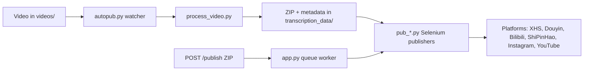

[English](../README.md) · [العربية](README.ar.md) · [Español](README.es.md) · [Français](README.fr.md) · [日本語](README.ja.md) · [한국어](README.ko.md) · [Tiếng Việt](README.vi.md) · [中文 (简体)](README.zh-Hans.md) · [中文（繁體）](README.zh-Hant.md) · [Deutsch](README.de.md) · [Русский](README.ru.md)


[](https://github.com/lachlanchen/lachlanchen/blob/main/figs/banner.png)

# AutoPublish

<p align="center">
  <strong>腳本優先、以瀏覽器驅動的多平台短影音發佈流程。</strong><br/>
  <sub>涵蓋安裝、執行、佇列模式與各平台自動化流程的標準操作手冊。</sub>
</p>

[](#prerequisites)
[](#system-overview)
[](#running-the-tornado-service-apppy)
[](#platform-specific-notes)
[](#running-the-tornado-service-apppy)
[](#pwa-frontend-pwa)
[](https://github.com/sponsors/lachlanchen)
[](#table-of-contents)
[](#license)
[](#configuration)
[](#security--ops-checklist)
[](#raspberry-pi--linux-service-setup)

| Jump to | Link |
| --- | --- |
| First-time setup | [Start Here](#start-here) |
| Run with local watcher | [Running the CLI pipeline (`autopub.py`)](#running-the-cli-pipeline-autopubpy) |
| Run via HTTP queue | [Running the Tornado service (`app.py`)](#running-the-tornado-service-apppy) |
| Deploy as service | [Raspberry Pi / Linux Service Setup](#raspberry-pi--linux-service-setup) |
| Support the project | [Support](#support-autopublish) |


本儲存庫刻意保留低抽象層風格：大多數設定直接寫在 Python 檔案與 shell 腳本中。本文檔是一份可執行的作業手冊，涵蓋安裝、執行與擴充點。

> ⚙️ **操作理念**：本專案偏好明確腳本與直接瀏覽器自動化，而非隱藏式抽象層。
> ✅ **本 README 的規範策略**：先保留技術細節，再提升可讀性與可探索性。

### Quick Navigation

| I want to... | Go here |
| --- | --- |
| Run my first publish | [Quick Start Checklist](#quick-start-checklist) |
| Compare runtime modes | [Runtime Modes at a Glance](#runtime-modes-at-a-glance) |
| Configure credentials and paths | [Configuration](#configuration) |
| Launch API mode and queue jobs | [Running the Tornado service (`app.py`)](#running-the-tornado-service-apppy) |
| Validate with copy/paste commands | [Examples](#examples) |
| Set up on Raspberry Pi/Linux | [Raspberry Pi / Linux Service Setup](#raspberry-pi--linux-service-setup) |

## Start Here

如果你是第一次接觸本儲存庫，請依序執行：

1. 閱讀 [Prerequisites](#prerequisites) 與 [Installation](#installation)。
2. 在 [Configuration](#configuration) 中設定憑證與絕對路徑。
3. 在 [Preparing Browser Sessions](#preparing-browser-sessions) 準備瀏覽器除錯工作階段。
4. 從 [Usage](#usage) 選擇執行模式：`autopub.py`（監控）或 `app.py`（API 佇列）。
5. 使用 [Examples](#examples) 的指令進行驗證。

## Overview

AutoPublish 目前支援兩種正式運行模式：

1. **CLI watcher mode（`autopub.py`）**：以資料夾為基礎進行匯入與發佈。
2. **API queue mode（`app.py`）**：透過 HTTP（`/publish`, `/publish/queue`）進行 ZIP 發佈。

本專案為偏好透明、腳本優先流程的操作者設計，而非抽象編排平台。

### Runtime Modes at a Glance

| Mode | Entry point | Input | Best for | Output behavior |
| --- | --- | --- | --- | --- |
| CLI watcher | `autopub.py` | 放入 `videos/` 的檔案 | 本機操作者流程與 cron/service 迴圈 | 偵測到新檔後即時處理並發佈到所選平台 |
| API queue service | `app.py` | 上傳 ZIP 至 `POST /publish` | 與上游系統整合與遠端觸發 | 接收任務、加入佇列，並依 worker 順序執行發佈 |

### Platform Coverage Snapshot

| Platform | Publisher module | Login helper | Control port | CLI mode | API mode |
| --- | --- | --- | --- | --- | --- |
| XiaoHongShu | `pub_xhs.py` | `login_xiaohongshu.py` | `5003` | ✅ | ✅ |
| Douyin | `pub_douyin.py` | `login_douyin.py` | `5004` | ✅ | ✅ |
| Bilibili | `pub_bilibili.py` | N/A | `5005` | ✅ | ✅ |
| ShiPinHao (WeChat Channels) | `pub_shipinhao.py` | `login_shipinhao.py` | `5006` | Optional | ✅ |
| Instagram | `pub_instagram.py` | `login_instagram.py` | `5007` | Optional | ✅ |
| YouTube | `pub_y2b.py` | N/A | `9222` | Optional | ✅ |

## Quick Snapshot

| What | Value |
| --- | --- |
| Primary language | Python 3.10+ |
| Main runtimes | CLI watcher (`autopub.py`) + Tornado queue service (`app.py`) |
| Automation engine | Selenium + remote-debug Chromium sessions |
| Input formats | Raw videos (`videos/`) and ZIP bundles (`/publish`) |
| Current repo workspace path | `/home/lachlan/ProjectsLFS/AutoPublish` |
| Ideal users | 管理多平台短影音管道的創作者／維運工程師 |

### Operational Safety Snapshot

| Topic | Current state | Action |
| --- | --- | --- |
| Hard-coded paths | Present in multiple modules/scripts | 上線前依主機更新路徑常數 |
| Browser login state | Required | 為每個平台保留持久 remote-debug profile |
| Captcha handling | Optional integrations available | 視需要配置 2Captcha/Turing 憑證 |
| License declaration | No top-level `LICENSE` file detected | 重新散佈前請先與維護者確認授權 |

### Compatibility & Assumptions

| Item | Current assumption in this repo |
| --- | --- |
| Python | 3.10+ |
| Runtime environment | Linux 桌面/伺服器並提供 Chromium 可用的 GUI |
| Browser control mode | 透過遠端偵錯工作階段與持久化設定目錄 |
| Primary API port | `8081`（`app.py --port`） |
| Processing backend | `upload_url` + `process_url` 必須可連線並回傳有效 ZIP |
| Workspace used for this draft | `/home/lachlan/ProjectsLFS/AutoPublish` |

---

## Table of Contents

- [Start Here](#start-here)
- [Overview](#overview)
- [Runtime Modes at a Glance](#runtime-modes-at-a-glance)
- [Platform Coverage Snapshot](#platform-coverage-snapshot)
- [Quick Snapshot](#quick-snapshot)
- [Operational Safety Snapshot](#operational-safety-snapshot)
- [Compatibility & Assumptions](#compatibility--assumptions)
- [System Overview](#system-overview)
- [Features](#features)
- [Project Structure](#project-structure)
- [Repository Layout](#repository-layout)
- [Prerequisites](#prerequisites)
- [Installation](#installation)
- [Configuration](#configuration)
- [Configuration Verification Checklist](#configuration-verification-checklist)
- [Preparing Browser Sessions](#preparing-browser-sessions)
- [Usage](#usage)
- [Examples](#examples)
- [Metadata & ZIP Format](#metadata--zip-format)
- [Data & Artifact Lifecycle](#data--artifact-lifecycle)
- [Platform-Specific Notes](#platform-specific-notes)
- [Raspberry Pi / Linux Service Setup](#raspberry-pi--linux-service-setup)
- [Legacy macOS Scripts](#legacy-macos-scripts)
- [Troubleshooting & Maintenance](#troubleshooting--maintenance)
- [FAQ](#faq)
- [Extending the System](#extending-the-system)
- [Quick Start Checklist](#quick-start-checklist)
- [Development Notes](#development-notes)
- [Roadmap](#roadmap)
- [Contributing](#contributing)
- [Security & Ops Checklist](#security--ops-checklist)
- [License](#license)
- [Acknowledgements](#acknowledgements)
- [Support](#support-autopublish)

---

## System Overview

🎯 **從原始素材到已發佈貼文的端到端流程**：



流程一覽：

1. **原始素材匯入**：將影片放入 `videos/`。監看器（`autopub.py` 或排程 / service）會透過 `videos_db.csv` 與 `processed.csv` 偵測新檔。
2. **素材生成**：`process_video.VideoProcessor` 會將檔案上傳到內容處理伺服器（`upload_url` 與 `process_url`），回傳 ZIP 套件，包含：
   - 編輯/編碼後影片（`<stem>.mp4`）
   - 封面圖
   - `{stem}_metadata.json`（包含在地化標題、描述、標籤等）
3. **發佈**：`pub_*.py` 的 Selenium 發佈器使用 metadata。每個發佈器會透過 remote-debug port 與持久化 user-data 目錄，接上已啟動的 Chromium/Chrome 實例。
4. **Web 控制平面（可選）**：`app.py` 提供 `/publish`，接收預先打包 ZIP，解壓後將任務排入相同發佈器。它也會刷新瀏覽器工作階段並觸發登入輔助（`login_*.py`）。
5. **支援模組**：`load_env.py` 從 `~/.bashrc` 注入環境變數，`utils.py` 提供共用工具（視窗聚焦、QR 處理、郵件工具），`solve_captcha_*.py` 在驗證碼出現時串接 Turing/2Captcha。

## Features

✨ **面向務實、腳本優先的自動化設計**：

- 多平台發佈：小紅書、抖音、Bilibili、視頻號（WeChat Channels）、Instagram、YouTube（可選）。
- 兩種運作模式：CLI 監控管線（`autopub.py`）與 API 佇列服務（`app.py` + `/publish` + `/publish/queue`）。
- 透過 `ignore_*` 檔可逐一停用平台。
- 透過 remote-debug 瀏覽器工作階段重用並保留持久化 profile。
- 可選 QR/驗證碼自動化與郵件通知輔助。
- 內建 PWA（`pwa/`）上傳 UI，不需前端打包流程。
- 針對 Linux/Raspberry Pi 提供服務化腳本（`scripts/`）。

### Feature Matrix

| Capability | CLI (`autopub.py`) | API (`app.py`) |
| --- | --- | --- |
| Input source | 本機 `videos/` watcher | 上傳 ZIP 到 `POST /publish` |
| Queueing | 以檔案進度的內建流程 | 明確的記憶體內任務佇列 |
| Platform flags | CLI 參數（`--pub-*`）+ `ignore_*` | 查詢參數（`publish_*`）+ `ignore_*` |
| Best fit | 單機操作者流程 | 外部系統整合與遠端觸發 |

---

## Project Structure

高層級原始碼／執行配置：

```text
AutoPublish/
├── README.md
├── app.py
├── autopub.py
├── process_video.py
├── load_env.py
├── utils.py
├── pub_*.py                  # platform publishers
├── login_*.py                # platform login/session helpers
├── solve_captcha_*.py
├── smtp.py
├── smtp_test_simple.py
├── send_email_qreader.py
├── requirements.txt
├── requirements.autopub.txt
├── .env.example
├── setup_raspberrypi.md
├── scripts/
├── pwa/
├── figs/
├── .github/FUNDING.yml
├── i18n/                     # multilingual READMEs
├── videos/                   # runtime input artifacts
├── logs/, logs-autopub/      # runtime logs
├── temp/, temp_screenshot/   # runtime temp artifacts
├── videos_db.csv
└── processed.csv
```

備註：`transcription_data/` 會在處理與發佈流程執行時產生。

## Repository Layout

🗂️ **核心模組與用途**：

| Path | Purpose |
| --- | --- |
| `app.py` | Tornado 服務，提供 `/publish` 與 `/publish/queue`，含發佈佇列與 worker 執行緒。 |
| `autopub.py` | CLI 監控器：掃描 `videos/`、處理新檔並平行呼叫發佈器。 |
| `process_video.py` | 上傳影片到處理後端並保存回傳 ZIP 套件。 |
| `pub_xhs.py`, `pub_douyin.py`, `pub_bilibili.py`, `pub_shipinhao.py`, `pub_instagram.py`, `pub_y2b.py` | 各平台 Selenium 自動化模組。 |
| `login_xiaohongshu.py`, `login_douyin.py`, `login_shipinhao.py`, `login_instagram.py` | 工作階段檢查與 QR 登入流程。 |
| `utils.py` | 共用自動化工具（視窗聚焦、QR/郵件輔助、診斷）。 |
| `load_env.py` | 從 shell 設定檔（`~/.bashrc`）載入環境變數並遮蔽敏感日誌。 |
| `smtp.py`, `smtp_test_simple.py`, `send_email_qreader.py` | SMTP/SendGrid 輔助與測試腳本。 |
| `solve_captcha_2captcha.py`, `solve_captcha_turing.py` | 驗證碼解題服務串接。 |
| `scripts/` | 服務設定與維運腳本（Raspberry Pi/Linux + 舊版自動化）。 |
| `pwa/` | 用於 ZIP 預覽與提交發佈的靜態 PWA。 |
| `setup_raspberrypi.md` | Raspberry Pi 佈署逐步指南。 |
| `.env.example` | 環境變數範本（憑證、路徑、驗證碼金鑰）。 |
| `.github/FUNDING.yml` | 贊助/募資設定。 |
| `logs/`, `logs-autopub/`, `temp/`, `temp_screenshot/`, `videos/` | 執行期產物與日誌（多數在 `.gitignore` 內）。 |

---

## Prerequisites

🧰 **首次執行前請先安裝下列內容**。

### Operating system and tools

- Linux 桌面/伺服器且有 X session（範例腳本常見 `DISPLAY=:1`）。
- Chromium/Chrome 與對應版本 ChromeDriver。
- GUI/媒體工具：`xdotool`、`ffmpeg`、`zip`、`unzip`。
- Python 3.10+（venv 或 Conda）。

### Python dependencies

最低執行需求：

```bash
pip install selenium tornado requests requests-toolbelt sendgrid qreader opencv-python webdriver-manager
```

套件同步安裝：

```bash
python -m pip install -r requirements.txt
```

輕量服務安裝（腳本預設使用）：

```bash
python -m pip install -r requirements.autopub.txt
```

`requirements.autopub.txt` 包含：
- `selenium`, `webdriver-manager`, `tornado`, `requests`, `requests-toolbelt`, `sendgrid`, `qreader`, `opencv-python`, `numpy`, `pillow`, `twocaptcha`。

### Optional: create a sudo user

```bash
sudo useradd -m -s /bin/bash -G sudo <USERNAME> && echo "<USERNAME>:<PASSWORD>" | sudo chpasswd
```

---

## Installation

🚀 **從乾淨環境安裝**：

1. Clone 本儲存庫：

```bash
git clone https://github.com/lachlanchen/AutoPublish.git
cd AutoPublish
```

2. 建立並啟用虛擬環境（`venv` 範例）：

```bash
python3 -m venv .venv
source .venv/bin/activate
python -m pip install -U pip
python -m pip install -r requirements.txt
```

3. 準備環境變數：

```bash
cp .env.example .env
# fill values in .env (do not commit)
```

4. 載入 shell 變數，讓需要的腳本可讀：

```bash
source ~/.bashrc
python load_env.py
```

注意：`load_env.py` 以 `~/.bashrc` 為設計前提；若使用其他 shell 設定檔，請依實際情況調整。

---

## Configuration

🔐 **先設定憑證，再確認主機特定路徑**。

### Environment variables

專案會從環境變數讀取憑證與可選的瀏覽器／執行時路徑。可先從 `.env.example` 開始：

| Variable | Description |
| --- | --- |
| `FROM_EMAIL`, `TO_EMAIL`, `APP_PASSWORD` | 用於 QR/登入通知的 SMTP 憑證。 |
| `SENDGRID_API_KEY` | SendGrid API 金鑰（SendGrid API 流程）。 |
| `APIKEY_2CAPTCHA` | 2Captcha API 金鑰。 |
| `TULING_USERNAME`, `TULING_PASSWORD`, `TULING_ID` | Turing 驗證碼憑證。 |
| `DOUYIN_LOGIN_PASSWORD` | 抖音二次驗證輔助碼。 |
| `INSTAGRAM_*`, `CHROME_*`, `CHROMEDRIVER_PATH` | Instagram／瀏覽器驅動覆寫設定。 |
| `AUTOPUBLISH_BROWSER_BIN`, `AUTOPUBLISH_CHROMEDRIVER`, `AUTOPUBLISH_DISPLAY` | `app.py` 全域瀏覽器／驅動／顯示覆寫。 |

### Path constants (important)

📌 **最常見的啟動問題**：硬編碼絕對路徑未隨主機更新。

仍有多個模組保留硬編碼路徑，請依實際主機更新：

| File | Constant(s) | Meaning |
| --- | --- | --- |
| `app.py` | `logs_folder_root`, `autopublish_folder_root`, `videos_db_path`, `processed_path`, `transcription_root`, `upload_url`, `process_url`. | API 服務根路徑與後端端點。 |
| `autopub.py` | `logs_folder_path`, `autopublish_folder_path`, `videos_db_path`, `processed_path`, `transcription_path`, `upload_url`, `process_url`, `chromedriver_path`. | CLI 監看器根路徑與後端端點。 |
| `scripts/run_autopub.sh`, `scripts/setup_autopub.sh` | Python/Conda/Repo/Log 的絕對路徑。 | 舊版/macOS 取向封裝腳本。 |
| `utils.py` | 封面處理 helper 中 FFmpeg 路徑假設。 | 媒體工具相容性。 |

重要路徑註記：
- 本工作區的倉庫路徑為 `/home/lachlan/ProjectsLFS/AutoPublish`。
- 部分程式碼與腳本仍參照 `/home/lachlan/Projects/auto-publish` 或 `/Users/lachlan/...`。
- 上線前請保留並調整這些路徑。

### Platform toggles via `ignore_*`

🧩 **快速安全開關**：建立（touch）`ignore_*` 空檔即可停用對應平台。

發佈旗標同樣受 ignore 機制控管。建立空檔可停用平台：

```bash
touch ignore_xhs ignore_douyin ignore_bilibili ignore_shipinhao ignore_instagram ignore_y2b
```

刪除對應檔案即可恢復啟用。

### Configuration Verification Checklist

設定 `.env` 與路徑常數後，執行快速檢查：

```bash
python -c "import os;print('AUTOPUBLISH_BROWSER_BIN=', os.getenv('AUTOPUBLISH_BROWSER_BIN'));print('AUTOPUBLISH_CHROMEDRIVER=', os.getenv('AUTOPUBLISH_CHROMEDRIVER'));print('DISPLAY=', os.getenv('DISPLAY') or os.getenv('AUTOPUBLISH_DISPLAY'))"
python -c "from load_env import load_env_from_bashrc; load_env_from_bashrc(); print('Environment load OK')"
python -c "import os; p=os.getenv('AUTOPUBLISH_CHROMEDRIVER') or os.getenv('CHROMEDRIVER_PATH') or '/usr/bin/chromedriver'; print(p, 'exists=', os.path.exists(p))"
```

如果任一值缺失，請先更新 `.env`、`~/.bashrc` 或腳本層常數。

---

## Preparing Browser Sessions

🌐 **可靠 Selenium 發佈的前提是工作階段持久化**。

1. 建立專用 profile 目錄：

```bash
mkdir -p ~/chromium_dev_session_{5003,5004,5005,5006,5007,9222}
mkdir -p ~/chromium_dev_session_logs
```

2. 以 remote debugging 啟動瀏覽器（以小紅書為例）：

```bash
DISPLAY=:1 chromium-browser \
  --remote-debugging-port=5003 \
  --user-data-dir="$HOME/chromium_dev_session_5003" \
  https://creator.xiaohongshu.com/creator/post \
  > "$HOME/chromium_dev_session_logs/chromium_xhs.log" 2>&1 &
```

3. 每個平台／每個 profile 手動登入一次。

4. 驗證 Selenium 可成功附著：

```python
from selenium import webdriver
opts = webdriver.ChromeOptions()
opts.add_experimental_option("debuggerAddress", "127.0.0.1:5003")
driver = webdriver.Chrome(options=opts)
print(driver.title)
driver.quit()
```

安全注意事項：
- `app.py` 目前仍含硬編碼 sudo 密碼預留值（`password = "1"`），用於瀏覽器重啟邏輯。請於正式部署前替換。

---

## Usage

▶️ **提供兩種運行模式**：CLI watcher 與 API queue service。

### Running the CLI pipeline (`autopub.py`)

1. 將原始影片放入監控目錄（`videos/` 或你設定的 `autopublish_folder_path`）。
2. 執行：

```bash
python autopub.py --use-cache --pub-xhs --pub-douyin --pub-bilibili
```

參數：

| Flag | Meaning |
| --- | --- |
| `--pub-xhs`, `--pub-douyin`, `--pub-bilibili` | 僅發佈到指定平台；未提供時三者預設啟用。 |
| `--test` | 將 test 模式傳遞到各發佈器（各平台行為可能不同）。 |
| `--use-cache` | 若可用，重用已存在的 `transcription_data/<video>/<video>.zip`。 |

CLI 每支影片流程：
- 透過 `process_video.py` 上傳並處理。
- 將 ZIP 解壓到 `transcription_data/<video>/`。
- 使用 `ThreadPoolExecutor` 啟動已選發佈器。
- 將追蹤狀態寫入 `videos_db.csv` 與 `processed.csv`。

### Running the Tornado service (`app.py`)

🛰️ **API 模式** 很適合產生 ZIP 的上游系統進行遠端觸發。

啟動服務：

```bash
python app.py --refresh-time 1800 --port 8081
```

API 端點摘要：

| Endpoint | Method | Purpose |
| --- | --- | --- |
| `/publish` | `POST` | 上傳 ZIP bytes 並加入發佈佇列 |
| `/publish/queue` | `GET` | 檢視佇列、任務紀錄與發佈狀態 |

### `POST /publish`

📤 **直接上傳 ZIP bytes 以加入發佈任務**。

- Header: `Content-Type: application/octet-stream`
- 必要 query/form 參數：`filename`（ZIP 檔名）
- 可選布林參數：`publish_xhs`, `publish_douyin`, `publish_bilibili`, `publish_shipinhao`, `publish_instagram`, `publish_y2b`, `test`
- Body: raw ZIP bytes

範例：

```bash
curl -X POST "http://localhost:8081/publish?filename=demo.zip&publish_xhs=true&publish_instagram=true&publish_y2b=true" \
  --data-binary @demo.zip \
  -H "Content-Type: application/octet-stream"
```

目前程式行為：
- 請求會被接收並加入佇列。
- 即時回應會回傳 JSON，包含 `status: queued`、`job_id` 與 `queue_size`。
- Worker 執行緒會序列處理佇列。

### `GET /publish/queue`

📊 **查看佇列健康度與進行中的任務**。

會回傳佇列狀態／歷史 JSON：

```bash
curl "http://localhost:8081/publish/queue"
```

回傳欄位包含：
- `status`, `jobs`, `queue_size`, `is_publishing`。

### Browser refresh thread

♻️ 週期性刷新瀏覽器可降低長時間運行時工作階段陳舊造成的失敗機率。

`app.py` 透過 `--refresh-time` 週期執行背景刷新執行緒，並接上登入檢查。刷新 sleep 內含隨機延遲行為。

### PWA frontend (`pwa/`)

🖥️ 輕量靜態 UI，用於手動 ZIP 上傳與佇列觀測。

本機啟動靜態 UI：

```bash
cd pwa
python -m http.server 5173
```

打開 `http://localhost:5173` 並設定後端 base URL（例如 `http://lazyingart:8081`）。

PWA 能力：
- 拖放 ZIP 預覽。
- 發佈目標切換與 test 模式。
- 提交到 `/publish` 並輪詢 `/publish/queue`。

### Command Palette

🧷 **常用指令彙整**。

| Task | Command |
| --- | --- |
| Install full dependencies | `python -m pip install -r requirements.txt` |
| Install lightweight runtime dependencies | `python -m pip install -r requirements.autopub.txt` |
| Load shell-based env vars | `source ~/.bashrc && python load_env.py` |
| Start API queue server | `python app.py --refresh-time 1800 --port 8081` |
| Start CLI watcher pipeline | `python autopub.py --use-cache --pub-xhs --pub-douyin --pub-bilibili` |
| Submit ZIP to queue | `curl -X POST "http://localhost:8081/publish?filename=demo.zip" --data-binary @demo.zip -H "Content-Type: application/octet-stream"` |
| Inspect queue status | `curl -s "http://localhost:8081/publish/queue"` |
| Serve local PWA | `cd pwa && python -m http.server 5173` |

---

## Examples

🧪 **可直接複製貼上執行的 smoke test 指令**：

### Example 0: Load environment and start API server

```bash
source ~/.bashrc
python load_env.py
python app.py --refresh-time 1800 --port 8081
```

### Example A: CLI publish run

```bash
python autopub.py --pub-xhs --pub-douyin --use-cache
```

### Example B: API publish run (single ZIP)

```bash
curl -X POST "http://localhost:8081/publish?filename=my_bundle.zip&publish_bilibili=true&test=true" \
  --data-binary @my_bundle.zip \
  -H "Content-Type: application/octet-stream"
```

### Example C: Check queue status

```bash
curl -s "http://localhost:8081/publish/queue"
```

### Example D: SMTP helper smoke test

```bash
python smtp.py
python smtp_test_simple.py
```

---

## Metadata & ZIP Format

📦 **ZIP 契約非常重要**：檔名與 metadata key 要與發佈器預期一致。

最少預期 ZIP 內容：

```text
<stem>_metadata.json
<video_filename>.mp4
<cover_filename>.jpg
```

`metadata` 驅動中國平台；可選的 `metadata["english_version"]` 供 YouTube 發佈器使用。

模組常見欄位：
- `title`, `brief_description`, `middle_description`, `long_description`
- `tags`（標籤列表）
- `video_filename`, `cover_filename`
- 各平台 `pub_*.py` 的專用欄位

若你從外部建立 ZIP，請確保 key 與檔名與各模組預期一致。

## Data & Artifact Lifecycle

這條流水線會建立本地產物，建議保留、輪替或清理：

| Artifact | Location | Produced by | Why it matters |
| --- | --- | --- | --- |
| Input videos | `videos/` | 手動放置或上游同步 | CLI watcher 的來源媒體 |
| Processing ZIP output | `transcription_data/<stem>/<stem>.zip` | `process_video.py` | 為 `--use-cache` 提供可重用負載 |
| Extracted publish assets | `transcription_data/<stem>/...` | `autopub.py` / `app.py` 的 ZIP 解壓 | 發佈器可直接使用的檔案與 metadata |
| Publish logs | `logs/`, `logs-autopub/` | CLI/API 運行時 | 故障排查與稽核 |
| Browser logs | `~/chromium_dev_session_logs/*.log`（或 chrome 前綴） | 瀏覽器啟動腳本 | 偵錯工作階段／port／啟動問題 |
| Tracking CSVs | `videos_db.csv`, `processed.csv` | CLI watcher | 避免重複處理 |

建議維運作法：
- 加上週期性清理或歸檔工作，處理舊的 `transcription_data/`、`temp/` 與舊日誌，避免磁碟吃滿。

## Platform-Specific Notes

🧭 **各平台對應的埠號與模組**：

| Platform | Port | Module(s) | Notes |
| --- | --- | --- | --- |
| XiaoHongShu | 5003 | `pub_xhs.py`, `login_xiaohongshu.py` | 支援 QR 重登入；標題清理與 hashtag 用法來自 metadata。 |
| Douyin | 5004 | `pub_douyin.py`, `login_douyin.py` | 上傳完成檢查與重試路徑對平台變動敏感，請密切看日誌。 |
| Bilibili | 5005 | `pub_bilibili.py` | 可透過 `solve_captcha_2captcha.py` 與 `solve_captcha_turing.py` 使用驗證碼 hook。 |
| ShiPinHao (WeChat Channels) | 5006 | `pub_shipinhao.py`, `login_shipinhao.py` | 快速 QR 核准對工作階段刷新穩定性很關鍵。 |
| Instagram | 5007 | `pub_instagram.py`, `login_instagram.py` | 以 API 模式用 `publish_instagram=true` 控制；`.env.example` 中提供對應 env。 |
| YouTube | 9222 | `pub_y2b.py` | 使用 `english_version` metadata 區塊；可用 `ignore_y2b` 停用。 |

## Raspberry Pi / Linux Service Setup

🐧 **建議用於 24/7 常駐主機**。

完整主機初始化請參考 [`setup_raspberrypi.md`](setup_raspberrypi.md)。

快速佈署：

```bash
export AUTOPUB_USER=<USERNAME>
export AUTOPUB_REPO=/home/<USERNAME>/Projects/autopub
sudo -E ./scripts/setup_autopub_pipeline.sh
```

此流程會依序執行：
- `scripts/setup_envs.sh`
- `scripts/setup_virtual_desktop_service.sh`
- `scripts/download_and_setup_driver.sh`
- `scripts/setup_autopub_service.sh`

在 tmux 中手動啟動服務：

```bash
./scripts/start_autopub_tmux.sh
```

驗證服務與埠：

```bash
systemctl status autopub.service autopub-vnc.service
sudo ss -ltnp | grep 590
```

相容性註記：
- 部分舊文件或腳本仍提到 `virtual-desktop.service`，目前倉庫的設定腳本會安裝 `autopub-vnc.service`。

## Legacy macOS Scripts

🍎 舊版封裝仍保留於相容舊本地流程。

專案仍保留舊有 macOS 取向的封裝腳本：
- `scripts/run_autopub.sh`
- `scripts/setup_autopub.sh`

這些腳本仍含絕對 `/Users/lachlan/...` 路徑與 Conda 假設。如果你依賴此流程，可保留，但請依主機更新路徑與虛擬環境。

## Troubleshooting & Maintenance

🛠️ **若有問題，先從這裡開始**。

- **跨主機路徑漂移**：若錯誤訊息提及缺少 `/Users/lachlan/...` 或 `/home/lachlan/Projects/auto-publish`，先把常數對齊到你的主機路徑（本工作區為 `/home/lachlan/ProjectsLFS/AutoPublish`）。
- **憑證衛生**：推送前執行 `~/.local/bin/detect-secrets scan`，若有外洩請立即輪替。
- **處理後端錯誤**：若 `process_video.py` 顯示 “Failed to get the uploaded file path,”，請確認上傳回應 JSON 含 `file_path`，且處理端點回傳 ZIP 位元。
- **ChromeDriver 版本不符**：若出現 DevTools 連線錯誤，請對齊 Chrome/Chromium 與 driver 版本（或改用 `webdriver-manager`）。
- **瀏覽器焦點問題**：`bring_to_front` 依賴視窗標題比對，Chromium/Chrome 名稱差異可能導致失效。
- **驗證碼中斷**：配置 2Captcha/Turing 憑證並在需要時接入 solver 回傳。
- **陳舊鎖檔**：若排程執行始終不啟動，檢查程序狀態並移除 `autopub.lock`（舊腳本流程）。
- **建議查看日誌**：`logs/`, `logs-autopub/`, `~/chromium_dev_session_logs/*.log` 與 systemd/journal。

## FAQ

**Q: 我可以同時跑 API 模式與 CLI watcher 嗎？**  
A: 可以，但不建議，除非你已明確隔離輸入與瀏覽器工作階段。兩者會爭用相同發佈器、檔案與埠。

**Q: 為什麼 `/publish` 回傳 queued 但還沒看到發布結果？**  
A: `app.py` 先加入佇列，再由背景 worker 逐筆序列執行。請查看 `/publish/queue`、`is_publishing` 及服務日誌。

**Q: 我已經有 `.env`，還需要 `load_env.py` 嗎？**  
A: `start_autopub_tmux.sh` 會在有 `.env` 時載入；但某些直接執行流程仍依賴 shell 環境變數。建議同時維持 `.env` 與 shell export 一致。

**Q: API 上傳 ZIP 的最低契約是什麼？**  
A: 要有合法 ZIP，包含 `{stem}_metadata.json`，並且影片與封面檔名與 metadata key（`video_filename`, `cover_filename`）一致。

**Q: 是否支援 headless mode？**  
A: 某些模組有 headless 相關變數，但本專案文件與建議模式仍是以 GUI + 持久化瀏覽器工作階段為主。

## Extending the System

🧱 **新平台與更穩健維運的擴充點**：

- **新增平台**：複製一個 `pub_*.py`，更新 selector／流程；若需要 QR 重驗證再加上 `login_*.py`，並在 `app.py`、`autopub.py` 接入旗標與佇列。
- **配置抽象化**：將分散常數遷移到結構化設定（`config.yaml`/`.env` + 型別模型），支援多主機。
- **憑證硬化**：以安全金鑰管理取代硬編碼或 shell 外露憑證流程（`sudo -A`、keychain、vault/secret manager）。
- **容器化**：將 Chromium/ChromeDriver、Python runtime、虛擬顯示封裝成可部署單元，便於雲端／伺服器使用。

## Quick Start Checklist

✅ **首次成功發佈的最小路徑**。

1. Clone 倉庫並安裝依賴（`pip install -r requirements.txt` 或輕量 `requirements.autopub.txt`）。
2. 更新 `app.py`、`autopub.py` 以及你將執行的腳本中的硬編碼路徑常數。
3. 在 shell 設定或 `.env` 匯出必要憑證；執行 `python load_env.py` 驗證載入。
4. 建立 remote-debug 瀏覽器 profile 資料夾，並啟動每個需要的平台工作階段。
5. 在每個目標平台 profile 中手動登入一次。
6. 啟動 API 模式（`python app.py --port 8081`）或 CLI 模式（`python autopub.py --use-cache ...`）。
7. 提交一個測試 ZIP（API）或一支測試影片（CLI）並檢查 `logs/`。
8. 每次推送前先進行金鑰掃描。

## Development Notes

🧬 **當前開發基線**（手動格式化 + smoke test）。

- Python 風格沿用既有 4 空格縮排與手動格式。
- 目前沒有完整自動化測試；依賴 smoke test：
  - 用 `autopub.py` 處理一支樣本影片；
  - 向 `/publish` 提交一個 ZIP 並觀察 `/publish/queue`；
  - 手動驗證每個目標平台。
- 新增腳本時請保留 `if __name__ == "__main__":` 入口，方便快速 dry-run。
- 儘量把平台變更隔離（`pub_*`、`login_*`、`ignore_*`）。
- 運行期產物（`videos/*`、`logs*/*`、`transcription_data/*`、`ignore_*`）通常為本機資料，並多數在 git 忽略。

## Roadmap

🗺️ **基於目前程式約束的優先改進**。

規劃/預期改進（依目前程式結構與現有註記）：

1. 用集中式設定（`.env`/YAML + 型別模型）替換散落硬編碼路徑。
2. 移除硬編碼 sudo 密碼寫法，改用更安全的程序控制。
3. 透過更穩固重試機制與更好的 UI 狀態偵測提升各平台發佈穩定性。
4. 擴充平台支援（例如快手及其他創作者平台）。
5. 將執行環境封裝為可重現部署單位（容器 + 虛擬顯示 profile）。
6. 增加 ZIP 契約與佇列執行的自動化整合檢查。

## Contributing

🤝 保持 PR 聚焦、可重現，並明確說明執行假設。

歡迎貢獻。

1. Fork 後建立專注分支。
2. 維持提交規模小且清楚（Git 歷史常見例如："Wait for YouTube checks before publishing"）。
3. PR 內加入手動驗證說明：
   - 環境假設
   - 瀏覽器/工作階段重啟情形
   - UI 流程變更相關日誌／截圖
4. 不要提交真實憑證（`.env` 會被忽略，` .env.example` 僅提供欄位結構）。

若加入新發佈模組，請一併接上：
- `pub_<platform>.py`
- optional `login_<platform>.py`
- `app.py` 的 API 旗標與佇列處理
- `autopub.py` 的 CLI 串接（如需）
- `ignore_<platform>` 切換邏輯
- README 更新

## Security & Ops Checklist

進入接近生產運行前請先完成：

1. 確認本機存在 `.env`，且未被 git 追蹤。
2. 輪替/清理歷史可能外洩憑證。
3. 替換程式內敏感預留值（例如 `app.py` 中的 sudo 密碼預留）。
4. 確認批次執行前 `ignore_*` 開關為預期。
5. 確保各平台瀏覽器 profile 隔離，並使用最小權限帳號。
6. 確認日誌對外分享前不外洩敏感資訊。
7. 推送前執行 `detect-secrets`（或同類工具）。

<a id="support-autopublish"></a>
## ❤️ Support

| Donate | PayPal | Stripe |
|---|---|---|
| [](https://chat.lazying.art/donate) | [](https://paypal.me/RongzhouChen) | [](https://buy.stripe.com/aFadR8gIaflgfQV6T4fw400) |

💖 社群資助用於維持基礎設施、穩定性工程與新平台整合。

AutoPublish 是更大規模開源創作者工具鏈的一部分，目標是讓跨平台發佈工具始終可維運、可擴充與可改造。資助可支持：

- 保持 Selenium 節點、處理 API 與雲端 GPU 持續在線。
- 推進新發佈器（例如快手、Instagram Reels 等）並修復現有機器人的穩定性。
- 製作更多文件、啟動腳本與獨立創作者教學。

### Additional Donation Options

<div align="center">
<table style="margin:0 auto; text-align:center; border-collapse:collapse;">
  <tr>
    <td style="text-align:center; vertical-align:middle; padding:6px 12px;">
      <a href="https://chat.lazying.art/donate">https://chat.lazying.art/donate</a>
    </td>
    <td style="text-align:center; vertical-align:middle; padding:6px 12px;">
      <a href="https://chat.lazying.art/donate"></a>
    </td>
  </tr>
  <tr>
    <td style="text-align:center; vertical-align:middle; padding:6px 12px;">
      <a href="https://paypal.me/RongzhouChen">
        
      </a>
    </td>
    <td style="text-align:center; vertical-align:middle; padding:6px 12px;">
      <a href="https://buy.stripe.com/aFadR8gIaflgfQV6T4fw400">
        
      </a>
    </td>
  </tr>
  <tr>
    <td style="text-align:center; vertical-align:middle; padding:6px 12px;"><strong>WeChat</strong></td>
    <td style="text-align:center; vertical-align:middle; padding:6px 12px;"><strong>Alipay</strong></td>
  </tr>
  <tr>
    <td style="text-align:center; vertical-align:middle; padding:6px 12px;"></td>
    <td style="text-align:center; vertical-align:middle; padding:6px 12px;"></td>
  </tr>
</table>
</div>

**支援 / Donate**

- 你的支持是創作者自動化研究、開發與維護的重要動力。
- 你的贊助將用於伺服器與研發，幫助作者持續維持跨平台發布工具的開放改進。
- Your support keeps the pipelines alive so more independent studios can publish everywhere with less busywork.

Also available via:
- GitHub Sponsors: <https://github.com/sponsors/lachlanchen>
- Project links: <https://lazying.art>, <https://chat.lazying.art>, <https://onlyideas.art>

---

## License

本倉庫快照目前未提供 `LICENSE` 檔。

本草案假設：
- 在維護者補上正式授權文件前，使用與再散布皆未定義。

建議後續動作：
- 新增頂層 `LICENSE`（例如 MIT/Apache-2.0/GPL-3.0）並同步更新本段內容。

> 📝 在新增授權檔前，商用／內部再散布的前提請視為未定且需直接向維護者確認。

---

## Acknowledgements

- 維護者與贊助資料頁：[@lachlanchen](https://github.com/lachlanchen)
- 贊助設定來源： [`.github/FUNDING.yml`](.github/FUNDING.yml)
- 本倉庫參考的生態服務：Selenium、Tornado、SendGrid、2Captcha、Turing captcha APIs。
