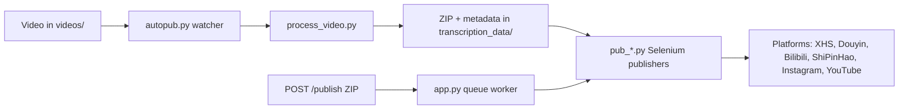

[English](../README.md) · [العربية](README.ar.md) · [Español](README.es.md) · [Français](README.fr.md) · [日本語](README.ja.md) · [한국어](README.ko.md) · [Tiếng Việt](README.vi.md) · [中文 (简体)](README.zh-Hans.md) · [中文（繁體）](README.zh-Hant.md) · [Deutsch](README.de.md) · [Русский](README.ru.md)


[](https://github.com/lachlanchen/lachlanchen/blob/main/figs/banner.png)

<div align="center">

# AutoPublish

<p align="center">
  <strong>腳本優先、以瀏覽器驅動的多平台短影音發布方案。</strong><br/>
  <sub>適用於安裝、執行、佇列模式與各平台自動化流程的權威操作手冊。</sub>
</p>

</div>

[](#prerequisites)
[](#system-overview)
[](#running-the-tornado-service-apppy)
[](#platform-specific-notes)
[](#running-the-tornado-service-apppy)
[](#pwa-frontend-pwa)
[](https://github.com/sponsors/lachlanchen)
[](#table-of-contents)
[](#license)
[](#configuration)
[](#security--ops-checklist)
[](#raspberry-pi--linux-service-setup)

[](#usage)
[](#preparing-browser-sessions)
[](#metadata--zip-format)

| Jump to | Link |
| --- | --- |
| 首次設定 | [Start Here](#start-here) |
| 本地 watcher 方式執行 | [Running the CLI pipeline (`autopub.py`)](#running-the-cli-pipeline-autopubpy) |
| 透過 HTTP 佇列執行 | [Running the Tornado service (`app.py`)](#running-the-tornado-service-apppy) |
| 部署為服務 | [Raspberry Pi / Linux Service Setup](#raspberry-pi--linux-service-setup) |
| 支援專案 | [Support](#support-autopublish) |


本倉庫刻意保持底層透明：大多數設定都放在 Python 檔案與 shell 腳本中。本文檔是一份作業手冊，涵蓋安裝、執行與擴充點。

> ⚙️ **運維理念**：專案傾向於使用可直接觀察的腳本與瀏覽器自動化，而非隱藏式抽象層。
> ✅ **本 README 的規範**：保留完整技術細節，再提升可讀性與可發現性。

### Quick Navigation

| 我想要... | 前往 |
| --- | --- |
| 執行首次發布 | [Quick Start Checklist](#quick-start-checklist) |
| 對比執行模式 | [Runtime Modes at a Glance](#runtime-modes-at-a-glance) |
| 設定憑證與路徑 | [Configuration](#configuration) |
| 啟動 API 模式與佇列任務 | [Running the Tornado service (`app.py`)](#running-the-tornado-service-apppy) |
| 使用可複製命令驗證 | [Examples](#examples) |
| 在 Raspberry Pi / Linux 部署 | [Raspberry Pi / Linux Service Setup](#raspberry-pi--linux-service-setup) |

## Start Here

如果你是第一次使用本倉庫，請依以下順序操作：

1. 先閱讀 [Prerequisites](#prerequisites) 與 [Installation](#installation)。
2. 在 [Configuration](#configuration) 設定憑證與絕對路徑。
3. 在 [Preparing Browser Sessions](#preparing-browser-sessions) 準備瀏覽器除錯會話。
4. 在 [Usage](#usage) 選擇執行模式：`autopub.py`（watcher）或 `app.py`（API queue）。
5. 透過 [Examples](#examples) 中的命令驗證。

## Overview

AutoPublish 目前支援兩種正式執行模式：

<div align="center">


</div>

1. **CLI watcher 模式（`autopub.py`）**：以資料夾為基礎的擷取與發布。
2. **API 佇列模式（`app.py`）**：透過 HTTP（`/publish`、`/publish/queue`）使用 ZIP 的 API 發佈。

此專案較適合偏好透明、腳本優先流程的操作人員，而非高階編排平台。

### Runtime Modes at a Glance

| 模式 | 進入點 | 輸入 | 最佳場景 | 輸出行為 |
| --- | --- | --- | --- | --- |
| CLI watcher | `autopub.py` | 放入 `videos/` 的檔案 | 本機操作流程、排程與服務迴圈 | 偵測到影片後立即處理並發佈到已選平台 |
| API 佇列服務 | `app.py` | 上傳 ZIP 到 `POST /publish` | 與上游系統整合與遠端觸發 | 接收任務後入佇列，工作執行緒依序執行 |

### Platform Coverage Snapshot

| 平台 | 發佈模組 | 登入輔助 | 控制埠 | CLI 模式 | API 模式 |
| --- | --- | --- | --- | --- | --- |
| XiaoHongShu | `pub_xhs.py` | `login_xiaohongshu.py` | `5003` | ✅ | ✅ |
| Douyin | `pub_douyin.py` | `login_douyin.py` | `5004` | ✅ | ✅ |
| Bilibili | `pub_bilibili.py` | N/A | `5005` | ✅ | ✅ |
| ShiPinHao（微信影片號） | `pub_shipinhao.py` | `login_shipinhao.py` | `5006` | 可選 | ✅ |
| Instagram | `pub_instagram.py` | `login_instagram.py` | `5007` | 可選 | ✅ |
| YouTube | `pub_y2b.py` | N/A | `9222` | 可選 | ✅ |

## Quick Snapshot

| 項目 | 數值 | 顏色提示 |
| --- | --- | --- |
| 主要語言 | Python 3.10+ |  |
| 主要運行模式 | CLI watcher（`autopub.py`）+ Tornado 佇列服務（`app.py`） |  |
| 自動化引擎 | Selenium + remote-debug Chromium 會話 |  |
| 輸入格式 | 原始影片（`videos/`）與 ZIP 包（`/publish`） |  |
| 目前倉庫路徑 | `/home/lachlan/ProjectsLFS/AutoPublish` |  |
| 目標使用者 | 管理多平台短影音流程的創作者／運維工程師 |  |

### Operational Safety Snapshot

| 主題 | 目前狀態 | 措施 |
| --- | --- | --- |
| 硬編碼路徑 | 多個模組仍存在 | 上線前請依主機更新路徑常數 |
| 瀏覽器登入狀態 | 必要 | 保持各平台的持久 remote-debug profile |
| 驗證碼處理 | 有可選整合 | 需要時配置 2Captcha / Turing 憑證 |
| 授權聲明 | 未偵測到頂層 `LICENSE` 檔案 | 於對外散布前先向維護者確認使用條款 |

### Compatibility & Assumptions

| 項目 | 本倉庫目前假設 |
| --- | --- |
| Python | 3.10+ |
| 執行環境 | 可提供 Chromium 圖形介面的 Linux 桌面/伺服器 |
| 瀏覽器控制模式 | 使用持久化 profile 目錄的 remote-debug 會話 |
| 主要 API 連接埠 | `8081`（`app.py --port`） |
| 處理後端 | `upload_url` 與 `process_url` 可連通且回傳有效 ZIP |
| 本草案使用之工作區 | `/home/lachlan/ProjectsLFS/AutoPublish` |

---

## Table of Contents

- [Start Here](#start-here)
- [Overview](#overview)
- [Runtime Modes at a Glance](#runtime-modes-at-a-glance)
- [Platform Coverage Snapshot](#platform-coverage-snapshot)
- [Quick Snapshot](#quick-snapshot)
- [Operational Safety Snapshot](#operational-safety-snapshot)
- [Compatibility & Assumptions](#compatibility--assumptions)
- [System Overview](#system-overview)
- [Features](#features)
- [Project Structure](#project-structure)
- [Repository Layout](#repository-layout)
- [Prerequisites](#prerequisites)
- [Installation](#installation)
- [Configuration](#configuration)
- [Configuration Verification Checklist](#configuration-verification-checklist)
- [Preparing Browser Sessions](#preparing-browser-sessions)
- [Usage](#usage)
- [Examples](#examples)
- [Metadata & ZIP Format](#metadata--zip-format)
- [Data & Artifact Lifecycle](#data--artifact-lifecycle)
- [Platform-Specific Notes](#platform-specific-notes)
- [Raspberry Pi / Linux Service Setup](#raspberry-pi--linux-service-setup)
- [Legacy macOS Scripts](#legacy-macos-scripts)
- [Troubleshooting & Maintenance](#troubleshooting--maintenance)
- [FAQ](#faq)
- [Extending the System](#extending-the-system)
- [Quick Start Checklist](#quick-start-checklist)
- [Development Notes](#development-notes)
- [Roadmap](#roadmap)
- [Contributing](#contributing)
- [Security & Ops Checklist](#security--ops-checklist)
- [License](#license)
- [Acknowledgements](#acknowledgements)
- [❤️ Support](#support-autopublish)

---

## System Overview

🎯 **從原始素材到正式貼文的端到端流程**：



流程概覽：

1. **原始素材接入**：將影片放到 `videos/`。監看器（`autopub.py` 或排程/服務）會透過 `videos_db.csv` 與 `processed.csv` 偵測新檔。
2. **資產產生**：`process_video.VideoProcessor` 會上傳檔案到內容處理伺服器（`upload_url` 與 `process_url`），回傳一個 ZIP 包，內容含：
   - 已編輯/轉碼的影片（`<stem>.mp4`）
   - 封面圖片
   - 包含在地化標題、描述、標籤等欄位的 `{stem}_metadata.json`
3. **發布**：`pub_*.py` 內的 Selenium 發佈器以 `metadata` 驅動。每個發佈器會以 remote-debug port 和持久化使用者資料目錄，掛接到已啟動的 Chromium/Chrome 實例。
4. **網頁控制平面（可選）**：`app.py` 提供 `/publish`，接收預先打包的 ZIP、解包後入佇列並交給同一組發佈器執行；也會刷新瀏覽器會話並觸發登入輔助腳本（`login_*.py`）。
5. **支援模組**：`load_env.py` 從 `~/.bashrc` 載入密鑰，`utils.py` 提供視窗聚焦、QR 處理、郵件工具等輔助，`solve_captcha_*.py` 在出現驗證碼時接入 Turing/2Captcha。

## Features

✨ **為務實、腳本優先自動化設計**：

- 多平台發布：XiaoHongShu、Douyin、Bilibili、ShiPinHao（微信影片號）、Instagram、YouTube（可選）。
- 兩種執行模式：CLI watcher 流程（`autopub.py`）與 API 佇列服務（`app.py` + `/publish` + `/publish/queue`）。
- 使用 `ignore_*` 檔案作為平台級暫時停用開關。
- 透過 remote-debug 重用瀏覽器會話並保留持久 profile。
- 可選的 QR／驗證碼自動化與郵件通知輔助。
- 內建 PWA（`pwa/`）上傳介面無需前端建置。
- 提供 `scripts/` 內 Linux / Raspberry Pi 服務化腳本。

### Feature Matrix

| 能力 | CLI（`autopub.py`） | API（`app.py`） |
| --- | --- | --- |
| 輸入來源 | 本機 `videos/` 監看 | 透過 `POST /publish` 上傳 ZIP |
| 佇列 | 基於檔案的內部進度 | 明確的記憶體內任務佇列 |
| 平台參數 | CLI 參數（`--pub-*`）+ `ignore_*` | 查詢參數（`publish_*`）+ `ignore_*` |
| 最佳使用情境 | 單機操作流程 | 外部系統整合與遠端觸發 |

---

## Project Structure

專案與執行時高層目錄結構：

```text
AutoPublish/
├── README.md
├── app.py
├── autopub.py
├── process_video.py
├── load_env.py
├── utils.py
├── pub_*.py                  # platform publishers
├── login_*.py                # platform login/session helpers
├── solve_captcha_*.py
├── smtp.py
├── smtp_test_simple.py
├── send_email_qreader.py
├── requirements.txt
├── requirements.autopub.txt
├── .env.example
├── setup_raspberrypi.md
├── scripts/
├── pwa/
├── figs/
├── .github/FUNDING.yml
├── i18n/                     # multilingual READMEs
├── videos/                   # runtime input artifacts
├── logs/, logs-autopub/      # runtime logs
├── temp/, temp_screenshot/   # runtime temp artifacts
├── videos_db.csv
└── processed.csv
```

說明：`transcription_data/` 會在執行時被處理／發布流程使用，任務完成後可能會出現在工作目錄。

## Repository Layout

🗂️ **關鍵模組與用途**：

| 路徑 | 用途 |
| --- | --- |
| `app.py` | Tornado 服務，對外提供 `/publish` 與 `/publish/queue`，並包含發佈佇列與 worker 執行緒。 |
| `autopub.py` | CLI watcher：掃描 `videos/`，處理新檔並平行呼叫各發佈器。 |
| `process_video.py` | 將影片上傳至處理後端並儲存回傳的 ZIP。 |
| `pub_xhs.py`, `pub_douyin.py`, `pub_bilibili.py`, `pub_shipinhao.py`, `pub_instagram.py`, `pub_y2b.py` | 各平台的 Selenium 自動化模組。 |
| `login_xiaohongshu.py`, `login_douyin.py`, `login_shipinhao.py`, `login_instagram.py` | 會話檢查與 QR 登入流程。 |
| `utils.py` | 共用自動化輔助（視窗聚焦、QR/郵件工具、診斷輔助）。 |
| `load_env.py` | 從 shell profile（`~/.bashrc`）載入環境變數並遮罩敏感日誌。 |
| `smtp.py`, `smtp_test_simple.py`, `send_email_qreader.py` | SMTP / SendGrid 輔助與測試腳本。 |
| `solve_captcha_2captcha.py`, `solve_captcha_turing.py` | 驗證碼 solver 整合。 |
| `scripts/` | 服務化與運維腳本（Raspberry Pi/Linux + legacy 自動化）。 |
| `pwa/` | 提供 ZIP 預覽與提交的靜態 PWA。 |
| `setup_raspberrypi.md` | Raspberry Pi 分步佈建指南。 |
| `.env.example` | 環境變數範本（憑證、路徑、驗證碼金鑰）。 |
| `.github/FUNDING.yml` | 贊助設定。 |
| `logs/`, `logs-autopub/`, `temp/`, `temp_screenshot/`, `videos/` | 執行時產物與日誌（多數在 `.gitignore` 中）。 |

---

## Prerequisites

🧰 **首次執行前請先安裝**。

### Operating system and tools

- Linux 桌面/伺服器，並具備 X session（腳本常見設定為 `DISPLAY=:1`）。
- Chromium/Chrome 與對應 ChromeDriver。
- GUI/媒體工具：`xdotool`、`ffmpeg`、`zip`、`unzip`。
- Python 3.10+（venv 或 Conda）。

### Python dependencies

最小執行依賴：

```bash
pip install selenium tornado requests requests-toolbelt sendgrid qreader opencv-python webdriver-manager
```

倉庫標準安裝：

```bash
python -m pip install -r requirements.txt
```

若你使用輕量安裝（setup 腳本預設）：

```bash
python -m pip install -r requirements.autopub.txt
```

`requirements.autopub.txt` 包含：
- `selenium`、`webdriver-manager`、`tornado`、`requests`、`requests-toolbelt`、`sendgrid`、`qreader`、`opencv-python`、`numpy`、`pillow`、`twocaptcha`。

### Optional: create a sudo user

```bash
sudo useradd -m -s /bin/bash -G sudo <USERNAME> && echo "<USERNAME>:<PASSWORD>" | sudo chpasswd
```

---

## Installation

🚀 **從空白機器開始安裝**：

1. 克隆倉庫：

```bash
git clone https://github.com/lachlanchen/AutoPublish.git
cd AutoPublish
```

2. 建立並啟用環境（以 `venv` 為例）：

```bash
python3 -m venv .venv
source .venv/bin/activate
python -m pip install -U pip
python -m pip install -r requirements.txt
```

3. 準備環境變數：

```bash
cp .env.example .env
# 填寫 .env（請勿提交）
```

4. 載入 shell 環境變數給腳本使用：

```bash
source ~/.bashrc
python load_env.py
```

注意：`load_env.py` 預設以 `~/.bashrc` 為基準；若你的環境使用其他 shell profile，請對應調整。

---

## Configuration

🔐 **先設定憑證，再確認主機對應路徑**。

### Environment variables

專案會從環境變數取得憑證與可選的瀏覽器／執行參數。先參考 `.env.example`：

| 變數 | 說明 |
| --- | --- |
| `FROM_EMAIL`, `TO_EMAIL`, `APP_PASSWORD` | QR/登入通知所需的 SMTP 憑證。 |
| `SENDGRID_API_KEY` | 使用 SendGrid API 流程的 key。 |
| `APIKEY_2CAPTCHA` | 2Captcha 的 API key。 |
| `TULING_USERNAME`, `TULING_PASSWORD`, `TULING_ID` | Turing 驗證碼憑證。 |
| `DOUYIN_LOGIN_PASSWORD` | 抖音二次驗證輔助碼。 |
| `INSTAGRAM_*`, `CHROME_*`, `CHROMEDRIVER_PATH` | Instagram 與瀏覽器驅動覆寫參數。 |
| `AUTOPUBLISH_BROWSER_BIN`, `AUTOPUBLISH_CHROMEDRIVER`, `AUTOPUBLISH_DISPLAY` | `app.py` 中的全域瀏覽器／驅動／顯示覆寫。 |

### Path constants (important)

📌 **最常見啟動問題**：硬編碼的絕對路徑未對齊。

部分模組仍保留硬編碼常數，請依你的主機更新：

| 檔案 | 常數 | 說明 |
| --- | --- | --- |
| `app.py` | `logs_folder_root`, `autopublish_folder_root`, `videos_db_path`, `processed_path`, `transcription_root`, `upload_url`, `process_url`. | API 服務根路徑與後端 endpoint。 |
| `autopub.py` | `logs_folder_path`, `autopublish_folder_path`, `videos_db_path`, `processed_path`, `transcription_path`, `upload_url`, `process_url`, `chromedriver_path`. | CLI watcher 根路徑與後端 endpoint。 |
| `scripts/run_autopub.sh`, `scripts/setup_autopub.sh` | Python/Conda/倉庫/日誌等絕對路徑 | Legacy / macOS 風格包裝腳本。 |
| `utils.py` | 封面處理輔助中的 FFmpeg 路徑假設。 | 媒體工具路徑相容性。 |

重要倉庫備註：
- 本工作區目前路徑為 `/home/lachlan/ProjectsLFS/AutoPublish`。
- 部分程式碼仍舊使用 `/home/lachlan/Projects/auto-publish` 或 `/Users/lachlan/...`。
- 請在本機先調整並覆寫這些路徑後再上線。

### Platform toggles via `ignore_*`

🧩 **快速安全開關**：只要 touch 對應 `ignore_*` 檔案即可停用該平台，不必改程式。

發布旗標也受 ignore 檔控。建立空檔來停用某平台：

```bash
touch ignore_xhs ignore_douyin ignore_bilibili ignore_shipinhao ignore_instagram ignore_y2b
```

移除對應檔案即可恢復。

### Configuration Verification Checklist

設定好 `.env` 與路徑常數後，可做快速驗證：

```bash
python -c "import os;print('AUTOPUBLISH_BROWSER_BIN=', os.getenv('AUTOPUBLISH_BROWSER_BIN'));print('AUTOPUBLISH_CHROMEDRIVER=', os.getenv('AUTOPUBLISH_CHROMEDRIVER'));print('DISPLAY=', os.getenv('DISPLAY') or os.getenv('AUTOPUBLISH_DISPLAY'))"
python -c "from load_env import load_env_from_bashrc; load_env_from_bashrc(); print('Environment load OK')"
python -c "import os; p=os.getenv('AUTOPUBLISH_CHROMEDRIVER') or os.getenv('CHROMEDRIVER_PATH') or '/usr/bin/chromedriver'; print(p, 'exists=', os.path.exists(p))"
```

若有任何缺值，先更新 `.env`、`~/.bashrc` 或腳本常數，再執行發佈。

---

## Preparing Browser Sessions

🌐 **穩定 Selenium 發布的關鍵是會話持久化**。

1. 建立各平台專用資料夾：

```bash
mkdir -p ~/chromium_dev_session_{5003,5004,5005,5006,5007,9222}
mkdir -p ~/chromium_dev_session_logs
```

2. 以遠端除錯啟動瀏覽器（以 XiaoHongShu 為例）：

```bash
DISPLAY=:1 chromium-browser \
  --remote-debugging-port=5003 \
  --user-data-dir="$HOME/chromium_dev_session_5003" \
  https://creator.xiaohongshu.com/creator/post \
  > "$HOME/chromium_dev_session_logs/chromium_xhs.log" 2>&1 &
```

3. 每個平台手動登入一次。

4. 驗證 Selenium 可否附著：

```python
from selenium import webdriver
opts = webdriver.ChromeOptions()
opts.add_experimental_option("debuggerAddress", "127.0.0.1:5003")
driver = webdriver.Chrome(options=opts)
print(driver.title)
driver.quit()
```

安全提示：
- `app.py` 目前在瀏覽器重啟邏輯中仍含 `password = "1"` 的硬編碼 sudo placeholder。正式部署前請替換。

---

## Usage

▶️ **目前提供兩種執行模式**：CLI watcher 與 API queue 服務。

### Running the CLI pipeline (`autopub.py`)

1. 將來源影片放入監看目錄（`videos/` 或你設定的 `autopublish_folder_path`）。
2. 執行：

```bash
python autopub.py --use-cache --pub-xhs --pub-douyin --pub-bilibili
```

參數：

| 參數 | 說明 |
| --- | --- |
| `--pub-xhs`, `--pub-douyin`, `--pub-bilibili` | 僅發佈到指定平台。若未指定，預設啟用三者。 |
| `--test` | 測試模式，會傳入各平台模組，行為依模組而定。 |
| `--use-cache` | 若存在 `transcription_data/<video>/<video>.zip`，可重用既有 ZIP。 |

每支影片的 CLI 流程：
- 透過 `process_video.py` 上傳與處理。
- 解壓縮 ZIP 到 `transcription_data/<video>/`。
- 以 `ThreadPoolExecutor` 啟動目標發佈器。
- 將狀態寫入 `videos_db.csv` 與 `processed.csv`。

### Running the Tornado service (`app.py`)

🛰️ **API 模式** 適合外部系統產生 ZIP 的場景。

啟動服務：

```bash
python app.py --refresh-time 1800 --port 8081
```

API 端點摘要：

| Endpoint | Method | Purpose |
| --- | --- | --- |
| `/publish` | `POST` | 上傳 ZIP bytes 並入佇列發佈任務 |
| `/publish/queue` | `GET` | 查詢佇列、歷史與發布狀態 |

### `POST /publish`

📤 **直接上傳 ZIP bytes 以排隊發佈任務**。

- Header：`Content-Type: application/octet-stream`
- 必填 query/form 參數：`filename`（ZIP 檔名）
- 可選布林參數：`publish_xhs`, `publish_douyin`, `publish_bilibili`, `publish_shipinhao`, `publish_instagram`, `publish_y2b`, `test`
- Body：原始 ZIP bytes

範例：

```bash
curl -X POST "http://localhost:8081/publish?filename=demo.zip&publish_xhs=true&publish_instagram=true&publish_y2b=true" \
  --data-binary @demo.zip \
  -H "Content-Type: application/octet-stream"
```

程式目前行為：
- 請求會被接受並入佇列。
- 即時回應 JSON，包含 `status: queued`、`job_id`、`queue_size`。
- Worker 執行緒會依序處理佇列中的任務。

### `GET /publish/queue`

📊 **觀察佇列健康度與進行中任務**。

回傳佇列狀態／歷史 JSON：

```bash
curl "http://localhost:8081/publish/queue"
```

回傳欄位包含：
- `status`、`jobs`、`queue_size`、`is_publishing`。

### Browser refresh thread

♻️ 週期性刷新瀏覽器可降低長時間執行時會話過期造成的失敗。

`app.py` 使用 `--refresh-time` 建立背景刷新執行緒，並掛接登入檢查邏輯；刷新間隔帶有隨機抖動。

### PWA frontend (`pwa/`)

🖥️ 輕量靜態 UI，用於手動上傳 ZIP 與檢視佇列。

本機執行：

```bash
cd pwa
python -m http.server 5173
```

開啟 `http://localhost:5173`，並設定後端 base URL（例如 `http://lazyingart:8081`）。

PWA 功能：
- 拖放 ZIP 預覽。
- 發佈目標切換與測試模式。
- 提交到 `/publish` 並輪詢 `/publish/queue`。

### Command Palette

🧷 **常用命令彙整**。

| 任務 | 指令 |
| --- | --- |
| 安裝全部依賴 | `python -m pip install -r requirements.txt` |
| 安裝輕量執行依賴 | `python -m pip install -r requirements.autopub.txt` |
| 載入 shell 環境變數 | `source ~/.bashrc && python load_env.py` |
| 啟動 API 佇列服務 | `python app.py --refresh-time 1800 --port 8081` |
| 啟動 CLI watcher 流程 | `python autopub.py --use-cache --pub-xhs --pub-douyin --pub-bilibili` |
| 提交 ZIP 到佇列 | `curl -X POST "http://localhost:8081/publish?filename=demo.zip" --data-binary @demo.zip -H "Content-Type: application/octet-stream"` |
| 檢查佇列狀態 | `curl -s "http://localhost:8081/publish/queue"` |
| 啟動本機 PWA | `cd pwa && python -m http.server 5173` |

---

## Examples

🧪 **可直接複製貼上的冒煙測試命令**：

### Example 0: 載入環境並啟動 API 服務

```bash
source ~/.bashrc
python load_env.py
python app.py --refresh-time 1800 --port 8081
```

### Example A: CLI 發佈執行

```bash
python autopub.py --pub-xhs --pub-douyin --use-cache
```

### Example B: API 發佈執行（單一 ZIP）

```bash
curl -X POST "http://localhost:8081/publish?filename=my_bundle.zip&publish_bilibili=true&test=true" \
  --data-binary @my_bundle.zip \
  -H "Content-Type: application/octet-stream"
```

### Example C: 查詢佇列狀態

```bash
curl -s "http://localhost:8081/publish/queue"
```

### Example D: SMTP 輔助冒煙測試

```bash
python smtp.py
python smtp_test_simple.py
```

---

## Metadata & ZIP Format

📦 **ZIP 契約很關鍵**：請維持檔名與 metadata 鍵值與發佈模組預期一致。

ZIP 最小內容：

```text
<stem>_metadata.json
<video_filename>.mp4
<cover_filename>.jpg
```

`metadata` 用於 CN 平台發佈；可選的 `metadata["english_version"]` 會提供給 YouTube 發佈器。

模組常用欄位：
- `title`、`brief_description`、`middle_description`、`long_description`
- `tags`（hashtags 清單）
- `video_filename`、`cover_filename`
- 各平台特有欄位（依各 `pub_*.py` 實作）

若你在外部產生 ZIP，請讓鍵名與檔名與模組期望保持一致。

## Data & Artifact Lifecycle

流水線會建立本地產物，請有意識地保留、輪替或清理：

| 產物 | 位置 | 產生來源 | 為何重要 |
| --- | --- | --- | --- |
| 來源影片 | `videos/` | 手動投入或上游同步 | CLI watcher 的來源媒體 |
| 處理後 ZIP 輸出 | `transcription_data/<stem>/<stem>.zip` | `process_video.py` | 可供 `--use-cache` 重用 |
| 已解壓發布素材 | `transcription_data/<stem>/...` | `autopub.py` / `app.py` 的 ZIP 解壓 | 發佈可直接使用的檔案與 metadata |
| 發佈日誌 | `logs/`, `logs-autopub/` | CLI/API 運行時 | 故障排查與稽核 |
| 瀏覽器日誌 | `~/chromium_dev_session_logs/*.log`（或 chrome 前綴） | 瀏覽器啟動腳本 | 診斷會話、埠、啟動問題 |
| 追蹤 CSV | `videos_db.csv`, `processed.csv` | CLI watcher | 防止重複處理 |

建議：
- 建立定期清理／封存作業，處理舊 `transcription_data/`、`temp/` 與舊日誌，避免磁碟壓力。

---

## Platform-Specific Notes

🧭 **各平台對應的埠與模組**：

| 平台 | 埠 | 模組 | 備註 |
| --- | --- | --- | --- |
| XiaoHongShu | 5003 | `pub_xhs.py`, `login_xiaohongshu.py` | QR 重登入流程；標題清洗與 hashtag 來源自 metadata。 |
| Douyin | 5004 | `pub_douyin.py`, `login_douyin.py` | 上傳完成檢查與重試路徑較脆弱，務必密切監控日誌。 |
| Bilibili | 5005 | `pub_bilibili.py` | 可透過 `solve_captcha_2captcha.py` 與 `solve_captcha_turing.py` 接入驗證碼。 |
| ShiPinHao（WeChat Channels） | 5006 | `pub_shipinhao.py`, `login_shipinhao.py` | 快速完成 QR 驗證對刷新會話穩定度很重要。 |
| Instagram | 5007 | `pub_instagram.py`, `login_instagram.py` | API 模式以 `publish_instagram=true` 控制；環境變數見 `.env.example`。 |
| YouTube | 9222 | `pub_y2b.py` | 透過 `english_version` metadata 區塊；可用 `ignore_y2b` 停用。 |

---

## Raspberry Pi / Linux Service Setup

🐧 **推薦用於長時間開機主機**。

完整主機設置可參考 [`setup_raspberrypi.md`](setup_raspberrypi.md)。

快速服務化設定：

```bash
export AUTOPUB_USER=<USERNAME>
export AUTOPUB_REPO=/home/<USERNAME>/Projects/autopub
sudo -E ./scripts/setup_autopub_pipeline.sh
```

此腳本會自動串接：
- `scripts/setup_envs.sh`
- `scripts/setup_virtual_desktop_service.sh`
- `scripts/download_and_setup_driver.sh`
- `scripts/setup_autopub_service.sh`

在 tmux 手動啟動服務：

```bash
./scripts/start_autopub_tmux.sh
```

驗證服務與埠：

```bash
systemctl status autopub.service autopub-vnc.service
sudo ss -ltnp | grep 590
```

兼容性說明：
- 部分舊文件／腳本仍提到 `virtual-desktop.service`；本倉庫目前的 setup 腳本安裝 `autopub-vnc.service`。

---

## Legacy macOS Scripts

🍎 倉庫仍保留 legacy macOS 包裝腳本：

- `scripts/run_autopub.sh`
- `scripts/setup_autopub.sh`

這些腳本包含固定 `/Users/lachlan/...` 路徑與 Conda 假設。若你依賴該流程，請保留並依主機更新路徑與 tool。

---

## Troubleshooting & Maintenance

🛠️ **出現問題先從這裡開始**。

- **跨機器路徑漂移**：若錯誤訊息中出現 `/Users/lachlan/...` 或 `/home/lachlan/Projects/auto-publish`，請將常數對齊到本機路徑（本工作區為 `/home/lachlan/ProjectsLFS/AutoPublish`）。
- **憑證衛生**：推送前執行 `~/.local/bin/detect-secrets scan`。若有外洩憑證請輪換。
- **處理後端錯誤**：若 `process_video.py` 顯示 `Failed to get the uploaded file path`，請確認上傳回應 JSON 含有 `file_path`，並確認處理端回傳 ZIP bytes。
- **ChromeDriver 不一致**：若出現 DevTools 連線錯誤，請對齊 Chrome/Chromium 與 driver 版本（或改用 `webdriver-manager`）。
- **瀏覽器焦點問題**：`bring_to_front` 依賴視窗標題比對，Chromium/Chrome 名稱差異可能導致失敗。
- **驗證碼中斷**：配置 2Captcha/Turing 憑證，並在必要時接入 solver 輸出。
- **過期鎖檔**：若排程任務長期不啟動，檢查進程狀態並刪除殘留 `autopub.lock`（legacy 流程）。
- **建議檢查日誌**：`logs/`、`logs-autopub/`、`~/chromium_dev_session_logs/*.log`，以及服務 journal。

## FAQ

**Q: 可以同時執行 API 模式和 CLI watcher 嗎？**  
A: 可以，但不建議，除非你對輸入與瀏覽器會話做出嚴格隔離。兩者都可能搶用相同發佈器、檔案與連接埠。

**Q: 為什麼 `/publish` 回傳 queued 但尚未看到任何已發佈？**  
A: `app.py` 先入佇列，再由背景 worker 逐筆處理。請檢查 `/publish/queue`、`is_publishing` 與服務日誌。

**Q: 若我已使用 `.env`，還需要 `load_env.py` 嗎？**  
A: `start_autopub_tmux.sh` 會在存在時載入 `.env`，但某些直接執行方式仍依賴 shell 環境。請保持 `.env` 與 shell export 一致。

**Q: API 上傳最小 ZIP 契約是什麼？**  
A: 需提供 `{stem}_metadata.json`，並讓影片與封面檔名與 metadata 鍵（`video_filename`、`cover_filename`）對應。

**Q: 有支援無頭模式嗎？**  
A: 某些模組有無頭相關變數，但本倉庫文件與實際作法主要使用保留持久 profile 的 GUI 瀏覽器。

## Extending the System

🧱 **新平台與更安全運維的擴充點**：

- **新增平台**：複製一個 `pub_*.py`，更新 selector 與流程，若需 QR 重認證再補上 `login_*.py`，再在 `app.py` 與 `autopub.py` 接上旗標與佇列控制。
- **設定抽象化**：將散落常數收斂至結構化設定（`config.yaml` / `.env` + typed model），提升多主機支援。
- **憑證安全加固**：將硬編碼或 shell 直出敏感流程改為安全憑證管理（`sudo -A`、金鑰鏈、vault/secret manager）。
- **容器化**：將 Chromium/ChromeDriver、Python Runtime、虛擬顯示整合為可重現部署單位，支援雲端／伺服器。

## Quick Start Checklist

✅ **最小化到首次成功發布的路徑**：

1. 克隆倉庫並安裝依賴（`pip install -r requirements.txt` 或 `requirements.autopub.txt`）。
2. 更新 `app.py`、`autopub.py` 及你即將執行的腳本中的硬編碼路徑。
3. 在 shell profile 或 `.env` 匯出必要憑證，執行 `python load_env.py` 驗證載入。
4. 建立各平台的 remote-debug profile 資料夾並啟動一次。
5. 在每個目標平台分別完成第一次手動登入。
6. 啟動 API 模式（`python app.py --port 8081`）或 CLI 模式（`python autopub.py --use-cache ...`）。
7. 提交一個樣本 ZIP（API）或影片（CLI），並檢查 `logs/`。
8. 每次提交前都執行秘密掃描。

## Development Notes

🧬 **目前開發基線**（手工排版 + 冒煙測試）。

- Python 風格沿用既有 4 空格縮排與手工格式。
- 目前無正式自動測試套件，改以冒煙測試：
  - 透過 `autopub.py` 處理單一範例影片；
  - 向 `/publish` 提交一個 ZIP 並觀察 `/publish/queue`；
  - 手動驗證每個目標平台。
- 新增腳本時保留 `if __name__ == "__main__":` 入口，便於快速 dry run。
- 平台改動儘量隔離（`pub_*`、`login_*`、`ignore_*`）。
- 運行時產物（`videos/*`, `logs*/*`, `transcription_data/*`, `ignore_*`）一般為本機資料，多為 git ignored。

## Roadmap

🗺️ **依目前程式約束的優先改進方向**。

規劃 / 期望改進（依目前程式註記）：

1. 以集中式設定（`.env`/YAML + typed model）取代散落硬編碼常數。
2. 移除硬編碼 sudo 密碼邏輯，改用更安全的程序控制。
3. 透過更強重試與更穩定的平台 UI 狀態偵測，提升發佈可靠性。
4. 擴充平台覆蓋（例如 Kuaishou 或其他創作者平台）。
5. 將執行環境打包為可重現部署單元（container + virtual display profile）。
6. 新增 ZIP 契約與佇列執行的自動化整合檢查。

## Contributing

🤝 歡迎以聚焦、可重現、明確說明運行假設的方式提交 PR。

Contributions 歡迎。

1. Fork 並建立專注分支。
2. 保持提交範圍小且命令式（歷史範例：`Wait for YouTube checks before publishing`）。
3. 在 PR 中補上人工驗證筆記：
   - 環境假設，
   - 瀏覽器／會話重啟，
   - 與 UI 流程相關的日誌或截圖。
4. 務必不要提交真實憑證（`.env` 已被忽略，僅用 `.env.example` 作欄位參考）。

新增發佈模組時，請同步更新：
- `pub_<platform>.py`
- 可選 `login_<platform>.py`
- `app.py` 中的 API 參數與佇列處理
- （若需要）`autopub.py` 的 CLI 路由
- `ignore_<platform>` 開關處理
- README 文件

## Security & Ops Checklist

上線前請先確認：

1. 本機有 `.env`，且未被 Git 追蹤。
2. 輪換或移除可能曾被提交過的憑證。
3. 替換程式中的敏感 placeholder（例如 `app.py` 中的 sudo 密碼 placeholder）。
4. 批次執行前確認 `ignore_*` 開關是刻意設定。
5. 確認瀏覽器 profile 按平台隔離，並使用最小權限帳號。
6. 對外分享 issue 報告前先確認日誌未暴露敏感資訊。
7. 推送前執行 `detect-secrets`（或同類工具）。

<a id="support-autopublish"></a>
## ❤️ Support

| Donate | PayPal | Stripe |
| --- | --- | --- |
| [](https://chat.lazying.art/donate) | [](https://paypal.me/RongzhouChen) | [](https://buy.stripe.com/aFadR8gIaflgfQV6T4fw400) |

## License

本倉庫目前快照中未包含 `LICENSE` 檔案。

草案假設：
- 在維護者補上明確授權條款前，視為使用與再分發條件未定義。

建議後續操作：
- 新增頂層 `LICENSE`（例如 MIT / Apache-2.0 / GPL-3.0）並同步更新本段。

> 📝 在正式加入授權檔前，請直接向維護者確認商業或內部再分發的前提假設仍未明確。

---

## Acknowledgements

- 維護者與贊助者頁面：[ @lachlanchen](https://github.com/lachlanchen)
- 資金設定來源：[`.github/FUNDING.yml`](.github/FUNDING.yml)
- 本倉庫涉及的生態服務：Selenium、Tornado、SendGrid、2Captcha、Turing captcha APIs。
