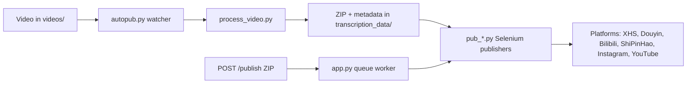

[English](../README.md) · [العربية](README.ar.md) · [Español](README.es.md) · [Français](README.fr.md) · [日本語](README.ja.md) · [한국어](README.ko.md) · [Tiếng Việt](README.vi.md) · [中文 (简体)](README.zh-Hans.md) · [中文（繁體）](README.zh-Hant.md) · [Deutsch](README.de.md) · [Русский](README.ru.md)


[](https://github.com/lachlanchen/lachlanchen/blob/main/figs/banner.png)

<div align="center">

# AutoPublish

<p align="center">
  <strong>腳本優先、以瀏覽器驅動的多平台短影音發布工具。</strong><br/>
  <sub>面向安裝、運行、佇列模式與各平台自動化流程的權威操作手冊。</sub>
</p>

</div>

[](#prerequisites)
[](#system-overview)
[](#running-the-tornado-service-apppy)
[](#platform-specific-notes)
[](#running-the-tornado-service-apppy)
[](#pwa-frontend-pwa)
[](https://github.com/sponsors/lachlanchen)
[](#table-of-contents)
[](#license)
[](#configuration)
[](#security--ops-checklist)
[](#raspberry-pi--linux-service-setup)

[](#usage)
[](#preparing-browser-sessions)
[](#metadata--zip-format)

| Jump to | Link |
| --- | --- |
| First-time setup | [Start Here](#start-here) |
| Run with local watcher | [Running the CLI pipeline (`autopub.py`)](#running-the-cli-pipeline-autopubpy) |
| Run via HTTP queue | [Running the Tornado service (`app.py`)](#running-the-tornado-service-apppy) |
| Deploy as service | [Raspberry Pi / Linux Service Setup](#raspberry-pi--linux-service-setup) |
| Support the project | [Support](#support-autopublish) |


倉庫刻意維持低階做法：大多數設定直接存在於 Python 檔案與 shell 腳本中。這份文件是作業手冊，涵蓋安裝、執行與擴充點。

> ⚙️ **運維哲學**：本專案偏好明確腳本與直接的瀏覽器自動化，而非隱藏式抽象層。
> ✅ **本 README 的原則**：先保留技術細節，再提升可讀性與可發現性。

### Quick Navigation

| I want to... | Go here |
| --- | --- |
| Run my first publish | [Quick Start Checklist](#quick-start-checklist) |
| Compare runtime modes | [Runtime Modes at a Glance](#runtime-modes-at-a-glance) |
| Configure credentials and paths | [Configuration](#configuration) |
| Launch API mode and queue jobs | [Running the Tornado service (`app.py`)](#running-the-tornado-service-apppy) |
| Validate with copy/paste commands | [Examples](#examples) |
| Set up on Raspberry Pi/Linux | [Raspberry Pi / Linux Service Setup](#raspberry-pi--linux-service-setup) |

## Start Here

如果你第一次使用這個倉庫，請依以下順序操作：

1. 先閱讀 [Prerequisites](#prerequisites) 與 [Installation](#installation)。
2. 在 [Configuration](#configuration) 設定憑證與絕對路徑。
3. 在 [Preparing Browser Sessions](#preparing-browser-sessions) 準備瀏覽器偵錯會話。
4. 在 [Usage](#usage) 選擇一種執行模式：`autopub.py`（watcher）或 `app.py`（API queue）。
5. 使用 [Examples](#examples) 中的命令進行驗證。

## Overview

AutoPublish 目前支援兩種正式執行模式：

<div align="center">


</div>

1. **CLI watcher 模式（`autopub.py`）**：以資料夾為基礎的收集與發布流程。
2. **API queue 模式（`app.py`）**：透過 HTTP (`/publish`、`/publish/queue`) 上傳 ZIP 進行發布。

本設計面向偏好透明、腳本優先流程的操作人員，而非抽象化的編排平台。

### Runtime Modes at a Glance

| 模式 | 入口 | 輸入 | 最佳使用情境 | 輸出行為 |
| --- | --- | --- | --- | --- |
| CLI watcher | `autopub.py` | 放入 `videos/` 的檔案 | 本機操作流程與 cron/service 迴圈 | 偵測到新影片後立刻處理並發布到選定平台 |
| API queue service | `app.py` | 上傳 ZIP 到 `POST /publish` | 與上游系統整合及遠端觸發 | 接受任務、入列後由 worker 依序執行 |

### Platform Coverage Snapshot

| 平台 | Publisher module | Login helper | Control port | CLI mode | API mode |
| --- | --- | --- | --- | --- | --- |
| XiaoHongShu | `pub_xhs.py` | `login_xiaohongshu.py` | `5003` | ✅ | ✅ |
| Douyin | `pub_douyin.py` | `login_douyin.py` | `5004` | ✅ | ✅ |
| Bilibili | `pub_bilibili.py` | N/A | `5005` | ✅ | ✅ |
| ShiPinHao (WeChat Channels) | `pub_shipinhao.py` | `login_shipinhao.py` | `5006` | Optional | ✅ |
| Instagram | `pub_instagram.py` | `login_instagram.py` | `5007` | Optional | ✅ |
| YouTube | `pub_y2b.py` | N/A | `9222` | Optional | ✅ |

## Quick Snapshot

| What | Value | Color cue |
| --- | --- | --- |
| Primary language | Python 3.10+ |  |
| Main runtimes | CLI watcher (`autopub.py`) + Tornado queue service (`app.py`) |  |
| Automation engine | Selenium + remote-debug Chromium sessions |  |
| Input formats | Raw videos (`videos/`) and ZIP bundles (`/publish`) |  |
| Current repo workspace path | `/home/lachlan/ProjectsLFS/AutoPublish` |  |
| Ideal users | Creators/ops engineers managing multi-platform short video pipelines |  |

### Operational Safety Snapshot

| Topic | Current state | Action |
| --- | --- | --- |
| Hard-coded paths | Present in multiple modules/scripts | Update path constants per host before production runs |
| Browser login state | Required | Keep persistent remote-debug profiles per platform |
| Captcha handling | Optional integrations available | Configure 2Captcha/Turing credentials if needed |
| License declaration | No top-level `LICENSE` file detected | Confirm usage terms with maintainer before redistribution |

### Compatibility & Assumptions

| Item | Current assumption in this repo |
| --- | --- |
| Python | 3.10+ |
| Runtime environment | Linux desktop/server with GUI display available to Chromium |
| Browser control mode | Remote debugging sessions with persisted profile directories |
| Primary API port | `8081` (`app.py --port`) |
| Processing backend | `upload_url` + `process_url` must be reachable and return valid ZIP output |
| Workspace used for this draft | `/home/lachlan/ProjectsLFS/AutoPublish` |

---

## Table of Contents

- [Start Here](#start-here)
- [Overview](#overview)
- [Runtime Modes at a Glance](#runtime-modes-at-a-glance)
- [Platform Coverage Snapshot](#platform-coverage-snapshot)
- [Quick Snapshot](#quick-snapshot)
- [Operational Safety Snapshot](#operational-safety-snapshot)
- [Compatibility & Assumptions](#compatibility--assumptions)
- [System Overview](#system-overview)
- [Features](#features)
- [Project Structure](#project-structure)
- [Repository Layout](#repository-layout)
- [Prerequisites](#prerequisites)
- [Installation](#installation)
- [Configuration](#configuration)
- [Configuration Verification Checklist](#configuration-verification-checklist)
- [Preparing Browser Sessions](#preparing-browser-sessions)
- [Usage](#usage)
- [Examples](#examples)
- [Metadata & ZIP Format](#metadata--zip-format)
- [Data & Artifact Lifecycle](#data--artifact-lifecycle)
- [Platform-Specific Notes](#platform-specific-notes)
- [Raspberry Pi / Linux Service Setup](#raspberry-pi--linux-service-setup)
- [Legacy macOS Scripts](#legacy-macos-scripts)
- [Troubleshooting & Maintenance](#troubleshooting--maintenance)
- [FAQ](#faq)
- [Extending the System](#extending-the-system)
- [Quick Start Checklist](#quick-start-checklist)
- [Development Notes](#development-notes)
- [Roadmap](#roadmap)
- [Contributing](#contributing)
- [Security & Ops Checklist](#security--ops-checklist)
- [License](#license)
- [Acknowledgements](#acknowledgements)
- [Support](#support-autopublish)

---

## System Overview

🎯 **從原始素材到已發布內容的端對端流程**：



流程一覽：

1. **素材接收**：將影片放入 `videos/`。watcher（`autopub.py` 或排程服務）會透過 `videos_db.csv` 與 `processed.csv` 偵測新檔。
2. **資產生成**：`process_video.VideoProcessor` 將檔案上傳至內容處理伺服器（`upload_url` 與 `process_url`），並回傳 ZIP 套件，包含：
   - 已編輯/轉碼影片（`<stem>.mp4`）
   - 封面圖片
   - `{stem}_metadata.json`，含本地化標題、描述、標籤等欄位
3. **發布執行**：`pub_*.py` 的 Selenium 發布器讀取元資料。每個模組都會透過遠端除錯連接埠與持久化 `user-data` 目錄，附著到已啟動的 Chromium/Chrome 實例。
4. **Web 控制平面（選用）**：`app.py` 提供 `/publish`，接收預先打包好的 ZIP，解包後進入佇列並交由同一組發布模組執行。它也可刷新瀏覽器會話並觸發登入輔助腳本（`login_*.py`）。
5. **支援模組**：`load_env.py` 從 `~/.bashrc` 注入環境變數，`utils.py` 提供共用工具（視窗聚焦、QR 處理、郵件輔助），`solve_captcha_*.py` 在驗證碼出現時與 Turing/2Captcha 整合。

## Features

✨ **為務實、腳本優先的自動化而設**：

- 多平台發布：XiaoHongShu、Douyin、Bilibili、ShiPinHao（WeChat Channels）、Instagram、YouTube（選用）。
- 兩種作業模式：CLI watcher 流程（`autopub.py`）與 API 佇列服務（`app.py` + `/publish` + `/publish/queue`）。
- 透過 `ignore_*` 檔案提供平台層級的暫時停用開關。
- 遠端除錯瀏覽器會話重用並保留持久化設定。
- 可選 QR/驗證碼自動化與郵件通知輔助。
- 內建 PWA（`pwa/`）上傳介面，無需前端建置。
- 提供 Linux/Raspberry Pi 服務化腳本（`scripts/`）。

### Feature Matrix

| Capability | CLI (`autopub.py`) | API (`app.py`) |
| --- | --- | --- |
| Input source | Local `videos/` watcher | Uploaded ZIP via `POST /publish` |
| Queueing | Internal file-based progression | Explicit in-memory job queue |
| Platform flags | CLI args (`--pub-*`) + `ignore_*` | Query args (`publish_*`) + `ignore_*` |
| Best fit | Single-host operator workflow | External systems and remote triggering |

---

## Project Structure

高階原始碼／執行佈局：

```text
AutoPublish/
├── README.md
├── app.py
├── autopub.py
├── process_video.py
├── load_env.py
├── utils.py
├── pub_*.py                  # platform publishers
├── login_*.py                # platform login/session helpers
├── solve_captcha_*.py
├── smtp.py
├── smtp_test_simple.py
├── send_email_qreader.py
├── requirements.txt
├── requirements.autopub.txt
├── .env.example
├── setup_raspberrypi.md
├── scripts/
├── pwa/
├── figs/
├── .github/FUNDING.yml
├── i18n/                     # multilingual READMEs
├── videos/                   # runtime input artifacts
├── logs/, logs-autopub/      # runtime logs
├── temp/, temp_screenshot/   # runtime temp artifacts
├── videos_db.csv
└── processed.csv
```

備註：`transcription_data/` 會在運行時由處理/發布流程使用，執行後可能會出現。

## Repository Layout

🗂️ **關鍵模組與用途**：

| Path | Purpose |
| --- | --- |
| `app.py` | Tornado service exposing `/publish` and `/publish/queue`, with internal publish queue and worker thread. |
| `autopub.py` | CLI watcher: scans `videos/`, processes new files, and invokes publishers in parallel. |
| `process_video.py` | Uploads videos to processing backend and stores returned ZIP bundles. |
| `pub_xhs.py`, `pub_douyin.py`, `pub_bilibili.py`, `pub_shipinhao.py`, `pub_instagram.py`, `pub_y2b.py` | Selenium automation modules per platform. |
| `login_xiaohongshu.py`, `login_douyin.py`, `login_shipinhao.py`, `login_instagram.py` | Session checks and QR login flows. |
| `utils.py` | Shared automation helpers (window focus, QR/mail helper utilities, diagnostics helpers). |
| `load_env.py` | Loads env vars from shell profile (`~/.bashrc`) and masks sensitive logs. |
| `smtp.py`, `smtp_test_simple.py`, `send_email_qreader.py` | SMTP/SendGrid helper and test scripts. |
| `solve_captcha_2captcha.py`, `solve_captcha_turing.py` | Captcha solver integrations. |
| `scripts/` | Service setup and operations scripts (Raspberry Pi/Linux + legacy automation). |
| `pwa/` | Static PWA for ZIP preview and publish submission. |
| `setup_raspberrypi.md` | Step-by-step Raspberry Pi provisioning guide. |
| `.env.example` | Environment variable template (credentials, paths, captcha keys). |
| `.github/FUNDING.yml` | Sponsor/funding configuration. |
| `logs/`, `logs-autopub/`, `temp/`, `temp_screenshot/`, `videos/` | Runtime artifacts and logs (many are gitignored). |

---

## Prerequisites

🧰 **首次執行前請先安裝**。

### Operating system and tools

- Linux 桌面/伺服器，具備 X session（提供腳本中常見 `DISPLAY=:1`）。
- Chromium/Chrome 與對應 ChromeDriver。
- GUI/多媒體輔助工具：`xdotool`、`ffmpeg`、`zip`、`unzip`。
- Python 3.10+（venv 或 Conda）。

### Python dependencies

最小執行集合：

```bash
pip install selenium tornado requests requests-toolbelt sendgrid qreader opencv-python webdriver-manager
```

倉庫標準安裝：

```bash
python -m pip install -r requirements.txt
```

輕量服務安裝（setup 腳本預設）：

```bash
python -m pip install -r requirements.autopub.txt
```

`requirements.autopub.txt` 內含：
- `selenium`, `webdriver-manager`, `tornado`, `requests`, `requests-toolbelt`, `sendgrid`, `qreader`, `opencv-python`, `numpy`, `pillow`, `twocaptcha`。

### Optional: create a sudo user

```bash
sudo useradd -m -s /bin/bash -G sudo <USERNAME> && echo "<USERNAME>:<PASSWORD>" | sudo chpasswd
```

---

## Installation

🚀 **從乾淨主機初始化**：

1. Clone the repository:

```bash
git clone https://github.com/lachlanchen/AutoPublish.git
cd AutoPublish
```

2. 建立並啟用虛擬環境（以 `venv` 為例）：

```bash
python3 -m venv .venv
source .venv/bin/activate
python -m pip install -U pip
python -m pip install -r requirements.txt
```

3. 設定環境變數：

```bash
cp .env.example .env
# fill values in .env (do not commit)
```

4. 為讀取 shell profile 的腳本載入變數：

```bash
source ~/.bashrc
python load_env.py
```

說明：`load_env.py` 以 `~/.bashrc` 為基礎；若你的 shell 使用其他 profile，請依實際環境調整。

---

## Configuration

🔐 **先設定憑證，再驗證主機相關路徑**。

### Environment variables

此專案從環境變數讀取憑證與可選的瀏覽器/執行路徑。請從 `.env.example` 開始：

| Variable | Description |
| --- | --- |
| `FROM_EMAIL`, `TO_EMAIL`, `APP_PASSWORD` | SMTP 憑證，用於 QR/login 通知。 |
| `SENDGRID_API_KEY` | SendGrid 金鑰，用於使用 SendGrid API 的郵件流程。 |
| `APIKEY_2CAPTCHA` | 2Captcha API 金鑰。 |
| `TULING_USERNAME`, `TULING_PASSWORD`, `TULING_ID` | Turing 驗證碼憑證。 |
| `DOUYIN_LOGIN_PASSWORD` | Douyin 二次驗證輔助。 |
| `INSTAGRAM_*`, `CHROME_*`, `CHROMEDRIVER_PATH` | Instagram 與瀏覽器驅動覆寫變數。 |
| `AUTOPUBLISH_BROWSER_BIN`, `AUTOPUBLISH_CHROMEDRIVER`, `AUTOPUBLISH_DISPLAY` | `app.py` 全域瀏覽器/驅動/display 覆寫。 |

### Path constants (important)

📌 **最常見的啟動問題**：未更新硬編碼的絕對路徑。

有些模組仍保留硬編碼路徑，請改為你的主機路徑：

| File | Constant(s) | Meaning |
| --- | --- | --- |
| `app.py` | `logs_folder_root`, `autopublish_folder_root`, `videos_db_path`, `processed_path`, `transcription_root`, `upload_url`, `process_url`. | API 服務根目錄與後端端點。 |
| `autopub.py` | `logs_folder_path`, `autopublish_folder_path`, `videos_db_path`, `processed_path`, `transcription_path`, `upload_url`, `process_url`, `chromedriver_path`. | CLI watcher 根目錄與後端端點。 |
| `scripts/run_autopub.sh`, `scripts/setup_autopub.sh` | Python/Conda/repo/log 絕對路徑。 | 適用舊版/macOS 的包裝腳本。 |
| `utils.py` | 封面處理工具中的 FFmpeg 路徑假設。 | 媒體工具路徑相容性。 |

重要倉庫說明：
- 本工作區的當前倉庫路徑是 `/home/lachlan/ProjectsLFS/AutoPublish`。
- 部分程式碼與腳本仍會引用 `/home/lachlan/Projects/auto-publish` 或 `/Users/lachlan/...`。
- 上線前請先在本機調整這些路徑。

### Platform toggles via `ignore_*`

🧩 **快速安全開關**：建立 `ignore_*` 檔案即可停用對應平台，不需改程式。

發布旗標也受 ignore 檔案控管。建立空檔案可停用某平台：

```bash
touch ignore_xhs ignore_douyin ignore_bilibili ignore_shipinhao ignore_instagram ignore_y2b
```

刪除對應檔案即可重新啟用。

### Configuration Verification Checklist

設定 `.env` 與路徑常量後，執行快速驗證：

```bash
python -c "import os;print('AUTOPUBLISH_BROWSER_BIN=', os.getenv('AUTOPUBLISH_BROWSER_BIN'));print('AUTOPUBLISH_CHROMEDRIVER=', os.getenv('AUTOPUBLISH_CHROMEDRIVER'));print('DISPLAY=', os.getenv('DISPLAY') or os.getenv('AUTOPUBLISH_DISPLAY'))"
python -c "from load_env import load_env_from_bashrc; load_env_from_bashrc(); print('Environment load OK')"
python -c "import os; p=os.getenv('AUTOPUBLISH_CHROMEDRIVER') or os.getenv('CHROMEDRIVER_PATH') or '/usr/bin/chromedriver'; print(p, 'exists=', os.path.exists(p))"
```

若有缺值，先更新 `.env`、`~/.bashrc` 或腳本中的常量後再執行發布。

---

## Preparing Browser Sessions

🌐 **會話持久化對穩定 Selenium 發布是必要條件**。

1. 建立專用 profile 資料夾：

```bash
mkdir -p ~/chromium_dev_session_{5003,5004,5005,5006,5007,9222}
mkdir -p ~/chromium_dev_session_logs
```

2. 啟動遠端除錯瀏覽器（以 XiaoHongShu 為例）：

```bash
DISPLAY=:1 chromium-browser \
  --remote-debugging-port=5003 \
  --user-data-dir="$HOME/chromium_dev_session_5003" \
  https://creator.xiaohongshu.com/creator/post \
  > "$HOME/chromium_dev_session_logs/chromium_xhs.log" 2>&1 &
```

3. 為每個平台/profile 手動登入一次。

4. 驗證 Selenium 可連線：

```python
from selenium import webdriver
opts = webdriver.ChromeOptions()
opts.add_experimental_option("debuggerAddress", "127.0.0.1:5003")
driver = webdriver.Chrome(options=opts)
print(driver.title)
driver.quit()
```

安全提醒：
- `app.py` 目前包含一個硬編碼 sudo 密碼預設值（`password = "1"`），用於瀏覽器重啟邏輯；正式部署前請替換。

---

## Usage

▶️ **本專案提供兩種運行模式**：CLI watcher 與 API queue service。

### Running the CLI pipeline (`autopub.py`)

1. 將原始影片放入監聽目錄（`videos/` 或你設定的 `autopublish_folder_path`）。
2. 執行：

```bash
python autopub.py --use-cache --pub-xhs --pub-douyin --pub-bilibili
```

參數：

| Flag | Meaning |
| --- | --- |
| `--pub-xhs`, `--pub-douyin`, `--pub-bilibili` | 限制僅發布指定平台；若未傳入，預設啟用上述三個平台。 |
| `--test` | 以測試模式執行發布器（不同模組行為可能不同）。 |
| `--use-cache` | 若可用，沿用現有 `transcription_data/<video>/<video>.zip`。 |

每個影片的 CLI 流程：
- 透過 `process_video.py` 上傳並處理。
- 將 ZIP 解壓到 `transcription_data/<video>/`。
- 透過 `ThreadPoolExecutor` 啟動選定的發布器。
- 將追蹤狀態寫入 `videos_db.csv` 與 `processed.csv`。

### Running the Tornado service (`app.py`)

🛰️ **API 模式適用於產生 ZIP 的外部系統整合**。

啟動服務：

```bash
python app.py --refresh-time 1800 --port 8081
```

API 端點摘要：

| Endpoint | Method | Purpose |
| --- | --- | --- |
| `/publish` | `POST` | Upload ZIP bytes and enqueue a publish job |
| `/publish/queue` | `GET` | Inspect queue, job history, and publish state |

### `POST /publish`

📤 **直接上傳 ZIP 來排入發布任務**。

- Header: `Content-Type: application/octet-stream`
- Required query/form arg: `filename`（ZIP 檔名）
- 可選布林值: `publish_xhs`, `publish_douyin`, `publish_bilibili`, `publish_shipinhao`, `publish_instagram`, `publish_y2b`, `test`
- Body: raw ZIP bytes

範例：

```bash
curl -X POST "http://localhost:8081/publish?filename=demo.zip&publish_xhs=true&publish_instagram=true&publish_y2b=true" \
  --data-binary @demo.zip \
  -H "Content-Type: application/octet-stream"
```

目前程式行為：
- 請求會被接受並入列。
- 立即回傳 JSON，包含 `status: queued`、`job_id` 與 `queue_size`。
- Worker thread 會以串列方式處理佇列中的任務。

### `GET /publish/queue`

📊 **觀察佇列健康度與進行中任務**。

回傳佇列狀態與歷史 JSON：

```bash
curl "http://localhost:8081/publish/queue"
```

回傳欄位包含：
- `status`, `jobs`, `queue_size`, `is_publishing`。

### Browser refresh thread

♻️ 定期刷新瀏覽器可降低長時間運行時會話過期導致失敗的機率。

`app.py` 會在 `--refresh-time` 間隔執行背景刷新執行緒，並在登入檢查中插入呼叫。刷新休眠行為會含隨機延遲。

### PWA frontend (`pwa/`)

🖥️ 輕量級靜態 UI，可供手動上傳 ZIP 與觀察佇列。

在本機啟動：

```bash
cd pwa
python -m http.server 5173
```

開啟 `http://localhost:5173` 並設定後端 base URL（例如 `http://lazyingart:8081`）。

PWA 能力：
- Drag/drop ZIP preview。
- 發布目標開關與 test mode。
- 向 `/publish` 提交並輪詢 `/publish/queue`。

### Command Palette

🧷 **常用命令集中檢視**。

| Task | Command |
| --- | --- |
| Install full dependencies | `python -m pip install -r requirements.txt` |
| Install lightweight runtime dependencies | `python -m pip install -r requirements.autopub.txt` |
| Load shell-based env vars | `source ~/.bashrc && python load_env.py` |
| Start API queue server | `python app.py --refresh-time 1800 --port 8081` |
| Start CLI watcher pipeline | `python autopub.py --use-cache --pub-xhs --pub-douyin --pub-bilibili` |
| Submit ZIP to queue | `curl -X POST "http://localhost:8081/publish?filename=demo.zip" --data-binary @demo.zip -H "Content-Type: application/octet-stream"` |
| Inspect queue status | `curl -s "http://localhost:8081/publish/queue"` |
| Serve local PWA | `cd pwa && python -m http.server 5173` |

---

## Examples

🧪 **可直接複製貼上執行的 smoke test 命令**：

### Example 0: Load environment and start API server

```bash
source ~/.bashrc
python load_env.py
python app.py --refresh-time 1800 --port 8081
```

### Example A: CLI publish run

```bash
python autopub.py --pub-xhs --pub-douyin --use-cache
```

### Example B: API publish run (single ZIP)

```bash
curl -X POST "http://localhost:8081/publish?filename=my_bundle.zip&publish_bilibili=true&test=true" \
  --data-binary @my_bundle.zip \
  -H "Content-Type: application/octet-stream"
```

### Example C: Check queue status

```bash
curl -s "http://localhost:8081/publish/queue"
```

### Example D: SMTP helper smoke test

```bash
python smtp.py
python smtp_test_simple.py
```

---

## Metadata & ZIP Format

📦 **ZIP 契約非常關鍵**：檔名與元資料欄位需與發布器預期一致。

ZIP 最低要求（示例）：

```text
<stem>_metadata.json
<video_filename>.mp4
<cover_filename>.jpg
```

`metadata` 主要供中文平台使用；可選的 `metadata["english_version"]` 會被 YouTube 發布器使用。

模組常用欄位：
- `title`, `brief_description`, `middle_description`, `long_description`
- `tags`（標籤清單）
- `video_filename`, `cover_filename`
- 各 `pub_*.py` 依自身實作而定的特定欄位

若你由外部產生 ZIP，請確保欄位名稱與發布模組約定一致。

## Data & Artifact Lifecycle

管線會產生本機產物，運維人員應主動保留、輪替或清理：

| Artifact | Location | Produced by | Why it matters |
| --- | --- | --- | --- |
| Input videos | `videos/` | Manual drop or upstream sync | Source media for CLI watcher mode |
| Processing ZIP output | `transcription_data/<stem>/<stem>.zip` | `process_video.py` | Reusable payload for `--use-cache` |
| Extracted publish assets | `transcription_data/<stem>/...` | ZIP extraction in `autopub.py` / `app.py` | Publisher-ready files and metadata |
| Publish logs | `logs/`, `logs-autopub/` | CLI/API runtime | Failure triage and audit trail |
| Browser logs | `~/chromium_dev_session_logs/*.log` (or chrome prefix) | Browser startup scripts | Diagnose session/port/startup issues |
| Tracking CSVs | `videos_db.csv`, `processed.csv` | CLI watcher | Prevent duplicate processing |

維運建議：
- 對舊的 `transcription_data/`、`temp/` 與歷史日誌新增週期性清理或封存，避免磁碟壓力。

---

## Platform-Specific Notes

🧭 **各平台的連接埠對應與模組責任**。

| Platform | Port | Module(s) | Notes |
| --- | --- | --- | --- |
| XiaoHongShu | 5003 | `pub_xhs.py`, `login_xiaohongshu.py` | QR 重登入流程；標題清理與 hashtag 規則取自 metadata。 |
| Douyin | 5004 | `pub_douyin.py`, `login_douyin.py` | 上傳完成檢查與重試路徑較脆弱，需密切監看日誌。 |
| Bilibili | 5005 | `pub_bilibili.py` | 透過 `solve_captcha_2captcha.py` 與 `solve_captcha_turing.py` 提供驗證碼掛鉤。 |
| ShiPinHao (WeChat Channels) | 5006 | `pub_shipinhao.py`, `login_shipinhao.py` | 快速 QR 驗證對會話刷新穩定性很重要。 |
| Instagram | 5007 | `pub_instagram.py`, `login_instagram.py` | 僅在 API 模式可用 `publish_instagram=true`；相關 env vars 見 `.env.example`。 |
| YouTube | 9222 | `pub_y2b.py` | 使用 `english_version` metadata block；可用 `ignore_y2b` 停用。 |

---

## Raspberry Pi / Linux Service Setup

🐧 **建議用於長時間上線主機**。

完整主機啟動方式請參考 [`setup_raspberrypi.md`](setup_raspberrypi.md)。

快速佈署步驟：

```bash
export AUTOPUB_USER=<USERNAME>
export AUTOPUB_REPO=/home/<USERNAME>/Projects/autopub
sudo -E ./scripts/setup_autopub_pipeline.sh
```

此腳本將會依序執行：
- `scripts/setup_envs.sh`
- `scripts/setup_virtual_desktop_service.sh`
- `scripts/download_and_setup_driver.sh`
- `scripts/setup_autopub_service.sh`

在 tmux 手動啟動服務：

```bash
./scripts/start_autopub_tmux.sh
```

驗證服務與連接埠：

```bash
systemctl status autopub.service autopub-vnc.service
sudo ss -ltnp | grep 590
```

相容性說明：
- 部分舊文件/腳本仍會引用 `virtual-desktop.service`；本倉庫目前的 setup 腳本安裝的是 `autopub-vnc.service`。

---

## Legacy macOS Scripts

🍎 倉庫仍保留舊版 macOS 兼容的 wrapper。

目前仍保留舊有 macOS 取向腳本：
- `scripts/run_autopub.sh`
- `scripts/setup_autopub.sh`

這些腳本含固定 `/Users/lachlan/...` 路徑與 Conda 假設。若你依賴該工作流，請保留，但須依主機環境調整路徑、venv 與工具。

---

## Troubleshooting & Maintenance

🛠️ **若發生問題，建議先按此順序排查**。

- **跨主機路徑漂移**：若錯誤訊息中出現 `/Users/lachlan/...` 或 `/home/lachlan/Projects/auto-publish`，請將常數改為你的主機路徑（此工作區為 `/home/lachlan/ProjectsLFS/AutoPublish`）。
- **密鑰衛生**：推送前執行 `~/.local/bin/detect-secrets scan`。輪替任何已外洩憑證。
- **處理後端錯誤**：若 `process_video.py` 顯示 "Failed to get the uploaded file path"，請確認上傳回應 JSON 含 `file_path`，且處理端點回傳 ZIP 位元。
- **ChromeDriver 不匹配**：若出現 DevTools 連線錯誤，請同步 Chromium/Chrome 與 driver 版本（或改用 `webdriver-manager`）。
- **瀏覽器焦點問題**：`bring_to_front` 依賴視窗標題比對，Chromium/Chrome 的命名差異可能使其失效。
- **驗證碼中斷**：設定 2Captcha/Turing 憑證，並整合對應 solver 輸出。
- **過期鎖定檔**：若排程執行從未啟動，請檢查程序狀態並移除過期 `autopub.lock`（舊腳本流程）。
- **建議查看日誌**：`logs/`, `logs-autopub/`, `~/chromium_dev_session_logs/*.log`，以及服務 journal 日誌。

## FAQ

**Q: 我可以同時跑 API mode 與 CLI watcher mode 嗎？**  
A: 可以，但除非你妥善隔離輸入與瀏覽器會話，不然不建議。兩者可能爭奪同一組發布器、檔案與連接埠。

**Q: 為什麼 `/publish` 回傳 queued，但尚未看到任何發布結果？**  
A: `app.py` 會先入列，接著由背景 worker 逐一串行處理。請檢查 `/publish/queue`、`is_publishing` 與服務日誌。

**Q: 已有 `.env`，還需要 `load_env.py` 嗎？**  
A: `start_autopub_tmux.sh` 會在有 `.env` 時讀取它；但部分直接執行方式仍依賴 shell 環境變數。兩者都保持一致可避免意外。

**Q: API 上傳對 ZIP 有最低契約嗎？**  
A: 必須是合法 ZIP，包含 `{stem}_metadata.json`，並且 `video_filename`、`cover_filename` 與 metadata 的欄位名稱一致。

**Q: 支援 headless mode 嗎？**  
A: 部分模組有 headless 相關變數，但本倉庫主要且文件化的執行模式仍是 GUI 背景、帶持久化 profile 的瀏覽器會話。

## Extending the System

🧱 **新平台與更安全操作的延展點**：

- **新增平台**：複製一份 `pub_*.py`，更新 selector/流程，必要時新增 `login_*.py`（若需 QR 重認證），再在 `app.py` 與 CLI `autopub.py` 端接上旗標與佇列。
- **設定抽象化**：將散落的常數集中到結構化設定（`config.yaml`/`.env` + 型別模型），方便多主機運作。
- **憑證儲存加固**：將硬編碼或 shell 外露的敏感流程替換為更安全的密鑰管理（`sudo -A`、鑰匙圈、Vault/密鑰管理器）。
- **容器化**：將 Chromium/ChromeDriver、Python runtime 與虛擬顯示打包成可部署單元，便於雲端或伺服器使用。

---

## Quick Start Checklist

✅ **最少步驟，快速完成首次成功發布**。

1. Clone 倉庫並安裝依賴（`pip install -r requirements.txt` 或輕量版 `requirements.autopub.txt`）。
2. 更新 `app.py`、`autopub.py` 與你將執行的腳本中的硬編碼路徑。
3. 在 shell profile 或 `.env` 匯出必需憑證，並執行 `python load_env.py` 驗證。
4. 建立 remote-debug 瀏覽器 profile 資料夾，並啟動每個必要平台的會話。
5. 在每個目標平台/對應 profile 下手動登入一次。
6. 啟動 API 模式（`python app.py --port 8081`）或 CLI 模式（`python autopub.py --use-cache ...`）。
7. 提交一筆 sample ZIP（API）或一筆 sample 影片（CLI）並查看 `logs/`。
8. 每次推送前執行密鑰掃描。

## Development Notes

🧬 **目前的開發基準**（人工格式化 + smoke testing）。

- Python 風格沿用現有 4 空格縮排與手工排版。
- 目前沒有正式自動化測試；依賴 smoke test：
  - 使用 `autopub.py` 處理一筆 sample 影片；
  - 透過 `/publish` 提交一筆 ZIP 並監看 `/publish/queue`；
  - 在各目標平台逐一人工驗證。
- 新增腳本建議保留 `if __name__ == "__main__":` 進入點，方便快速乾跑。
- 盡量將平台變更隔離在 `pub_*`、`login_*`、`ignore_*`。
- 執行產物（`videos/*`, `logs*/*`, `transcription_data/*`, `ignore_*`）預期為本機資源，多半由 git 忽略。

---

## Roadmap

🗺️ **依目前程式碼限制、優先改進項目**。

計畫/預期改進（依目前程式結構與既有註記）：

1. 用集中式設定（`.env`/YAML + typed model）取代分散的硬編碼路徑。
2. 移除硬編碼 sudo 密碼模式，改用更安全的流程控制。
3. 用更強重試邏輯與更細緻 UI 狀態判斷提升發布穩定度。
4. 擴充更多平台（例如快手或其他創作者平台）。
5. 將執行環境打包為可重現部署單位（容器 + 虛擬顯示 profile）。
6. 新增 ZIP 契約與佇列執行的自動化整合檢查。

## Contributing

🤝 PR 應保持聚焦、可重現，並明確說明運行假設。

歡迎貢獻。

1. Fork 並建立 focused branch。
2. 保持 commit 小而聚焦（依歷史慣例，例如 “Wait for YouTube checks before publishing”）。
3. PR 中加入人工驗證紀錄：
   - 環境假設
   - 瀏覽器/會話重啟情況
   - 對應 UI 流程變更的日誌或截圖
4. 切勿提交真實密鑰（`.env` 會被忽略，僅以 `.env.example` 作為結構參考）。

如果要引入新的發布模組，請補齊以下內容：
- `pub_<platform>.py`
- optional `login_<platform>.py`
- `app.py` 的 API 旗標與佇列處理
- `autopub.py` 的 CLI 接線（如需要）
- `ignore_<platform>` 切換處理
- README 更新

## Security & Ops Checklist

在接近 production 運行前：

1. 確認本機有 `.env` 且未被 git 追蹤。
2. 清理/輪換歷史上可能外洩的憑證。
3. 替換程式中敏感預設值（例如 `app.py` 中的 sudo 密碼預設值）。
4. 確認 `ignore_*` 切換邏輯是否是有意為之。
5. 確保每個平台的瀏覽器 profile 有隔離，且使用最小權限帳號。
6. 確認日誌未暴露敏感資訊後再分享 issue。
7. 推送前執行 `detect-secrets`（或同等工具）。

<a id="support-autopublish"></a>
## ❤️ Support

| Donate | PayPal | Stripe |
| --- | --- | --- |
| [](https://chat.lazying.art/donate) | [](https://paypal.me/RongzhouChen) | [](https://buy.stripe.com/aFadR8gIaflgfQV6T4fw400) |

## License

No `LICENSE` file is currently present in this repository snapshot.

Assumption for this draft:
- Treat usage and redistribution as undefined until the maintainer adds an explicit license file.

Recommended next action:
- Add a top-level `LICENSE` (for example MIT/Apache-2.0/GPL-3.0) and update this section accordingly.

> 📝 Until a license file is added, treat commercial/internal redistribution assumptions as unresolved and confirm directly with the maintainer.

---

## Acknowledgements

- Maintainer and sponsor profile: [@lachlanchen](https://github.com/lachlanchen)
- Funding configuration source: [`.github/FUNDING.yml`](.github/FUNDING.yml)
- Ecosystem services referenced in this repo: Selenium, Tornado, SendGrid, 2Captcha, Turing captcha APIs.
